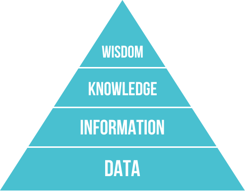

What is Information?
====================

If you are reading this right now, you are sitting at a computer, or holding one in your hands. We are more connected and have access to more knowledge at our fingertips than at any point in human history. And it is growing at an exponential rate.

* [Google processes 40,000 searches every second.](https://www.internetlivestats.com/google-search-statistics/)
* [Worldwide, there are 5 billion searches per day](http://www.smartinsights.com/search-engine-marketing/search-engine-statistics/)
* It is estimated that the big four internet corporations store 1,200 **petabytes** of information between them.

But the question remains, how does this all fit together? What is all of this information good for? The first thing we want to establish is a mental framework for how all of this fits together.

## Data

What is data? What's the temperature outside? How many steps did you take today? How many calories do you consume in a day? What's your dog's birthday?

The answers to these questions are all data. Raw facts that don't have context. What does it mean that it's raining? Or that there are 100,000 commercial airline flights every day?

Data are facts. Each fact is just a little thing that is true (we hope). Without some sort of context, each one of these facts is not very useful. The temperature at 5pm on the day you were born is a data point. It might be interesting to know something like this, but it doesn't really give you anything to act on. And the big question with information technology is: How does all this data inform how I should act?

## Information

When you take raw data and give it structure and context, it becomes information. Information that tells us something about the world. It gives us something that raw facts do not. Knowing the temperature last week isn't very useful. But knowing that it was a little warmer last week than it is today, and that throughout that time, it has steadily been getting cooler, might tell me that the seasons are beginning to change and that winter is coming. The American educator Nicholas Henry called information "Data that changes us".

Once I've moved up this hierarchy, from raw facts to facts plus context, I have something that I didn't have before. I have data in a structure. And it is *this* aspect of human experience that this course focuses on. However, even information has its limits. Knowing what information is leads up one more level.

## Knowledge

When we have information coming to us from many different sources over time, we begin to gain a greater picture of how the world works and our place in it. If you're from Minnesota, you may have attempted to go outside without a coat on in the middle of winter. You learned that this is uncomfortable and should not be done for more than a minute or two. You've learned to check the temperature so you know how many layers to put on. In fact, you have fine tuned your wardrobe so that you know exactly how much clothes and of what types of fabric to wear in winter to stay relatively comfortable. This is knowledge.

A particularly famous definition of knowledge:

> Knowledge is a fluid mix of framed experience, values, contextual information, expert insight and grounded intuition that provides an environment and framework for evaluating and incorporating new experiences and information. It originates and is applied in the minds of knowers. In organizations it often becomes embedded not only in documents and repositories but also in organizational routines, processes, practices and norms

We have a greater understanding of the world because we have taken lots and lots of information over time and, applied our values to it, and used to to inform how we act as humans.

## Wisdom

Many philosophers have debated what wisdom is. And it's a difficult concept to pin down. If we think of knowledge as "know-how", then wisdom can be thought of us "know-why". Some call it "integrated knowledge" or "information made super-useful", "common sense", "the ability to make sound judgments and decisions apparently without thought." It's knowledge that has been internalized and made part of who we are. It's giving thought to why things are the way they are, and out place in the cosmos.

In Ojibwemowin, Nibwaakaawin is Wisdom. To cherish knowledge is to know wisdom. This is one of the Seven Grandfather Teachings. And it sits at the top of the hierarchy of human understanding. It is data, information, and knowledge from everywhere processed, analyzed, and internalized so that we can truly understand the world around us.

## The Pyramid

This framework is often called DIKW. It's particularly relevant to the study of information technology because it gives us a sense of where, in the realm of human experience, this study resides.

 

This course is about information technology in general, and about the way we interface with it in particular. We will look at various applications that have been developed over the last few decades that give us the ability to interact with information in a fast, intuitive way. However, it is very important that we can understand that all that information out there, all those memes, cat pictures, social media, and news articles only exist to inform us at higher levels of understanding. Without giving at least a little thought to how that information can help us build upon our knowledge and how that knowledge informs us and makes us wise, it isn't very useful.

Periodically, throughout this course, we will attempt to take a step back and look at what we're doing in context, and in this way, we can inform ourselves, and try to use information we have access to as a tool to make ourselves and the world just a little bit better.

Let's go exploring.

