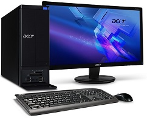
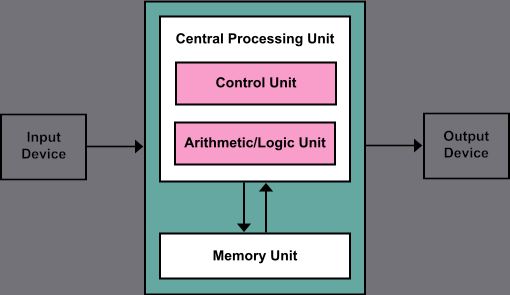
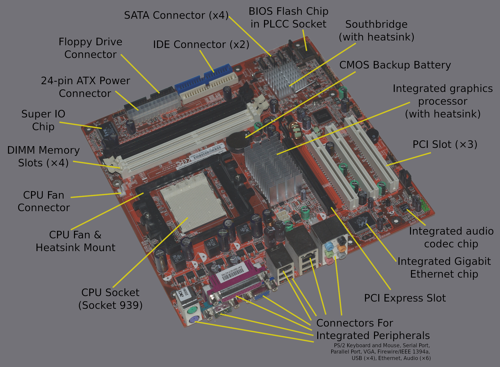
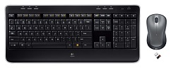

What is a Computer?
===================

computer
: A device which can be instructed to perform arbitrary sets of arithmetic and logical operations.

hardware
: The "bare metal" of a computer. The physical devices and components that make up a computer, including the CPU, the case, the power supply, the mother board, and so on.

central processing unit
: The CPU is the "brain" of the computer. It's job is to fetch instructions, execute them, and return results. It does the "thinking."

memory
: The memory (sometimes called RAM) keeps track of the current tasks the computer is working on. Any application that you start running first has to be copied into memory before its instructions can be executed.

software
: The part of a computer that consists of data or instructions. It is represented in the hardware as electrical impulses. It is intangible, but it can be interacted with using interface devices.

interface
: A place at which two systems interact with each other.

application
: An application or app is a piece of software that the user can interact with. In a modern operating system an app is often represented on the screen by a "window". Common software applications include word processors, spreadsheets, video games, and photo editors.

input/output device
: A device that allows the user or other computer systems to interact with the core computer systems. Common examples are the screen, mouse, keyboard, speakers, and hard drive.

The Story so far
----------------

In 1949, *Popular Mechanics* boasted that "Computers of the future may weight no more than 1.5 tons." Technically, they were correct. Computers of today don't, typically, weight much more than that. So what is a computer, really?

In today's digital world, when we talk about digital computing, we are talking about general-purpose computing machines. These are incredibly complex machines that can be programmed to solve (in theory) any mathematical problem. At its core, a computer is a machine that just solves math problems. Very clever mathematicians and computer scientists have found ways to use these math problems to represent just about every conceivable thing in the world. Everything from a text file, to a picture, to a piece of music. And we can do this with amazing accuracy. And so increasingly, computers are taking over more and more of the work that humans used to do. And now we embed them in everything from coffee machines, to robots, to self-driving cars. We carry them around in our pockets. We operate them at our jobs. They are in our entertainment devices. They even have [internet connected toilets](http://www.wired.com/insights/2014/04/toilet-role-internet-things). The number of internet-connected devices is expected to hit [50 billion](https://techjury.net/blog/how-many-iot-devices-are-there/#gref)
in 2020. It is possible that this estimate might even be low.

Today's smartphone is about 100,000 times more powerful, and has one million times more memory, than the Apollo 11 guidance computer that went to the moon. There is more knowledge and information at our fingertips than at any time in human history. With all of that power and complexity comes some very real dangers. For one, they are actually hard to use. Computer experts sometimes don't fully understand just how much knowledge they take for granted. For many people, they are very intimidating. Let's attempt to de-mystify them.

, via [Wikimedia Commons](https://commons%20.wikimedia.org/wiki/File%3AOperating_system_placement.svg)](images/hierarchy.png)

A computer is a shockingly complex machine. Even the simplest computer has millions of components. Some of the most advanced CPUSs in the world today sport billions of transistors, each measuring only about 20 nanometers, many times smaller than the width of a human hair. It is impossible for a human to even hold that mental concept in his or her mind. So how do we deal with that kind of complexity? Let's talk about **interfaces**.

Parts of a Computer
===================

There are four main components that a computer needs to operate and they are all separated by interfaces. An **interface** in computer science is the place where two systems interact with each other. For example, the interface between the user and the application that the user is working on might consist of a keyboard, a mouse, and a display.

**The User**

The User is you. If you are reading this text, you are already a computer user and are interfacing with it. The interface that you see is probably a web browser window, and the text has been downloaded to that web browser from a web server somewhere in the world.

**The Application layer**

Most often, when using a computer, you will use some sort of application, or app. This might be a web browser, a word processor, a photo editor, or a video game. Applications are self-contained programs which are designed to assist the user in completing some specific task.

**The Operating System Layer**

The Operating System is the main software of the computer. It is usually installed immediately after the machine is manufactured or assembled, and it governs almost all of the computer's operations. It creates a layer of abstraction between the user, the apps, and the hardware. If you are taking my class, the operating system you are most likely using is either Windows 10 or ChromeOS, though many of the same principles and conventions are followed in most modern operating systems.

**The Hardware**

At the very bottom of the computer hierarchy is the hardware, the bare metal. This text is not designed to go into a great amount of detail about the hardware, however, we will go over some of the basic hardware components of a computer. And so, below, you can see a brief overview of the modern computer hardware architecture, otherwise known as the Von Neumann architecture.

How a computer works
====================

<figure>

<figcaption>Von Neumann Architecture By Kapooht (Own work) <a href="http://creativecommons.org/licenses/by-sa/3.0">CC BY-SA 3.0</a>, via <a href="https://commons.wikimedia.org/wiki/File%3AVon_Neumann_Architecture.svg">Wikimedia Commons</a></figcaption>

</figure>

The modern concept of a computer follows what’s known as the Von Neumann architecture. What this means is actually pretty simple at its most fundamental. There are three basic components: The computer itself, input devices, and output devices. Let's look at all three of these in turn.

[John von Neumann](https://en.wikipedia.org/wiki/Von_Neumann_architecture), in 1945, conceived of a very simple architecture which we still use today. At its core, a computer has two main components, the Central Processing Unit (the CPU), and a Memory Unit which today we typically call RAM. A computer stores a "program" in memory (RAM), and then the CPU asks the memory unit for the first step of the program (known as an "instruction") and then executes it. It returns any result to memory and then asks for the next step. Over and over until the program ends. Each of these components can be broken further up into sub-components until we get all the way down to the most fundamental parts of the CPU, the transistors, which can be so small that more than four million of them could fit in the period at the end of this sentence.

Inside the Computer
===================

Today's computers are so amazingly complex that no one person can even coherently think about the design as a whole. We design computers in a modular way. One component at a time. The process of integrating these components and getting them to talk to each other is known as "computer organizaion".

Perhaps the most beautiful thing about all of this? For most people, none of that matters. For the sake of making digital technology available to everyone, we have created **interfaces** that shield us from all of that complexity. We don't have to worry about the file system, the clock speed, or the instruction set on our CPU. All we need is to know how to open the word processor so that we can get some work done or start up [Steam](http://store.steampowered.com/) so that we can play a video game.

Input/Output
============

It is a pretty poor computer that can't do anything with the result of some operation or computation. And so, almost all computers have some way for a user or other agent to interact with it. The modern home computer might have dozens of input/output devices attached to it. These allow the user to interact with whatever program (or programs) are running on the computer. These devices are what make up the **interface** between the user (you) and the computer's hardware and software. Some are obvious, but others are a bit more subtle.

**Input Devices**

-   Mouse
-   Keyboard
-   Scanner
-   Game Controller
-   Fingerprint Reader
-   Touchscreen
-   Microphone
-   GPS antenna
-   Bluetooth Chip

**Output Devices**

-   Monitor
-   Touchscreen
-   Speakers
-   Haptic feedback (rumble feature on game controller)
-   Printer
-   Hard drive
-   Jumpdrive

Of course, this list could go on and on. Altogether, these devices are known as Input/Output devices, or I/O devices. Some home computers will have variations on these basic parts. For instance, a gamer might have a high-performance mouse and keyboard, or an XBox 360 controller. An artist might have a digital drawing tablet. A photographer might have a camera set up to transfer photos directly to the computer. Also, your car most likely has many small computers in it which monitor conditions in the car, such as engine temperature. That temperature sensor is an I/O device, and the fan that it it turns on when the temperature gets too high is also an I/O device. Anything that a computer uses to interact with a user or the outside world is a I/O device.

Conclusions
===========

This section is a brief tour of the components that make up a computer system. It's not designed to be comprehensive, but hopefully you have a sense for the sort sort of work that goes into designing these things and maybe a deeper understanding of how all those pieces fit together. Let this new knowledge inform your work as you continue through the rest of the course.
