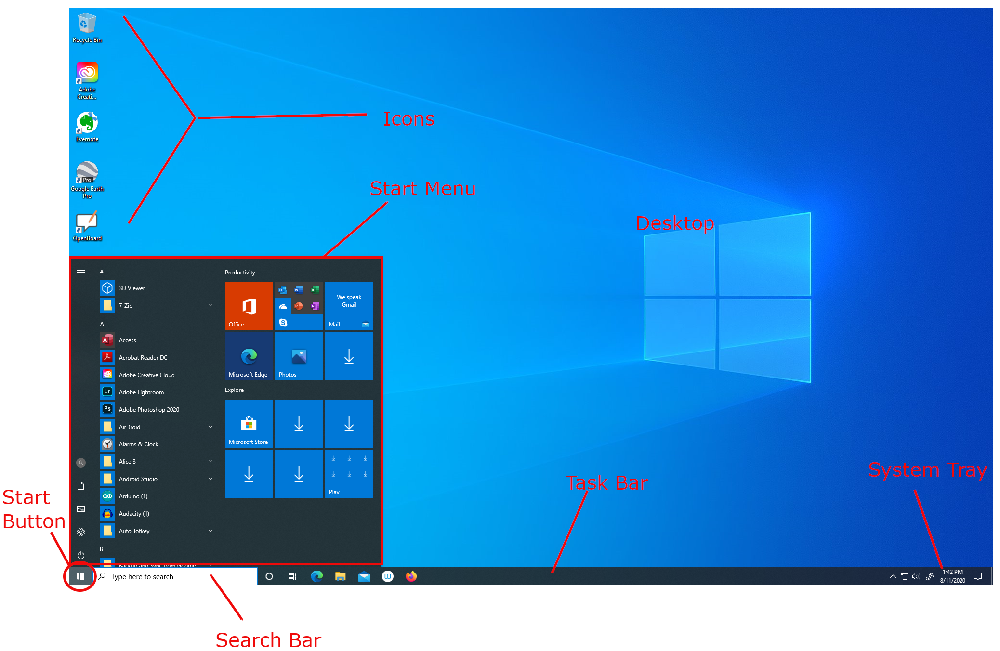
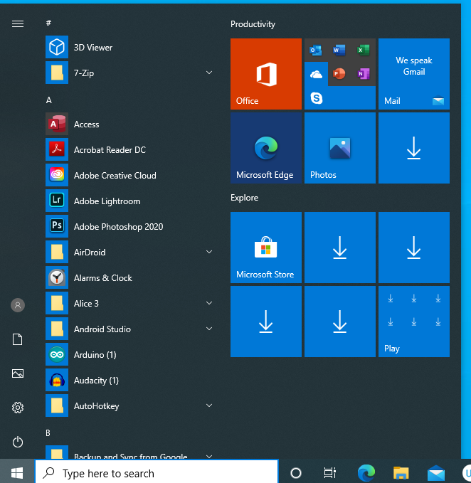
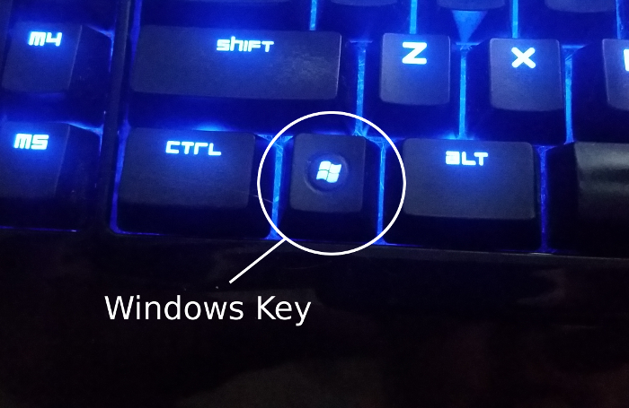

Windows 10
==========

Microsoft Windows 10 is one of the operating systems that we will use in our
examples throughout this text. Windows 10 is the industry standard in many offices, organizations, and workplaces. Windows has a long and storied history. Some versions are better than others. Windows 10 is generally considered to be the last version of Windows as Microsoft has opted to transition to what's called a "rolling release" model. New versions will simply be patched into an existing Windows installation, instead of requiring full system upgrades. Let's take a look around.

[If you are using a Chromebook, click here](7_chromeos.md){: .label}

The Main Interface 
==================

{: width="75%"}

The Windows desktop is (along with all modern operating systems) based
on the metaphor of a literal desktop. So there are some things about it
that will come to feel quite natural as you explore it and work with it
enough. That said, there are a few things that are not completely
intuitive to newcomers to the world of computing. Let's look at some of
the basic details of the desktop. As you go through this, make sure you
are looking at the desktop on your own computer so that you can notice
any differences between the one in the image and the one in front of
you.

**Note:** If you are using Mac OS X for your coursework, some of this will still be relevant to you. Some of the core design philosophies are
very similar, but they are just different enough that you may have to
figure some of these things out on your own. If you are using Chrome OS (ie, a Chromebook), then click [here](7_chromeos.md).

Desktop
-------

The large main area of the screen is your actual desktop. This is your
workspace. Any apps that you open will be contained in "windows" in this
space. The desktop is designed so that many apps can be open at a time
and they can "stack" on top of each other. You can move windows behind
and in front of each other, resize them as needed, and manipulate them
in other ways within this space. Often, there are also icons on the
desktop as well. Typically, the **Recycle Bin** is located on the
desktop for easy access. Any file that you delete will be moved here
first so that if you accidentally delete a file that you needed, you can
recover it easily. **Do not use the recycle bin to store files**.

Try this: 

1. Left-Click and hold on the top bar of a window (this browser window, for example).
1. Drag your mouse all the way to the right until you see a ghost of a box fill half the screen
1. Release the left mouse and observe what happens.

Using this trick, you can split a screen into halves with two windows each taking exactly half the screen. A great way to have a web browser with some research up on one half and a note-taking app or word processor document on the other half.

Search Bar
----------

The search bar is a handy tool which can make navigating your computer much more intuitive and faster. Simply click inside the search bar and begin typing something. If it doesn't find a file or app on your computer which matches the search, it will, instead, make a web search instead using the Edge browser and the Bing search engine (I don't often use this feature, honestly).

Try this:

1. Click inside the Search Bar.
1. Type "Paint"
1. See what results pop up.
1. The top result should be the Paint app; simply hit the **Enter** key and the Paint app will load.

The search bar is an invaluable utility for quickly opening an app that you use a lot. To quickly access the search bar, simply hit the **Window** key on the keyboard (discussed more below).

Task Bar
--------

The Windows Task Bar is the strip of icons that runs almost always along
the bottom of the screen. It is possible to move it to any edge of the
screen, but by convention and habit it's usually on the bottom. This is
a central piece of the interface of the Windows user experience. Even
when they tried to get rid of the start button (more on this in a bit)
in Windows 8, the task bar was still there. It has several primary
functions. First, it shows you what applications are currently open and
ready to use. They are typically highlighted and you can switch back and
forth between them by left-clicking on their icons on the task bar.

The task bar can also be customized with icons for apps that you like to
use a lot. To do this, simply click and drag the icon for an app onto
the task bar and release.

There are a few icons that are there by default and some of the most
importants ones we'll go through together later in this section. But
first, we need to talk about two other things on the task bar, the
**System Tray**, and the **Start Button**.

System Tray
-----------

The system tray is a catchall dumping ground for lots of information
about the current state of your system. The most obvious information
that it contains is the current date and time. But there's also other
information here too.

It will supply information about network connections, volume controls,
and also have information about apps running on your computer that don't
necessarily have a window associated with them, like a real-time virus
scanner. Go ahead and click on whatever you see there. Try both
right-clicking and left-clicking on everything you see and observe what
happens.

Start Button
------------

This button is the gatway to your computer. This is a very important 
important interface feature on the Windows 10 desktop. Clicking on it
brings up the **Start Menu**.

Start Menu
----------

{: width="75%"}

The **Start Menu** contains links to every app installed on your
computer. It is extremely important that you know where this is and what
all you can find here. As you read this, make sure you are looking at your own computer's
start menu to verify that things look the same, or identify differences.

The first thing you should notice is that it is divided into three main
sections. Along the left edge are a series of buttons that give you quick access to important parts of the system. At the very top, the hamburger icon expands the left bar so you can see what all of these buttons do. For example, the button at the bottom gives you the option to turn off or restart the computer. You'll also find buttons which will take you directly to your documents folder or your downloads folder.

Next to this bar, the left panel of the Start Menu has an alphabetical listing of all apps installed on the system. This is less useful than it seems since you'll have to scroll pretty far to find many apps. It's much easier to type the name of the app in the search bar at the bottom. But some people might prefer to scroll through this list.

Finally, on the right is an app panel designed after Microsoft's Metro UI. It's a useful place to pin buttons for apps that you like to use a lot. I have never found it immensely useful unless you're using a tablet or other device with a touch screen (such as a Microsoft Surface), in which case, you'll definitely want to customize this with your favorite apps.

Built into almost all modern keyboards is a key with a logo on
it. For keyboards that are typically used with Windows systems, this is typically a Windows logo. It's often called the **Windows Key** or the **Win Key**.
Occasionally, you'll see it referred to as the **Super Key**. In the
Windows operating system, it has the same effect as clicking on the
**Start Button**, that is, it opens the Start Menu.

{: width="75%"}

Thus, a quick way to open an app without having to hunt for it with the
mouse is simply to press the **Win Key** and then start typing, the text
will automatically appear in the search bar of the **Start Menu** and
the app list will automatically filter to your search.

Try this:

Follow the same procedure as above to open the Pain app, but instead, first press the Windows Key, and then immediately start typing the word "paint". You'll notice this is a quick way to get to your favorite apps without even touching the mouse.

What Next?
==========

Spend a little time tinkering with anything else you find in the main
Windows interface. In fact, from time to time, you will want to just
play around with whatever you see on the screen. Modern computers are
pretty good about preventing you from doing anything that will cause any
real damage or at least warn you before you do anything irreversible. So
you're fairly free to do whatever you want without fear.
