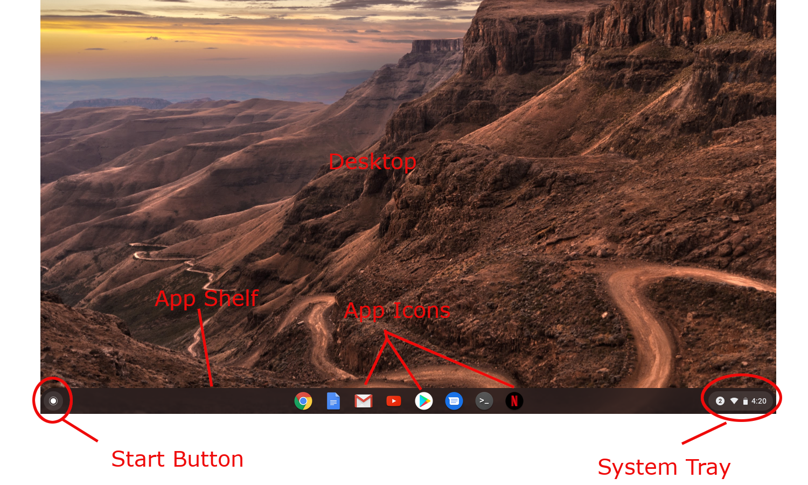
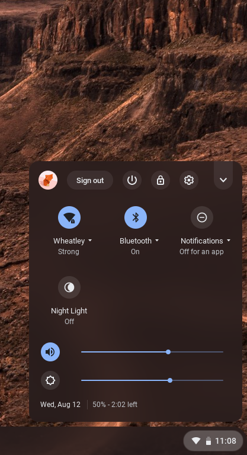
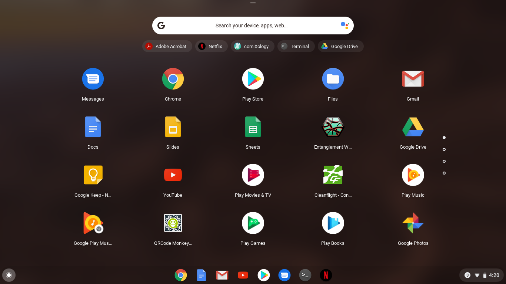
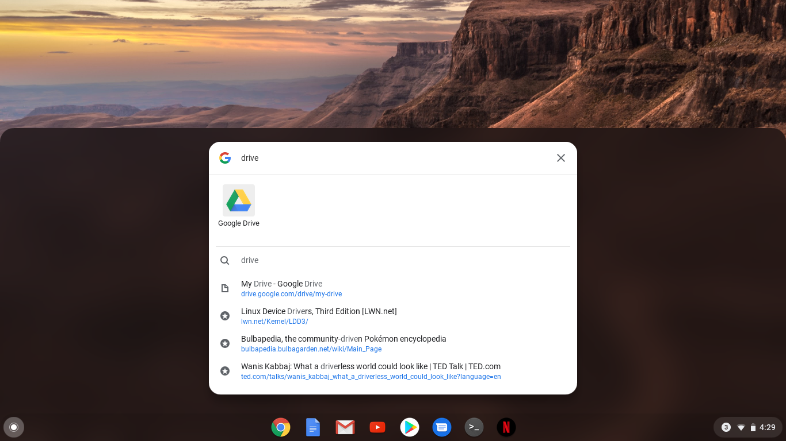
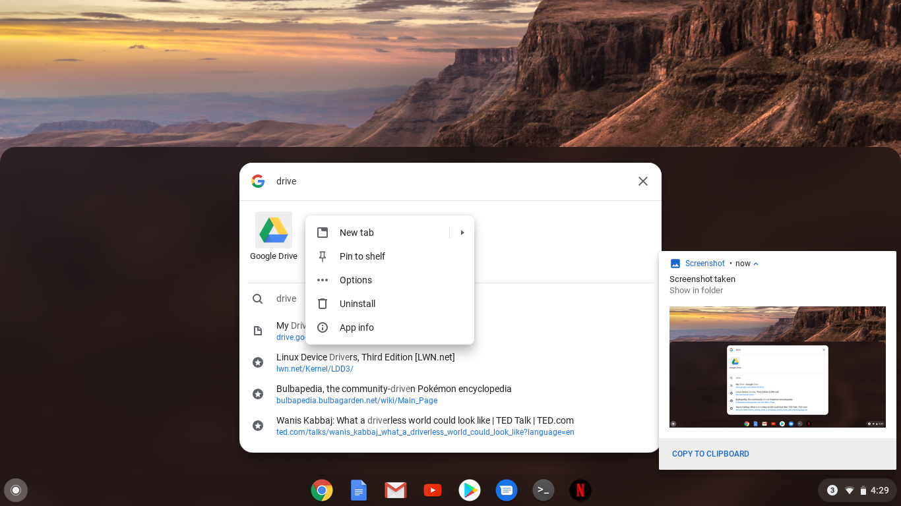
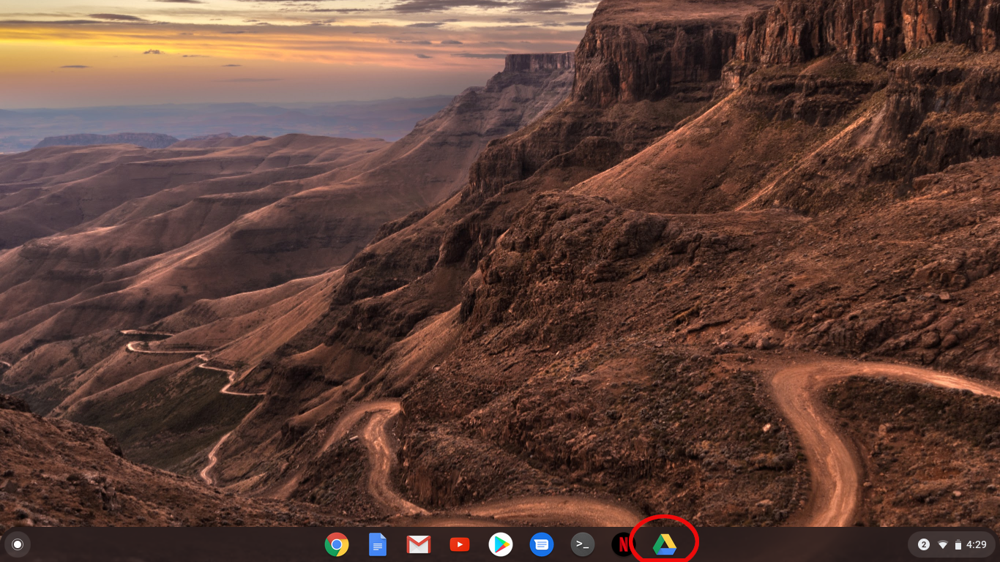

Chrome OS
=========

Google's Chrome OS is an app that is quickly gaining in popularity. The chief reason for this is cost. Chromebooks (the portable computers which run Chrome OS) are not expensive. They have low-end hardware that leverages internet (cloud-based) services to do most of their heavy lifting. For this reason, they do require an active internet connection to be even remotely useful, but there are things you can do with them in offline mode.

[If you are using a Windows 10 machine, click here](6_windows_10.md){: .label}

The Main Interface 
==================

{: width="75%"}

The first thing you might notice is that it kind of looks like Windows. This is not an accident. There are a lot of conventions that have become very standard in operating system interfaces. We have a desktop, icons, a taskbar (called the shelf in Chrome OS), and a system tray. Let's look at each of these main components in turn.

Desktop
-------

The main work area on the screen is the desktop. This is where any apps you are using will display their interfaces. Like other operatin systems, apps are displayed in windows and can be resized and moved around. However, due to the limited screen real estate on the smaller displays of Chromebooks, you'll likely not use this feature often. Still, it can be handy.

System Tray
-----------

{: width="25%"}

The system tray is where you will find a lot of intresting information. Google has merged the system tray with the notification menu. So this is where you'll find important system information and settings, but also notifications such as messages, emails, and alerts. It's a good idea to familiarize yourself with the buttons and settings in the tray. Open the settings menu (the **cog** icon) and explore the different system settings available here.

App Shelf
---------

The App Shelf is much like the taskbar in Windows. It's a convenient place where you can have your most important apps ready to fire up as soon as you open the computer. It also shows which apps are currently running and allows you to switch between them. In the above screenshot, you can see icons for Chrome, Google Docs, Gmail, YouTube, the Play Store, Google Messages, a terminal shell app, and Netflix. A tap on any one of these will fire up the relevant app and you can begin working or watching videos or whatever.

Start Button
------------

Technically, Google calls this button the App Launcher. And that's what it does. You can't fit all of your apps on the shelf, so all the apps that aren't on the shelf must be accessed somewhere. The App Launcher opens the App Drawer, an interface that looks like this:

{: width="75%"} 

Here, you can scroll through app icons arranged in some sort of mysterious order (it's not alphabetical, so who knows?), or simply type the name of an app in the search bar at the top to find what you're looking for.

*Adding an icon to the Shelf*

Try this:

1. Click or tap the App Launcher icon.
1. In the search bar, type the word "Drive" (for Google Drive)

    {: width="75%"}

1. Long press the icon until a menu appears:

    {: width="75%"}

1. Tap or click on Pin to Shelf

    {: width="75%"}

What Next?
----------

Chromebooks take a lot of flak for being low powered or not as useful as a Windows/Mac/Linux PC. However, if a person takes the time to get to know Chrome OS, it really has a lot ot offer. It's easy-to-use interface means you can get to work faster and with less fiddling. The leveraging of powerful cloud services almost completely mitigates the fact that the actual hardware isn't that powerful. And access to the entire Android software ecosystem means that you'll always have access to new apps and functionality.

Spend some time exploring the computer. Open all of the apps that are already pre-installed and see what they do. In the next chapter, we'll take a look at the Internet and the ideas behind cloud software. In particular, we'll look at Google's app ecosystem.

We'll see you there.
