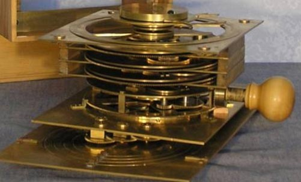
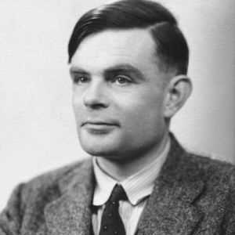
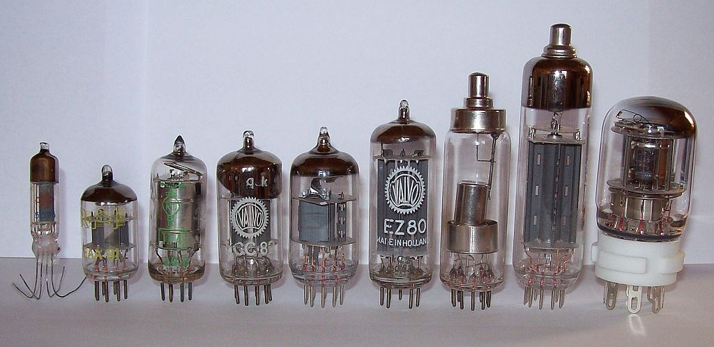
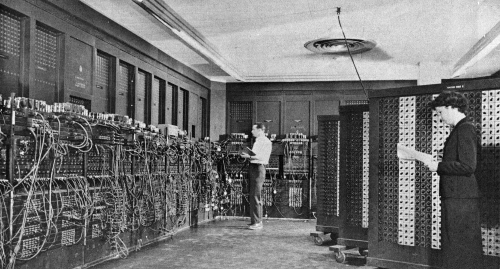
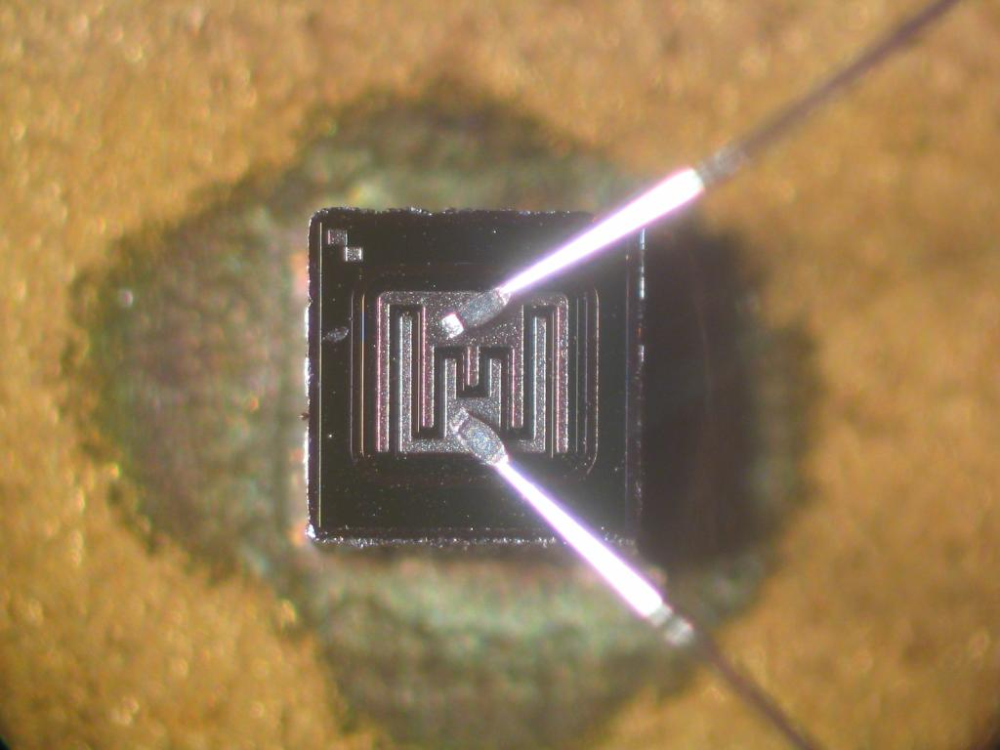
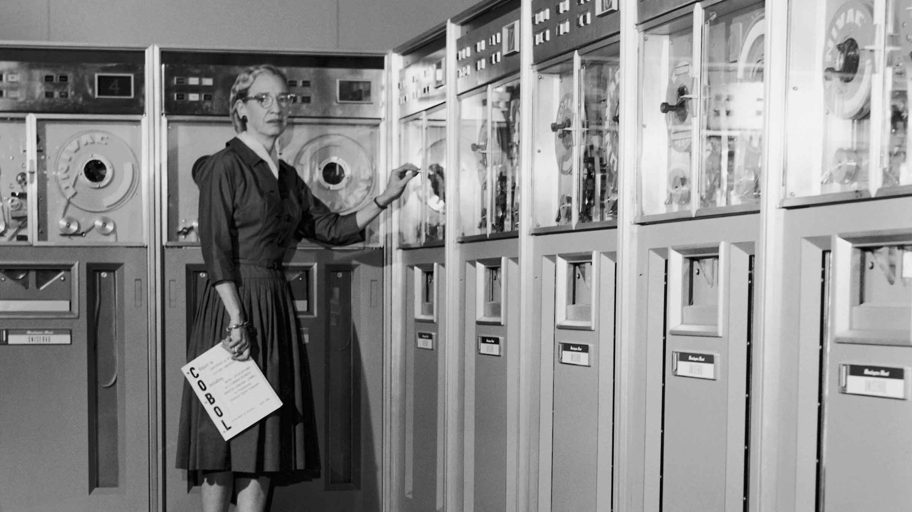
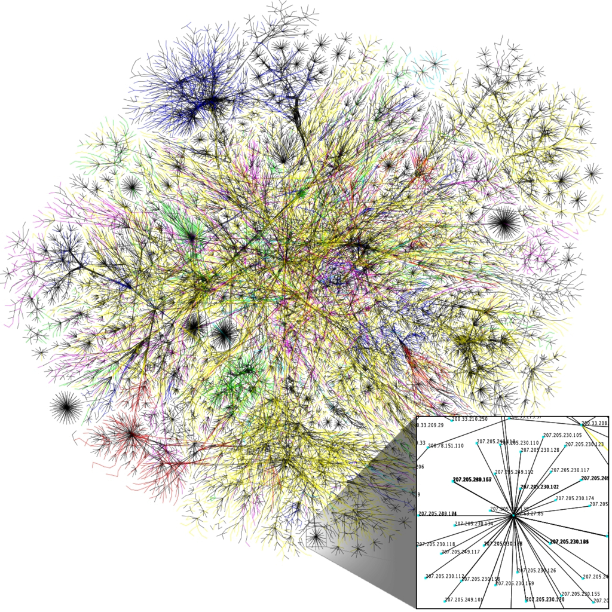

A Brief History of computing
============================

# Computing Timeline
--------------------

  | Dates        | Developments                                                                                                                                   |
  | -----        | ------------                                                                                                                                   |
  | 20,000 BCE   | Early cultures develop counting and rudimentary record-keeping                                                                                 |
  | 150-100 BCE  | Antikythera Mechanism - analog computing device                                                                                                |
  | Up to 1800s  | Algebra developed. Algorithms developed and used. Abacus invented and used. First mechanical calculators built and used.                       |
  | 1800-1930    | Babbage's Difference Engine. Boolean Logic. Hollerith, punch cards, and the 1890 census                                                        |
  | 1930s        | Alan Turing's papers on computability. Claude Shannon and information theory.                                                                  |
  | 1940s        | First electronic digital computers - Colossus, ENIAC, etc                                                                                      |
  | 1950s        | Symbolic programming languages. Transistors. Data-processing applications (spreadsheets, etc).                                                 |
  | 1960-1975    | Integrated circuits. Minicomputers. Time-sharing mainframe systems. Keyboards and monitors. Grace Hopper, compilers, and high-level languages. |
  | 1975-1990    | Microcomputers. Mass-produced personal computers. GUIs. Networks and Internet                                                                  |
  | 1990s        | Optical storage. World Wide Web. Laptop computers                                                                                              |
  | 2000-present | Embedded computing. Wireless computing. Continuing proliferation of the web into every facet of human life.                                    |

The Early Years
===============

Computational reasoning is not by any stretch a uniquely human trait.
Many animals have been shown to, at the very least, add and subtract
even if at a very rudimentary level. Of course, no other animal has
taken the whole thing quite so far as humans. The digital computer has
been in development for a very long time. In fact, the earliest
computation and data storage devices go back as far as the earliest
humans on Earth.

The Ishango Bone
----------------

The Ishango Bone is a section of a babboon's femur which has curious
notches carved into its surface. The prevailing theory is that it was a
counting device, though, as you can probably imagine, many an
anthropologist have poured countless hours of fruitless speculation into
just what the hatchmarks could possibly be counting. Suffice to say, it
is a very early example showing that basic anal retentive record-keeping
goes back quite a long way in human history.

The Antikythera Mechanism
-------------------------

The Antyikythera Mechanism is fascinating for so many reasons. For one,
it is a magnificent work of art all on its own. Used to calculate the
positions of the stars to aid in navigation, it is not only notable for
its capabilities or early date (150 BCE), but for its staggering
complexity. For while there are no other examples of the mechanism in
existence, it is fairly easy to reason that no such device could have
sprung up fully formed. There had to have been a progression of less
complex versions and it almost certainly had contemporaries, even if
only a few.

The Abacus
----------

The abacus was an still is one of the most useful ancient arithmetic
machines. In fact, it is still in use by some people in Eastern Europe,
Russia, China, and Africa. It never needs to charge its batteries and it
never needs security updates.

Algebra
-------

Algebra's earliest roots go back to the Babylonians and many forms of
algorithmic computation (or evidence of it) popped up in places all over
the world from Hellenic Greece to Egypt to South America. But it was a
Persian mathematician named *Omar Khayyam* who laid the foundations for
algebraic geometry in 1070. European Algebra got a kick in the pants
when an Italian mathematician named Fibonacci revived European algebra
in the 13th century.

The Difference Engine
---------------------

[Charles Babbage](https://en.wikipedia.org/wiki/Charles_Babbage) and
[Ada Lovelace](https://en.wikipedia.org/wiki/Ada_Lovelace) are
interesting figures in the history of computing, though in the end,
their actual effect on the future trajectory of the study of algorithmic
computing is probably pretty negligible. Most of their work occurred
during 1830s. They get lots of credit for some of their ideas though,
even if they never saw the light of day until very recently. Babbage
designed a device that he called the *Difference Engine* which was a
complex mechanical machine with over 18,000 parts which could be used to
solve polynomial equations. It was, however, never built. Ada Lovelace,
the daughter of the Romantic poet Lord Byron and a brilliant
mathematician, had a correspondence with Babbage and, after seeing his
plans for the Difference Engine, developed what is widely regarded as
the first computer program, an algorithm which the Difference Engine
could use to calculate the sequence of [Bernoulli
numbers](https://en.wikipedia.org/wiki/Bernoulli_number).

The next really significant development in the progress of computing
machines happened in the years leading up to the 1890 census. A man
named Herman Hollerith invented an electromechanical punch card
tabulating machine which cut the processing time from 8 years (the 1880
census) to only six in 1890. This is made significant especially
considering how much larger the population had grown over those ten
years. Hollerith went on to found a company called *The Tabulating
Machine Company*, which eventually merged with three other companies to
become the *Computing-Tabulating-Recording Company* (CTR). In 1924, CTR
was renamed to the much more familiar *International Business Machines
Corporation* or IBM.

Theory and foundations
======================

Alan Turing
-----------

**Alan Turing (1912-1954) -** Along comes perhaps the most famous
computer scientist of all time, [Alan
Turing](https://en.wikipedia.org/wiki/Alan_Turing). He is perhaps most
famous for his work at Bletchley Park cracking the German Enigma Code
during World War II. However, he also laid down considerable theoretical
groundwork for the field of computer science such that he is often
regarded as the father of theoretical computer science. His seminal
paper in 1946 was the first detailed design of a stored-program
computer. Today, we call his concept a [Turing
Machine](https://en.wikipedia.org/wiki/Turing_machine). He wrote another
influential work on the topic of artificial intelligence and proposed a
test (now called the [Turing
Test](https://en.wikipedia.org/wiki/Turing_test) to create a standard
for a machine to be called "intelligent."

Turing is one of the most revered figures in the field of computer
science and his story ends tragically as it was revealed that he was
homosexual, persecuted mercilessles by the police and government, and
eventually committed suicide. His legacy still lives on in modern
computer architecture, however. Almost all computer architectures are
based at least in part on the Turing Machine model.

John Von Neumann
----------------

**John Von Neumann (1903-1957) -** A mathematician of massive influence,
John Von Neumann was also one of the earliest computer scientists. He
laid out an architecture for a computer in a paper in 1945. It described
how a stored-program computer would be organized, how its parts and
components would talk to each other, and how their hierarchies would be
structured. Though considerably evolved, today's computers are heavily
influenced by the [Von Neumann
Architecture](https://en.wikipedia.org/wiki/Von_Neumann_architecture).

The Vacuum Tube Era
===================

The first digital computers used vaccuum tubes to represent binary
digits (bits). They reasonably fast, but they were large, clunky, and,
like a lightbult, they had a tendency to burn out frequently. And yet,
as expensive, inefficient, and frustrating as these early machines were,
they were *still* faster than doing it by hand.

The first programmable, electronic, digital computer was **Colossus**.
It was used during World War II to help crack ciphers, and though it was
not a stored-program computer, it was fully programmable with switches
and plugs.

**ENIAC** was the first "Turing-complete" computer. It was a massive
machine consisting of 18,000 vacuum tubes, 1500 relays, weight 80 tons,
and used 200 kw of power. It was used to calculate artillery firing
tables for the United States military, though the war did not last long
enough for this purpose to be its main mission. One of its first
programs was a study of the feasibility of a thermonuclear weapon. It
was able to complete a calculation that took a human 20 hours to
complete in 30 seconds. So while it was prone to breaking down, it's
astonishing (for its time) speed and calculating power more than made up
for it.

These computers evolved and grew more sophisticated and explored many
interesting technologies, however, it was all blown away by one very
tiny invention

The Transistor
==============

A transistor is a tiny semiconductor device which can act as a switch.
As they are much smaller, more reliable, and cheaper to produce, they
*very quickly* replaced vacuum tubes as the primary computational
element in electronic computers. It wasn't long before they were getting
smaller and smaller until a little-known company called Intel
manufactured the first **microprocessor**, the Intel 4004. This first
processor was a general-purpose chip designed to be the brains in a
digital adding machine. It was a calculator chip. It added, subtracted,
multiplied, and divided its way through history as the chip that changed
everything.

An **integrated circuit** is a piece of computing hardware that
miniturizes and standardizes certain tasks in computing. ICs are a way
of putting many, many transistors and other electrical components on a
thin piece of silicone which makes the chips faster, more efficient, and
cheaper to produce. The IC is what made the microcomputer revolution
possible.

Grace Hopper and the compiler
=============================

In the early days, all computers could understand was machine language. That is, 1s and 0s. *All* programming was done in machine language using binary codes. In 1952, she developed the first compiler program. The idea is simple: let's write computer programs using English words and then translate or **compile** them into machine language. In 1954, she was worked on a project which developed an early high-level English-word based programming language that would eventually become COBOL, a language still in use today.

The very idea of being able to write programs in human-readable language was revolutionary and Hopper's legacy in the world of computing is incalculable. She is quite possibly only surpassed in importance by Alan Turing, himself.

The Internet
============

Computer technology progressed at a fairly steady clip from the
mid-sixties on. Corporations found uses for them, as did the government
and univsities. By the mid-eighties, there were relatively affordable
home computers and some of them were even fairly useful. Unbeknownst to
most people in the 80s, a technology had been incubating on university
campuses and government buildings for the past 20 years and was about to
change everything.

There were many computer networks that took a crack at the problem of
transmitting data over long distances. Most of the successful ones
settled on some variety of what is called "**packet switching**," which
is to say, breaking up large pieces of data and sending them off across
the network in pieces to be reassembled at the other end. The most
successful of these networks was ARPANET which went live in 1969,
sending its first message from UCLA to the Stanford Research Institute
on 29 October, 1969. For 20 years, the ARPANET would grow to connect
many universities, corporations, and government organizations together.
Massive funding provided by the United States Government helped to push
the project forward very quickly. And then along came 1989

The ARPANET and the Internet that would grow out of it use the
**TCP/IP** protocol, a unified language and set of rules that all
computers connected to the internet must adhere to. In fact, it's not
just one or even two protocols, it's what we call a *stack* of
protocols. Shortened to the two main ones, the **Transmission Control
Protocol** which is responsible for breaking information up into
discrete chunks at one end of a connection and then reassembling them at
the other end. And the **Internet Protocol** which is responsible for
addressing making sure packets get where they are going.

The World Wide Web
==================

In 1989, an English scientist named **Tim Berners-Lee** invented a set
of technologies for making the internet more accessible and
comprehensible. He invented what is now called the **World Wide Web**, a
network of interconnected, "hyperlinked" documents and other resources
which can be access using a piece of software called a *web browser*.
Berners-Lee invented four main technologies:

-   The **HTTP protocol**, which is the set of rules that govern
    the web. It determines how web pages are served up, and how web
    browsers will interact with the TCP/IP protocols of the web itself.
-   **HyperText Markup language** or HTML is a markup language which
    allows for easy formatting of web documents (web pages). It has gone
    through many revisions over the years, but Berners-Lee's original
    HTML is still quite easily recognizable by any modern web developer.
-   **Web Server** software was needed to tell a computer how to "serve"
    a web page to anyone who was trying to access it.
-   **Web Browser** software enables a user to "browse" and search the
    web for information, parsing, interpreting, and formatting the
    content that it receives so that it's readable by you or me.

The Smartphone revolution
=========================

There were many attempts as, as early as the 90s, to build a hand-held
productivity device and while some of them were pretty neat in their
time, none of them was so immensely useful that it would ever become
ubiquitous. Until the smartphone. It wasn't [the
first](https://en.wikipedia.org/wiki/IBM_Simon), but in 2007 a device
called the iPhone hit shelves and changed...everything.

Let me just get real with you here, reader. This is written as someone
who does not and never will own an iPhone. The effect of the iPhone on
modern society has been so profound it will probably take us decades to
even come to terms with its existence. Our relationship with
*information* has changed. Our relationships with *each other* have
changed. To say that the iPhone has been a [disruptive
technology](https://en.wikipedia.org/wiki/Disruptive_innovation) would
be like saying the atom bomb was a firecracker.

Of course, this is not to overstate the importance of the iPhone. If it
hadn't been the iPhone, it would have been the HTC Dream or the Samsung
Galaxy or some other [Android
phone](https://en.wikipedia.org/wiki/Android_(operating_system)). The
technology was already there and the time was right for it. Apple was
lucky and very, very good at marketing.

This is not to *understate* the importance the iPhone either. It's the
first successful iPhone with the exception of the Blackberry, thought
that seemed to be isolated to business people. And just stop and think
about the profound ramifications of having a device in the palm of your
hand which is essentially a direct link to the sum-total of
(effectively) all of human knowledge. Every language. Every book. Every
piece of music. Every movie or TV show. All of it can be access with a
smartphone.

Notable machines and other developments
=======================================

-   [Colossus](https://en.wikipedia.org/wiki/Colossus_computer) - The
    first fully electronic digital programmable computer
-   [ENIAC](https://en.wikipedia.org/wiki/ENIAC) - First
    "Turing-complete" digital computer
    -   Weighed 80 tons, used 200 kw of power, had 18,000 vacuum tubes,
        1500 relays, and hundreds of thousands of other components.
-   The Transistor - 1955
-   The integrated circuit - 1949 (work began) - working model 1958
-   January 1971 - First Microprocessor
    -   Intel 4004 - Adding machine processor
-   Grace Hopper and the compiler. 1950s. COBOL. Led to a proliferation
    of programming languages. Grace Hopper was the Mother of
    Software Development.
-   ARPANET - 1969
-   Tim Berners-Lee, the Internet, and The World Wide Web - 1989
-   The Smartphone revolution - 2007-present
-   Five Generations
    -   Mechanical/electromechanical
    -   Vacuum Tubes
    -   Transistors and Integrated circuits
    -   Better ICs
    -   Experimental/Theoretical (Quantum computers, DNA computers, etc)
-   Closing Thoughts - Moore's Law
    -   The number of transistors in a dense integrated circuit doubles
        approximately every two years.
    -   Gordon Moore, founder of Intel. 1965
    -   It has held true so far, though there is self-serving bias.
    -   Used to set long-term planning goals for semiconductor industry
    -   The law is replicated in prices, memory capacity, megapixels in
        digital cameras, etc.
    -   Not technically a law (conjecture/observation)
