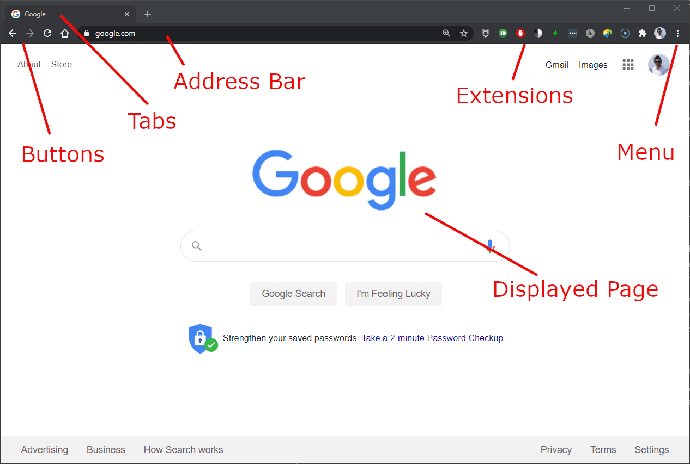

--- 
title: 'The World Wide Web'
layout: page
parent: Chapter 2 - The Internet
nav_order: 2
---

The World Wide Web
==================

**Vocabulary:**

World Wide Web
: A system where documents on other resources are identified by URLs and are connected via hypertext, and are accessible over the Internet.

Hypertext
: Text on a computer display that with references to other text via "hyperlinks" that can be accessed by just clicking on them.

Web Browser
: An app whose main purpose is to browse the Web using simplified controls and many integrated features. It typically interacts with the Web via the HTTP protocol and interprets a number of web programming languages like JavaScript and HTML.

Webpage
: A "page" of content on the Web. A collection of web pages under the same domain are typically referred to as a "website".

Website
: A website is a collection of pages all under the same Web domain. Usually, they are related by content, theme, or purpose.

URL
: Uniform Resource Locator, often called a *web address*, is a reference to a specific object on the Web. It specifies its location. It's characterized by the fact that the same URL should, in most cases, point to the exact same resource. In most Web Browsers, this is displayed in the top bar.

Search Engine
: A website that specializes in indexing the World Wide Web, and giving users the ability to search that index to quickly locate information that is relevant to a particular question.

In the early 1990s, the World Wide Web slowly became the most important way that people access resources on the Internet. An early proliferation of **web browsers**, apps that allow users to interact with the Internet using a system of **hypertext** and **links** became synonymous with the term *surfing the Internet* or *surfing the Web*.

Today, web browsers are a class of apps that enable intuitive browsing of the web with an uncluttered interface. There are *many* web browsers, and each one specializes has its own strengths and weaknesses. First, let's look at some of the typical interface features you'll find in the majority of web browsers, using the screenshot from [Google Chrome](https://www.google.com/chrome/) above as our example.

Web Browsers
------------

{: width="75%}

### Main Area

The vast majority of the browser interface is always the displayed page. Whatever page the browser has currently loaded. Over the years, most browsers have put an immense focus on limiting the scope of the browsers' interfaces so that the main focus will always be on displayed content.

### Top Bar

At the top of the browser window, you'll find basically the entire browser UI. Let's look at a few of the features:

* **Buttons**: A set of buttons, usually set at the left, generally include *back* and *forward* buttons as well as a button to return to a user-established *"Home"* page.
* **Tabs**: All web browsers include some sort of tabbed browsing, allowing the user to have multiple pages open (if you're like me, this is anywhere between 2 and 20). To the right of the last tab is usually a button to open a new tab. Keyboard shortcuts (Ctrl-t for most browsers) will also open a new tab.
* **Address Bar**: The address bar contains the URL to the currently displayed web page.
* **Extensions**: Almost all browsers are highly extensible. They allow you to install add-ons or extensions that add functionality to the browser. These include things like ad blockers, spellcheckers, password managers, and more.
* **Menu**: The location of the menu button varies, but it's usually on the right in most browsers. Contained in the menu are settings, bookmarks, and other utility-oriented features.

What web browser should i use?
------------------------------

Many web-based companies employ apps to browse their content that are really just web browsers wrapped up in a fancy user interface. For example, the Facebook or Twitter smartphone apps are simply web browsers with the UI elements pre-loaded, so they only have to download the cat pictures and political posts.

But by and large, for general web browsing, you use a general-purpose web browser. Here's a listing of the most popular ones:

* **[Chrome](https://www.google.com/chrome/)** is the most popular browser on the web. Developed and maintained by Google, it has a number of features that allow easy integration with a Google account (more on this later). It has its faults, and there are certainly privacy conerns, but it is highly capable, easy to use, and compliant with all current standards.
* **[Safari](https://www.apple.com/safari/)** is the default web browser for Apple computers. Its tight integration with the Apple software ecosystem is a big draw for Mac users. It has great integration with Apple's iCloud Keychain password manager, which makes managing multiple passwords a breeze (though there may be security concerns associated with it).
* **[Firefox](https://www.mozilla.org/en-US/firefox/new/)** from the Mozilla Foundation is my current browser of choice. It's a streamlined app with a large community of people building useful extensions. It's fast and loads quickly and is very security-minded. It integrates well with a number of password managers and is continually updated.
* **[Opera](https://www.opera.com/)** is an interesting choice that I occasionally use. It has a built-in Virtual Private Network (VPN), which is free to use, allowing you to evade tracking and other privacy concerns. It's not clear just how much trust a person should put in this VPN service, however, it can be handy if you are concerned about privacy.
* **[IE/Edge](https://www.microsoft.com/en-us/edge)** are proprietary browsers from Microsoft. For whatever reason, they just are not very popular, despite Microsoft's best efforts to push usage of Edge on Windows 10 systems. Still, it's a fine web browser. It does seem that it's not always compliant with cutting edge standards, and some web sites don't always work correctly, but in general, it works.
* **[Brave](https://brave.com/)** I mention here only because it's the most interesting "outsider" browser. It has a built-in ad-blocker and has strong security features such as a firewall and VPN. If you opt-in to their advertising scheme, they will even pay you in Bitcoin, which is an interesting tactic. It's worth checking out and since it's built on Chromium, it's compatible with all Chrome extensions.

How to use a web browser?
-------------------------

Using a browser could not be simpler. There are generally two ways to go about it:

1. If the site you are looking for is known, simply type the URL for that site into the **address bar** and hit **Enter**. From there, navigation is usually mouse-based, ie, pointing, clicking, scrolling.
1. If you have a question you would like answered, but don't know where to find that answer, simply formulate a query and type it into the **address bar** and hit **Enter*. A query can be anything from a vauge notion such as "recipe for chicken curry" or a constructed sentence such as "How do I change a tire on a 2015 Honda Pilot?". Being specific helps. There's a sort of art to crafting a query, but the designers of search engines have become very, very good at delivering relevant suggestions to even badly spelled queries. A little practice.

It is important to note that when you type a query in the address bar, it is not the browser that conducts the search. In the settings of a browser, you can define a default **search engine**, like Google, Yahoo!, Bing, or DuckDuckGo. The browser simply sends the query along to the default search engine and the search engine returns its suggestions as a web page full of results. From there, you scroll through the results and click on ones that seem relevant.

**Tip:** when you're not sure which link from a search result is going to have the information you want, you can click the mouse wheel (press it like a button), and that link will open in a new tab. In this way, you can click on several results and have them open in several tabs that you can examine at your leisure.

If you don't have much experience with web browsers, it's a good idea to get to play around with them. Ask it questions like you might some ancient oracle and see what results pop up. Even the most esoteric information can sometimes be found quickly and efficiently.

In the following sections, we'll look at some of the services that are available on the Web and where they can be located. In particular, we will look at Google's application ecosystem since it will be the primary way in which tutorials will be delivered in this course. I'll walk you through setting up a *Google account*, and some of the useful tools that this opens up for you. And then, if you're in the advanced course, we'll use Google's apps to build a simple website of our own.
