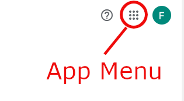

--- 
title: 'Setting Up a Google Account'
layout: page
parent: Chapter 2 - The Internet
nav_order: 3
---

Google Accounts
===============

Google has positioned itself very well in the electronic world. Not only are they a powerhouse search engine, but they have cornered the market in online productivity, positioned themselves as one of the most important hosting platforms, domain registrars, and boast a massive library of software that you can use, generally for free (think about what this means).

For our purposes, we will use a Google account so that we can gain access to their productivity apps, that is Docs, Sheets, Slides, and Sites. Let's get started.

Creating a Google Account
-------------------------

**A disclaimer:** There are very real privacy and possible security concerns with creating and using a Google account. The saying goes, "If the product is free, *you* are the product." And this is absolutely true of Google. They track your activities and the apps that you use to market advertising at you, log immense amounts of data (which they claim is aggregated and anonymized), and they are not shy about it either. That said, there are compelling reasons to trust them (to some extent) as well. As long as we are cognizant of the risks. For one, if they betray the public trust too egregiously, it will hurt their business model. They have not been shown to be completely nefarious and have championed free Internet policies for decades. The Google mission states "Do the right thing" and while this statement can be interpreted very broadly, if it is true that their corporate ethos follows something in this vein, then perhaps they are not the worst company in the world. For what it's worth, the instructor of this course is fully in the Google app ecosystem. I have made the personal choice to trust them with...pretty much everything. And the consequences of that choice are just what I will have to accept in the future when they decide to become supervillains and take over the world.

If you _are_ extra concerned about Google and the implications of creating a Google account, what I recommend is this. When signing up for this account, use your school email address to create the account and link it with your school account. This will ensure that once you leave school, the account will cease to be relevant and eventually will be deleted (or you could delete it yourself!)

**Also:** If you already have a Google account and wish to use that, that is perfectly acceptable. It will not change the way the tutorials work.

Let's see how it's done.

1. Click this link: [Google Signup](https://accounts.google.com/Signup).
1. Fill out the form. If you wish to use your LLTC email address to create this account, simply click the link that says "Use my current email address instead", and then enter your LLTC email address (i.e. yourusername@students.lltc.edu)
    
1. Click Next.
1. You will need to enter a phone number. Google will shoot you a text message to verify that it's yours. Click Next.
    
1. Google will send you a text message. Enter the code in that message into this box. Click Next.
    
1. Here, you must enter your birthday, and gender (you are free to lie), as well as set up a recovery email, just in case you forget your password. **Highly advised that for now, you set up your recovery email as your student email!** If you do not, and you forget your password and/or lose your phone, you might not be able to recover your account and, also your work for this semester. After you have finished here, click Next.
    
1. The next page offers you some options to use your phone number to receive video calls and such. Feel free to skip or confirm this as you wish. I've never used the features, so I can't say whether they are neat or not. They won't be relevant for this course, however.
    
1. Finally, you must agree to Google's terms of service and confirm that you have read their privacy statements. You *must* read all of this. Just kidding. Scroll to the bottom and click **I agree**! Honestly, it's not a bad idea to at least skim this page. It's useful information and written in normal English. 
 
   We'll have a more nuanced discussion about licensing agreements and privacy statements later in the term. For now, just know that you're not "signing your life away." This isn't a mortgage. It's just a Google Account. The only thing they can really track is how you use their products. That's it. If you happen to have an Android smartphone and use it regularly, however...well... Anyway. Click I agree.
    
1. And there you have it. Your very own Google Account!
    

What comes with a Google account?
---------------------------------

There is a whole host of tools, apps, and goodies that come with a Google account. On the first page when you first create the account, you'll notice in the upper right hand corner a menu button which will let you access all of the apps and features that come with the account.

Here's a short list of the features that we will be using this term.

* A [Google Drive](http://drive.google.com) with 15 GB of free space (more costs money).
* A collection of productivity apps, including a word processor, spreadsheet, and presentation app.
* An email account through gmail.

Also included are a myriad of other tools including calendars, maps, YouTube, a Contact list, a few different messaging apps, blogging and web development tools, enterprise grade app development tools, and a lot more. And most of it is technically free to use or at least free to try. We won't be covering much of this in detail in this course, but I encourage you to peruse what's available at your leisure. You'll be surprised what you might find.
