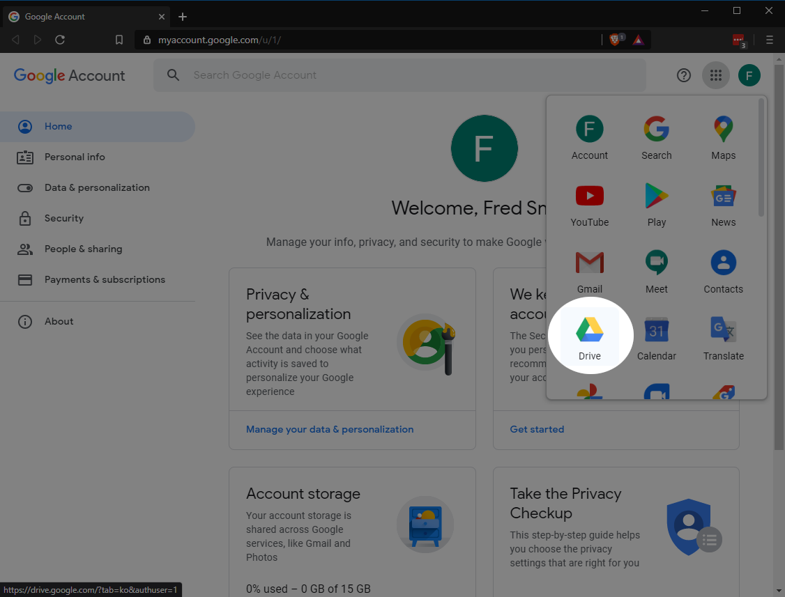

--- 
title: 'How to Use a Google Account'
layout: page
parent: Chapter 2 - The Internet
nav_order: 4
---

Google Account Features
=======================

So you've got a Google account. What now? There are a few things you can do at your leisure and we will not walk you through all of it, but for now, take a look around this home screen. If you've navigated away from it, you can return there by following [this link](https://myaccount.google.com/).

At some point, you may want to take a half hour or so to go through the four main links on this screen. There are four main areas that you can explore to get your account set up the way you like:

* **Privacy and Personalization**: Here, you can decide how your account will track and store your data. Your search, location, and YouTube history. You can decide what Google does with your data and you can even download all of your data.
* **Security Issues**: Google will let you know what issues Google may have identified for your privacy and security. For example, here you might enable 2-step verification or identify devices that are logged into your account.
* **Account Storage**: Here you can manage the storage space on your account and see how it is distributed across Google's services. You will get 15 gigabytes of storage for free with the account. And this is effectively unlimited if you only use it for simple things like text documents and such. The more you use it for storing things like photos and other large files, it can fill up.
* **Take the Privacy Checkup**: Your account software will walk you through a process where it will explore a few common areas where people like to secure their accounts. You can decide how you like advertisements to be generated, for example.

Your Main Apps
--------------

These are all useful menus and features to explore, but we will not look at them in detail here. Instead, let's turn to the main apps in the Google suite. Turn your attention to the top right corner menu in the above screenshot. You can use the mouse wheel to scroll through this list. The icons that you should learn to recognize by sight are as follows:

* Drive:  - This is Google drive. This is where your files will be stored.
* Docs:  - Docs is your word processor.
* Slides:  - Slides is your presentation software.
* Sheets:  - Sheets is a spreadsheet app.

Note that if you are using a **Chromebook**, you can access the google apps by simply searching for them in the App shelf and can even pin them to your shelf.

If you are using Windows, one thing that you might want to do is install Google Drive on your computer. This will allow you to sync any files from your home computer to the cloud with ease. This is pre-installed on a Chromebook, but here's how to do it in Windows:

1. First, in the Google Accounts interface, click the menu button on the top right and select the Google Drive app. Alternately, you can simply navigate to [drive.google.com](https://drive.google.com).

    {: width="50%"}
1. Click the cog in the upper right corner and select **Get Drive for desktop**. Alternately, if this is your first time here, you might see the blue box in the bottom left corner as seen in the screenshot above. This does the same thing.

    {: width="50%"}
1. This will download a file to your computer. Simply run the file (click or double-click it, depending on your platform) and it will walk you through the entire installation. It will take you step by step so you can customize the installation. The defaults are all very reasonable, so typically, you can just keep click **next** and it should work just fine. If you have any trouble with this, ask the instructor.
1. Now, you will have a folder on your local machine that you can drop files into which will then be automatically synced with your Google Drive. This is a great way to keep track of files so you don't lose them, and it has the added security benefit of keeping your data safe from such things as ransomware attacks.

Next
----

In the next sections, we will look at web browsing, search engines, and email.

