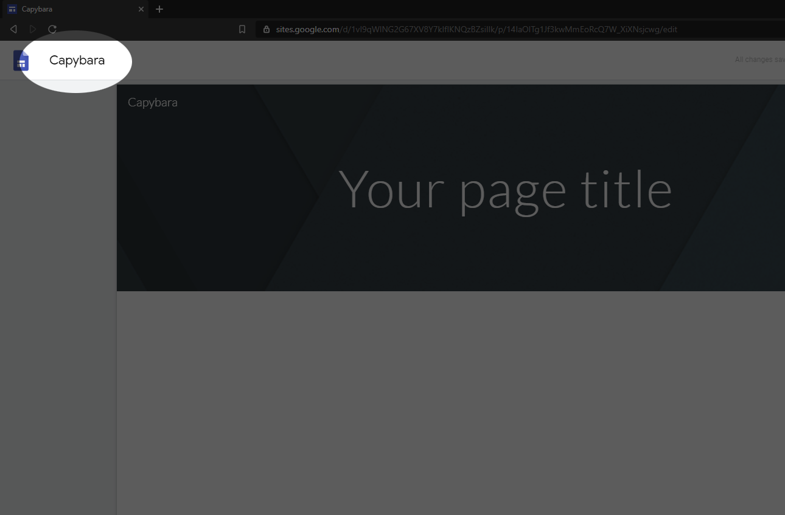
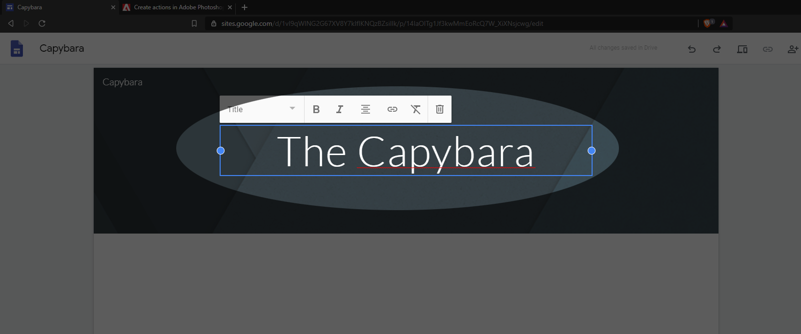
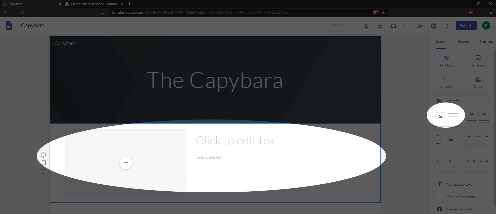
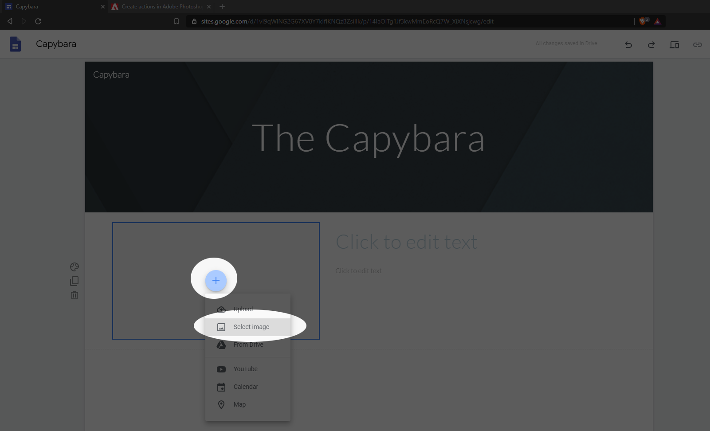
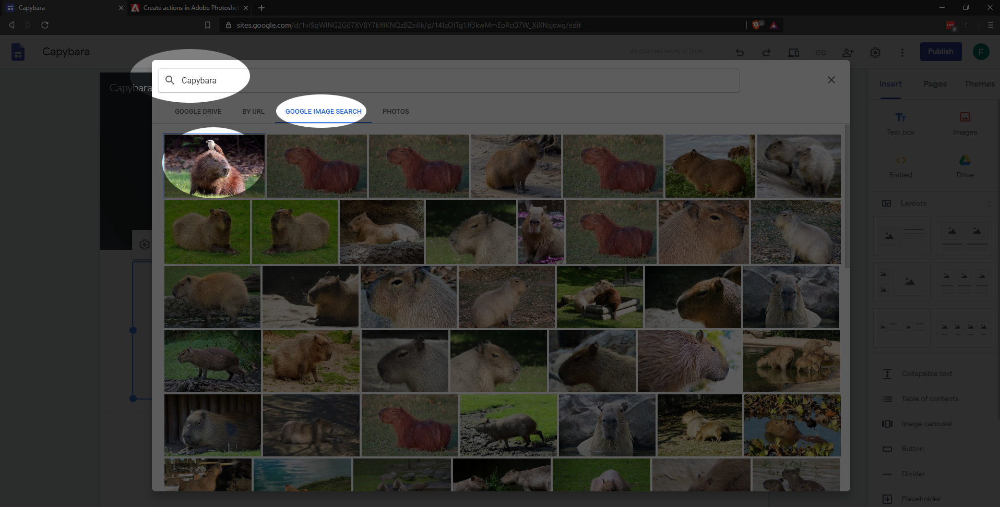
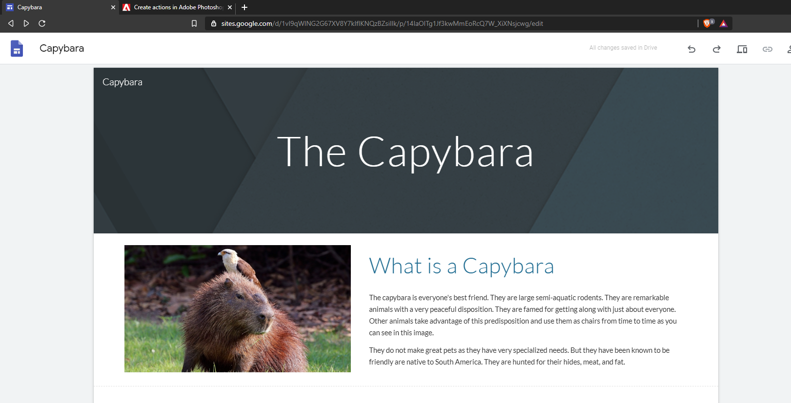
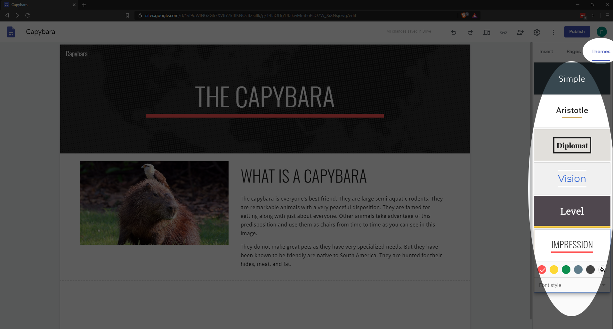
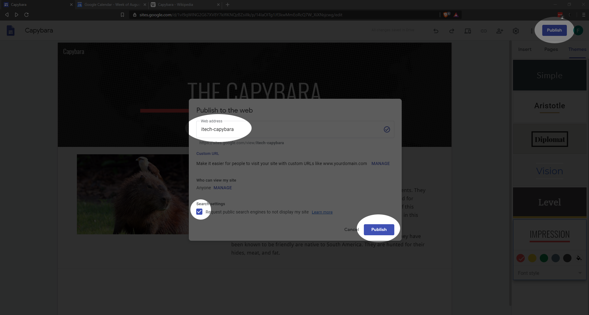
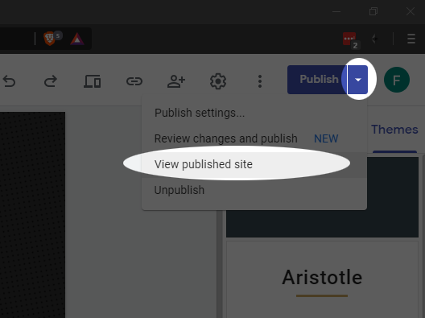

--- 
title: 'Build Your First Website'
layout: page
parent: Chapter 2 - The Internet
nav_order: 7
---

Building a simple website these days is quite straightforward. It is also something that a reasonably tech-savvy person might be called upon to do on occasion, even if one is not a professional Web developer. If you have a basic command of a web browser, a word processor, and confidence moving files around, you will be able to build something that looks professional and attractive.

For the purposes of tutorials and projects in this course, we will use [Google Sites](https://sites.google.com/). The basics of using this platform will be covered here. If you have any questions, problems, or concerns, ask a classmate or the instructor.

Click the link to go to [Google Sites](https://sites.google.com). Create an account if you don't already have a Google account.

1. Create a new website using Google Sites. Start with a blank site as shown here:
    
1. Select a topic that you know something about, that you can talk about in briefly in a couple of paragraphs, and can be represented by an image. Possible topics:
    * An animal or other organism
    * A hobby
    * A person you admire (historical or otherwise)
1. At the top left, change the title of the site to something represents your topic:
    
1. Change the page title at the top center of your page. To this, simply click on the title, delete the text, and type.
    
1. Select a layout from the toolbar on the right with an image and some text. Click it and it will be inserted underneath the banner.
    
1. Let's add an image. First, **click** the plus in the center of the image placeholder. Here, you have the option of selecting an image from your computer if you like, or you can grab one from your Google photos library or do a Web image search. in this case, choose **Select Image**.
    
1. Select the **Google Image Search** tab and type a relevant search query into the top bar, and then select your image. A blue bar will appear at the bottom and you can click **insert**:
    
    There are some simple image editing tools here. You can crop and resize, add captions, turn the image into a link and so one, but we'll leave that for later.
1. Next, you'll do some typing. Change the heading in the textbox to read something relevant and then write about two paragraphs about the topic that you think are interesting. For the purposes of this assignment, it doesn't even have to be factual. So be creative if you like.
    
1. In the top right, click the **Themes** tab on the sidebar. Select any theme you like. Here, you can also change color schemes as well.
    
1. Now, publish the site. In the top right, click **Publish**, select a unique name for the site. Since this is just practice, you may not want the page indexed by search engines, so put a check in the box at the bottom of the dialog. Finally, click **Publish** once again.
    
1. The page is now live and you can view it clicking the arrow next to the Publish button and selecting **View published site**.
    
1. Since you now have a published web page, you may want to make revisions. You can edit the site as much as you like and it will save the changes you make, however, any changes you make will not appear until you press **Publish** again. Let's try this: at the bottom of your text, add something like "For more information, click here". Now, in another browser tab, find some reference that your hypothetical reader might find useful (Wikipedia, for example). And highlight the URL at the top of the browser. Press **Ctrl-C** to copy it, or right click the highlighted URL and click "Copy".
    
1. The URL is now in your system clipboard. Return to the tab with your web page editor and highlight some relevant text, like the word "here". Next, click the chain icon to create a link.
    
1. In the dialog that opens, paste the URL into the **Link** box (**Ctrl-V** or right click and select **paste**) and click Apply.
    
1. Your page is finished for now. Click **Publish** once again. It will show you a comparison between what's currently published and your draft. Click **Publish** one final time and view the resulting web page!
    
1. Copy and paste the URL in the browser bar into the assignment on the course portal on Canvas to turn in the assignment.
