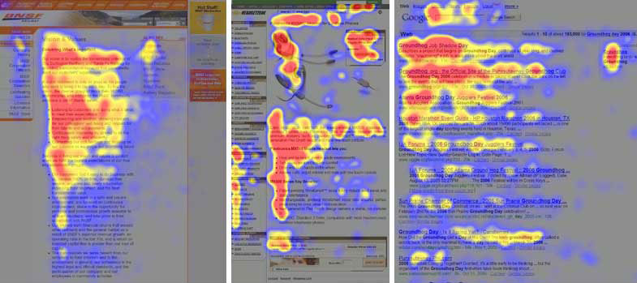

--- 
title: 'Web Design Principles'
layout: page
parent: Chapter 2 - The Internet
nav_order: 8
---

Principles of Web Design
========================

What actually makes a good Website? What makes a good page in a Website? Let's start with the long view. Look at high-level principles that can help us build good Websites that are useful for users and would be more likely to generate traffic.

## Purpose

A website needs to have a clear purpose. Make the intention of the site clear with a simple glance around. Ask what the website wants to accomplish? Are you reviewing movies? Selling a product? Is it educational? Are you compiling a guide for how to accomplish a particular task or craft?

To this end, you also want to establish **your** credibility as an author and content-creator. By continually generating quality content, you can even build a reputation, rise in the page ranks, and generate more traffic to your website.

## Craft quality content

Visual design is important, but having good content is essential to drawing users to your site. You want people to share links to your content and come back again later. Have someone proofread your content for clarity, consistency, and readability.

## Keep it simple

Try to keep a website as simple as possible to accomplish your goal. Choose a consistent and clear color pallette, use easy-to-read type (fonts), and carefully choose visual elements like images to complement your written and other content. Don't overload your users' senses with noise, garish colors, and goofy fonts.

Consider using a [Color pallette generator](https://coolors.co/) if you don't have much experience in design. Once you've selected a color pallette, *stick with it*. Don't deviate into other color territory.

Can you think of any examples of popular websites that violate the simplicity principle?

## Understand Reading Patterns

Research into reading patterns and using eye-tracking technology, we have discovered that almost all content consumption follows a sort of f-shaped pattern where readers focus most of their attention on the beginning of any content, article, or page. Headings generally get the most attention and many readers will trail off and never actually finish reading the article. Rather than complain about this, use it to your advantage. Keep content brief, if possible, but also concentrate the most important information at the top of the article and then let less important information or context information come in at the end.

## Establish a visual hierarchy

Make use of headings to split your content into sections or regions. Cue the reader in on what each area of the page contains by using clear labeling and heading hierarchies. This is also a great practice to get into if you want to maintain ADA (Americans with Disabilities Act) compliance (and you should!). Users with screen readers need those headings to find things on the page.

Color can also be a great tool to help users orient themselves to the content of the page.

## Keep load times low

If you want people to read your content and not click away, you want to optimize the load times of the site. This can be done by being aware of things like image sizes and how those files load. Remember, users expect a site to load in less than 2 seconds. And 3 seconds is often a deal breaker.

## Responsive design

"Responsive" is an industry buzzword that simply refers to the extent to which your site's content can automatically adjust to smaller screen sizes. How "responsive" it is is a measure of how mobile-friendly your site's design is. The tools that we'll be using to build our pages for this course already have this aspect of our work covered as Google Sites automatically generates nicely responsive web pages.
