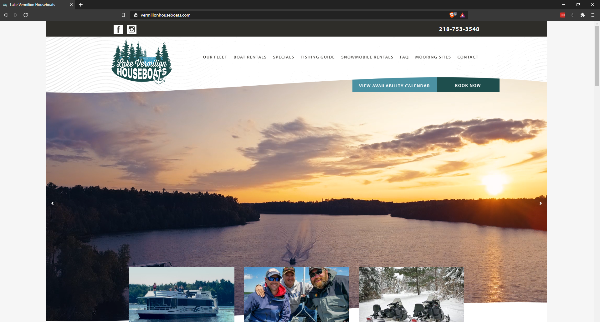
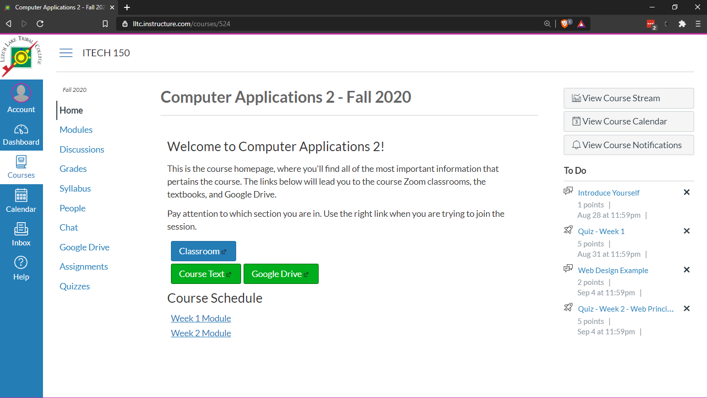
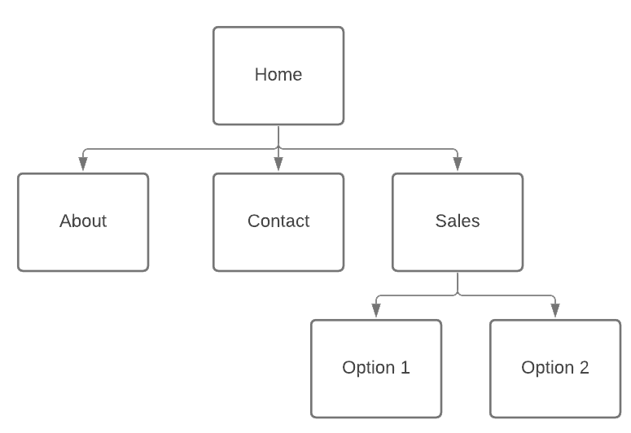
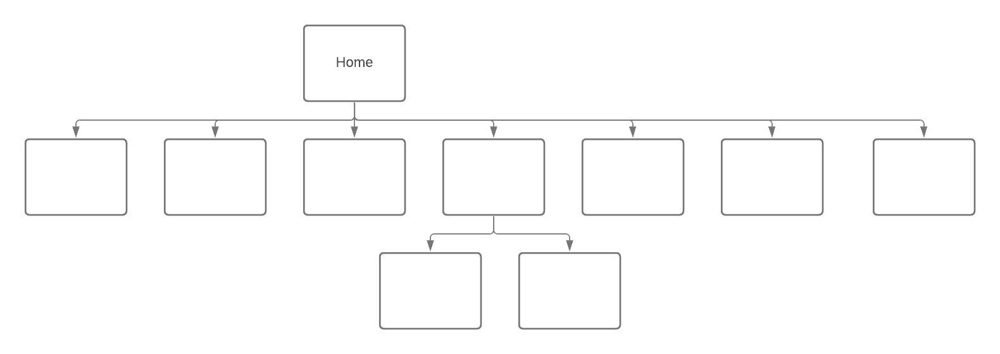
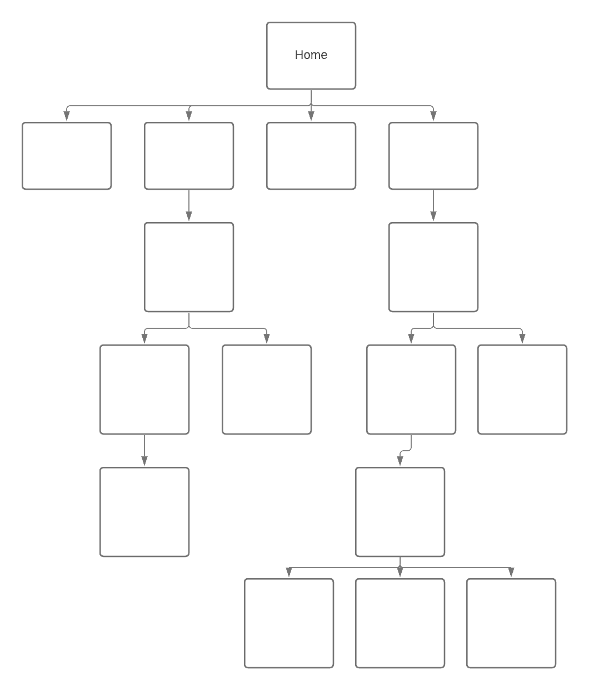
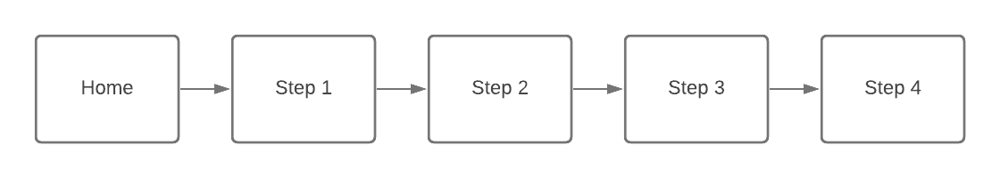
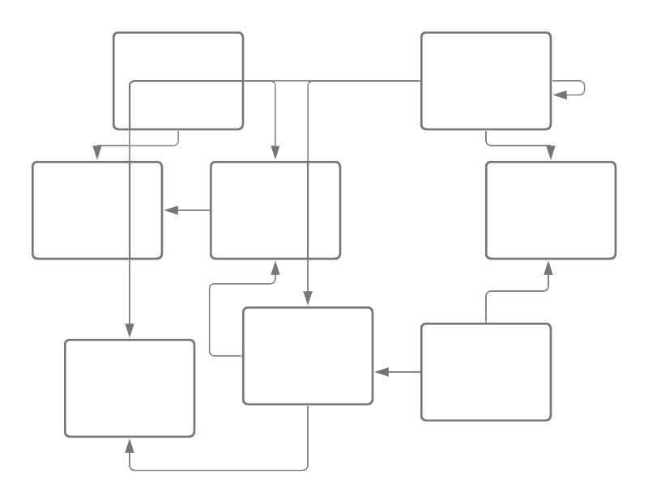
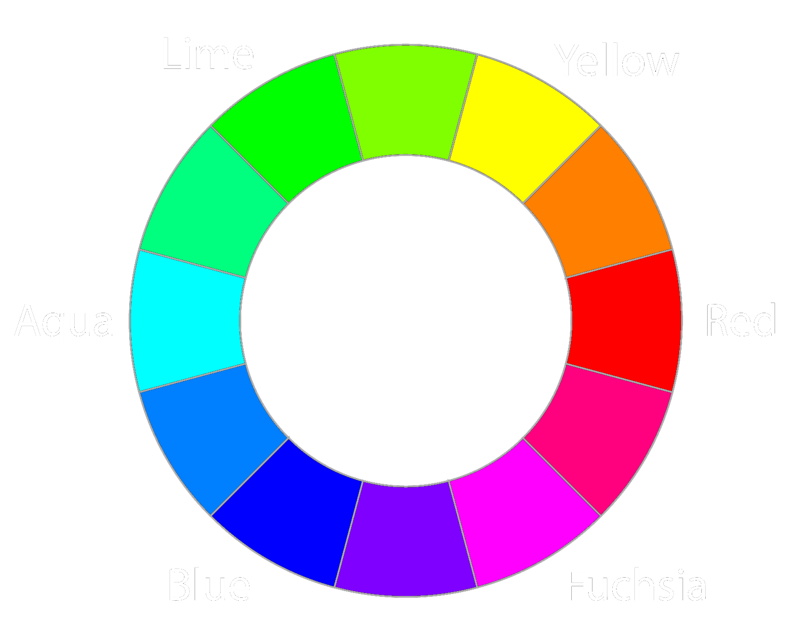

--- 
title: 'Site Design Principles'
layout: page
parent: Chapter 2 - The Internet
nav_order: 9
---

Website Organization
====================

Goals
-----

---

* Describe common ways to organize a website
* Explore some principles of visual design
* Talk about target audiences
* Discuss navigation within a website
* Talk about graphics and its appropriate use
* Outline some best practices

Getting Started
---------------

We are using Google Sites for most of our work, so a lot of the best practices and other design decisions are already made for us. However, it's a good idea to think about them and critically look at some of the decisions that are made for us by choosing this particular platform.

Target Audience
---------------

When you build a website, the first thing you want to think about is who you expect to read your website. What might they be trying to accomplish? What is their initial experience with your website going to be? Let's look at a couple exmaples.

 

Here, we have the homepage for a houseboat rental company on Lake Vermillion in Minnesota. The page immediately greets you with a large image of the lake, a sampling of images of people just having a really great time, and a couple of very easy to locate "Call to Action" buttons (CTA) where you can either book a reservation or check the availability. There are few options here. Just a very quick sales pitch promising an adventure, and a couple CTAs.

You're probably familiar with this page, but let's look at it critically. Instead of just a couple well-placed buttons to funnel clients through, you have a myriad of tools and links available to you so you can immediately get to work. There are no images. It's a website designed around a distinctly different purpose, to facilitate learning where all of your tools are immediately available.

Website Organization
--------------------

How do you navigate a website? How do you ensure that users find what they are looking for? To answer this, you have to decide how your site will be organized. Some sites publish a diagram of their site's organizational structure called a **site map**. Indeed, even if you don't publish one for your users, you should have one in your own file so you can see the overall structure of a multipage website. Broadly, the structure of a site fits into three categories.

* Hierarchical
* Linear
* Random

### Hierarchical Organization

The vast majority of websites are hierarchical in their structure. Consider how https://www.lltc.edu is organized. There is a home page and all other pages on the site are linked from it.

{: width="50%"}

Now, a hierarchically organized site can be shallow or deep. Either all or most pages are linked directly from the home page, or you'll see a lot of depth where users navigate down one of many paths to find what they are looking for:

| A Shallow Hierarchy                                | A Deep Hierarchy                             |
|  |  |

### Linear organization

Some websites want their users to progress through a series of pages in a linear fashion. For example a how-to website, or a class with a series of lessons.

### Random Organization

Occasionally, there are some sites that have no clear sense of organization. These sites are not typically appropriate for commercial sites and are often artistic or experimental in nature. This is also sometimes called "web organization".

### Other thoughts on organization

It is certainly the case that many websites will embody two or more of these types of organizational structures. A site might be primarily hierarchical, but also have some pages that are linked in specific linear progressions, like the LLTC website which has a sequences of pages you have to progress through to apply to the college. Or Wikipedia which is largely a shallow hierarchy, but also has a distinctly random web organization since many pages are cross-linked to each other, sometimes in many ways.

## Design for an Audience

While you're designing a website, be sure to consider who your target audience is and use colors and fonts appropriately. Consider the following websites and their target audiences. Who is each one targeted at and how do the elements of that page and the overall design reflect their targeting?

* [PBS Kids](https://pbskids.org/)
* [Nickelodeon](https://www.nick.com/)
* [Teen Vogue](https://www.teenvogue.com/)
* [AARP](https://www.aarp.org/)

What do you notice? How are colors used? How are fonts and images used? What about layouts and buttons? Notice that in the sites designed for kids, there are lots of bright colors with big buttons and simple interfaces. A site designed for young adults has a sleek modern look with an overall black and white theme with pictures and headlines but you have to click through to find content. Sites for older users have a tendency to use larger fonts, light or even white backgrounds, well-defined images, and more text on the home page. Indeed, it reads more like a newspaper.

## Color Schemes

An overlooked but highly important decision that should be made early in the design process, before any content is ever generated, is selecting a color scheme for the website. Now, if you're using pre-defined templates, sometimes these decisions are made for you. But good templates almost always have a way to swap out the existing default color scheme for your own. Let's get a quick overview of colors and how they work in web design (or any kind of design, for that matter).

### The color wheel

http://paletton.com/

https://color.adobe.com/

https://coolors.co/

