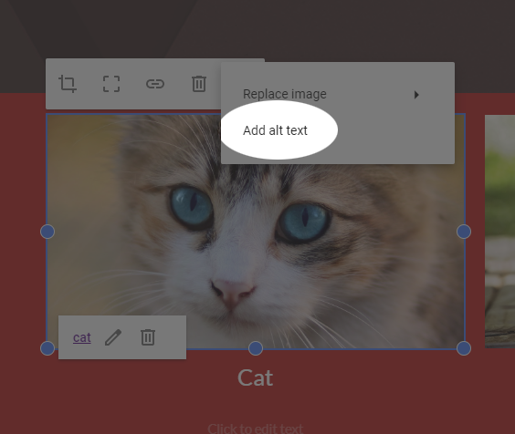
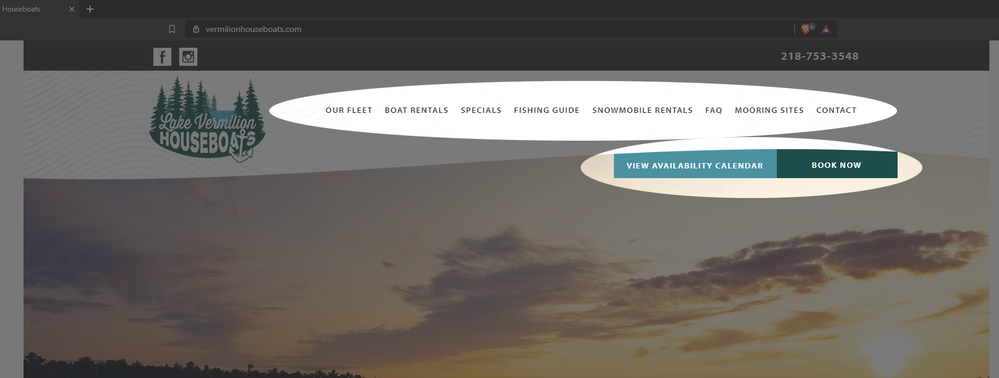
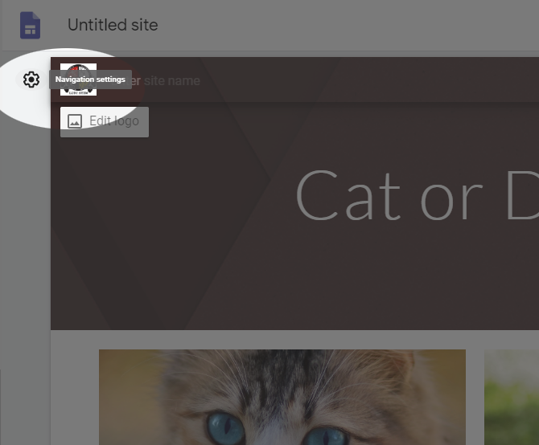
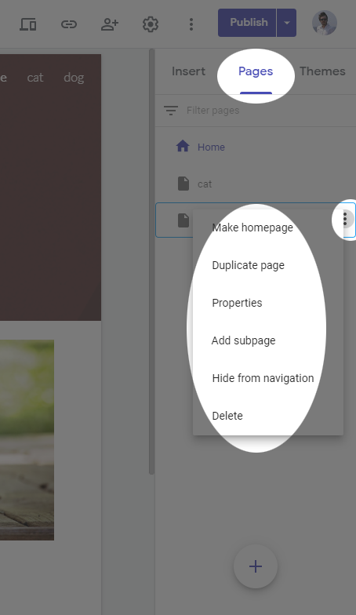

--- 
title: 'Site Design Principles'
layout: page
parent: Chapter 2 - The Internet
nav_order: 9
---

Website Organization
====================

Goals
-----

---

* Describe common ways to organize a website
* Explore some principles of visual design
* Talk about target audiences
* Discuss navigation within a website
* Talk about graphics and its appropriate use
* Outline some best practices

Getting Started
---------------

We are using Google Sites for most of our work, so a lot of the best practices and other design decisions are already made for us. However, it's a good idea to think about them and critically look at some of the decisions that are made for us by choosing this particular platform.

Target Audience
---------------

When you build a website, the first thing you want to think about is who you expect to read your website. What might they be trying to accomplish? What is their initial experience with your website going to be? Let's look at a couple examples.

 

Here, we have the homepage for a houseboat rental company on Lake Vermillion in Minnesota. The page immediately greets you with a large image of the lake, a sampling of images of people just having a really great time, and a couple of very easy to locate "Call to Action" buttons (CTA) where you can either book a reservation or check the availability. There are few options here. Just a very quick sales pitch promising an adventure, and a couple CTAs.

You're probably familiar with this page, but let's look at it critically. Instead of just a couple well-placed buttons to funnel clients through, you have a myriad of tools and links available to you so you can immediately get to work. There are no images. It's a website designed around a distinctly different purpose, to facilitate learning where all of your tools are immediately available.

Website Organization
--------------------

How do you navigate a website? How do you ensure that users find what they are looking for? To answer this, you have to decide how your site will be organized. Some sites publish a diagram of their site's organizational structure called a **site map**. Indeed, even if you don't publish one for your users, you should have one in your own file so you can see the overall structure of a multi-page website. Broadly, the structure of a site fits into three categories.

* Hierarchical
* Linear
* Random

### Hierarchical Organization

The vast majority of websites are hierarchical in their structure. Consider how https://www.lltc.edu is organized. There is a home page and all other pages on the site are linked from it.

{: width="50%"}

Now, a hierarchically organized site can be shallow or deep. Either all or most pages are linked directly from the home page, or you'll see a lot of depth where users navigate down one of many paths to find what they are looking for:

| A Shallow Hierarchy                                | A Deep Hierarchy                             |
|  |  |

### Linear organization

Some websites want their users to progress through a series of pages in a linear fashion. For example a how-to website, or a class with a series of lessons.

### Random Organization

Occasionally, there are some sites that have no clear sense of organization. These sites are not typically appropriate for commercial sites and are often artistic or experimental in nature. This is also sometimes called "web organization".

### Other thoughts on organization

It is certainly the case that many websites will embody two or more of these types of organizational structures. A site might be primarily hierarchical, but also have some pages that are linked in specific linear progressions, like the LLTC website which has a sequences of pages you have to progress through to apply to the college. Or Wikipedia which is largely a shallow hierarchy, but also has a distinctly random web organization since many pages are cross-linked to each other, sometimes in many ways.

## Design for an Audience

While you're designing a website, be sure to consider who your target audience is and use colors and fonts appropriately. Consider the following websites and their target audiences. Who is each one targeted at and how do the elements of that page and the overall design reflect their targeting?

* [PBS Kids](https://pbskids.org/)
* [Nickelodeon](https://www.nick.com/)
* [Teen Vogue](https://www.teenvogue.com/)
* [AARP](https://www.aarp.org/)

What do you notice? How are colors used? How are fonts and images used? What about layouts and buttons? Notice that in the sites designed for kids, there are lots of bright colors with big buttons and simple interfaces. A site designed for young adults has a sleek modern look with an overall black and white theme with pictures and headlines but you have to click through to find content. Sites for older users have a tendency to use larger fonts, light or even white backgrounds, well-defined images, and more text on the home page. Indeed, it reads more like a newspaper.

## Color Schemes

An overlooked but highly important decision that should be made early in the design process, before any content is ever generated, is selecting a color scheme for the website. Now, if you're using pre-defined templates, sometimes these decisions are made for you. But good templates almost always have a way to swap out the existing default color scheme for your own. Let's get a quick overview of colors and how they work in web design (or any kind of design, for that matter).

### The color wheel

The color wheel is a good starting point when looking to build a color palette for a web site. The pictured color wheel is based on the three primary colors that monitors can display. The colors displayed in this wheel are all highly saturated however, and some mixing and matching is in order.

As it turns out, color schemes are fairly easy to build and follow mathematical principles. There are many tools available, but let's look at a few examples of common color schemes.

### Monochromatic

Here, we have three colors with the same hue, but white or black are added to create darker versions of these colors. This way, you're guaranteed to have colors that work well together.

### Analogous

Analogous color schemes are created when we select colors that are close to each other on the color wheel.

### Complementary

In a complementary color scheme, we select two colors that are opposite each other on the color wheel.

### Split-Complementary

A split-complementary is formed when we select a primary color and then two colors adjacent to the complement across the wheel. This has the advantage of having the strong contrast of a complementary scheme, but with less tension between the colors.

### Triad

A triad is formed from three colors evenly spaced around the wheel. It has medium contrast and some drama, but not as extreme as a complement.

### Tetrad

A tetrad is formed when you take four colors from around the color scheme. You can form these in a few ways. If you evenly space the colors, you get four colors that are far from each other, but you can also select a pair of analogous colors that complement each other like example here.

### Some tools to get you started

There are many tools to choose from these days when building color palettes. Here are a few to get you started:

* [Paletton](http://paletton.com/)
* [Adobe color picker](https://color.adobe.com/) 
* [Coolors](https://coolors.co/)

### How to use a color scheme

Once you have selected a color palette, usually you choose one of the colors to be the dominant color and use the others as accents. A mix of neutral colors like black, white, and gray will probably also find their way into your site. Even the color of your text is not so clear cut. For example, what color is the text on this web page that you're reading? Why do you think I used a shade of gray and not white? When you go to other websites, look at the color of the text and have a think about why they chose the colors they did for the palette, the text, and other elements in the page.

One of the advantages of using Google Sites is that it can help streamline the process of color scheming. If you add a branding image, it will give you the option to select a primary color from a company or site logo. And other colors will be automatically selected based on that choice. You still have some flexibility, and you are free to choose whichever colors you like, but if you let Google do its magic, you won't have to worry too much about color selection beyond choosing between a small selection of colors that work harmoniously with each other.

## Graphics

There are some considerations that need to be considered when selecting images to include in a website. The primary way in which you can optimize load times for your pages is by optimizing the file sizes of your multimedia and graphics. It's rare that you'll host your own video (you'll upload to a video hosting site like YouTube or Vimeo and embed it in your pages), but you will be hosting your own images. So what you want to do is ensure that the image resolutions and sizes are as close as possible to the size that they will render in the browser. That said, this is becoming less of an issue as devices become more powerful and blazing fast connection speeds are becoming the norm. However, if you use a lot of graphics, spending a little extra time optimizing those images is still a good idea. Here are some tools you can use to manipulate images (we'll cover this process more in another chapter).

* [Pixlr](https://pixlr.com) - Free cloud layer-based raster editor
* [Photoshop](https://www.photoshop.com) - The most famous raster editor in the world 
* [The Gimp](https://www.gimp.org/) - The second most famous raster editor in the world (but also it's free)

### A Note on ADA Compliance

Another thing that should be considered when selecting images is their effect on screen readers for people who rely on them to navigate. HTML has a mechanism for adding alternate text to images. In the early days, this was purely a mechanism for replacing the image in case the image failed to load (a very real possibility in the old days). But it eventually became a primary mechanism for ADA compliance and maintaining accessibility for people who are visually impaired. When a screen reader parses the web page and comes across an image, it will read the alt-text back to the user so they know what was in the picture. Google Sites makes this process quite easy. Simply select the image, select the three dots on the far right of the menu, and click **Add alt text**. Do this for every image to maintain ADA compliance.

Alternately, if the image *is* purely decorative and need not be parsed by a screen reader (a background image, for example), in the alt-text dialog that opens, you can leave the alt text box blank and check the box that says it is decorative.

## Navigation

Deciding how users navigate your web page is critical to the user experience. Take the Lake Vermillion Houseboats example. The navigation is at the top of the page with the two CTA buttons just beneath it. Looking at this, can you think of what type of organization is this site structured around? Is it shallow or deep?

This text uses a sidebar for navigation. Notice how the bar stays static when you scroll down a page. Why do you think this choice was made?

In addition to a navigation bar, it can sometimes be useful to add a search feature, especially if your site is some sort of index or houses some encyclopedic knowledge (Wikipedia, for example). Try out this site's search feature.

### Navigation with Google Sites

In Google Sites, navigation is handled very intuitively. To set the location of the navigation bar, click the cog at the top right of the banner:

When you add a new page to the site, a link is automatically added to the navigation bar. In the pages tab, you can change nesting of each page add sub-pages, or hide them from the navigation by clicking the three dots next to the page's title.

Google Sites also automatically generates a search index for quick navigation as well.

## Best Practices

While Google Sites does much of this automatically, it is good to know some basic best practices if your career path ends up including web design and/or you find yourself using more advanced tools to build web sites.

* Page Layout
    * Consistency in layout, navigation, header design
    * Add a footer with copyright and contact info
    * Balance text, graphics, and white-space
    * Home page loads very quickly
    * Responsive page design that emphasizes mobile devices
* Navigation
    * Main navigation is consistent and easy to find
    * The footer should have plain text links for accessibility reasons
* Color and Graphics
    * A unified and consistent color scheme is used
    * Colors should be limited to three or four (plus neutrals)
    * Colors are sensitively used to maintain accessibility (consider visually impaired users)
    * Graphics are optimized for quick page loading
    * Colors and graphics enhance and don't distract
    * Use alt-text for accessibility
* Content
    * Use sane, common fonts
    * Use headings, subheadings, lists, short sentences and paragraphs
    * Revise and run spell check
    * Hyperlinks are logical. Don't use "Click Here" as link text
    * Don't make your users click too much
    * Make sure all links actually work.

For more comprehensive list of best practices, technology educator Terry Ann Morris has an [extensive and thorough list](https://terrymorris.net/bestpractices/).
