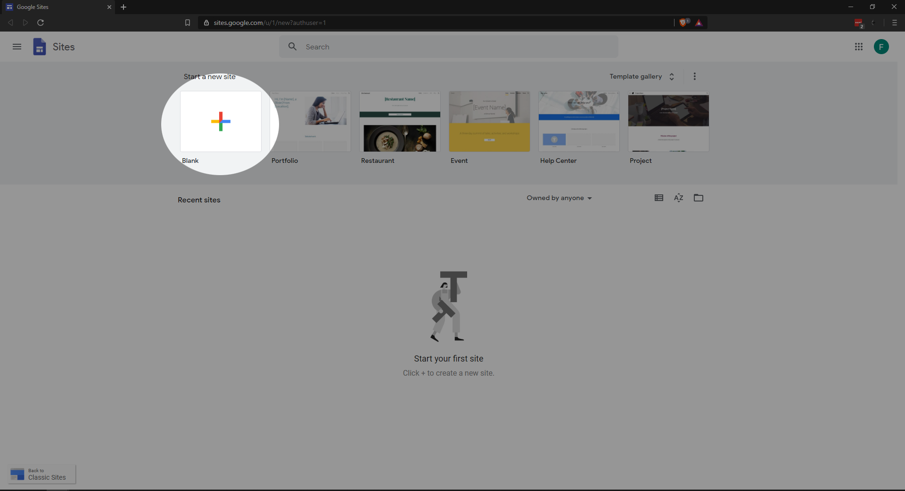

--- 
title: 'Build Your First Website'
layout: page
parent: Chapter 6 - The Internet
nav_order: 3
---

Building a simple website these days is potentially very simple. If you have a basic command of a web browser, a word processor, and confidence moving files around, you will be able to build something that looks professional and attractive.

For the purposes of tutorials and projects in this course, we will use [Google Sites](https://sites.google.com/). The basics of using this platform will be covered in class, and if you miss the class where we cover it, take a shot at figuring out the interface yourself. If you have any questions, problems, or concerns, ask a classmate or the instructor.

Click the link to go to [Google Sites](https://sites.google.com). Create an account if you don't already have a Google account.

1. Create a new website using Google Sites.
    
3. In one one page, include a picture, and answer a few questions about yourself.

   * What's your program/major
   * A short paragraph describing what you hope your profession will be and a description of where you might want to be 10 years from now.
   * Is there any particular app or piece of software that you would like to look at in this course?

4. You must include an image/meme/other multimedia.

Publish this site and make note of the URL which leads to it.

Submit the URL for your site to course portal on Canvas.
