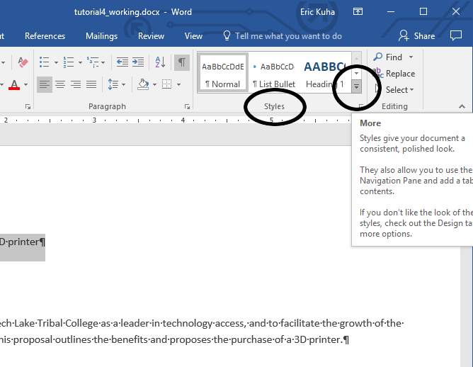
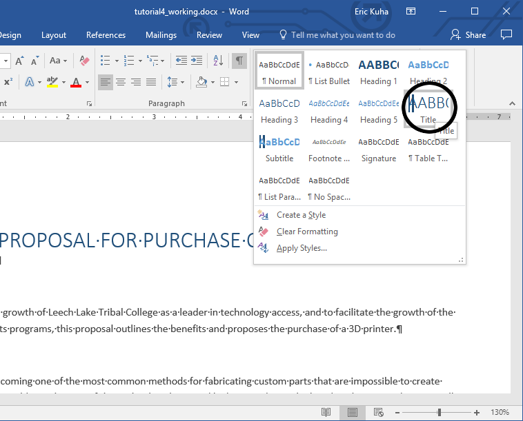
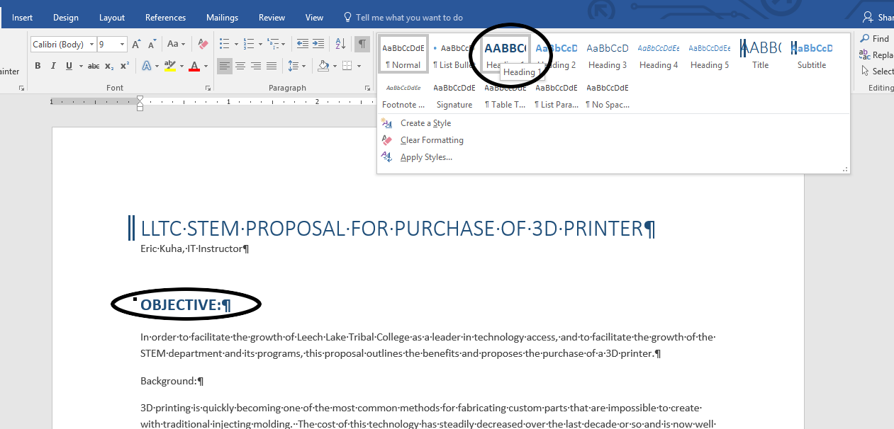
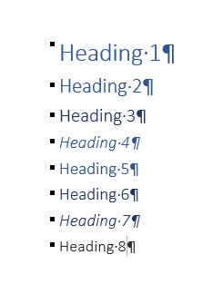
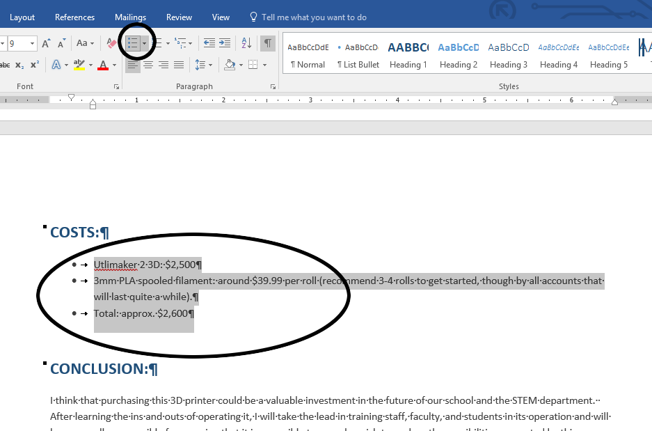
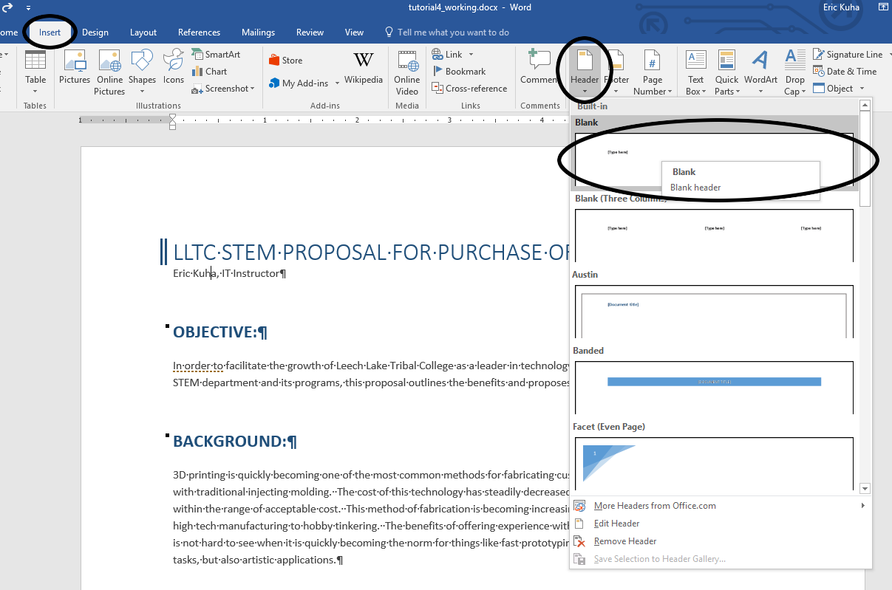
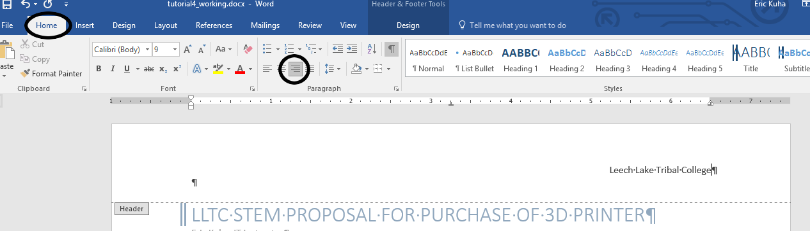
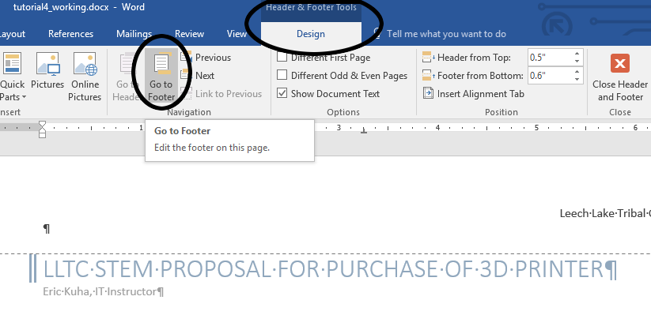
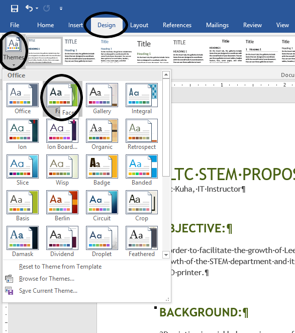

# Tutorial 5 - Styles and Themes

One of the most important rules when it comes to building professional
documents is consistency. When you create a heading for a section in
your document, you want all other headings to look the same, otherwise
it just won't look right. You might confuse your reader about what sort
of importance a section has. And yet, applying several different formats
(color, font, size, etc) to a some text can be tedious, especially if
you have to do it over and over again to multiple section headings. Most
modern word processors have built-in systems for styling a document
quickly and consistently. You can apply styles for titles, lists, and
multiple levels of headings among other things. Let's look at an
example. This tutorial takes the unformatted text of a purchase proposal
document and transforms it into a professional-looking and, hopefully
convincing, argument in favor of a large purchase.

Tools Covered
=============

Styles

:   Quick-Styles allow you to easily and consistently apply uniform
    styling to your document

Themes

:   Themes are specially tailored sets of formatting which can change
    the look and feel of an entire document.

Headers and Footers

:   Bands of white space at the top and bottom of the page that can be
    used to add repeated information such as the author's name or the
    page number.

TUTORIAL
========

[Start File](res/tutorial4_start.docx)

1.  Download the start file and open it in Microsoft Word. Look over the
    document to get a feel for what is here.

    {: width="100%"}

2.  First, select just the first line of text. In the **Home** tab, look
    at the **Styles** group. Depending on your screen's resolution,
    yours might look different. Expand the menu and see what styles are
    in the menu.

    {: width="100%"}

    If you hover the mouse cursor over any of the styles in the menu,
    Word will allow you to preview what the style will look like
    when applied. Click on the **Title** style.

    {: width="100%"}

    Observe the effect.

3.  An interesting thing about the Title and the various Heading styles
    is that they always affect entire paragraphs, so you don't actually
    need to select the paragraph that you want to change. You just need
    to move the insertion point to somewhere in the paragraph and then
    select it. Move the **insertion point** to somewhere in the third
    paragraph, the one the says "**Objective:**". In the **Styles**
    menu, select the **Heading 1** style.

    {: width="100%"}

    Notice that there are more than one level of headings. This allows
    you to arrange information in a document according a hierarchy. It
    is unlikely that you will have more than a few levels of headings in
    any normal document, however, the option exists if you want it. It's
    usually best to use the lowest level heading that keeps your
    document's hierarchy clear.

    {: width="100%"}

4.  Apply the **Heading 1** style to each of the other section headings:
    *Background*, *Applications*, *Proposal*, *Costs*, and *Conclusion*

    {: width="100%"}

5.  Scroll down the *Costs* section. There are three paragraphs that
    list the projected costs of the purchased equipment. Select all
    three paragraphs. In the **Paragraph** group of the **Home** tab,
    click on the **Bullets** button to convert these three lines into a
    bulleted list.

    {: width="100%"}

    Bulleted and numbered lists are essential to all design. By using a
    list format, you can make information easy to read and digest.
    People like lists.

6.  To add the **header**, go to the **Insert** tab and find the
    **Header & Footer** group. Click on the **Header** tool. Inside the
    Header menu are a number of useful pre-made header templates, but we
    are just going to add a blank one.

    {: width="100%"}

    A document control that says **\[Type here\]** will already
    be selected. Type "Leech Lake Tribal College". Go to the **Home**
    tab and right-align the header text.

    {: width="100%"}

    Scroll down to the next page and note that the text is also included
    at the top of this page. In fact, what you type into a header will
    be repeated on every page.

7.  Next, we're going to add page numbers. With the insertion point
    still inside the header, go to the **Header & Footer Tools** context
    tab and click the **Go To Footer** tool.

    {: width="100%"}

    Next, click the **Page Number** tool at the top left. Inside, the
    Page Number menu, select **Bottom of Page** and finally select
    **Plain Number 2** which will create a centered page number on each
    page of the document in the footer.

    {: width="100%"}

    Finally, click **Close Header and Footer** to leave the Footer.

8.  Our last task will be to change the **Theme** of the document.
    Themes are built-in sets of fonts, styles, colors, and other
    formatting that are designed to go together harmoniously. Since most
    people aren't real great at design, why not let Word do all of the
    hard work for you? Go to the **Design** tab. At the left end of the
    ribbon, there is a **Theme** tool which will open a menu with
    several pre-designed themes for you to choose from. Hover the moust
    over a few of them and observe how they change the entire look of
    the document. Select the **Facet** theme.

    {: width="100%"}

9.  Save your document and upload it to the class portal.

