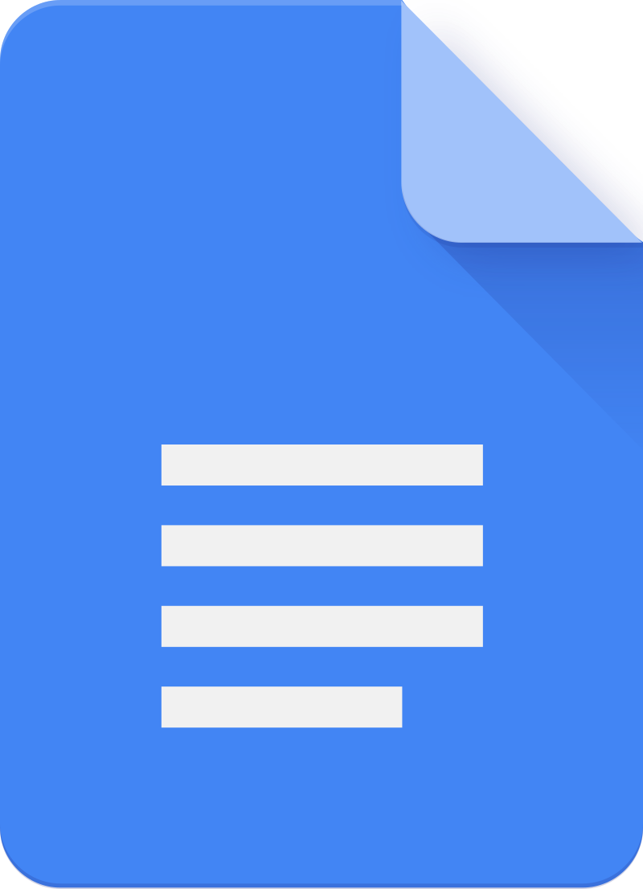
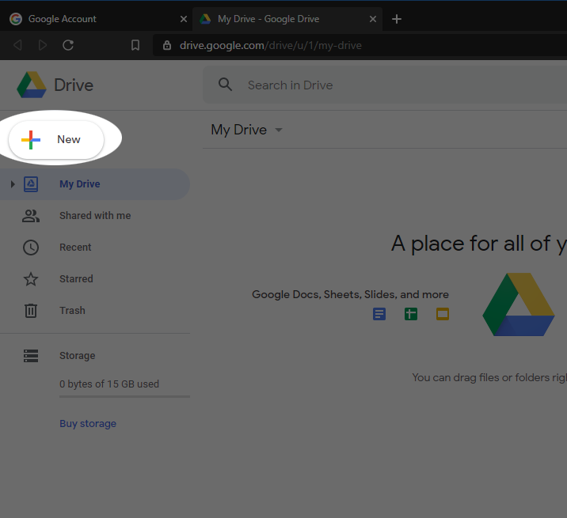
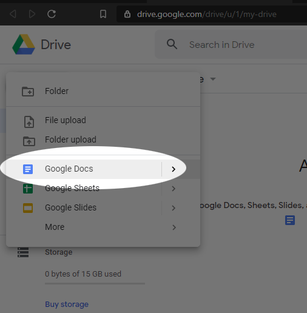
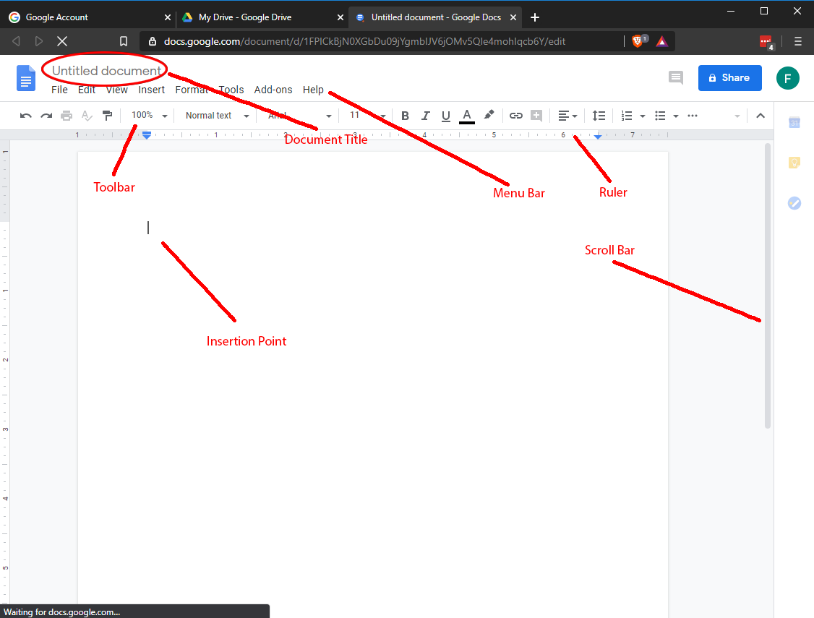

{: width="10%"}

<iframe width="560" height="315" src="https://www.youtube.com/embed/FiEMvSUIT6U" frameborder="0" allow="accelerometer; autoplay; encrypted-media; gyroscope; picture-in-picture" allowfullscreen></iframe>

Google Docs is a word processing application that can help you create professional documents, fliers, resumes, and more.

How to create a document
------------------------

1. In the [Google Drive](https://drive.google.com) interface, click **New** and select **Google Docs**:
    {: width="50%"}
    {: width="50%"}

Docs at a glance
================

{: width="75%"}

The Google Docs Interface
-------------------------

**Document Title**
: At the top, you'll find the document title. This is equivalent to the file name. To change it, simply click on the title and type.

**Menu Bar**
: A series of drop-down menus are at the top, giving access to many of the app's tools and features.

**Toolbar**
: The toolbar holds an array of a buttons and drop-down menus for all of the most commonly used tools in the app.

**Scroll bar**
: To scroll up or down in the document, you can scroll the mouse wheel, swipe your finger up or down on a touchscreen, or simply click and drag on the scroll bar. Honestly, at this point, the scroll bar is really just a visual indicator of where you are in the document. No one really scrolls using the bar anymore.

**Insertion Point**
: The vertical blinking line is the point at which text will appear if you begin typing. Try it!

**Ruler**
: A useful device when it comes to typsetting and layout. It's on by default. It can be especially handy to lay out tab stops and paragraph indents.
