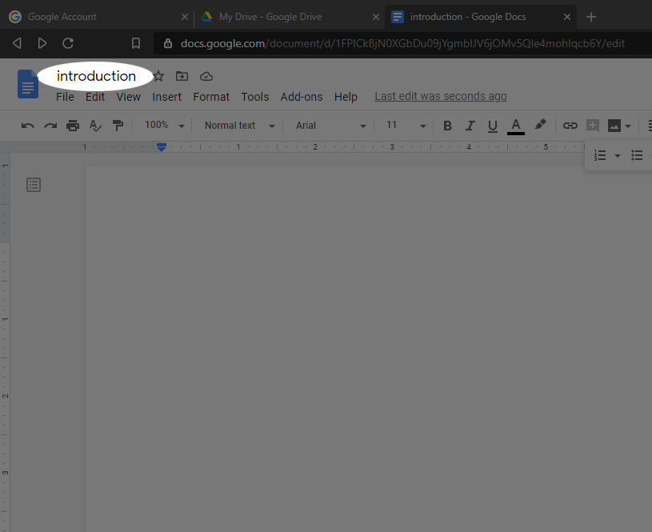
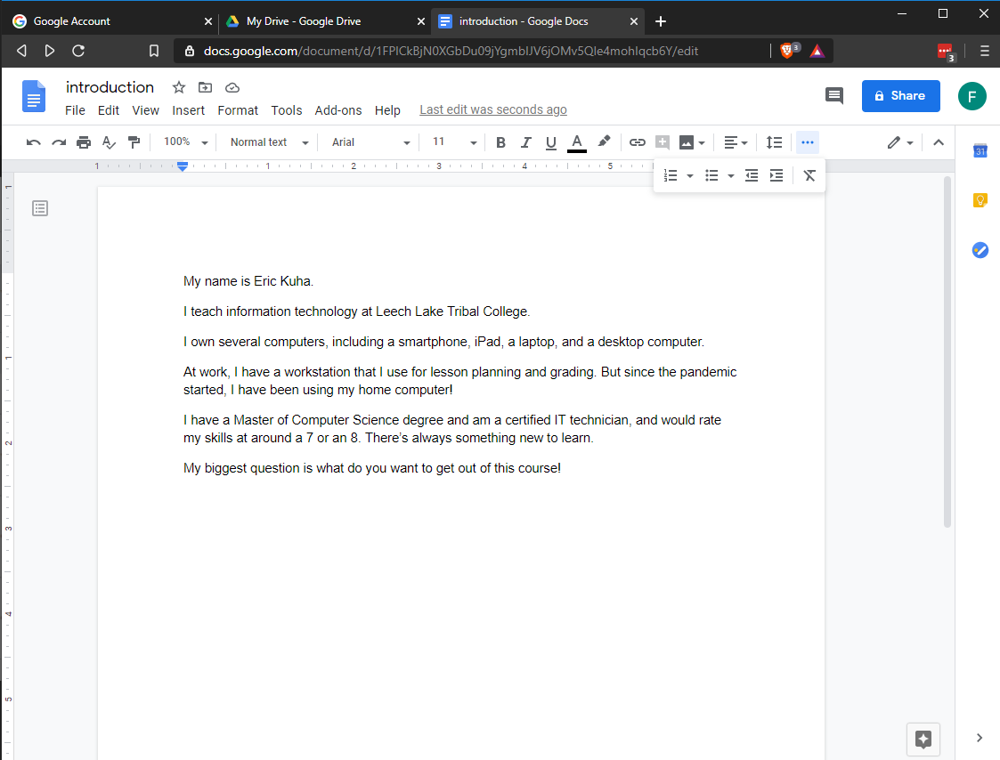

We are going to create, edit, and save a document. This document will be submitted to the class portal for grading.

TUTORIAL
========

1. Open your Google Drive and create a new Google Doc as demonstrated in the [previous section](1_docs_tour.md).
1. Click on the document title and change it to *introduction*.
    {: width="50%}
1. In the document, type out a brief introduction for youself answering these questions:
    - What is your name?
    - What is your program/major?
    - How experienced are you with computer?
    - Do you own a general-purpose computer? What kind? (Smartphones count)
    - What do you use it for?
    - Do you use a computer at work?
    - What do you use it for?
    - What is one question you have about computers that you'd like answered?
    {: width="50%}
1. You have a couple of different options when it comes to saving a Google Doc. If you just want it to be saved on your Google Drive (which will be the easiest way to submit it!) then you're already finished with this assignment! Google Docs automatically saves the document every time you make an edit. *And* it keeps a record of all edits made to the document, which can be very handy.

    If, however, you want to download the document to your computer, you can do so in one of several standard formats. We'll talk about this more later in the course, but just for a preview, click the **File** menu at the top of the window, and find the **Download** button and look over the different kinds of files options that are available. The two you're most likely to use are *Microsoft Word* and *PDF Document*.

Finishing Up
------------

To submit this assignment, you will have to upload it to Canvas. A video tutorial on how to do this will be included and linked here when it is ready. It will also be demonstrated live in class.
