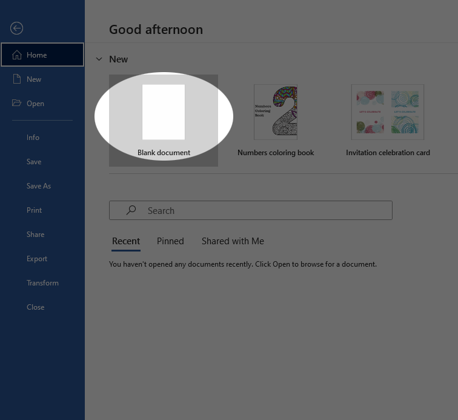
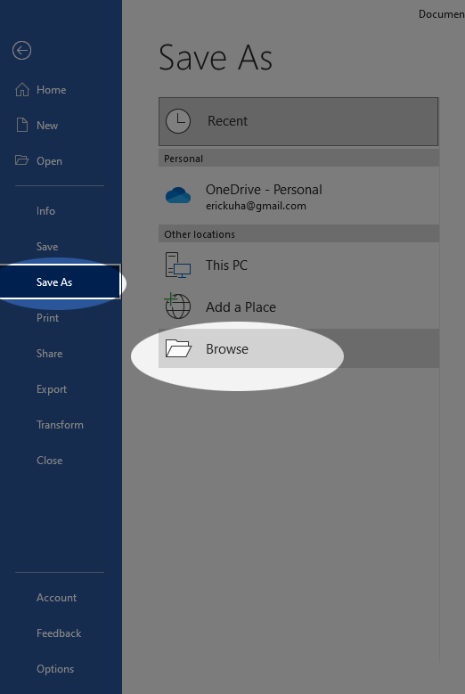

We are going to create, edit, and save a word document. This document
will be submitted to the class portal for grading.

<iframe width="560" height="315" src="https://www.youtube.com/embed/vMEzZCJpf1o" title="YouTube video player" frameborder="0" allow="accelerometer; autoplay; clipboard-write; encrypted-media; gyroscope; picture-in-picture; web-share" allowfullscreen></iframe>

TUTORIAL
========

1.  Open Microsoft Word by clicking the **Start Menu** button and either
    navigating to Word or typing "word" into the search bar.
2.  Word will open into the **backstage view**.

    

3.  Click on the **Blank Document** template.
4.  In the document, type out a brief introduction for yourself
    answering these questions:

    -   What is your name?
    -   What is your program/major?
    -   What is a question about computers that you would like answered?

    

5.  When you are finished typing, click the **File** tab to return to
    the **backstage view**.
6.  Click **Save As**

    

7.  Click **Browse** to open the file explorer.
8.  Navigate to your itech 100 folder which you created in the file
    manager tutorial. Give this file a logical name. Ensure that it's
    being saved as a **Word Document (.docx)**. Click **Save**.

    

9.  You can exit Word now. Finally, you will upload this file to
    class portal. Wait for instructions from the instructor for how to
    do this.
