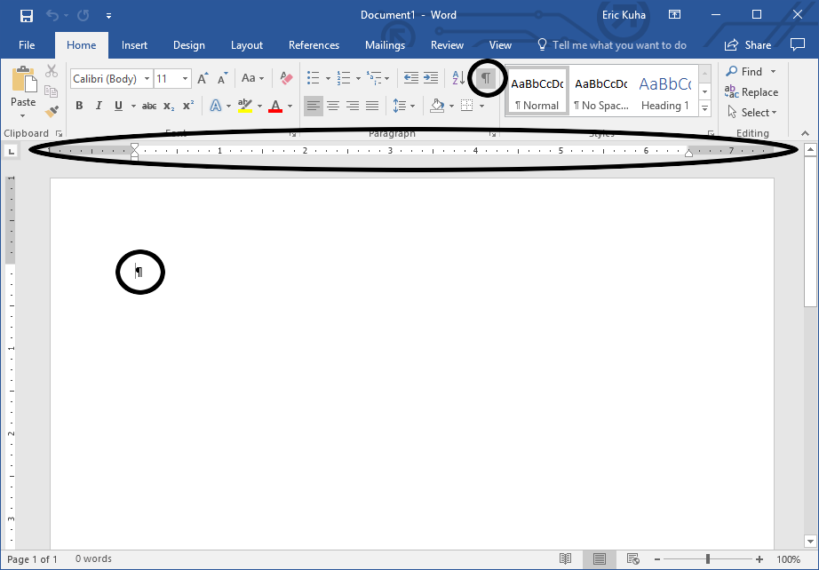
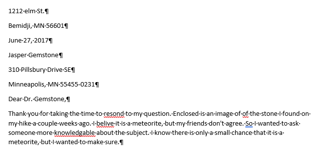
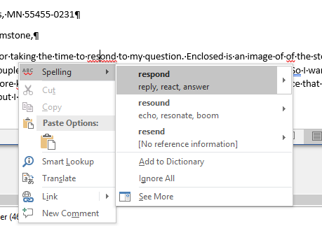
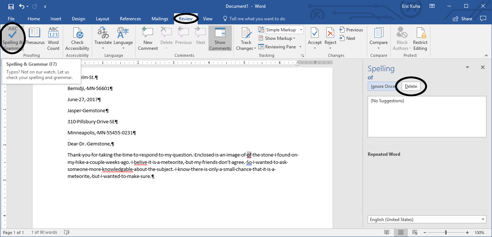
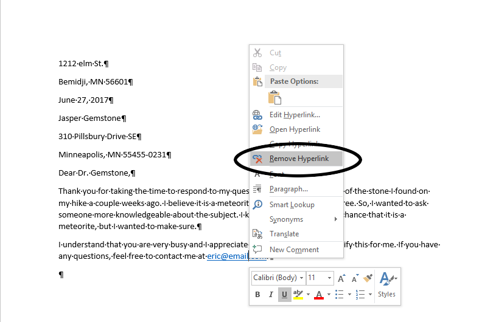
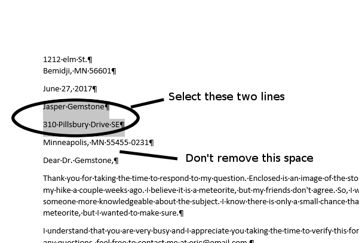
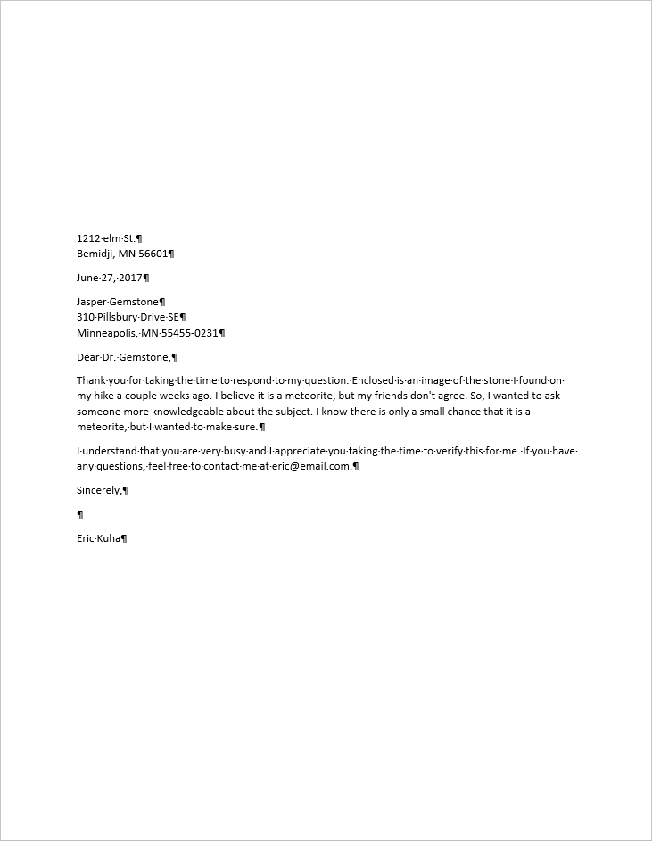

Tutorial 2 - Basic Text Editing
===============================

<iframe width="560" height="315" src="https://www.youtube.com/embed/eoY2x_fPdG8" frameborder="0" allow="accelerometer; autoplay; encrypted-media; gyroscope; picture-in-picture" allowfullscreen></iframe>

Word processing is, at its most fundamental, the process of manipulating text. Google Docs is a highly robust, feature-rich word processor. However, in order to get to some of its more advanced features, we should take a look at some of the basic tools and methods at our disposal in the modern word processing environment.

In this tutorial, we will write a basic block-style letter. In this process, we are going to gain experience with the following tools:

Insertion Point
: The blinking line that indicates where text appears when you type.

Paragraph and Line Spacing
: How to recognize default line and paragraph spacing and how to change it.

Spellchecking
: How Docs identifies spelling and grammar errors and how we can use these tools to make our words flow better.

TUTORIAL
========

1. Create a new blank document in your Drive in a folder you've created for this course. The window will look like this:

    

1. Change the document name to "block letter" or something similar.

1. We are going to write a block-style letter. This means that all of our text will be aligned to the left, paragraphs will be styled as blocks, and we must include addresses of the sender and receivera t the top of the letter. We will have to make some adjustments to the default styling in Google Docs to make this work which will give us an opportunity to see how some of these tools work.

   First, type the address of the sender as follows. Press the **Enter** key whenever you see the carriage return (&crarr;) symbol

   <pre>
   1212 Elm St. &crarr;
   Bemidji, MN 56601 &crarr;
   </pre>

1. Next, type the date

    <pre>
    June 27, 2017 &crarr;
    </pre>

4.  Next, type the sender's address as follows:

    <pre>
    Jasper Gemstone &crarr;
    310 Pillsbury Drive SE &crarr;
    Minneapolis, MN 55455-0231 &crarr;
    </pre>

5.  Now, type the salutation:

    <pre>
    Dear Dr. Gemstone, &crarr;
    </pre>

    Your document should look like this:

    

1.  If you are familiar with MS Word, you'll notice that, by default, Docs does not add an extra space between paragraphs. We'll add these at the end. Next, **Type** the following paragraph *exactly* as it appears here (typos and all):

    <pre>
    Thank you for taking the time to resond to my question. Enclosed is an image of of the stone I found on my hike a couple weeks ago. I belive it is a meteorite, but my friends don't agree. So I wanted to ask someone more knowledgable about the subject. I know their is only a small chance that it is a meteorite, but I wanted to make sure. &crarr;
    </pre>

1. When you are finished, notice that Docs has detected a number of errors in the text. It has automatically underlined them in a red or blue squiggly line. Sometimes errors automatically correct themselves. For example, when you type the word "belive" it will auto-correct to "believe".

    

1. There are a couple of different ways to correct spelling and grammar errors that are detected by Docs. **Right-click** on the first error, the word "resond". The context menu will bring up a list of possible replacement words. The first one is often the correct one, but always make sure.

    

1. To proof the rest of the document, let's use the **Spelling and Grammar** tool. Go to the **Tools** menu, click on **Spelling and Grammar** and then **Spelling and Grammar Check**.

    

1. Follow the interface and evaluate each error that is detected. If your document is the same as the example, then you can simply click **Accept** for each suggested correction.

    

1. Type the following paragraph as it appears here:

    <pre>
    I understand that you are very busy and I appreciate you taking the time to verify this for me. If you have any questions, feel free to contact me at &lt;yourname&gt;@email.com. &crarr;
    </pre>

    Where it says "yourname", enter your name. Notice that when you hit enter to create the next paragraph, the email address is automatically underlined in blue. Docs has detected that this is an email address and has coverted that text into a **hyperlink**. As a general rule, you would leave the hyperlink as it is, but if you are going to print the document and hand-delivering or mailing it, then you should remove the hyperlink since you can't click a piece of paper.

1. To remove the hyperlink, **left-click** on it to move the insertion point inside of it. A small context menu will appear. Click on the **Remove Link** button as shown here:

    

1. To close the letter, type:

    <pre>
    Sincerely, &crarr;
    &crarr;
    &lt;your name&gt;
    </pre>

1. Our last task is to fix some of the formatting. In standard block-style, since we do not indent the paragraphs, we want to add an extra space between each paragraph. This is easy to do. First, **click and drag** to select all of the text from the word "Minneapolis" to the bottom of the document. Next, click on the line spacing tool on the toolbar, and click **Add space after paragraph**:

    

1. Finally, we want to add some spaces between the addresses and the date. Select the second and third lines of the document (the lines that start with the words "Bemidji" and "August"), and **Add Space After Paragraph**. The result will look like this:

    

1. Lastly, if you change the zoom level (try to find this on the toolbar, it's the menu with the percentage in it) to something small, like 50%, you'll get a overview of the entire document. You'll notice that all of the text is scrunched at the top of the document. Let's add some spacing at the top of the document. But instead of simply adding a bunch of carriage returns at the top of the page, let's change the top margin.

    Click the **File** menu, and then find **Page Setup** and select it. 

    

1. The dialog that opens will allow you to change several aspects of the page layout. Here, we're just interested in the top margin. Notice that right now, all of the margins are 1 inch. Change the top margin to **3 inches** and click **OK**.

    

1. The final result will look like this. Submit the file to the class portal.

    

Closing
-------

In this tutorial we looked at some of the basic tools and features that are available in Google Docs. We've seen that it is a capable word processor with a clean interface. And we've refreshed our memory on how to create professional-looking documents for things like cover letters, and other formal correspondence.
