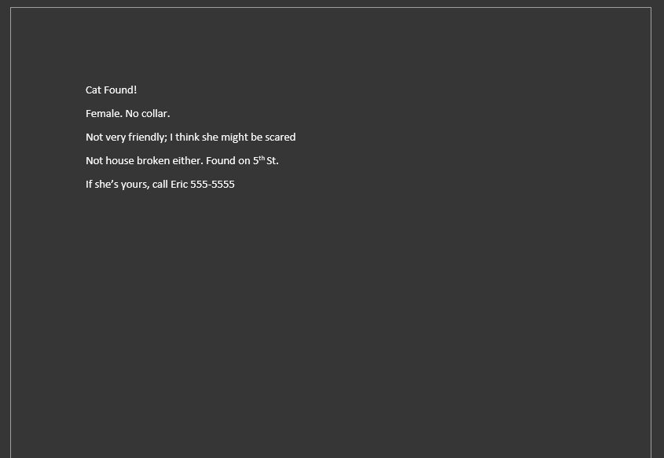
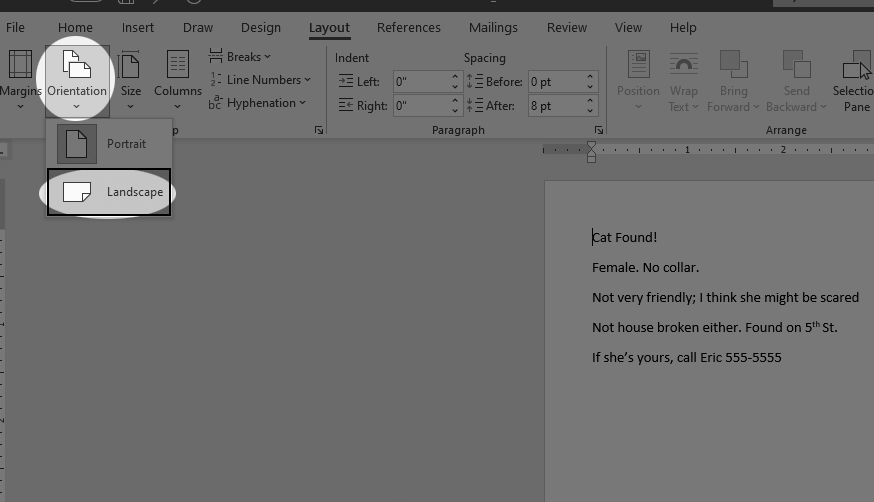
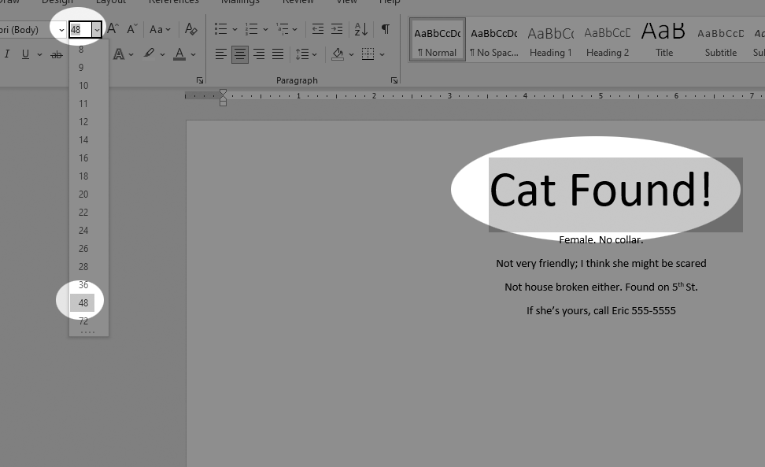
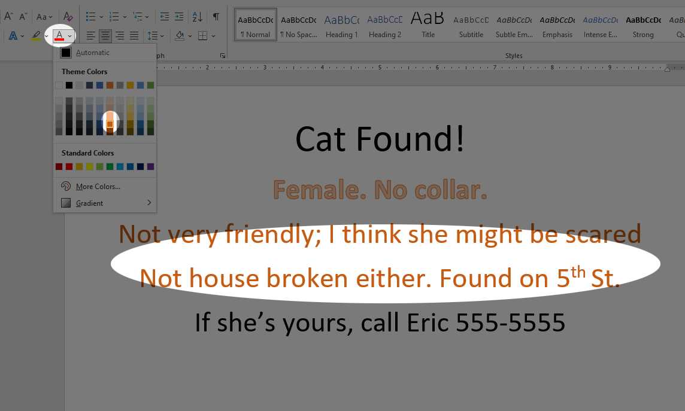
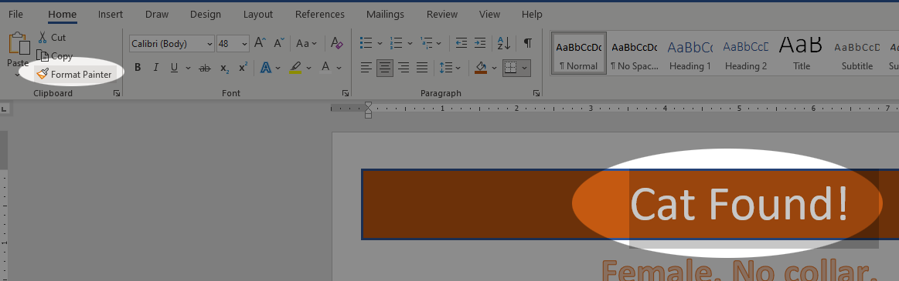
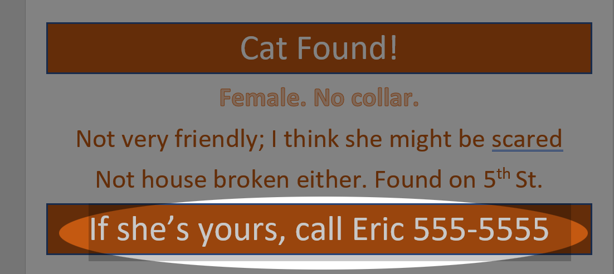
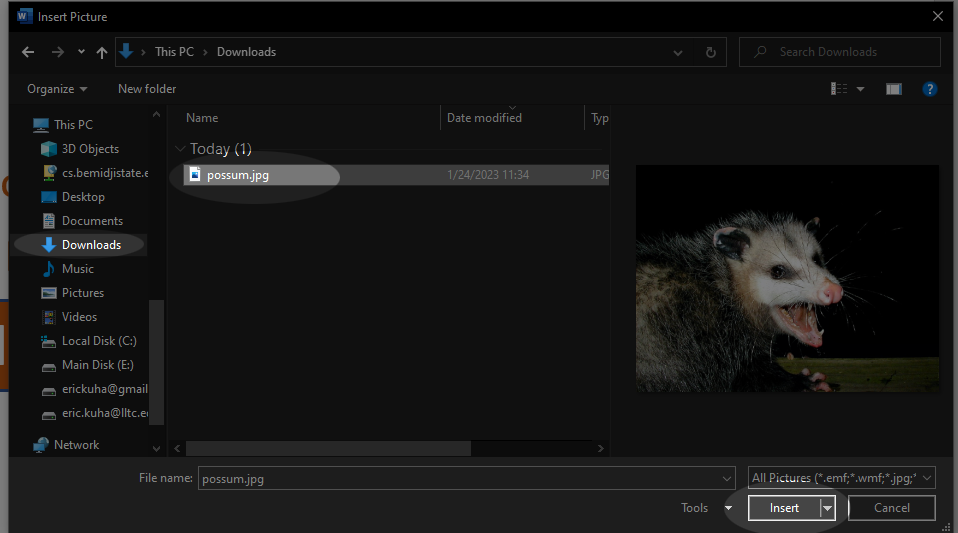

Tutorial 3 - Formatting and Working with Images
===============================================

<iframe width="560" height="315" src="https://www.youtube.com/embed/Co54X0qMPt8" frameborder="0" allow="accelerometer; autoplay; encrypted-media; gyroscope; picture-in-picture" allowfullscreen></iframe>

A modern word processor is more than just a tool to write letters. It's
also a full-featured desktop publishing app. While perhaps not ideal for
very complex layouts &mdash; for that, you'll want an actual desktop
publishing app like [Microsoft
Publisher](https://products.office.com/en-us/publisher) or [Adobe
InDesign](http://www.adobe.com/products/indesign.html) -- but for
relatively simple publishing projects, a word processor can be great for
quickly throwing together something that looks decent and does the job.

For this tutorial, we will be creating a flyer for a found "pet". The
inspiration for this tutorial is based on a popular [internet
meme](http://knowyourmeme.com/memes/irl-troll-posters).

Tools Covered
-------------

Margins

:   Changing the margins doesn't have to be tricky. Word comes with
    several useful pre-defined margin settings

Orientation

:   Sometimes you want the sheet of paper taller than it is wide, other
    times, you want it wider than it is tall. Word makes switching this
    setting easy.

Font Color and Shading

:   Not all text need be black and white. It's the 21st century and we
    can use color if we want.

Borders

:   Using borders can add visual interest to simple bits of text.

Format Painter

:   Quickly and easily apply complex formatting from one piece of text
    to another without having to repeat all of the same steps
    over again.

Images

:   What would a modern document be without a few pictures? Word has
    come a long way in its ability to insert and manipulate images
    in documents. We'll try out a few of the image manipulation tools
    that Word provides.

TUTORIAL
--------

1.  First, copy the start file to your Google Drive. To do this, first [click here](https://bit.ly/2FnUEgq). The document will open in Google Docs, but you will not be able to edit it. Flick on the **File** menu and select **Make a copy**. For your convenience, all of the files you will need are also linked here:

    * [Start File](https://bit.ly/2FnUEgq)
    * [Start Image](res/possum.jpg)

    You do not need the image file quite yet.

    

    Next, in the dialog that opens, change the name of the file to "flyer tutorial" and select the folder you'd like to save it to (e.g. ITECH 100)

    

1. The first thing you should notice is that it is just plain text in the default Docs format. It's not a bad idea when building a flyer to create the content first and the work on the formatting once this is finalized.

    To begin our project, we'll want to get our page set up correctly. This text is going to lay nicer on a landscape layout, so we'll flip the sheet 90 degrees, and to use as much real estate as possible, we'll narrow the margins a bit. To start, Click on the **File** menu and select **Page Setup**.

    

    In the dialog that opens, check the Orientation radio button for **Landscape** and then change all four margins to **0.5**. The units for the margins are in inches, so if this were printed, you'd have all but a half an inch of space to use on all sides. Click **OK**.

    

1. Next, select all text and center it. To do this, you can either **click and drag** from the top left to the bottom right, or press **Ctrl-a** on the keyboard. Once all text is selected, select the **Center align** tool from the toolbar.

    

1. Now, select the first paragraph which says "Cat Found!". To quickly select an entire paragraph, you can triple-click on it. Using the **font-size** tool on the toolbar, change the size of this paragraph to **48 pt**.

    

1. Select the remaining text and set its size to 36. This should ensure that someone would be able to read the text on the flyer from a distance, but that the most important, eye-catching text is the largest.

    

1. Next, we are going to add some color to our text. The goal here is to use colors that complement each other and add visual interest to the flyer. First, select the second paragraph, which says "Female. No collar." Next, select the **Text color** tool from the toolbar. Select the color *dark blue 2* from the color palette.

    

1. Select all the text below this and change the color to *dark orange 2*.

    

    Orange and blue offset each other nicely because they oppose each other on the color wheel. We are choosing darker shades of both colors so that they will display well on a white background.

1. Select the first paragraph, which says "Cat Found!" again. We're going to add a background color and change the color of this text now. In the **Format** menu, select *Paragraph styles* and then *Borders and shading*.

    

1. Let's change the background color to our *dark orange 2* and create a border around this paragraph that is *dark blue 2*. In this **Borders and shading** dialog, add all four side borders, set the border width to *2.25 pt*, change the border color and the background color to the correct colors as shown here:

    

    Finally, click **Apply**. Next, with the text still selected, change the color of the text to *white*. A general rule to follow is to always use white text on dark backgrounds and dark or black text on white backgrounds.

    

1. Now, let's say we want to apply all of the same styling from the first paragraph to the bottom paragraph. This is a tedious, multi-step process. And one of the problems with processes like this is that they are error-prone. It's easy to make a mistake. So, enter the **Format Painter** tool. This process is a little tricky, but the results are dramatic. Let's follow it carefully on a keystroke by keystroke basis.

    * If it's not already selected, select the first paragraph of text.
    * Click on the **Format Painter** tool in the toolbar.
    * Finally, select the last paragraph of text and observe what happens.
    * If you make a mistake and your result does not look like the screenshot, click the **undo** button or hit **Ctrl-z** and try again.

    

    If you have any trouble with this, watch the video above to see it demonstrated live. And you also always have the option to just manually apply all of this formatting. However, I think once you get the hang of the format painter, it's a very powerful tool for speeding up your work and keeping formatting consistent.

1. Now, let's add an image. Right here is a link to the image that we will be inserting. Right-click on it and click *open in new tab* or something similar depending on your web browser.

    * [Start Image](res/possum.jpg)

1. We are simply going to copy the image directly out of the web browser and paste it into our document, to make our lives easier. With the image open in another tab in your browser, click over there and see a nice picture of a cat. **Right-click** on the image in the browser. In the context menu that opens, select **Copy Image**. This copies all of the image data to your system's clipboard. (**Note:** If you are using a Chromebook and have not attached a USB mouse, long-pressing the image on the touch screen will have the same effect)

    

1. Return to the tab which contains your document. Click at the end of the second paragraph to move your insertion point there. Press **Enter** to add another line after it.

    

1. Now, if you have installed the Google docs offline extension in your browser (it only takes a second), you can **right-click** in the new space and select **Paste** to add the image. However, an even quicker method of pasting is to simply press **Ctrl-v** on your keyboard. Observe that the image has appeared and is also way too big.

    

1. **Click** the image to select it. You will notice that eight blue square *handles* appear around the image, as well as a little blue circle above it. The handles are for resizing and the circle is for rotating. By default, the image's proportions are locked, which is very handy for us, because we do not risk squishing it as long as we use *only* the corner handles.

    

1. Click and drag on one of the corner handles and begin making it slightly smaller. Keep making small adjustments until all of the flyer's content fits on one page:

    

1. You may notice that with the image selected, the toolbar has changed slightly. Different tools are available here for you to use. I encourage you to click on **Image options** and see what tools are available here, however we do not need them for this tutorial. Instead, let's just crop the image for now. Click on the **Crop** tool on the new toolbar and drag the side handles to cut off any extraneous image material so that it focuses in on the "cat's" face. This isn't strictly necessary, but it will save on ink from printing a large, very dark image a hundred times (which you do not need to do for this tutorial).

    

    Press **Enter** when you are satisfied with the size of the image.

1. At this point, the flyer is complete. You may submit this flyer to the course portal.

