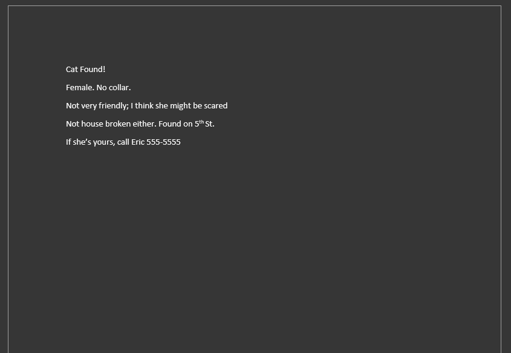
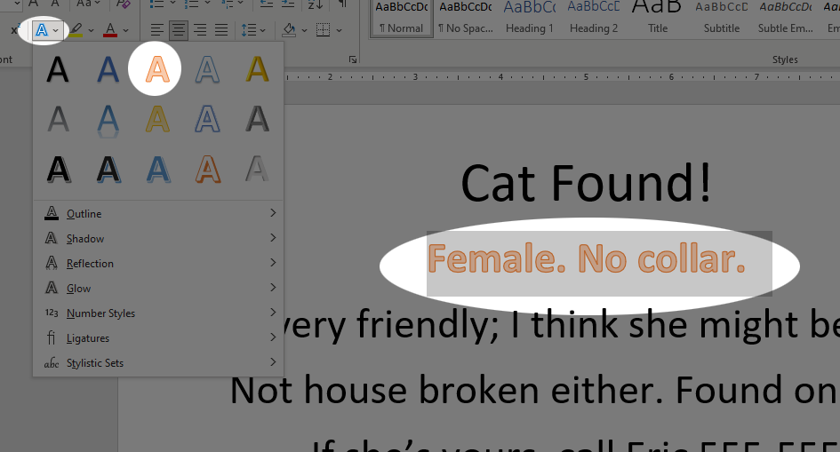
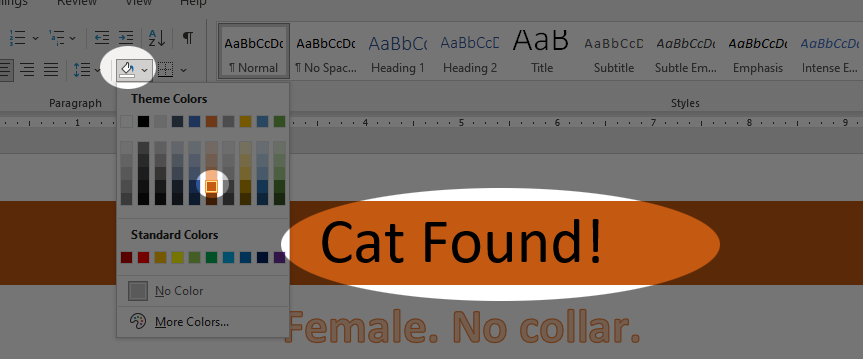
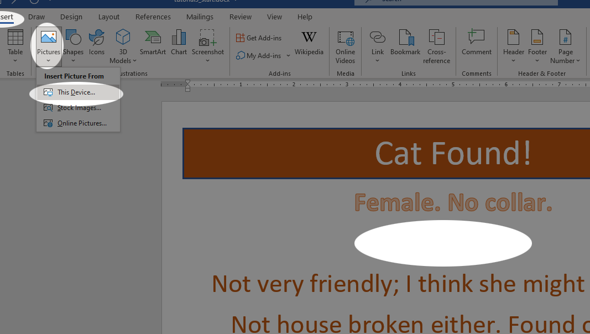
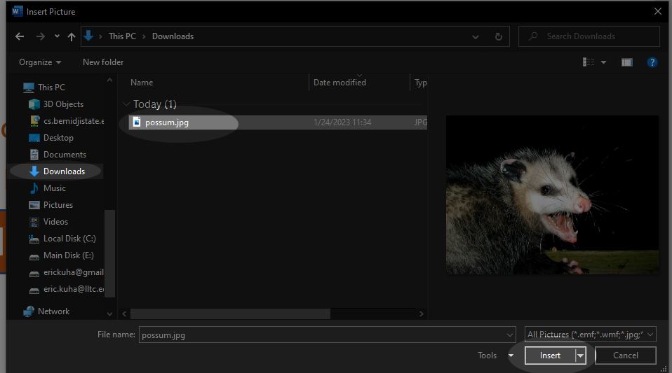
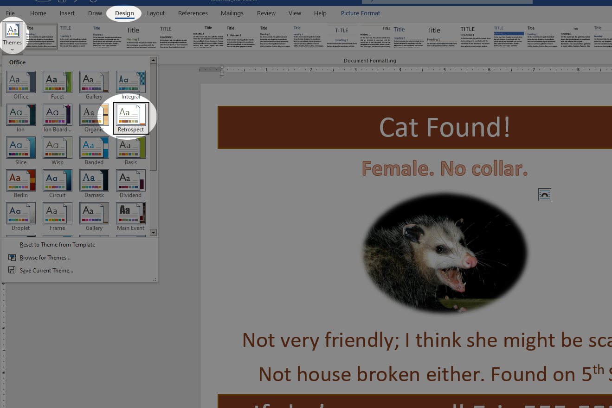

# Tutorial 3 - Formatting and Working with Images

A modern word processor is more than just a tool to write letters. It's
also a full-featured desktop publishing app. While perhaps not ideal for
very complex layouts -- for that, you'll want an actual desktop
publishing app like [Microsoft
Publisher](https://products.office.com/en-us/publisher) or [Adobe
InDesign](http://www.adobe.com/products/indesign.html) -- but for
relatively simple publishing projects, a word processor can be great for
quickly throwing together something that looks decent and does the job.

For this tutorial, we will be creating a flyer for a found "pet". The
inspiration for this tutorial is based on a popular [internet
meme](http://knowyourmeme.com/memes/irl-troll-posters).

Tools Covered
=============

Margins

:   Changing the margins doesn't have to be tricky. Word comes with
    several useful pre-defined margin settings

Orienatation

:   Sometimes you want the sheet of paper taller than it is wide, other
    times, you want it wider than it is tall. Word makes switching this
    setting easy.

Text Effects

:   A quick way of giving text some interesting colors and styles

Font Color and Shading

:   Not all text need be black and white. It's the 21st century and we
    can use color if we want.

Borders

:   Using borders can add visual appeal to simple bits of text.

Format Painter

:   Quickly and easily apply complex formatting from one piece of text
    to another without having to repeat all of the same steps
    over again.

Images

:   What would a modern document be without a few pictures? Word has
    come a long way in its ability to insert and manipulate images
    in documents. We'll try out a few of the image manipulation tools
    that Word provides.

Theme

:   The theme of a document is the unified set of colors and fonts that
    give the document a cohesive feel.

TUTORIAL
--------

1.  Download these two files:

    -   [Start
        File](res/tutorial3_start.docx)
    -   [Start
        Image](res/possum.jpg)

    Move both files from the downloads folder to somewhere that you
    won't lose them.

2.  Open the file named *tutorial3_start.docx*. The first thing you should
    notice is that it is just plain text in the default Word format.
    It's not a bad idea when building a flyer to create the content
    first and the work on the formatting later.

    {: width="100%"}

3.  First, in the **Layout** tab, under **Margins**, change the page
    margins to *Narrow*

    {: width="100%"}

    This allows you to use as much of the page as possible without
    sacrificing too much page-padding margin.

4.  Next, in the same tab, right next to the **Margins** tool is the
    **Orientation** tool. Click it and change the orientation
    to landscape.

    {: width="100%"}

    The default *Portrait* orientation is taller than it is wide, but
    for this flyer, we want the page wider than it is tall.

5.  Next, select all of the text (Shortcut: *Ctrl-a*) and center the
    text using the center alignment tool in the **Home** tab,
    **paragraph** group.

    {: width="100%"}

6.  Time to make the text pop. First, we'll start making it all bigger.
    Select the first line of text and increase the font size to 48 using
    the font size tool in the **Font** group.

    {: width="100%"}

    Select the rest of the text and set the font size to 36.

7.  Some fancy formatting is easy. Select the second line of
    text ("Female. No collar."). In the **Font** group, click the **Text
    Effects** button and select the effect in the middle of the top row.
    It's the orange one. These text effects are a quick way to add a
    little eye-catching flair to a document. Be careful not to overuse
    it, of course, or you risk your work looking either derivative or even a little silly.

    {: width="100%"}

8.  Now, select the third and fourth lines and click on the **text
    color** tool. Choose the dark orange color, second from the bottom
    in the middle column of the theme colors pallette, **Orange, Accent 2, Darker 25%**.

    {: width="100%"}

    It is not a bad idea to get used to choosing colors from the "theme
    colors" part of the pallette, as these colors are chosen by design
    experts and designed to look well together.

9.  Another way to grab the eye is to change the background color of
    some text. Select the first line of text ("Cat Found!"). In the
    **Paragraph** group, select the **Shading** tool -- it looks like a
    paint bucket -- and select the same dark orange color as you
    did before.

    {: width="100%"}

    It is generally considered bad design to have dark text on a
    dark background. So, with the first paragraph still selected, under
    **Font Color**, change the text to white.

10. To add just a little bit more interest to the first line, let's add
    a border. With the line still selected, click on the **Borders**
    tool in the **paragraph** group. At the bottom of the borders menu,
    click **Borders and Shading**. Set the border as follows:
    -   Set **Box** base style
    -   Set the color to the dark blue one spot to the left of the dark
        orange color we've been using
    -   Set the width to 2&frac14;

        {: width="100%"}

    -   Press **OK**.

-   Now, we want to do all of that again to the bottom line of text.
    However, there is an easy way to do it. We will use the **Format
    Painter** tool. Ensure that the first line is still highlighted. In
    the **Clipboard** group of the **Home** tab, click on the **Format
    Painter** tool.

    {: width="100%"}

    Finally, simply highlight the bottom line of text. All of the
    formatting from the first line should be immediately applied to the
    last line like so:

    {: width="100%"}

1.  Let's add the image. Move the **insertion point** to the end of the
    second line. Press the **Enter** key (&crarr;) to create a new line.
    Next, in the **Insert** tab, **Illustrations** group, click the
    **Pictures** tool.

    {: width="100%"}

    In the dialog that opens, navigate to the image file that you
    downloaded at the beginning of the tutorial, *possum.jpg*. Select it
    and click the **Insert** button. In my case, I had saved the picture to my Downloads folder.

    {: width="100%"}

    The picture is very large, and will have pushed all of the other
    text onto two other pages.

2.  To resize the image, you click and drag on one of the eight
    "handles" on the edges of the selected image. For our purposes,
    ensure that you *always* use the corner handles. If you use the edge
    handles, it will stretch and distort the image. To maintain its
    **aspect ratio**, we click and drag from the corners. Try it now.
    Drag one of the corner handles until the image is smaller. Keep
    resizing the image in small increments until all of the content fits
    on one page again. In the **Picture Tools** tab, on the right, the
    height and width of the image should be a little less than 4 inches
    by 3 inches.

    {: width="100%"}

    Now, let's style the image. With the image selected, ensure that you
    are in the **Picture Tools/Format** tab. In the **Picture Styles**
    group, click the *More* button (the little down arrow) to expand the
    styles menu. Select the **Soft Edge Oval** style. Resize the image
    again if you need to. The result should look something like this:

    {: width="100%"}

3.  The last thing we will do is change the **Theme**. In the **Design**
    tab, on the far left is the **Themes** tool. Click it to open a menu
    of available themes. Hover the mouse pointer over a few of them and
    see how they change the document. Each one is a complete package of
    fonts, colors, and styles designed to work harmnoniously together.
    In fact, you've been operating under a theme this whole time. The
    default theme is called "*Office*". By using the theme colors and
    theme fonts, you can change the entire look and feel of a document
    by simply changing its theme. Select the "*Retrospect*" theme.

    {: width="100%"}

4.  Finally, replace the name at the bottom with your own and adjust
    font sizes as needed to fit everything on one page. With that, the
    flyer is complete. Submit the completed file to the class portal.

