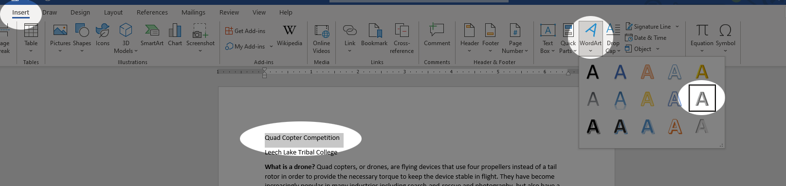
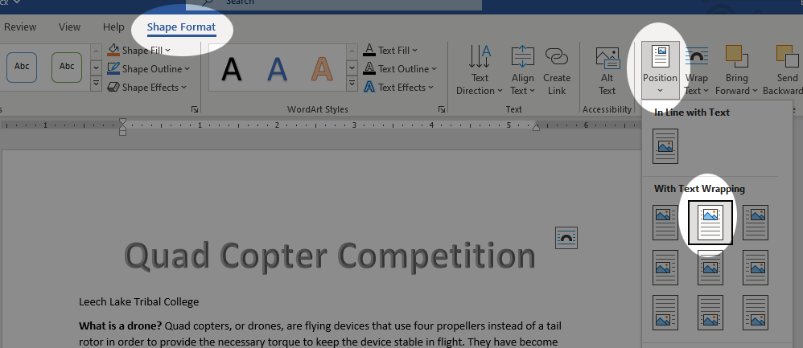
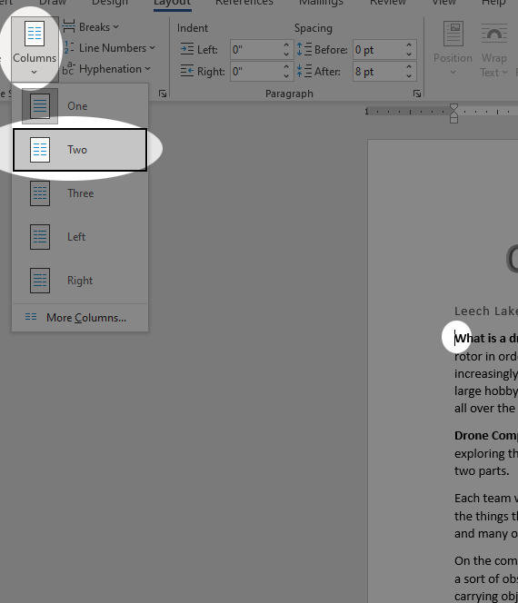
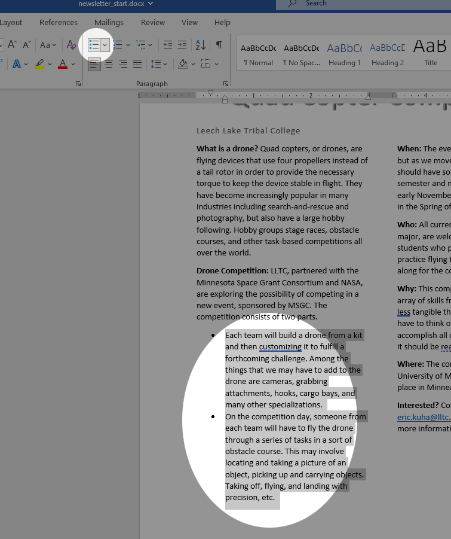
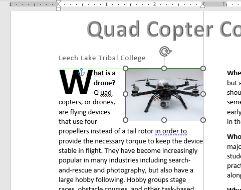

# Tutorial 4 - More Formatting

<iframe width="560" height="315" src="https://www.youtube.com/embed/_nDsaDxOi3o" title="YouTube video player" frameborder="0" allow="accelerometer; autoplay; clipboard-write; encrypted-media; gyroscope; picture-in-picture; web-share" allowfullscreen></iframe>

Continuing our fundamental foray into the world of desktop publishing with Microsoft Word, let's play around with a few more tools while we build a simple newsletter.

Tools Covered
=============

Word Art

: Fancy graphics using just your words

Columns

: Splitting a document into two or more columns can make reading easier and enhance the visual impact of a document.

Drop Caps

: Make the first letter in a document extra large as a decorative enhancement.

Unordered Lists

: Make a list of items that makes information easier to digets.

Breaks

: Break your columns and sections where *you* want them broken.

TUTORIAL
========

### The Header

First, let's make the header look a bit better using some Word Art and Quick Styles.

1. Download the start files:

    * [Start File](res/newsletter_start.docx)
    * [Image 1](res/drone.jpg)
    * [Image 2](res/soldering.jpg)
    * [Image 3](res/floral.jpg)

1. Open the file and look over the contents.

    

1. First, select the first paragraph of text, which reads "Quad Copter Competition". In the **Insert** tab, **Text** group, select the *Word Art* tool. Choose the tool on the right in the middle, *Fill: Gray, Accent color 3; Sharp Bevel*.

    

1. The result won't be quite what we are looking for. With the Word Art selected, we should be in the context tab **Shape Format**. Find the *Position* tool and select *top center*.

    

1. Next, in the *Wrap Text* menu, select *Top and Bottom*.

    

1. With the main title sorted, let's select the second paragraph of text and make it a bit fancier with a quick style. Select the second paragraph which says, "Leech Lake Tribal College" and, in the **Home** tab, select the *Subtitle* style from the *Styles* Menu.

    

There are lots of ways you could make the header fancier, like including a logo or other embellishments, but we're going for a simple aesthetic here.

### Columns

Adding columns is a simple process, but it can often require sectioning off part of your document so that it doesn't throw off the formatting that you already have in place.

1. Place the *insertion point* at the beginning of the line that says "What is a drone?" In the **Layout** tab, **Page Setup** group, open the *Breaks* menu and add a *Continuous Section Break*.

    

    It doesn't look like much happened, but I assure you, this is going to make the rest of this process a lot more painless.

1. Without moving the *insertion point*, and still in the **Layout** tab, select the *Columns* tool and choose *Two Columns*.

    

    If we hadn't created the section break, the columns would have thrown off our titles and other already established formatting. You can go ahead and try deleting the section break and see what it does to your document, but don't forget to undo any changes you make with **ctrl-z**.

1. Now, another problem that we have is that our columns are very unbalanced. Generally, it's a good idea to keep them as even as possible, so place the insertion point at the beginning of the paragraph that starts with the word **When:**

    

    Next, in the **Layout** tab, in the **Page Setup** group, in the *Breaks* Menu, select *Column* and observe the result.

    

### Lists and Drop Caps

Next, we'll enhance readability and visual appeal by adding some visual cues and stylistic elements to the newsletter.

1. The second section of the document has information that might be better if it were presented as bullets, to clarify some meaning. Select the second two paragraphs in that section:

    

    Next, back in the **Home** tab, **Paragraph** group, select the bullet list tool and observe the result.

    

1. Next, place the insertion point at the beginning of the line that starts "**What is a drone?**". In the **Insert** Tab, **Text** group, select the *Drop Cap* tool and select the *Dropped* option. Observe the result

    

### Images

Let's add some images in a variety of ways

1. Download or locate the image from the tutorial files called **[drone.jpg](res/drone.jpg)**.

    

1. Place the *insertion point* near the very beginning of the document (exactly where doesn't matter), just after the Drop Cap "*W*". In the **Insert** tab, click on *Picture* and locate the image file in your file system (check the *Downloads* folder if you don't remember where you put it).

    

    This is going to make your text look terrible because it is currently positioned "inline". We will fix this in the next step.

    

1. With the image placed and still selected, you should be in the **Picture Format** tab. This context tab has lots of useful tools to position, adjust, and edit the images that you put in your document. In the **Arrange** group, select the *Position* tool and select *Position in Top Left with Square Text Wrapping*.

    

1. Now, with the mouse, click and drag the image down so that it's at the top right of the left column. Get it positioned so that you can see the green guide lines appear, or so that it looks nice. Also, re-size as necessary using the corner handles.

    

1. Next, with the second image, simply right-click [this link](res/soldering.jpg), and then select *open in new tab*. In the new tab, right-click the image and click *copy image* (or something similar depending on what browser you're using).

    

1. Place the *Insertion Point* near the end of the document and press *Paste* or **ctrl-v** to place the image. In the **Picture Format** tab, again, change the positioning so that it is no longer inline with the text, and then position and resize the image so that it looks nice and fits beneath the bottom of the right column of text. Like this:

    

    The image shows one possible way of setting the text wrapping correctly.

1. The last image is [here](res/floral.jpg). It is an image of the floral motif from the school website. Insert it into the document however you like, and then in the **Picture Format** tab, resize the image as appropriate and then using the *Position* tool, place it neatly at the bottom center like so:

    

    For reference, I set the width of the image to exactly 7 inches and set the position to bottom center and it worked very well. See the video if you can't figure out exactly how to do this.

### Closing

With that, the newsletter is done. Submit the final version of the file on Canvas as normal.
