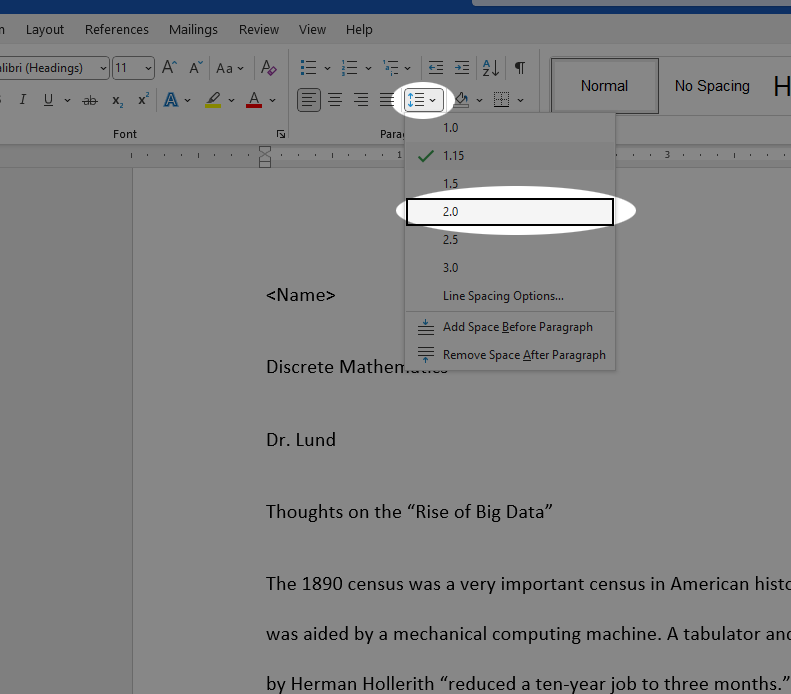
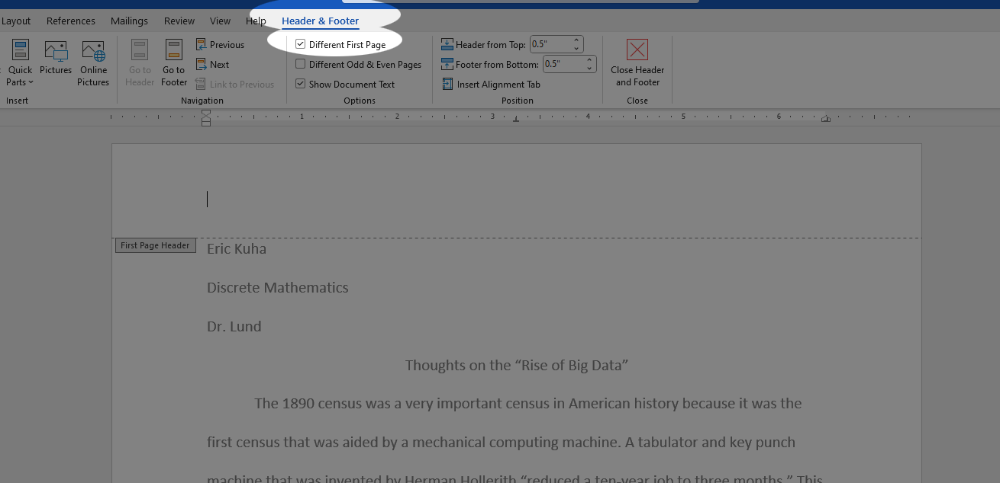
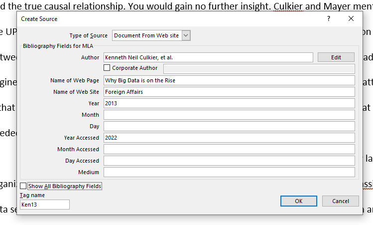
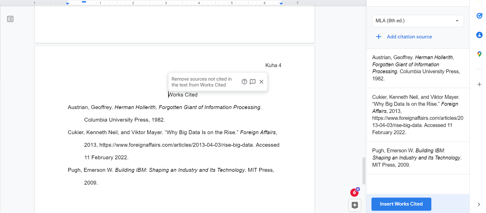

Tutorial 5 - MLA Style
======================

<iframe width="560" height="315" src="https://www.youtube.com/embed/iagAmTaNmUo" frameborder="0" allow="accelerometer; autoplay; clipboard-write; encrypted-media; gyroscope; picture-in-picture" allowfullscreen></iframe>

One of the things you'll be asked to do as a college student, is to
conduct research, analyze it, and then compile your findings into an essay or paper. It's just a fact of life. As part of this, you'll be asked to adhere to some formal
style guide. There are a number of style definitions out there. If
you're in a STEM field, you might be required to follow the styleguide
of the [American Psychological Association (APA)](https://apastyle.apa.org/), and if you're in a
humanities course, you might be asked to adhere to the [Modern Language
Association (MLA)](https://style.mla.org/) style. If you go into tech, you may find yourself adhering to the styleguide of the [Association for Computing Machinery (ACM)](https://www.acm.org/publications/authors/reference-formatting).

This tutorial highlights some of the key features of the MLA styleguide
and how to quickly convert a document in its default form into
something that adheres fairly strictly to this styleguide.

In the last half of the tutorial, we will take a close look at how to add both in-text citations and a works cited page using tools that are built into Google Docs.

Tutorial
--------

### Getting Started

Let's look at a list of the basic requirements of MLA style. These are
the things we will need to do to the start file.

-   Double-space the entire document
-   Increase the font size of the entire document to 12 points.
-   Indent the first line of each body paragraph to .5 inches from the
    left margin
-   Add the page number preceded by your last name in the upper-right
    corner of each page. Omit this from the first page.

First, copy [Start File](https://bit.ly/3knis33) to your Google Drive.

1.  Ensure that your **insertion point** is blinking somewhere in the text. Press **Ctrl-A** to select the entire document. Then, with the **line & paragraph spacing** tool, change the document spacing to *double*.

    

1. Now change the font size to **12pt**

    

    The MLA styleguide makes no specific recommendation on typefaces. Rather the new editions require only that we use a legible font. So we will leave our font as the Google Docs default "Arial".

1. Move the insertion point to the fourth line of the document which reads "Thoughts on the "Rise of Big Data". Center this line.

    

1. Replace the first line which reads "&lt;Name&gt;" with your name.

### Indenting Paragraphs

Now, we want to indent the first line of every paragraph using the indent widget: .

1. Place the insertion point at the beginning of the first body paragraph which starts "The 1890 census was..."

1. To select all of the text after this point, hold the **Ctrl** and **Shift** keys and then press the **End** key on your keyboard. Alternately, you can simply click and drag to the bottom of the document.

1. This is tricky. You have to click and drag the top part of the **indent widget** 0.5 inches to the right. You will notice that the first line of each paragraph moves with you. It will look like this if you are successful.

    

    If it does not, simply click the undo button and try again.

1. Scroll through the document to ensure that all paragraphs are properly indented.

### Page Numbers

We'll add page numbers in the MLA style to the top of each page except the first one.

1. In the **Format** menu, select **Page Numbers**.

    

1. In the dialog that opens, ensure the **Header** is selected. **Uncheck** the "Show on first page" option. And ensure that number starts at 1. Click **Apply**.

    

1. Scroll down to the top of _page 2_ and observe that the page number has been added. Double click the mouse to the left of the number 2 here to enable editing of the header. Type your last name and then a space. It should look like this:

    

### Citations

Now, we are going to go through this and create some citations and a
bibliography. Remember, that there is a certain amount of wiggle room
when it comes to citations, but there are some hard and fast rules and
you should consult your English instructor if there are any questions
about the correctness of the citations generated by Google Docs.

1. The first source we want to add is a book called "Herman Holerith: Forgotten Giant of Information Processing". I don't expect you to have read this book, however, so all you'll need is the ISBN number to create the citations. Click **Tools** and then select **Citations**.

    

1. The Citations sidebar will have appeared and this is where you'll do the major work for this process. Ensure that the citation style selected is MLA (8th ed.). Click **Add citation source**. In the dropdown menus that appear, select the Source type: **Book** and Access by: **Print**. Finally, enter the ISBN number into the box that appears: **978-0231051460**. Finally, click **Search**.

    

1. The results should automatically extract the information you need, so simply click **Continue**.

    

1. This will populate a form with all of the information you need. Click **Add citation source**. 

    

1. With that, done, you have created a source that you can use to do two things. First, you can use it to create in-text citations, and second, you can use it to generate a "works cited" page at the end of the document. Both of which are immensely useful. Click the first paragraph after the quote that ends with the words "...to three months" and then click **Cite** on Austrian source. This will insert an in-text citation at that point. Finally change, the pound symbol (#) to the number 46 and the in-text citation is complete.

    

1. The next book we want to add is about the history of IBM and has the ISBN number: **978-0262512824**. Follow the same procedure as before to create the citation source. Next, near the top of page 2, the last sentence, add the in-text citation:

    

1. Next, we want to add an article to our bibliography list. The article is called [The Rise of Big Data](https://www.foreignaffairs.com/articles/2013-04-03/rise-big-data). Click this link to open the article in a tab and then select the URL and copy it to your clipboard. Alternately, right-click the link here and select **Copy link address** in the context menu that pops up.

    

1. Back in the document, Add a citation source and select Website as both the *Source type* and the *Accessed by* method. Paste the URL into the box and click **Search**. The resulting source will be missing the publication year, so we'll add it manually. So click **Continue**, and then in the form, scroll down to *Published year* and type **2013**. Finally, click **Add citation source**.

    

1. Near the bottom of page 2, find the paragraph that ends "...money and time." and click **Cite** on the Cukier source.

    

1. Finally, let's insert our works cited page. Move the insertion point to the very end of the document and press **Ctrl-Enter** on the keyboard. This will create a page break.

1. Now, in the Citations sidebar, simply click **Insert Works Cited** and the fully formatted works cited page will be generated:

    

### Conclusion

It's important to note that this citation system is not the solution to all of your citation problems. It's a fairly limited tool in some respects. It can't do more complex citations for things such as films and other media automatically and these ones will have to be entered by hand. However, using a modern tool like this can dramatically reduce the amount of time you spend fiddling around with citations.

Submit this assignment to Canvas and you are done.
