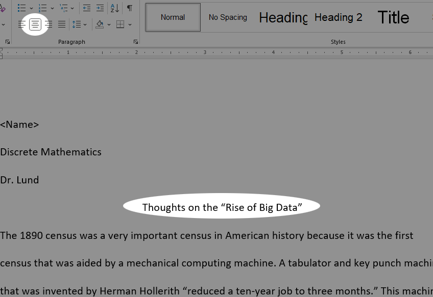
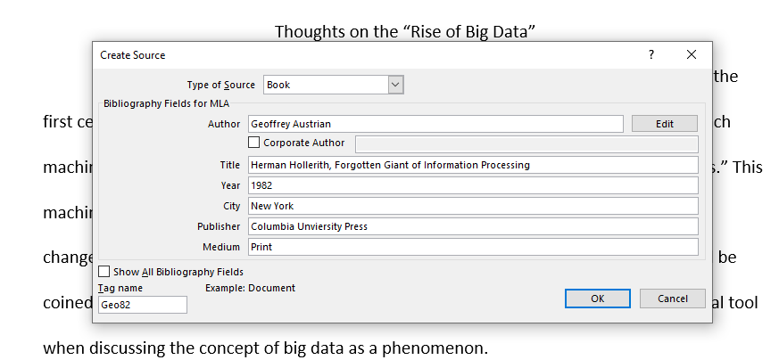
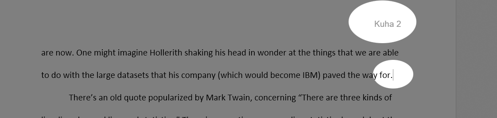
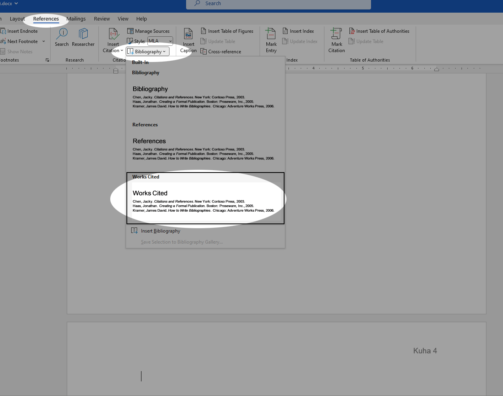
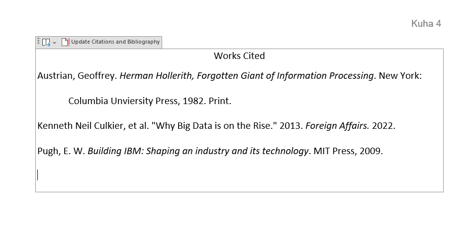

# Tutorial 6 - MLA Style

<iframe width="560" height="315" src="https://www.youtube.com/embed/uYFIBQLkobI" title="YouTube video player" frameborder="0" allow="accelerometer; autoplay; clipboard-write; encrypted-media; gyroscope; picture-in-picture; web-share" allowfullscreen></iframe>

One of the things you'll be asked to do as a college student, is to
write essays. It's just a fact of life. As part of this, you'll be asked to adhere to some formal style guide. There are a number of style definitions out there. If you're in a STEM field, you might be required to follow the styleguide of the American Psychological Association (APA), and if you're in a humanities course, you might be asked to adhere to the Modern Language
Association (MLA) style.

This tutorial highlights some of the key features of the MLA styleguide
and how to quickly convert a Word document in its default form into
something that adheres fairly strictly to this styleguide.

Tutorial
========

### Getting Started

Let's look at a list of the basic requirements of MLA style. These are
the things we will need to do to the start file.

-   Double-space the entire document
-   Remove paragraph spacing from the entire document
-   Increase the font size of the entire document to 12 points.
-   Indent the first line of each body paragraph to .5 inches from the
    left margin
-   Add the page number preceded by your last name in the upper-right
    corner of each page. Omit this from the first page.

First, download the [Start File](res/mla_start.docx).

1.  Press **Ctrl-A** to select the entire document.
2.  Go to the **Home** Tab on the Ribbon.
3.  In the **Paragraph** group, click the **Line and Paragrah Spacing**
    button and click 2.0.

    {: width="100%"}

4.  Again, click on the **Line and Paragraph Spacing** button and click
    **Remove Space After Paragraph**. Now everything is double spaced.

    {: width="100%"}

5.  Lastly, with everything still selected, in the **Font** group, click
    the change the font size to **12**. You'll notice that the document
    is now considerably longer, but this is all so that you don't strain
    your English instructor's eyes.
6.  Next, replace the name at the top of the page with your
    first and last name.
7.  Center the title *Thoughts on the "Rise of Big Data* by clicking somewhere in the
    title and then click the **center** tool in the **Paragraph** group.
    The document should be looking like this:

    {: width="100%"}

### Indenting Paragraphs

Next, we want to indent the first line of every paragraph using the
indent widget: 

1.  Place the **insertion point** at the beginning of the first
    paragraph of text *(The 1890 census was a very important census...)*.
2.  To select all of the text in the body of the document, hold the
    **ctrl** and **shift** keys and press the **end** key. Alternately,
    simply use the mouse to click and drag to select all of the text.
3.  Ensure that you have the rulers enabled and observe the
    indent widget. Click and drag the top part of the widget
     to the right by
    .5 inches. As you do this, you will notice that the first line of
    each visible paragraph in the selection moves with you. It should
    look like this:

    {: width="100%"}

4.  Scroll through the document to ensure that all main body paragraphs
    are indented.

### Page Numbers

We'll add page numbers in the MLA style to the top of each page except
the first one.

1.  To add Page numbers, click on the **Insert** tab and in the **Header
    & Footer** group, select the *Page Number* menu and select the **Top
    of Page**.
2.  Select *Plain Number 3*.

    {: width="100%"}

3.  The insertion point is now blinking to the left of the page number.
    **Type your last name** and press **Space**.
4.  Since MLA style does not require a page number on the first page,
    verify that you are in the **Header & Footer Tools** tab, and check
    the box that says *Different First Page*. The result is that the
    first page header will be blank and the rest of them will have your
    last name and the page number:

    {: width="100%"}

### Citations

Now, we are going to go through this and create some citations and a
bibliography. Remember, that there is a certain amount of wiggle room
when it comes to citations, but there are some hard and fast rules and
you should consult your English instructor if there are any questions
about the correctness of Word's citations.

1.  Select the **References** tab.
2.  In the **Citations & Bibliography** group, ensure that the selected
    style is **MLA Seventh Edition**. It may default to APA, and we don't want that for this tutorial.
3.  The first citation we want to add is a book called "Herman Holerith: Forgotten Giant of Information Processing". Click at the end of the quote that says "reduced a ten-year job to three months."
4.  In the **Citations & Bibliography** group click *Insert Citation*
    and then *Add New Source*.

    {: width="100%"}

5.  In the *Type of Source* box, select *Book*.
6.  Fill out the form with the following information:

      | Author    | Geoffrey Austrian                                           |
      | Title     | Herman Hollerith, Forgotten Giant of Information Processing |
      | Year      | 1982                                                        |
      | City      | New York                                                    |
      | Publisher | Columbia University Press                                   |

    {: width="100%"}

    You can omit Medium as it is no longer required by the current
    edition of the MLA styleguide.
7.  Press **OK** and see the parenthetical citation that is
    automatically generated.
9.  Now, at the top of page 2, find the end of the line that says "...paved the way for." and place the insertion point there.

    {: width="100%"}

    Click *Insert Citation*.
10. This will be another book. Fill in the form as follows:

      | Type of Source | Book                                                 |
      | Author         | E.W. Pugh                                            |
      | Year           | 2009                                                 |
      | Title          | Building IBM: Shaping an Industry and its Technology |
      | Publisher      | MIT Press                                            |

    Press OK and it will insert the parenthetical citation.

12. Next, place the insertion point at the end of the paragraph that ends "...save significant amounts of money and time." Click *Insert Citation*. Fill in the form as follows:

      | Type of Source   | Document From Web site                             |
      | Name of Web Page | Why Big Data is on the Rise                        |
      | Name of Web Site | Foreign Affairs                                    |
      | Author           |  Kenneth Neil Cukier and Viktor Mayer-Schoenberger |
      | Year             | 2013                                               |
      | Year Accessed    | 2022                                               |

    We are going to omit the URL because it's easy to find and not required by the specification any more. Click OK and it will once again insert the parenthetical citation.

### Works Cited

Let's create a Works Cited page. This will be automatically generated by Word.

1.  Press **Ctrl-End** to automatically jump to the end of the document.
2.  Press **Ctrl-Enter** to create a page break.
3.  In the **References** tab, click the *Bibliography* tool and select
    *Works Cited*.

    {: width="100%"}

4.  Observe the result. The MLA style guide requires that this all be
    double spaced and that the title be the same font and size as the
    rest of the document as well as centered. Other than that, this is
    all perfect.
5. In order, the things you must do are:

    * Center the title "Works Cited" and change its size to 12 pt.
    * Select the rest of the Works Cited and bump its size to 12 pt.
    * Then double-space the entire Works Cited page.
    * Finally, select the entire Works Cited page and change the font to Calibri so it is the same as the rest of the document.

    {: width="100%"}

6. If this is tricky, you can follow along in the video above.

### Conclusion

That's it. You've formatted it according to MLA style. The tutorial is complete. Submit it to Canvas as normal.
