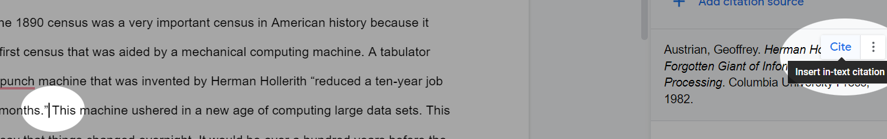
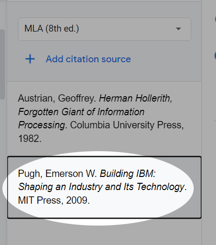

Tutorial 6 - MLA Style
======================

<iframe width="560" height="315" src="https://www.youtube.com/embed/kxCEp7b3ovg" frameborder="0" allow="accelerometer; autoplay; clipboard-write; encrypted-media; gyroscope; picture-in-picture" allowfullscreen></iframe>

One of the things you'll be asked to do as a college student, is to
conduct research, analyze it, and then compile your findings into an essay or paper. It's just a fact of life. As part of this, you'll be asked to adhere to some formal
style guide. There are a number of style definitions out there. If
you're in a STEM field, you might be required to follow the styleguide
of the [American Psychological Association (APA)](https://apastyle.apa.org/), and if you're in a
humanities course, you might be asked to adhere to the [Modern Language
Association (MLA)](https://style.mla.org/) style. If you go into tech, you may find yourself adhering to the styleguide of the [Association for Computing Machinery (ACM)](https://www.acm.org/publications/authors/reference-formatting).

This tutorial highlights some of the key features of the MLA styleguide
and how to quickly convert a document in its default form into
something that adheres fairly strictly to this styleguide.

It also introduces the idea of expanding the functionality of Google Docs by installing add-ons.

Tutorial
--------

### Getting Started

Let's look at a list of the basic requirements of MLA style. These are
the things we will need to do to the start file.

-   Double-space the entire document
-   Remove paragraph spacing from the entire document
-   Increase the font size of the entire document to 12 points.
-   Indent the first line of each body paragraph to .5 inches from the
    left margin
-   Add the page number preceded by your last name in the upper-right
    corner of each page. Omit this from the first page.

First, copy [Start File](https://bit.ly/3knis33) to your Google Drive.

1.  Ensure that your **insertion point** is blinking somewhere in the text. Press **Ctrl-A** to select the entire document.

    

1. Now change the font size to **12pt**

    

    The MLA styleguide makes no specific recommendation on typefaces. Rather the new editions require only that we use a legible font. So we will leave our font as the Google Docs default "Arial".

1. Move the insertion point to the fourth line of the document which reads "Thoughts on the "Rise of Big Data". Center this line.

    

1. Replace the first line which reads "&lt;Name&gt;" with your name.

### Indenting Paragraphs

Now, we want to indent the first line of every paragraph using the indent widget: .

1. Place the insertion point at the beginning of the first body paragraph which starts "The 1890 census was..."

1. To select all of the text after this point, hold the **Ctrl** and **Alt** keys and then press the **End** key on your keyboard. Alternately, you can simply click and drag to the bottom of the document.

1. This is tricky. You have to click and drag the top part of the **indent widget** 0.5 inches to the right. You will notice that the first line of each paragraph moves with you. It will look like this if you are successful.

    

    If it does not, simply click the undo button and try again.

1. Scroll through the document to ensure that all paragraphs are properly indented.

### Page Numbers

We'll add page numbers in the MLA style to the top of each page except the first one.

1. In the **Format** menu, select **Page Numbers**.

    

1. In the dialog that opens, ensure the **Header** is selected. **Uncheck** the "Show on first page" option. And ensure that number starts at 1. Click **Apply**.

    

1. Scroll down to the top of _page 2_ and observe that the page number has been added. Double click the mouse to the left of the number 2 here to enable editing of the header. Type your last name and then a space. It should look like this:

    

### Citations

Now, we are going to go through this and create some citations and a
bibliography. Remember, that there is a certain amount of wiggle room
when it comes to citations, but there are some hard and fast rules and
you should consult your English instructor if there are any questions
about the correctness of Word's citations.

We are going to begin this process by installing an Add-on to Google Docs. 

**Disclaimer:** We are going to experiment with a citation generator that automatically generates citations. I cannot guarantee that the citations created by this add-on are correctly formatted. You will want to examine them carefully throughout your process to ensure that they are correctly formatted or have an English instructor verify them if you are unsure.
{: .label .label-yellow}

1. First, let's install the add-on. Click the **Add-on** menu and select **Get Add-ons**.

    

1. The Add-on we are looking for is EasyBib. If it is not visible on the first page of the G Suite Marketplace, type "EasyBib" into the "Search Apps" box.

    

1. Click on EasyBib and then in the next screen click **Install**. First it will tell you to "Get ready to install". Click **Continue**. Then it will ask you to confirm your Google Account. Select the correct account. It will ask for some permissions, click **Allow**. Finally, when it is finished installing, close the G Suite Marketplace by clicking the big X in the top right corner of that window.

1. Now, return to the **Add-On menu**. Select **EasyBib Bibliography Creator**. Then, select **Manage Bibliography**.

    

1. Now, the first source we want to add is a book called "Herman Holerith: Forgotten Giant of Information Processing". But we're going to play around with this tool that might just make our lives easier. The ISBN number of the book is **978-0231051460**. Copy this into the search box in the EasyBib interface and hit **Search**.

    

1. In the search results, click **Select** next to the first option.

    

1. It will be added to your running bibliography. Using this system, we do have to manually insert in-text citations. Click in the first paragraph after the quote that ends with the words "...to three months" and add the following exactly:

    <pre>
    (Austrian)
    </pre>

    In-text citations in MLA style use the author's last name to specify which source the citation refers to. Like this:

    

1. The next book we want to add is about the history of IBM and has the ISBN number: **978-0262512824**. Copy it here and type it into the EasyBib search box to find the source. Select the first result to add it to your running bibliography.

    

1. Near the top of page 2, the last sentence, add the in-text citation:

    <pre>
    (Pugh)
    </pre>

    The author of the book on IBM. Like this:

    

1. Next, we want to add an article to our bibliography list. In the EasyBib interface and then in the search box, type "The Rise of Big Data":

    

    In the search results, scroll down until you find this entry and **Select** it:

    

1. Near the bottom of page 2, find the paragraph that ends "...money and time." and inser the following in-text citation:

    <pre>
    (Culkier, Mayer-Schoenberger)
    </pre>

    

1. Finally, let's insert our Bibliography. Move the insertion point to the very end of the document and press **Ctrl-Enter** on the keyboard. This will create a page break. Alternately, you can use the following menu tool: **Insert&gt;Break&gt;Page Break**.

    

1. In the EasyBib interface, verify that the style is MLA 8th Edition. Next, click the red button that says **Add Bibliography to Doc**. And observe the result.

    

### Conclusion

It's important to note that EasyBib is not a solution to all of your citation problems. It's a fairly limited tool in some respects. It can't do more complex citations for things such as films and other media. However, if your source set is simple, and the sources are searchable on [WorldCat](https://www.worldcat.org/), you may find that EasyBib can simplify the process of creating citations. There are other more sophisticated citation generatation tools, such as [Zotero](https://www.zotero.org/), but they often require tutorials in and of themselves and I leave it to you to discvoer their features and uses.

Submit this assignment to Canvas and you are done.
