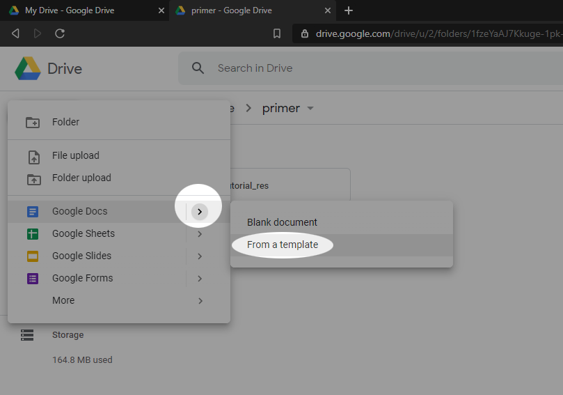
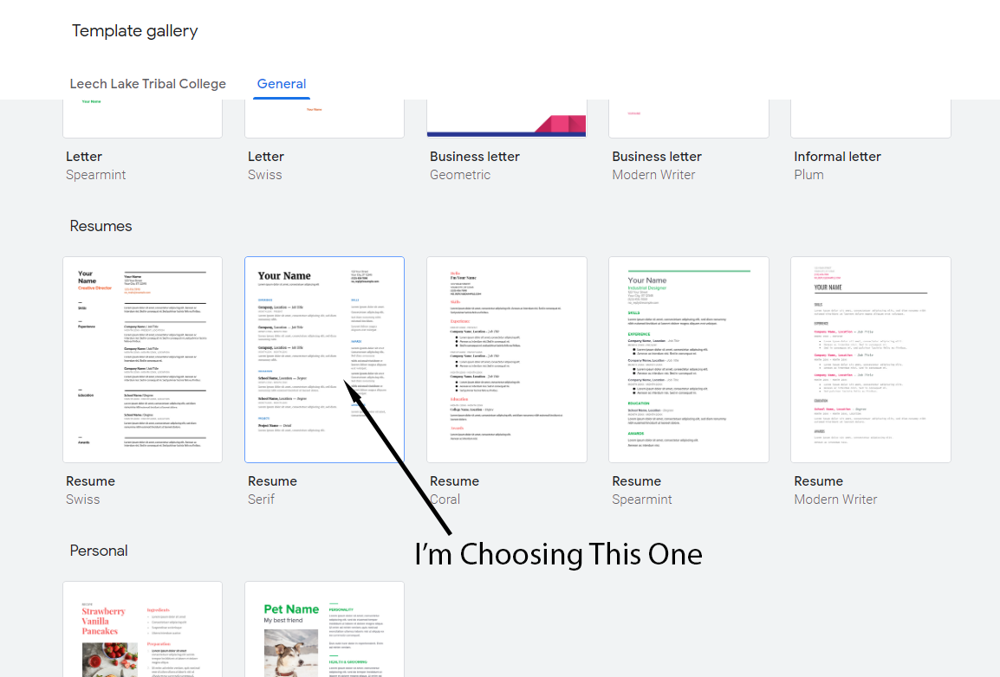
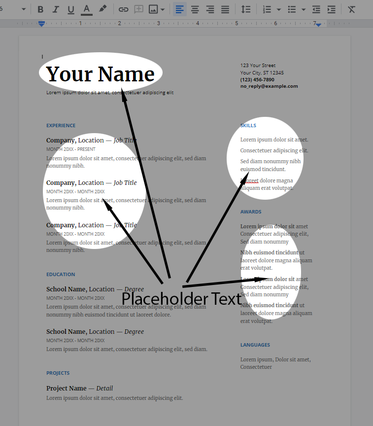
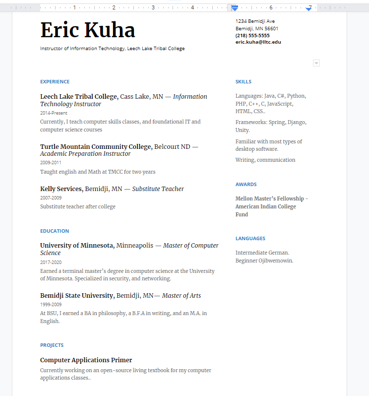
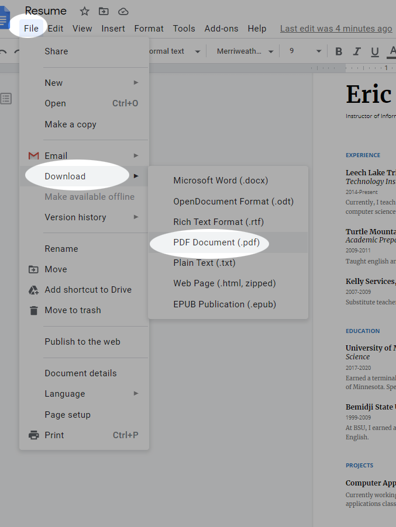
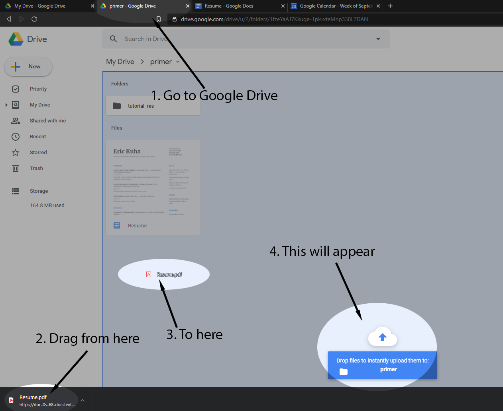

Project 2 - Resume
==================

<iframe width="560" height="315" src="https://www.youtube.com/embed/QFkk-fVnXwQ" frameborder="0" allow="accelerometer; autoplay; clipboard-write; encrypted-media; gyroscope; picture-in-picture" allowfullscreen></iframe>

[Example File](https://bit.ly/3kJ7ZiU)

Discussion
----------

It's probably safe to say that at some point in your life, you will have
to write a resume or dust of and revise an old one. We all find
ourselves looking for new work occasionally. This project is designed to
give you practice with working from a template and exporting to an
immutable pdf format. It is possible that you will also get a workable
resume out of it, though it is highly recommended that you run it by a
career counselor before handing it out to prospective employers.

Skills Covered
--------------

-   Creating a document from a template
-   Working with and exporting to the immutable **Portable Document
    Format** or **PDF**

Terminology
-----------

Template

:   A standard document with pre-determined layout, fonts, colors, and
    design used to make designing of documents easier.

Portable Document Format (PDF)

:   A type of computer document format that has two main qualities.
    First, it is difficult to edit (immutable) and change making it
    ideal for important documents like resumes and cover letters.
    Second, it contains all of the formatting and layout information in
    the file so that it will look exactly the same no matter what
    software, operating system, or hardware the document is being viewed
    with; thus, how you set it up is how it is going to look for whoever
    reads it.

Getting Started
---------------

1. Go to [Google Drive](https://drive.google.com)
1. Navigate to the folder where you store your work.
1. Click the **New** button at the top left, then mouse over the chevron to the right of **Google Docs** and select **From a template**.

    

1. In the **Template Gallery**, scroll down until you see the resume templates. There's usually about five of them to choose from. Select one that you think you like, and **Click** it. 

    

1. Once the template is opened, take a look around and orient yourself with what you see.

    

    You'll notice that the document is filled with placeholder text that you must replace with your own information.

1. You can replace the placeholder text by simply deleting it and typing something else in its place. Try this with the placeholder that says **Your Name**.

    

    Notice that much of the placeholder text is weird words like "Lorem ipsum dolor sit amet". This is called "Lipsum". It's designed to look like real text while actually being gibberish. It's a common typesetter's tool when they're working on formatting, but don't care about the actual content.

1. Fill in the rest of the resume with relevant information. Feel free to be creative, but make sure you replace *all* placeholder text with something. If there's a section that doesn't seem relevant to you, delete it.

    

1. Finally, we wish to export the document to a **PDF**. This is a common file format for documents like this because it ensures that the document will render exactly the same on any screen. In the **File** Menu, select **Download** and then select **PDF Document**.

    

1. The file will download to your local machine rather than be saved in your Google Drive. So to turn the file in as a PDF, you'll have to upload it back to your Google Drive. Simply click over to the tab where your Google Drive is open (or navigate back to Google Drive), then drag the file out of your download bar (it may be in a different location depending on your browser) and release it.

    

1. Lastly, submit the **PDF** file to Canvas as normal. Part of your score will be submitting the correct file format.
