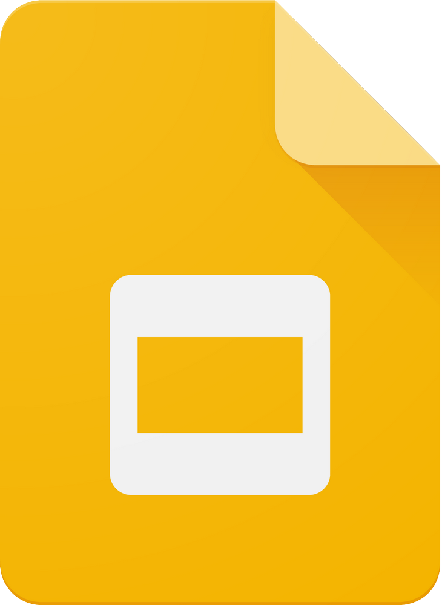
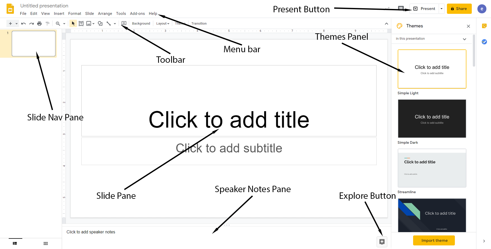

Introduction
============

{: width="25%"}

Google Slides is a presentation graphics app that
includes a suite of tools and utilities to create professional
presentations.

PowerPoint at a Glance
----------------------

{: width="75%"}

Menu Bar
:   This is where you'll find most of the tools that come with the app. They're fairly logically arranged, and finding a particular feature is typically fairly straightforward.

Toolbar
:   Most of your most commonly used tools are arrayed here as buttons for easy access.

Slide Pane
:   The main work area which takes up most of the screen space. This
    shows the currently selected slide from your slide show.

Slide Navigation Pane
:   This is an outline view of your presentation. It shows thumbnails of
    all of the slides in your slide show and allows you to quickly jump
    back and forth between them.

Notes
:   In this pane, you can
    type notes for yourself for when you are actually giving your
    presentation. Slides has a feature where you can see the
    notes on your screen, but the audience cannot see them on the
    projector. Highly useful.

Present Button
:   This is the button that starts the presentation. Actually delivering a presentation is a whole topic in itself as there are plenty of tools and features that make this experience streamlined and user-friendly. There is even the ability to present the slideshow over the web by pointing your users to a specific URL.

Themes Panel
:   Open by default, the themes panel allows you to select from a small collection of pre-defined themes. These occasionally get rotated out so there's usually something fresh to use for your presentation.

Explore Button
:   This is a tool that we have not hit on much so far this term, but we are going to now. It's a very useful tool that leverages some arcane algorithm in Google's servers that automatically formats your slides to fit the content and create interesting and compelling slides.

Presentation Principles
---------------------

Slides (and most other presentation software) is built around the
metaphor of a slide show (I have no idea how many of my readers have ever seen an actual slide show!). Each slide is a discrete panel with some
information in the form text, graphics, or images. The presenter can
advance the slide show by hitting the space bar, clicking a mouse, or
using a special wireless clicker that they can hold discretely in the
palm of the hand. The basic concepts are simple enough. However, there
are a few things that you should keep in mind as you explore this and
other software like it.

First, the most important thing to remember is that *the slide show is
not the presentation*. You speaking and interacting with your audience
is your presentation. The slide show is a supplement. It's a visual aid.
It is used to highlight and accentuate key points, but it is *not* the
presentation itself.

Now, this is not always the case. Some people do share slide files as a
way of passing along information in a structured way. Indeed, it's a
fairly common practice, but by and large, it is not what we are going to
be using it for in this class. I, too, am guilty of this practice, but I usually do try to build my slides as a supplement to a long-form text.

Since this is not a public speaking course, the art of rhetoric is not
covered in detail here, however, it is necessary to talk a little bit
about the rhetoric of a slide show. So, we will, in class and in the videos, discuss ways in which to blend the art of speaking with the
art of crafting a slide show. We will talk about how to make your slide
show complement your speech without drawing too much of your audience's
attention.
