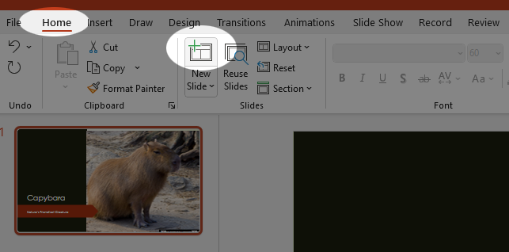
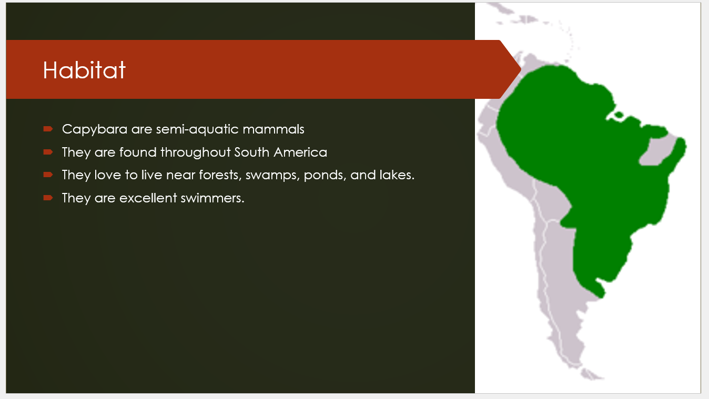

Tutorial - Creating and Building a Slide Show
=============================================

In this tutorial, we are going to build a slideshow. This will be a little different than our tutorials so far in that it will be largely free-form. You are not necessarily going to build the exact same slideshow as presented here. Indeed, you should experiment with your own subject.

Your first order of business is to think of an animal that you like. Take a moment.

Okay, got it? Good. I'm going to use the [Capybara](https://en.wikipedia.org/wiki/Capybara) as an example.

[My Example](res/Capybara.pptx)

TUTORIAL
--------

With your chosen animal, you are going to follow these same basic steps. I'd certainly advise you also keep a tab open to the animal's [wikipedia](https://www.wikipedia.org) page, so that you can grab images and information (since stuff there is usually on a very lenient license).

Let's begin.

1. Open the **PowerPoint** app.
1. You'll be greeted by the backstage view of the app, which will include a list of templates and recently accessed slideshows.

    

    Click on the **Blank** template. We want a clean slate.

1. You'll be greeted with the [PowerPoint Interface](1_powerpoint_tour.html). The first thing you'll want to do is select a theme. Select the **Design** tab and select a theme that you like. Or just pick one at random:

    

    I picked "Wisp," but you may select whichever one you wish. 

1. Type in a title, use the name of your animal. Then add a subtitle. Be as clever as you wish:

    

1. That done, let's try something out. There should be a Designer panel on the right that will give you ideas for designing your slide:

    

### The Explore Pane

The **Designer** pane is a kind of AI assistant. It will happily supply you with alternative slide layouts and designs based on what content is in your slides. And it does a pretty good job. Let's see what we can do with it.

1. First, take a look at the suggestions that it already has generated for your title slide.

    

1. You could certainly use one of these suggested layouts, but let's take it a step further. Select the **Insert** tab and the **Pictures** tool. Select the **Online Pictures...** option.

    

1. Type your search term in the Bing search bar and hit **Enter**. Select an image by **clicking** on it. Then click **INSERT**.

    

1. Watch what happens to the Designer pane:

    

    The image is just sitting in the middle of the slide at first, but it suggests a whole bunch of interesting layouts that accentuate the text and the image. Go ahead and **Select** one of these layouts.

    

### Adding Slides

Now, let's add some actual content. Throughout this process, let's leverage the power of the Designer pane to make our lives a little easier and end up with a nice, professional result. One thing that's important to recognize is the power of **layouts**. There are a set of pre-defined layouts that you can use to give your content structure, and we'll look at these throughout the process, and then use the Designer pane to augment these layouts and make them pop.

1. Click the **New Slide** button at the top left of the interface

    

1. The default layout for the slide has a title and content box. Typically, you'll want a heading of some kind in the title box and *usually*, you'll use a bullet list to highlight key points in the content box.

    

1. Add some content. For this slide, let's just make it a definition slide. Just introduce your subject. One thing to make sure you do is **use bullet points** in the content box. This is the default behavior, so it should be on, but verify just in case:

    

1. Open the Designer pane to see what layouts it suggests. You might consider using one of these, but let's add an image first and see what else comes up. Add an image in the same way as before, but select a different image. Now, observe our options in the Designer pane.

    

1. Select a layout that you like.

1. Let's add a few more slides. Since we're doing animals, go ahead and create four more slides with the following headings

    * Habitat
    * Diet
    * Social Habits
    * Conservation Status

1. Use only three or four bullets per slide and keep your sentences brief. For each one, add an *appropriate* image and let the Designer pane do some heavy lifting. Here are my examples:

|  |  |
|  |  |

### Transitions and Animations

The last thing we'll do is add some animations to our slides. These add visual appeal and motion to an otherwise static experience. 

Transitions
:   These are animations that play as a transition from one slide to another.

Animations
:   These are animations that can be triggered to occur inside a given slide. Usually used as a method to create what's called **Progressive Disclosure**.

Progressive Disclosure
:   The process of revealing information on a given slide one bullet at a time. This can be used as a way of adding emphasis to your speech, or keeping your audience from simply reading the slides.

1. Return to your first slide, your title slide.
1. Open the **Transitions** tab.

    

1. In the large menu at the top, select a transition that you like. There are several to choose from and you can expand it with the little arrow button in the corner of the menu. As you select them, the animation will play so you can see what it looks like.

    

1. Once you've selected a transition that you like, click the button that says **Apply to all slides** and you're done. The same transition will play for all slides.

    

1. Go to the first slide that has some bullets. It should be your second slide. Open the **Animations** tab. **Select** the text box with the bullets by clicking on it. Then select an animation that you like. By default, you will get the *progressive disclosure* effect because the default behavior is to reveal each bullet item *on click*. You can also see this because numbers will appear next to each item in the list.

    

1. You can mess around with the speed of the animation as you like, but this is the basic process. Proceed to add progressive disclosure animations to each slide in the file and then the tutorial is complete.

## Conclusion

Now, if you're observant, you'll notice that I never changed the file name until the very end. It totally slipped my mind. Go ahead and do that now, and make sure to move it to an appropriate folder in your Google Drive. Submit it as a link to Canvas as normal.

There are a lot more features that you can use in Slides, but honestly, with just the few we've explored in this tutorial, you'll be well on your way to crafting slides that will impress.
