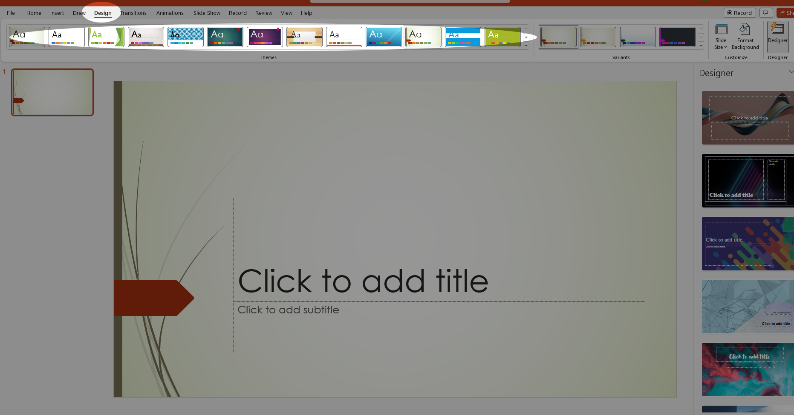
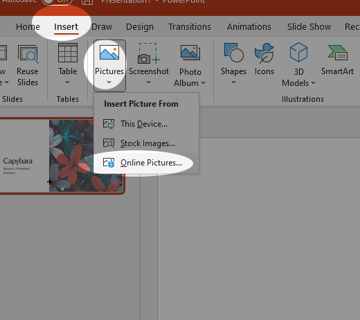
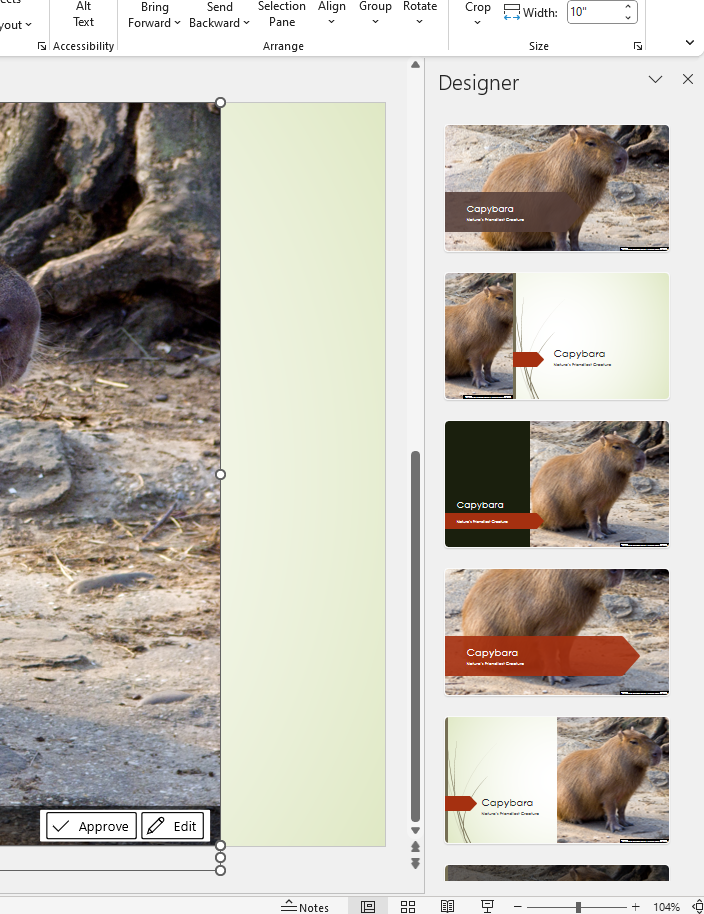
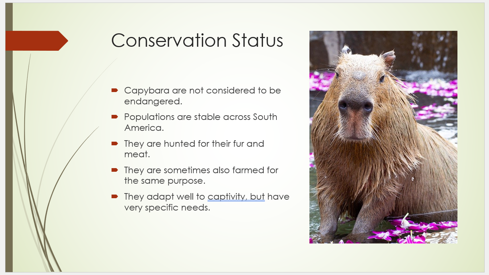

Tutorial - Creating and Building a Slide Show
=============================================

In this tutorial, we are going to build a slideshow. This will be a little different than our tutorials so far in that it will be largely free-form. You are not necessarily going to build the exact same slideshow as presented here. Indeed, you should experiment with your own subject.

Your first order of business is to think of an animal that you like. Take a moment.

Okay, got it? Good. I'm going to use the [Capybara](https://en.wikipedia.org/wiki/Capybara) as an example.

TUTORIAL
--------

With your chosen animal, you are going to follow these same basic steps. I'd certainly advise you also keep a tab open to the animal's [wikipedia](https://www.wikipedia.org) page, so that you can grab images and information (since stuff there is usually on a very lenient license).

Let's begin.

1. Go to [Google Slides](http://slides.google.com/).
1. You'll be greeted by the slides homepage. It will have a list of all of your slideshows in your google account listed from most recently accessed.

    

    Click on the **Blank** template. We want a clean slate.

1. You'll be greeted with the [Slides interface](1_slides_tour.html). The first thing you'll want to do is select a theme. Scroll down the Themes panel and select one that seems to fit your animal. Or just pick one at random:

    

    I picked "Coral," but you may select whichever one you wish. Afterwards, you may want to dismiss the **Themes Pane** by clicking the X in the top right corner as shown in the screenshot above.

1. Type in a title, use the name of your animal. Then add a subtitle. Be as clever as you wish:

    

1. That done, let's try something out. Click the **Explore** button at the bottom right of the Slides interface:

    

### The Explore Pane

The **Explore** pane is a kind of AI assistant. It will happily supply you with alternative slide layouts and designs based on what content is in your slides. And it does a pretty good job. Let's see what we can do with it.

1. First, take a look at the suggestions that it already has generated for your title slide.

    

1. You could certainly use one of these suggested layouts, but let's take it a step further. Click the **Insert Image** button and select **Search the web**.

    

1. Type your search term in the Google search bar and hit **Enter**. Select an image by **clicking** on it. Then click **INSERT**.

    

1. Watch what happens to the Explore pane:

    

    The image is just sitting in the corner at first, but it suggests a whole bunch of interesting layouts that accentuate the text and the image. Go ahead and **Select** one of these layouts.

    

### Adding Slides

Now, let's add some actual content. Throughout this process, let's leverage the power of the Explore pane to make our lives a little easier and end up with a nice, professional result. One thing that's important to recognize is the power of **layouts**. There are a set of pre-defined layouts that you can use to give your content structure, and we'll look at these throughout the process, and then use the Explore pane to augment these layouts and make them pop.

1. Click the **New Slide** button at the top left of the interface

    

1. The default layout for the slide has a title and content box. Typically, you'll want a heading of some kind in the title box and *usually*, you'll use a bullet list to highlight key points in the content box.

    

1. Add some content. For this slide, let's just make it a definition slide. Just introduce your subject. One thing to make sure you do is **use bullet points** in the content box. The bullet button is highlighted here:

    

1. You'll see that Explore tab has given you some suggestions for layouts. You might consider using one of these, but let's add an image first and see what else comes up. Add an image in the same way as before, but select a different image. Now, observe our options in the Explore pane.

    

1. Select a layout that you like.

1. Let's add a few more slides. Since we're doing animals, go ahead and create four more slides with the following headings

    * Habitat
    * Diet
    * Social Habits
    * Conservation Status

1. Use only three or four bullets per slide and keep your sentences brief. For each one, add an *appropriate* image and let the Explore pane do some heavy lifting. Here are my examples:

|  |  |
|  |  |

### Transitions and Animations

The last thing we'll do is add some animations to our slides. These add visual appeal and motion to an otherwise static experience. 

Transitions
:   These are animations that play as a transition from one slide to another.

Animations
:   These are animations that can be triggered to occur inside a given slide. Usually used as a method to create what's called **Progressive Disclosure**.

Progressive Disclosure
:   The process of revealing information on a given slide one bullet at a time. This can be used as a way of adding emphasis to your speech, or keeping your audience from simply reading the slides.

1. Return to your first slide, your title slide.
1. In the **Slide** menu, select **Transition**.

    

1. The transition pane opens on the right and will replace any other pane that you may have open. From the menu, select a transition that you like. There aren't too many to choose from. After you select one, you can click the **Play** button to see what it looks like.

    

1. Once you've selected a transition that you like, click the button that says **Apply to all slides** and you're done. The same transition will play for all slides.

    

1. Go to the first slide that has some bullets. It should be your second slide. The **Motion** pane should still be open. **Select** the text box with the bullets by clicking on it. Then click **Add animation** when the Motion pane changes

    

1. The process here is simple. To create a *progressive disclosure* effect, simply select an animation that you like from the menu, ensure that **On click** is selected. Then **Check** the box that says **By paragraph**, which will ensure that each bullet comes on its own click, giving you complete control over how much information is displayed during the presentation.

    

1. You can mess around with the speed of the animation as you like, but this is the basic process. Proceed to add progressive disclosure animations to each slide in the file and then the tutorial is complete.

## Conclusion

Now, if you're observant, you'll notice that I never changed the file name until the very end. It totally slipped my mind. Go ahead and do that now, and make sure to move it to an appropriate folder in your Google Drive. Submit it as a link to Canvas as normal.

There are a lot more features that you can use in Slides, but honestly, with just the few we've explored in this tutorial, you'll be well on your way to crafting slides that will impress.
