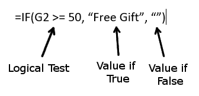

TUTORIAL 5 - Advanced Functions
-------------------------------

We are going to look at some of the advanced functions that Excel has to offer. This tutorial is not intended to show you everything that there is to do, but rather, to give you an idea of the sorts of things that are possible. As always, once you have an idea of what you *can* do, you have a better idea of things you *might* be able to do if you looked a little deeper. So we will look at the following functions:

if()
    The :code:`if` function allows you to execute conditional commands
sumif()
    Maybe you only want to add certain numbers from a specific list.
What if analysis
    We can actually have Excel automatically find the correct solution to a difficult problem.
Absolute References
    This is so important that we're just going to keep coming back to it.
vlookup()
    We're going to see how to use the :code:`vlookup` function to grab data from another table.
Data Table
    Now we're going to look at how Excel can quickly build table data for use in "what if" scenarios.
Home Loan
    This is a demo of a fairly simple financial planning function.

Tutorial
~~~~~~~~

Download the `Start File <http://erickuha.com/primer/excel_resources/advanced_examples-1.xlsx>`_.

The IF() Function
"""""""""""""""""

The :code:`IF()` function takes three parameters: a logical test (something with a **True** or **False** value), a value to display if the test is **True** and a value to display if the value is **False**.

#. The first sheet is called **IF**. In this scenario, we have a list of donors who have given money to your organization. On the right, you should see the explanatory text tells us that any donation of $50 or more receives a free gift. Select the cell :code:`H2`. 
#. In the **Formulas** tab, **Function Library** group, click on the **Logical** tool and select the **IF** function.

   .. figure:: images/advanced/2.png
      :width: 100%

#. In the **Function Arguments** dialog, we must think carefully about our parameters. The logical test must ask if the amount that donor gave was greater than or equal to $50. In Excel, this is represented by the operator :code:`>=`. So in the *Logical_test* box, we enter :code:`G2>=50`. In the *Value_if_true* box, we want to the output to display *"Free Gift"*. Enter the string :code:`"Free Gift"`. In the *Value_if_false* box, we want it to display nothing, so we use empty quotation marks to denote an empty string: :code:`""`.

   .. figure:: images/advanced/3.png
      :width: 100%

#. Press the **OK** button and observe the result. Since Silvia Armstrong donated $52, she will receive the free gift. With cell :code:`H2` still selected, drag the fill handle to the bottom of the table and observe as the other cells are filled in. The reference to :code:`G2` will automatically update for each row of data in the table.

   .. figure:: images/advanced/4.png
      :width: 100%

SUMIF
"""""

On the next sheet, we will add some numbers together, but *only if* some value is true.

#. Select cell :code:`D34`, at the bottom of the far right column.
#. In the **Formulas** tab, **Function Library** group, click the **Math & Trig** tool and scroll down until you find the :code:`SUMIF` function.

   .. figure:: images/advanced/5.png
      :width: 100%

#. Click in the *Range* box and then using your mouse select the entire column of names on the sheet. Excel will automatically abbreviate this to :code:`[Seller]`, the name of the column.

   .. figure:: images/advanced/6.png
      :width: 100%

#. In the *Criteria* box, enter a string with your name in quotation marks. In my case, I entered the string :code:`"Eric"`.
#. Finally, click in the *Sum_range* box, and then select the entire column of dollar totals. Excel will abbreviate this to :code:`[Order Total]`. Make sure your dialog looks like this before pressing **OK**.

   .. figure:: images/advanced/7.png
      :width: 100%

#. The total should be the sum of all of the numbers that are in rows with your name! To finish, try to do the same thing with the *Units Sold* column.

What if?
""""""""

We're going to do two "What if?" scenarios here. 

**Grade Projection**

#. Select cell :code:`B7`.
#. In the **Data** tab, **Forecast** group, select the **What-if Analysis** tool and choose the **Goal Seek** option.

   .. figure:: images/advanced/8.png
      :width: 100%

#. In the *Goal Seek* Dialog, you can read this like a sentence. We want it to read "Set cell B8 (the cell with the student's final grade) to value 80 (the desired grade) by changing cell B7 (the grade we don't know yet). Your dialog should look like this:

   .. figure:: images/advanced/9.png
      :width: 100%

#. As we can see, the student is going to need to do pretty well on that final to get a B in the class!

**Sales Goals**

#. Next, we want to calculate some sales goals. Use what you know about goal seek to answer the questions on the sheet.

Absolute References
"""""""""""""""""""

In this one, we're going to get some practice with absolute references. You've done this before, so this tutorial won't hold your hand. Here are some tips:

#. Only do the first row, and then use the fill handle to fill in the rest of the table.
#. Use absolute refernces to grab the values from the box at the bottom of the sheet.
#. Use sensible formulas to make the calculations (ie, Net Pay is going to be the Gross Pay minus all the taxes).
#. Use relative references and absolute references wherever applicable. You'll need both!

vlookup
"""""""

The :code:`vlookup` function will allow us to grab an individual employee's data from the **Absolute References** sheet and build a sort of pay stub.

#. Select Cell :code:`A2`. Type :code:`=`. Click back over to the **Absolute References** sheet, and select the first name in the table: *Barr, Kiona W.* Press :code:`Enter`.
#. Select Cell :code:`C5`. In the **Formulas** tab, **Function Library** group, click the **Insert Function** button. In the search box, type :code:`VLOOKUP`. 
#. In the :code:`VLOOKUP` dialog, in the first box (the *Lookup_value*), select cell :code:`A2`.
#. In *Table_array*, select the entire table of data from the other table. It should read :code:`'Absolute References'!A8:L22`.
#. In *Col_index_num*, we're looking for the number of regular hours this employee worked. That's in the 4th column. So let's enter the number :code:`4`. Press OK.
#. For most of the rest of them, you can simply copy and paste the *text* of cell :code:`C5` and change the column number. You may have to get creative, with the overtime rate, but you shouldn't have too much trouble. Your table will look like this if you have correctly completed it:

   .. figure:: images/advanced/10.png
      :width: 100%

The beautiful thing about :code:`VLOOKUP` in this case, is that all we have to do is change which employee cell :code:`A2` is referencing, and the pay stub will automatically repopulate with that employee's data. With just a little upfront work, we can have an infinitely re-usable spreadsheet.

Data Table
""""""""""

A data table is an automatically generated table of "What if?" values. We're going to populate these four tables with data without doing any of the math ourselves. At the top, there is a small table showing the monthly payment on a loan with a principal value of $250,000 and a 5% interest rate and a 30 year term. The three tables direclty below it will be used to calculate the monthly payment at different interest rates, term lengths, and principal values. First notice how the first table is populated the top line has a reference to the monthly payment amount (calculated with the :code:`PMT` function and then referenced here). The left column is a series of interest rates in 0.5% increments. Rather than running the :code:`PMT` function over and over again, let's let Excel do the heavy lifting.

#. Select the *Vary Interest* table, cells :code:`B15:C22`. In the **Data** tab, **Forecast** group, select **What-if Analysis** and the *Data Table* option.

   .. figure:: images/advanced/11.png
      :width: 100%

#. In this case, we only want to set *Column input cell*. Select that box and then select cell :code:`B5`. Press :code:`OK`.

   .. figure:: images/advanced/12.png
      :width: 100%

   **Note:** The numbers are in parentheses because they are negative. This is how accountants write negative numbers. For whatever reason.

#. Notice that the table has filled in with the monthly payment amounts for different interest rates! And we did hardly anything!
#. Complete the other two single-input tables here on your own.
#. For the larger two-input table, the method is essentially the same. Select the entire table, cells :code:`B27:H34`. Bring up the **Data Table** dialog.
#. For *Row input cell*, select cell :code:`B6` since the top *row* is the term lengths. In the first column we have the interest rates, so for *Column input cell*, we'll use cell :code:`B5`. Press **OK** and observe the results.

   .. figure:: images/advanced/13.png
      :width: 100%

Home Loan
"""""""""

In the final sheet, we'll put together a simple home loan calculator. This is sort of a spin-off from the previous sheet and a demonstration of the :code:`PMT` function.

#. Let's fill in the table with some sane, sensible values first.

   A. Annual Interest Rate: 4.5%
   B. Payments per year: 12
   C. Interest Rate per Pay Period: :code:`=B3/B4`. This is the interest rate divided by the number of payments per year.
   D. Number of Years: 30
   E. Total Number of Payments: :code:`=B6*B4`. The number of payments per year times the number of years.
   F. Loan Amount: 120,000

#. Now, let's set up the :code:`PMT` function. Select cell :code:`B10`.
#. In the **Formulas** tab, find the **Financial** tool and scroll until you find the :code:`PMT` function. Select it.

   .. figure:: images/advanced/14.png
      :width: 100%

#. Fill in the form with references to the marked cells (they are labeled)

   .. figure:: images/advanced/15.png
      :width: 100%
#. Press **OK** and see what the mortgage payment would be. In this case, it's $608.02.
#. Spend a couple of minutes playing around with the numbers in the calculator. Change the interest rate, the term length, and the principal value to see how the calculator changes the Monthly Payment amount.

Conclusion
""""""""""

This has been kind of a whirlwind tour of some of the more advanced features of Microsoft Excel. Keep this spreadsheet if you like so you can reference some of these tools if you forget about them. And remember, you can always do a web search if you forget how Data Tables work, for example (I did). You have an idea of what's possible. Let's look at more stuff in the next few tutorials.
