--- 
title: 'Tutorial 6 - Tables Pivot Tables'
layout: page
parent: Chapter 4 - Spreadsheets
nav_order: 9
mathjax: true
---

TUTORIAL 6 - Tables and Pivot Tables
====================================

In an earlier tutorial, we looked at how you can take a range of data
and make it into a table. Now, we are going to look at some advanced
ways in which you can use those tables to make the data fit your needs.

At every step of this tutorial, it is very important to stop and think about what you're doing and what information you are gaining by performing this particular action.

Tutorial
--------

First, let's consider how our table might be structured. When we
conceptualize data ranges. Often a data range is just a structured
collection fo individual data entries. A list, if you will. So for
example, let's imagine our company has four salespeople. We might
imagine a table with the following columns:

  | Column Name  | Data Type                            |
  | -            | -                                    |
  | Month        | The Month The sale took place        |
  | Salesperson  | Name of the person who made the sale |
  | Account      | Account number of the customer       |
  | Order Amount | The amount of the order in dollars   |

### Tables

1.  Download the [start file](res/pivot_start.xlsx).
2.  Examine the sheet and get a sense of what it's reporting. Each line
    is an individual sale of some product made by a particular sales
    person, during a month, and for some total amount.

    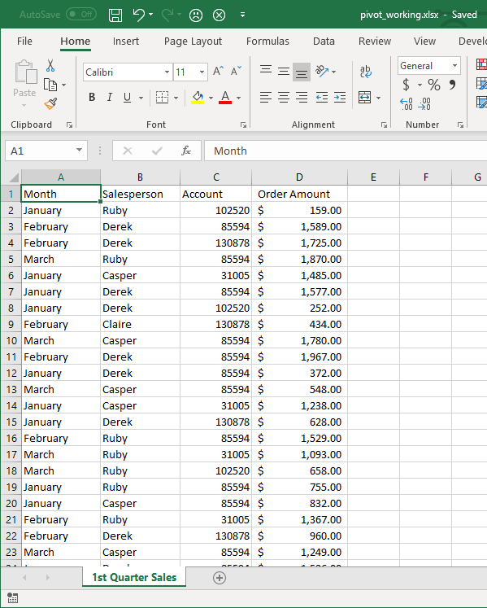{: width="75%"}

3.  Select any cell inside of the data and go to the **Insert** tab.
4.  In the **Tables** group, click on the **Table** tool.

    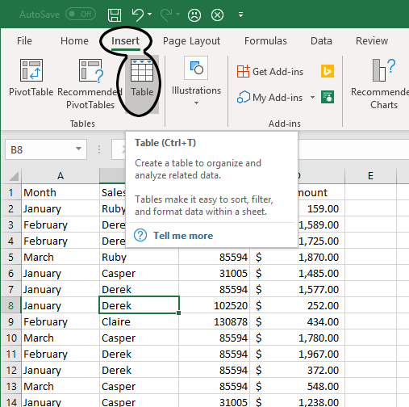{: width="75%"}

5.  In the **Create Table** dialog, ensure that the range is correct
    (you'll see the ants marching around your data). Also, ensure that
    the *My table has headers* box is checked.

    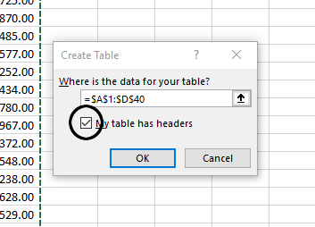{: width="75%"}

6.  In the **Table Tools Design** tab, in the **Table Styles** group,
    select any style you wish. In the **Table Style Options** group,
    observe what happens when you turn on or off the checkboxes for
    *Banded Rows*, or *Banded Columns*, and the other options. Ensure
    that it looks like this before moving on to the next step:

    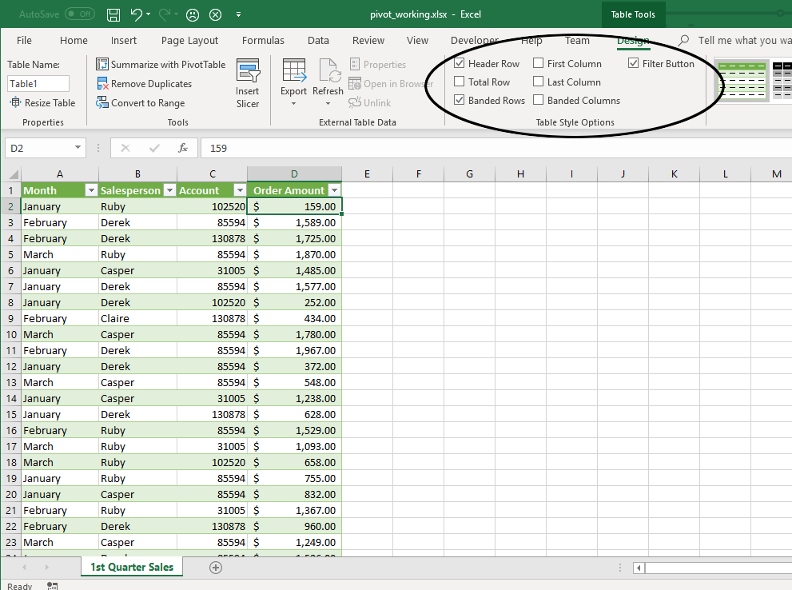{: width="75%"}

7.  In the Properties box, change the table name to **SalesData**.

### Sorting and Filtering

An important thing to remember is that once you define a table in Excel,
it takes on certain properties. Before creating the table, Excel will
treat it as a sheet with a bunch of independent pieces of data. Now, it
understands that you have an interrelated *set* of data and this allows
you to manipulate it in some interesting and useful ways.

1.  Select a cell in the Salesperson column.
2.  In the **Data** tab, **Sort & Filter** group, click the Sort A to Z
    Button. The table is now sorted by the name of the salesperson.

    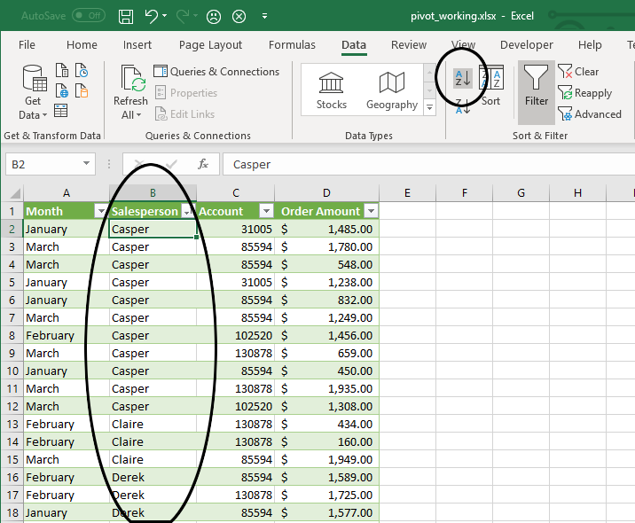{: width="75%"}

3.  Now, select any cell in the table data. Again, in the **Data** tab,
    click the **Sort** button to bring up the Sort dialog. Here, you can
    add further sort conditions to your table. Click **Add Level**.
4.  In the new sort level, for the Column box, choose *Month*. Leave the
    Sort On as *Cell Values*. In the Order box, select Custom List, and
    select the list that says *January, February, March, etc*. Click
    **OK** and then click **OK** and observe the results.

    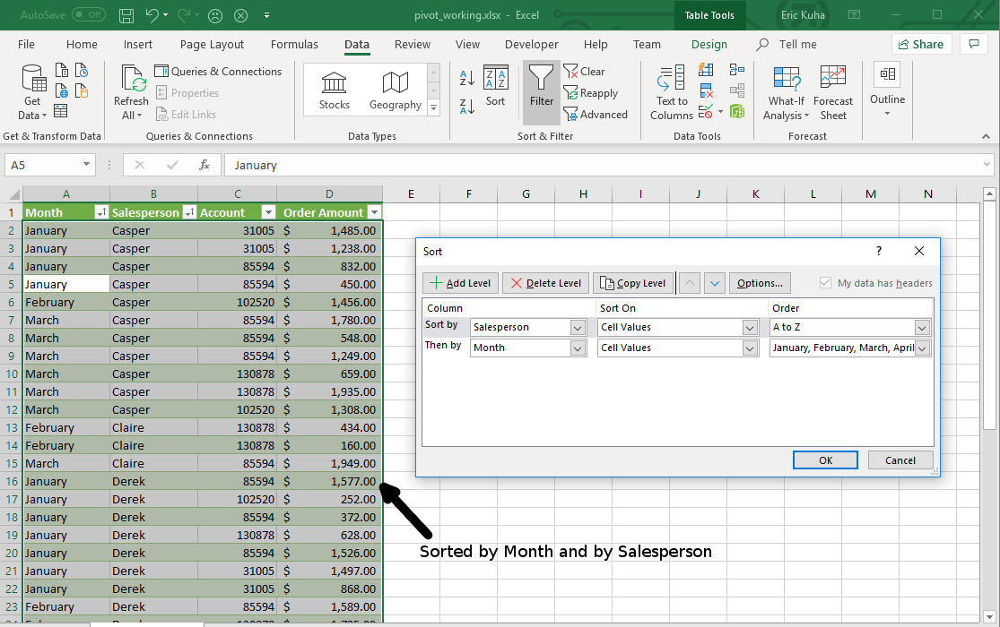{: width="75%"}

5.  We can also filter data, that is, omit data that we don't need at
    the moment (wihtout deleting it). Click the filter button next to
    the Account column heading. Remove the checkmarks from all entries
    except account *31005* and click **OK**.

    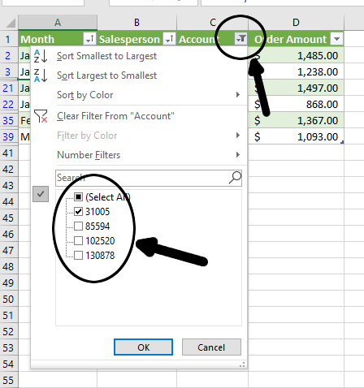{: width="75%"}

6.  Now only the data for that account is displayed. To verify, examine
    the row numbers and see how it skips some rows.

    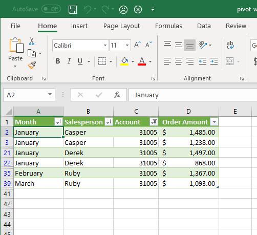{: width="75%"}

Now, we want to try something a little different. We'll add a different
kind of filtering method that's a bit mroe interactive. Introducing the
*Slicer*.

1.  Next, back in the **Data** tab, in the **Sort & Filter** group,
    click **Clear** to clear all filters on the data. Next, in the
    **Table Tools Design** tab, in the **Tools** group, click on
    **Insert Slicer**. Click in the box next to *Salesperson* to select
    it and click **OK**.

    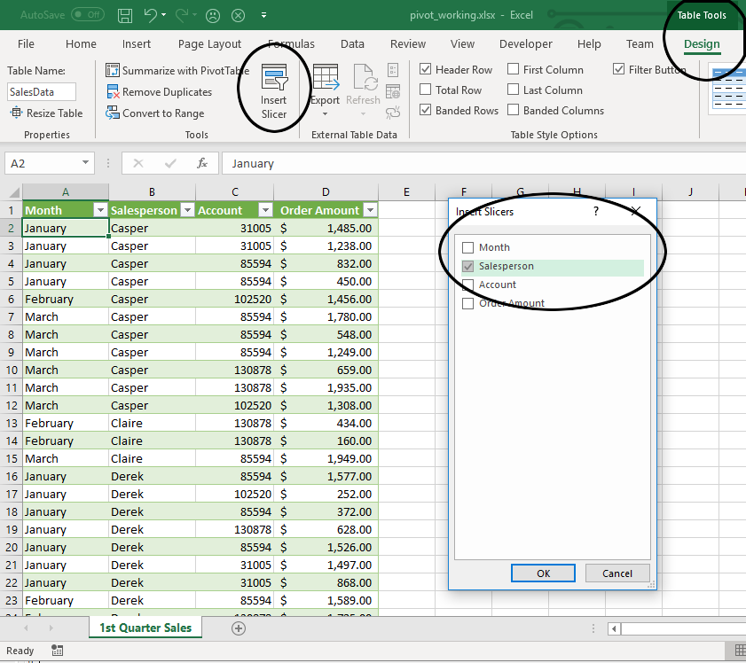{: width="75%"}

2.  Reposition and resize the slicer so it looks nice. You can also
    apply a style to it if you like. Observe what happens when you click
    on the names of the salespeople. There are also two buttons on the
    top of the slicer which allow you to clear the filter or select
    multiple items.

### Totals and Subtotal

We have a list of sales data now. Let's say we want to total everything
up and see how it all adds up. We can simply add a total row to see the
final totals of any numerical columns. We can even do other statistical
functions (i.e. average, median, etc), but if we want more granular
control of how totals are calculated, we can also add subtotals with a
few extra clicks.

1.  Click on any cell within the data set. In the **Table Tools Design**
    tab, **Table Style Options** group, check the *Total Row* option and
    scroll to the bottom of the table. Observe that you now have the
    total sum of all of the sales in the table.

    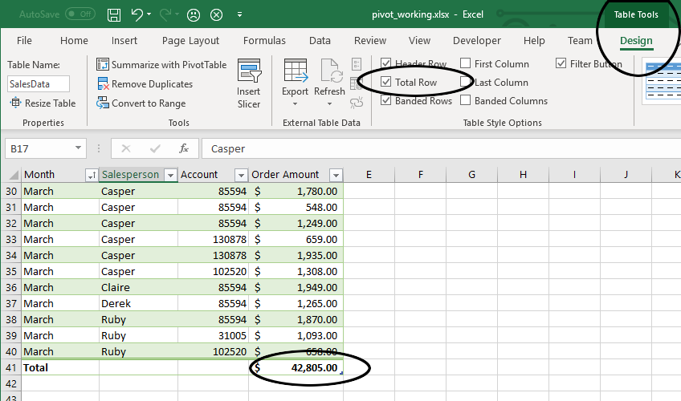{: width="75%"}

2.  Mouse over the total on the table and then click on the dropdown
    menu that appears to the right. Select *Average* from this menu to
    get the average sale total for the entire quarter:

    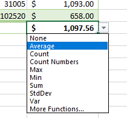{: width="75%"}

3.  Now, let's say this isn't enough detail, and we want to add monthly
    subtotals to our table. Unfortunately, this task cannot be automated
    directly in a table like so many other things, but there is a quick
    way to accomplish it, nonetheless. First, ensure that your data is
    sorted in order by month. If you are not sure whether it is, go to
    the **Data** tab and use the **Sort** tool to ensure that the table
    is sorted by Month and that the names of the months are selected and
    in the correct order (as we did earlier in this tutorial).

    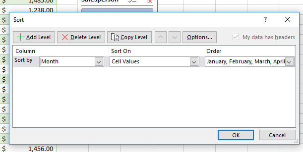{: width="75%"}

4.  Now, Click anywhere in the data and, in the **Table Tools Design**
    tab, under the **Tools** group, click *Convert to Range*.
    Immediately, the filter buttons will vanish, as will your slicer.
    But this is fine.
5.  Next, head over to the **Data** tab. Over in the **Outline** group,
    click *Subtotal*. You can observe this dialog as a description of
    what you want to do. In this case, it should read, "At each change
    in: *Month*, Use function: *Sum*. Add subtotal to: *Order Amount*.
    Ensure that *Summary below data* is selected and click **OK**.

    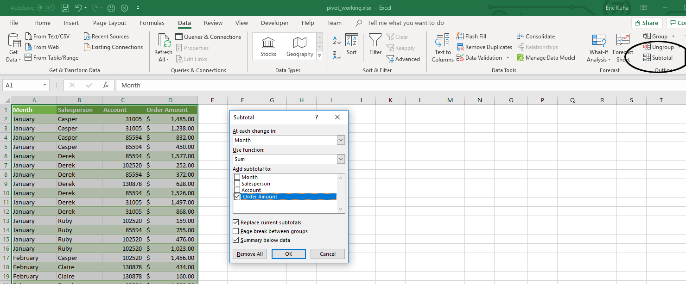{: width="75%"}

6.  Scroll through the table and observe what has been done. There is a
    subtotal at the bottom of every month. Also, notice that in the far
    left margin, there is an outline of sorts. You can collapse entire
    months using these buttons. At the top, try clicking on the level 2
    button and see how the table collapses just to monthly totals.

    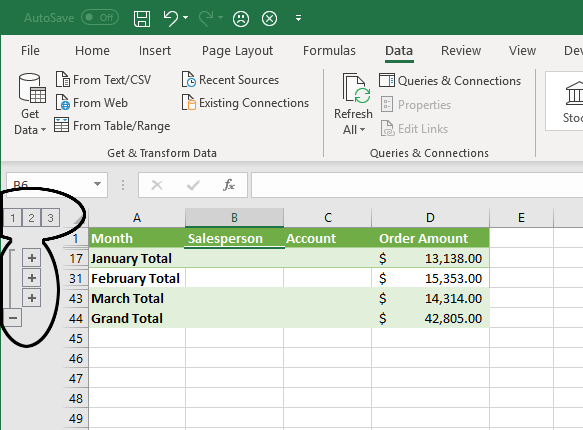{: width="75%"}

7.  Finally, back in the **Data** tab, click on *Subtotal* again, and
    this time, at the bottom left of the dialog, click **Remove All** to
    remove the subtotals. Again, click anywhere in the data, go to the
    **Insert** tab and click **Table**. Ensure that "My table has
    headers" is selected and click **OK**. Lastly, in the **Tables Tools
    Design** tab, change the name of the table, once again, to
    "SalesData".

Next up, Pivot Tables.

### Pivot Tables

This is a tool that is deceptively simple to use, but somewhat difficult
to understand conceptually. What we are going to do, in essence, is
rotate some of the data around so it becomes columnar data. We are going
to turn this essentially one dimensional list of data into a
two-dimensional matrix which can be sorted, filtered, and visualized in
a hundred different ways.

1.  Ensure that the cell selection is somewhere inside the data. In the
    **Insert** tab, in the **Tables** group, click on **PivotTable**. In
    the dialog that opens, the defaults should be okay, but look over
    them so that you understand them. Most importantly, we want to
    ensure that the correct data is selected and the pivot table is
    being generated in a *New Worksheet*.

    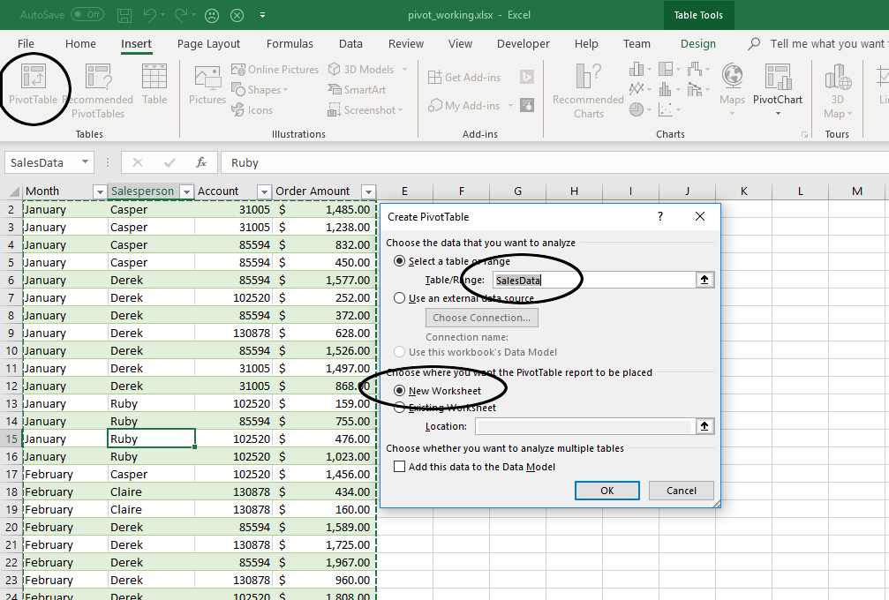{: width="75%"}

2.  Now, right off the bat, you will see nothing much. But here's the
    breakdown of what is here:

    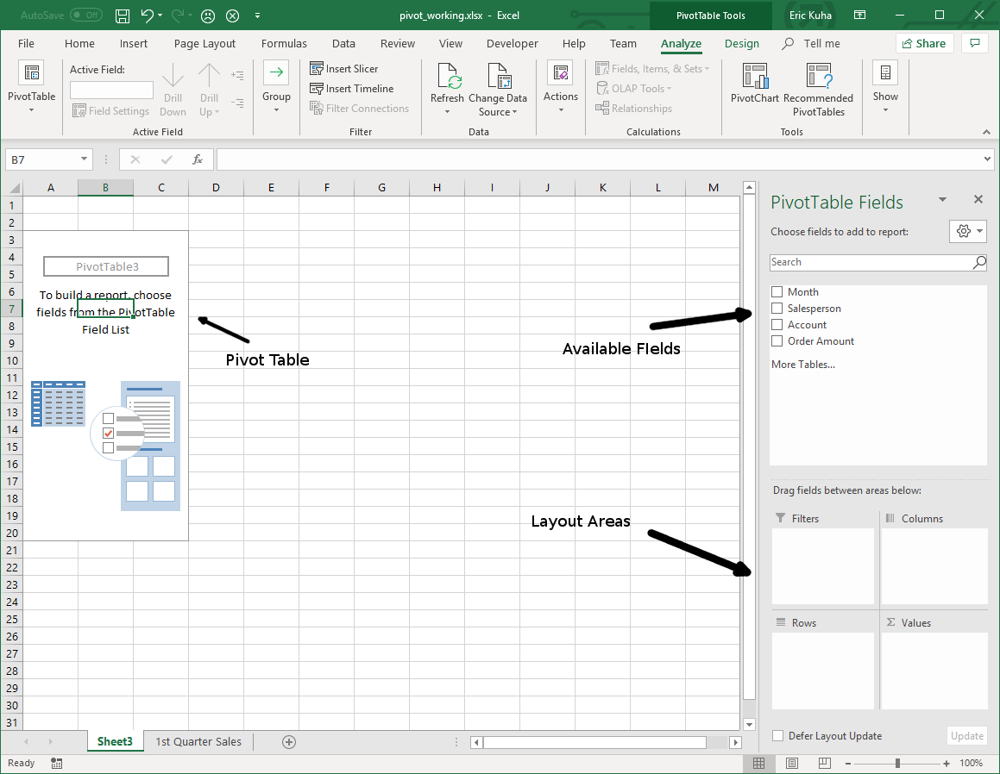{: width="75%"}

    | Area    | Description                                                                                                         |
    | -       | -                                                                                                                   |
    | ROWS    | These will become row labels                                                                                        |
    | COLUMNS | These will become column labels                                                                                     |
    | FILTERS | This is where you can filter data based on any of the field data                                                    |
    | VALUES  | Fields placed in this box will populate the table data cells based on a formula that you choose (SUM, AVERAGE, etc) |

    In essence, the purpose of a pivot table is to be able to take the
    fields and rotate them around so the actual data becomes the rows
    and columns, allowing you to compress and summarize the data for
    visualization purposes.

3.  In the **PivotTable Fields** box, **click** on the checkbox next to
    the Salesperson field.

    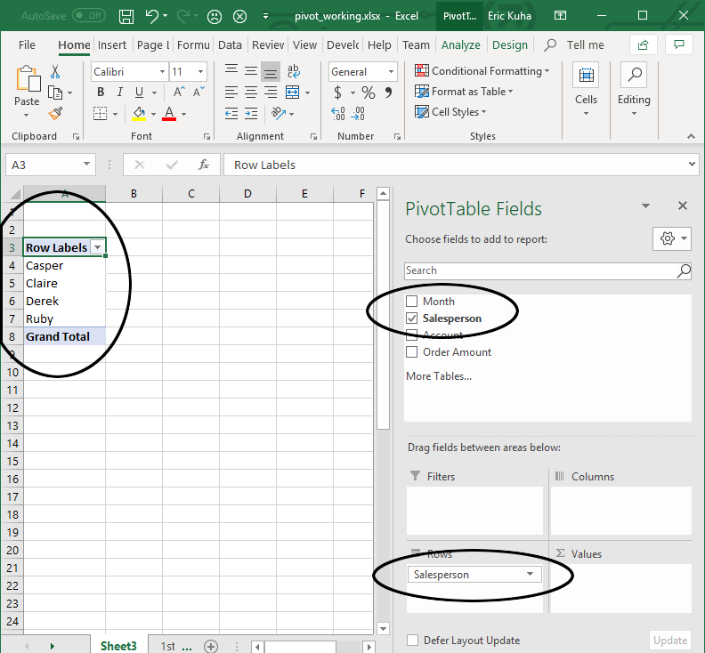{: width="75%"}

    Notice the names of the individual salespeople are now the row
    labels for this new table. Also, notice that Salesperson is now in
    the *Rows* area in the PivotTable Fields box.

4.  Click and drag the **Month** and **Account** fields down to the Rows
    box as well and observe how these now form a sort of row hierarchy.
    Last, drag **Order Amount** to the *Values* box. This is what it
    should look like:

    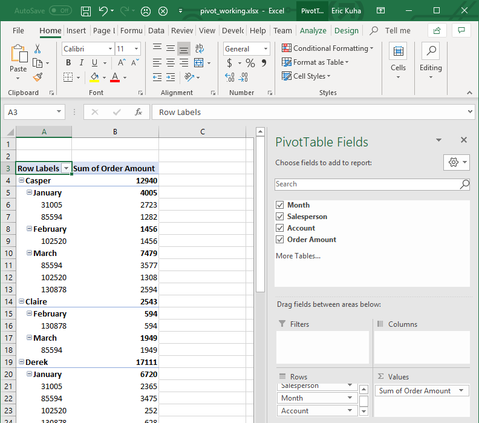{: width="75%"}

5.  This is the beginning of a useful summary of the data. At the very
    least, it's sorted and organized. However, the real magic of a pivot
    table is in deciding which fields should be columns and which fields
    should be rows. So we are going to pivot the **Account** field up to
    the *Column* box. Simply click and drag it out of the *Rows* box and
    into the *Columns* box.

    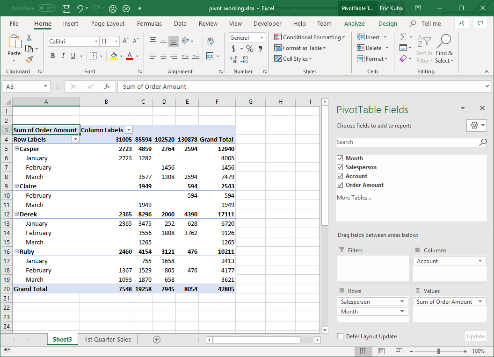{: width="75%"}

6.  Now, let's add a slicer to this pivot table. First, ensure that the
    cell selector is somewhere inside the pivot table. Then, uncheck the
    Salesperson field in the *PivotTable Fields* box on the right
    sidebar. Next, in the **Pivot Tools Analyze** tab, in the **Filter**
    group, **click** the *Insert Slicer* tool. In the dialog that opens,
    select *Salesperson* and click OK.

    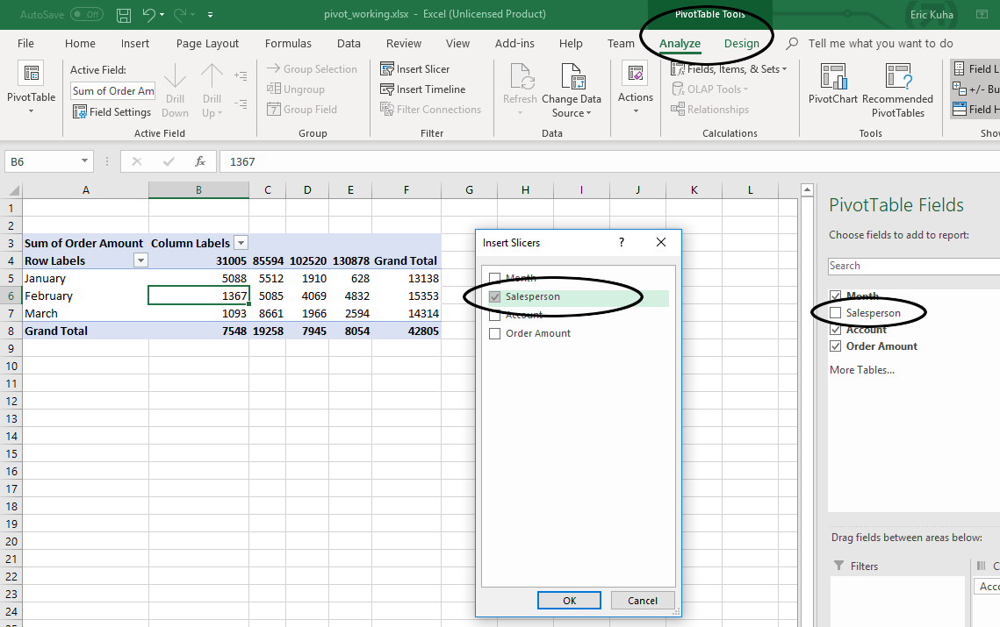{: width="75%"}

7.  Now, you can use the slicer to select data for any of the
    salespeople on the fly.

    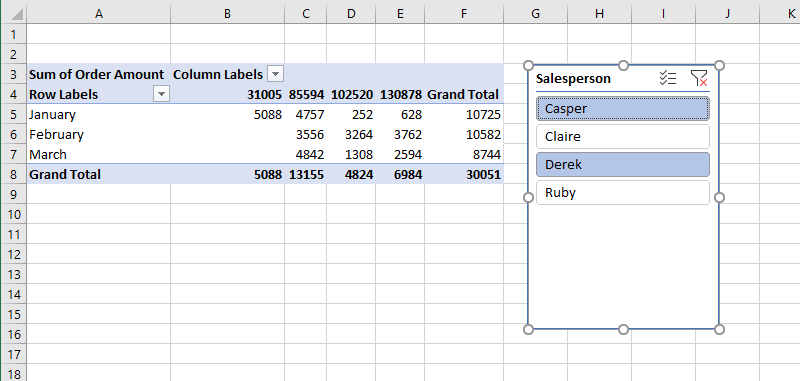{: width="75%"}

8.  Rename the sheet where your pivot chart is *Sales Data Pivot*.

### Pivot Charts

Next, we'll use the *Recommended* feature to automatically generate a
pivot table and use the resulting table to build a dynamic chart based
on the pivot data.

1.  Go back to the *1st Quarter Sales* sheet. Ensure that the selector
    is inside the table. In the **Insert** tab, **Tables** group,
    **click** the *Recommended PivotTables* tool. In the dialog that
    opens, select *Sum of Order Amount by Month*. It should be the
    second one down in the list.

    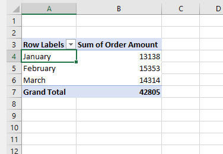{: width="75%"}

2.  In the **Values** box at the bottom right of the window, select *Sum
    of Order Amount* and click on *Value Field Settings*

    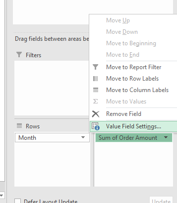{: width="75%"}

3.  First, change the calculation to *Average*. Then, **Click** *Number
    Format* and and change the format to *Currency*. Observe the result
    in the pivot table.
4.  Now, select the newly created pivot table and in the **PivotTable
    Tools Analyze** tab, **Tools** group, **click** the *PivotChart*
    tool. Choose the *Clustered Column* and click OK.

    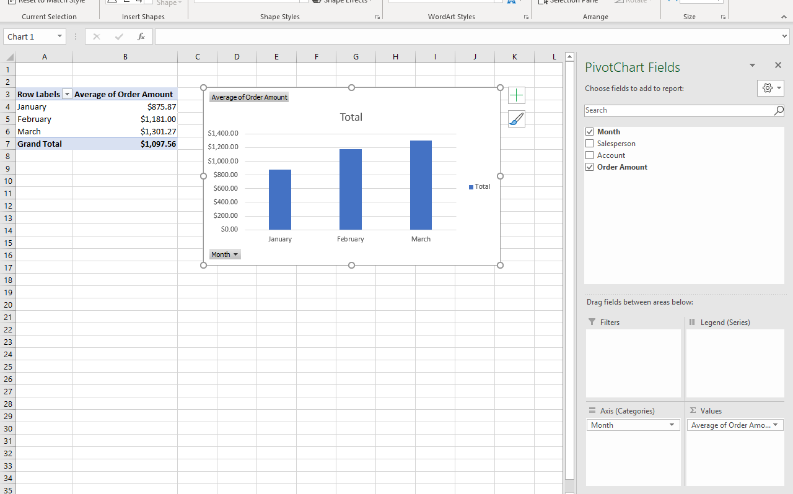{: width="75%"}

5.  Change the name of this sheet to *Monthly Sales*.

### Conclusion

We have only scratched the surface of what you can do with these tools
here. From here, you can do things like apply styles, or different data
visualizations. With other data sets, it is always a good idea to try
out different combinations of fields in a pivot chart to see how the
data behaves. Use slicers to select specific data. Above all, let Excel
do as much of the heavy lifting as possible. From start to end product,
the tables and charts in this tutorial can be made in under five
minutes. It's just a matter of practicing with the tools and building
confidence.
