--- 
title: 'TUTORIAL 3 - Forms'
layout: page
parent: Chapter 5 - Databases
nav_order: 5
---

TUTORIAL 3 - Forms
==================

User Interface

:   The means by which the user and a computer system interact. The part
    of the program that a user sees, which hides all of the complexity
    of actual program.

Graphical User Interface

:   A GUI is an interface with a graphical component. It\'s a UI that
    looks nice, at least in theory.

In a way, crafting a database with Access is sort of like writing a
computer program. One of the most important parts of writing a program
is to create an interface for anyone who might use your program. This
**user interface** is how your users will interact with your database.
Specifically, Access has a system of Forms that protect your database
from users who might not know how the database works, and make it easier
and more intuitive to add new records or search for existing records.

Creating the Artists and Genres forms
-------------------------------------

The first thing we will need to do is create forms for adding new
artists and genres to their respective tables. So, open records the
database that we\'ve been working on. Ensure that you have completed all
of the tutorials up until this point. You should have three tables for
Albums, Artists, and Genres and they should all be linked with
relationships. If you don\'t know what this means, you may wish to
review the previous tutorials in this chapter.

1.  Go to the **Create** tab. In the **Forms** group, click the **Form
    Wizard** button. This will open a dialog that will walk us through
    the process of setting up a new form.

    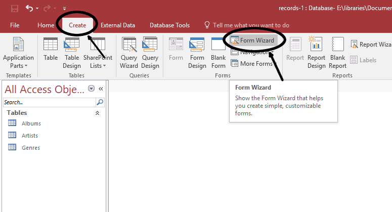

2.  In the **Tables/Queries** dropdown, select **Table: Artists**. Add
    both fields by clicking the double chevron button (\>\>). Click
    **Next**.

    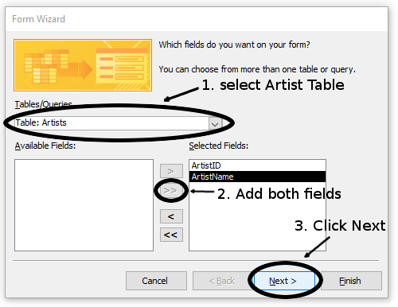

3.  Select the **Datasheet** style for this form. and click **Next**.

    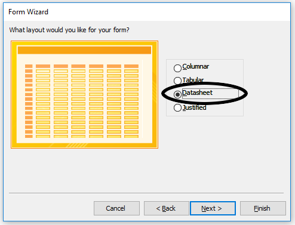

4.  Change the title to "*ArtistsForm*" and click finish.

    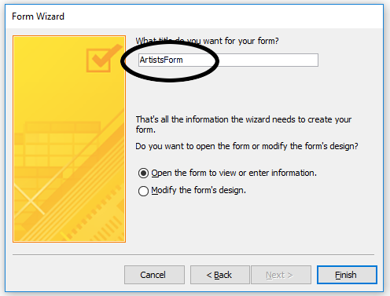

    This will allow you to easily add more artists to the table without
    having to go into the table itself. You also will not have to worry
    about ID numbers are they can be added at will here as well.

    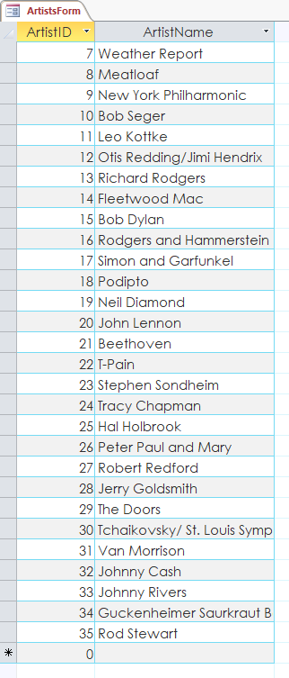

5.  Now, perform the exact same procedure again, only create a
    "*GenresForm*".

    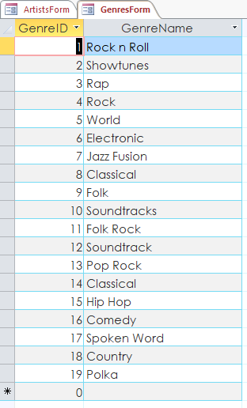

Creating the Album Form
-----------------------

Now, we need to create a new form for our actual Albums. This will
involve several more steps, as the table has more fields and we have to
deal with foreign keys, but follow along and you will see how it works.

1.  You can close the Artists and Genres forms. Go to the **Create** tab
    and start the **Form Wizard** again.
2.  This time select **Table: Albums** from the **Tables/Queries**
    dropdown, but only add AlbumID, AlbumName, and ReleaseDate fields to
    your form.

    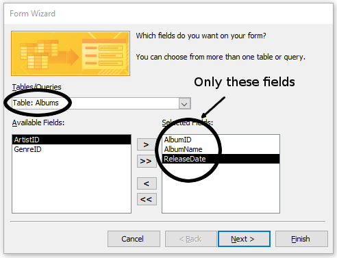

    Make sure they are in this order.

3.  In the next page of the wizard, choose the **Columnar** style.

    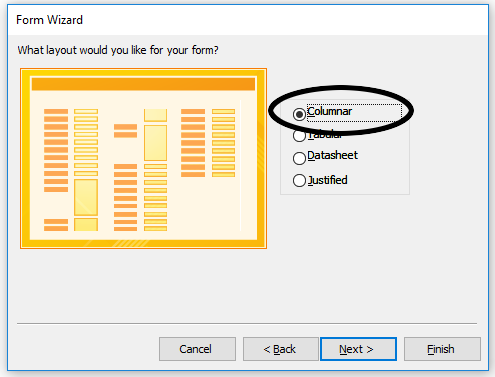

4.  Name it \"*AlbumsForm*\" and press **Finish**.

Adding Combo Boxes
------------------

The base form is there, but it\'s not quite ready yet. We can\'t add an
album without an artist and a genre. For this, we\'ll use a Combo Box.

1.  You should be in the **Home** tab. Click the **View** button at the
    top left to get to **Layout View**.

    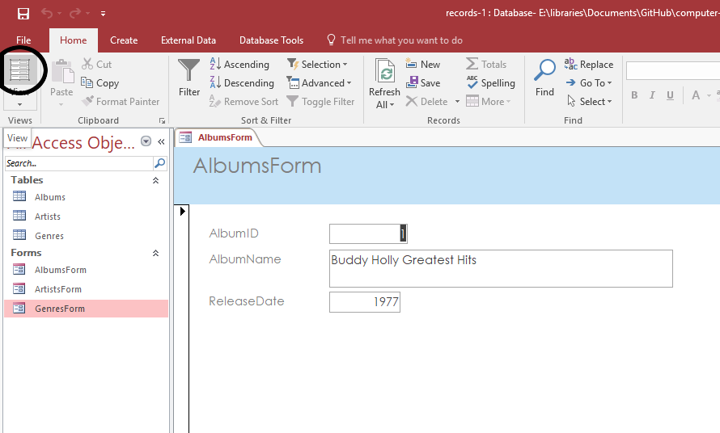

2.  Now, you\'ll be in the **Form Layout Tools: Design** tab. You should
    see a menu of **Controls** in the middle of the ribbon. Find the
    **Combo Box** control and select it.

    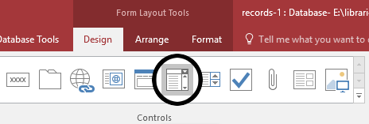

3.  Click somewhere in the form (you\'ll have to reposition this control
    later). The **Combo Box Wizard** will appear. Select **I want the
    combo box to get the values from another table or query**. Click
    **Next**

    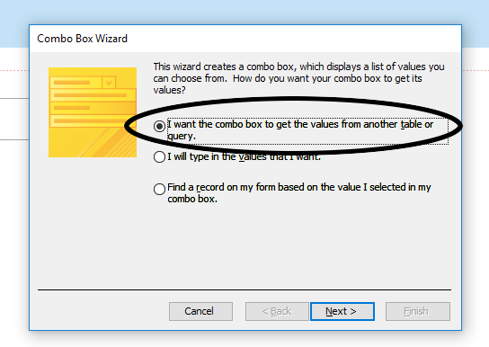

4.  Select the **Artists** table to get the values from. and click
    **Next**.

    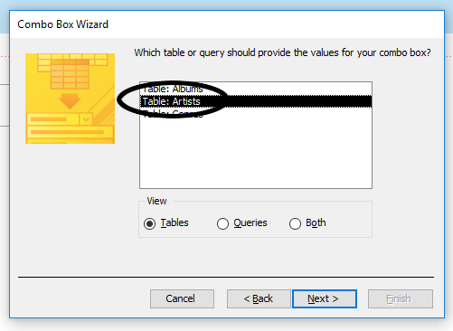

5.  Add both fields to the list, but make sure they are in this order:

    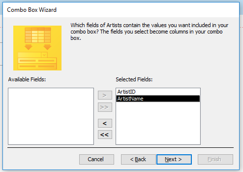

6.  Sort by **ArtistName** and click **Next**.

    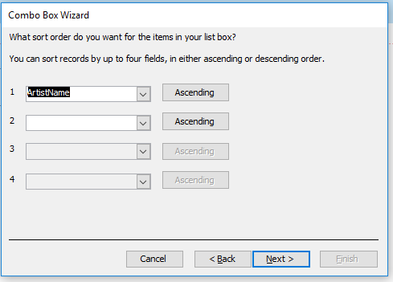

7.  Ensure that **Hide Key Column** is selected.

    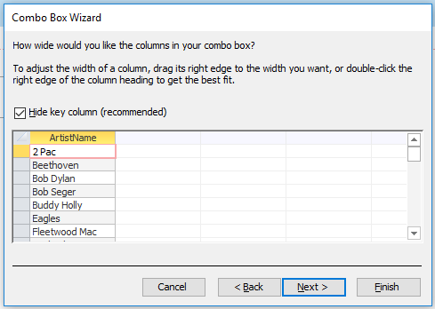

8.  Next, select **Store that value in field:** and select **ArtistID**.
    This is how we will show the artist\'s name, but the form will
    remember the ID key.

    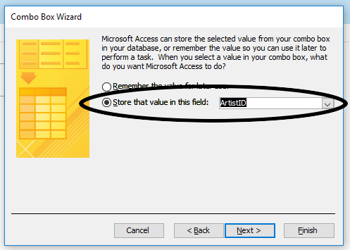

9.  Name the field \"*Artist*\" and click **Finish**.
10. Now, reposition and resize the box until it fits and looks nice:

    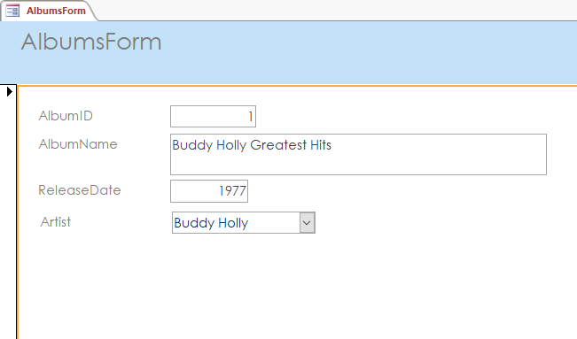

11. Next, we need to change one of the Combo Box\'s properties.
    Right-click on the ComboBox and select **Properites**. The
    properties sidebar should appear.

    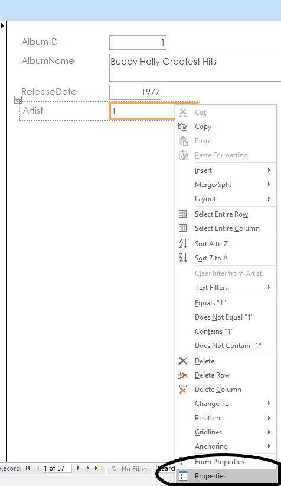

12. In the Property Sheet, in the **List Items Edit Form**, select
    **ArtistsForm**.

    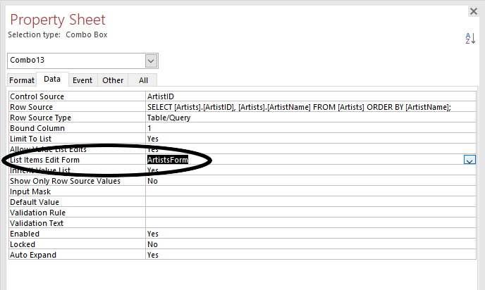

13. Repeat this entire process once again to create a genre\'s Combo Box
    and the form will be complete and functional.

    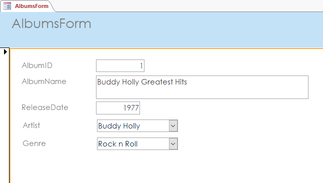

## Add A Couple Buttons

Lastly, let\'s add some buttons so we can edit and add new records to
the the table with a nice, clean, intuitive interface.

1.  With the AlbumsForm still open, click on the **Button** control in
    the **Form Layout: Design** tab.

    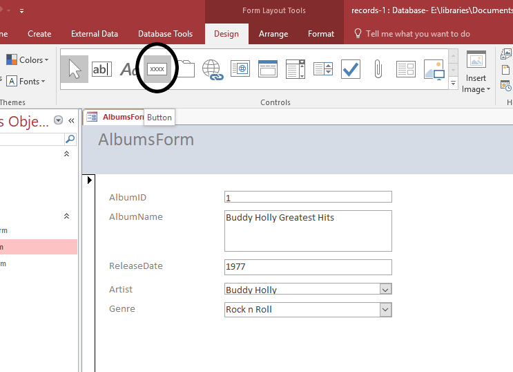

2.  Place the button underneath the Genre Combo Box. The wizard will
    open. To select this button\'s function, selec the **Record
    Operations** category, and **Add New Record** Action.

    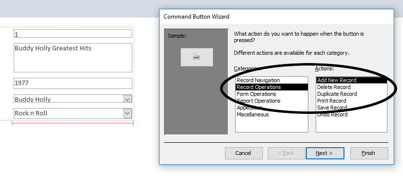

3.  On the next page of the wizard, leave the button image as the
    default (though truth be told, you really should find a different
    image, this one is small and kind of ambiguous). Hit **Next**.
4.  Name it **AddNewRecord** and hit **Finish**. Now you have a button.

    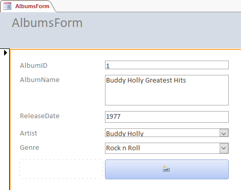

5.  Create two more buttons. One with the **Save Record** action and one
    with the **Delete Record** operation. Use the same procedure and
    give them suitable names. Lastly, add a fourth button with the
    **Find Record** action from the **Record Navigation** category. Now,
    your form has controls.
6.  Go to the **Arrange** tab and play around with the layout grid until
    you have something that looks reasonably decent and organized.
    Here\'s what I came up with:

    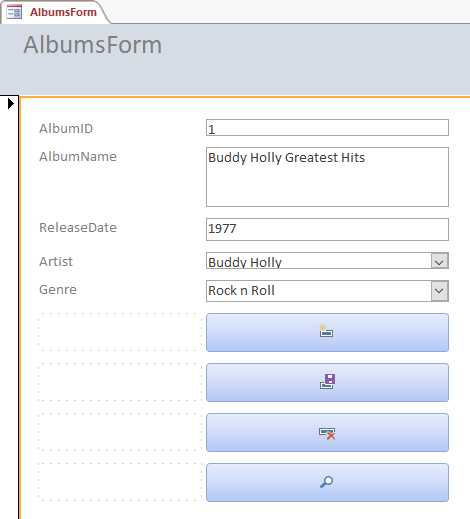

Go to the **Form View**. Try to add a few new albums. Use artists and
genres that are not already in the database and see what happens. Try
searching for a record using the buttons and use different filtering
options. When you are finished. Save, everything. Compact & Repair your
database. Upload it to the class portal.
