TUTORIAL 4 - Queries
--------------------

In this tutorial, we will build a couple of simple queries. In so doing, we will begin to see the power of a relational database for organizing information in useful ways.

Query
    A query is a search for data across one or more tables in your database. The query allows us to sort, filter, or organize the raw data in our tables in interesting and useful ways.

Tutorial
~~~~~~~~

Beethoven Query
"""""""""""""""

How many Beethoven albums do I have? Let's find out how many and what they are. Open up your database from the previous tutorials and follow along.

#. In the **Create** tab, click the **Query Design** tool. 

   |1|

#. Let's add all three tables to the query by double clicking on each of them in turn until you see this. 

   |2|

#. Close the **Show Table** dialog and then take a moment to examine the interface. At the top, in the ribbon are our query design tools, In the middle are our tables in their UML diagram and at the bottom is the design of our query. It has nothing so far, but we're going to change that. First, feel free to rearrange the tables in the query area in a way that makes sense to you. Then, let's start adding fields to our query. 

   |3|

#. We want to find out which albums are by Beethoven, so let's first add *ArtistName*. Do this by simply *double-clicking* on *ArtistName* in the *Artists* table. It will appear in the first section of the query design at the bottom of your screen. 

   |4|

#. Next, let's add the following fields in order: *AlbumName*, *ReleaseDate*, *GenreName*, from their respective tables. Your query should be looking like this: 

   |5|

#. There are a number of ways that we can manipulate the data that would be displayed if we ran this query. One of the most useful ones is to set a **Criteria**. Under the *ArtistName* field in the query, look for the **Criteria** box. Click inside of it and type "Beethoven" in quotation marks. **Don't forget the qutotation marks**. Finally, since we know that all of the albums that are going to display here are going to be by Beethoven, we don't need to show that field, so uncheck the **Show** box in the **ArtistName** field. If your screen looks like this, you're golden. 

   |6|

#. At the left end of the ribbon in the **Query Tools** tab, click the **Run** tool. 

   |7|

#. The query will run and its results will be displayed in tabular form. In fact, the query results will look exactly like a table. 

   |8|

#. Save the query as *BeethovenQuery* and close it. 

ArtistQuery
"""""""""""

Let's combine some of the ways in which we can integrate the use of queries and forms. Let's make a query so that we can use a form to find specific artists and their albums.

#. In the **Create** tab, click **Query Design**.
#. Add all three tables to the query.
#. Once again, add the following fields (very similar to the previous query), *ArtistName*, *AlbumnName*, *ReleaseDate*, *GenreName*. 

   |9|

#. This time, don't filter or change what displays. Simply **Run** the query. 
   
   |10|
   
   The result is a nice table showing all of the albums, but instead of showing numbers for album and genre, it has the names of these fields. A far clearer and more easily searchable table.
#. You can filter or sort by any of these fields. For example, click the small arrow in the ArtistName header and and sort A-Z. 

   |11|

#. Save and close this query. Call it *ArtistQuery*.
#. Go back to the **Create** tab and click **Form Wizard**.
#. In the **Tables/Queries** dropdown, click **ArtistQuery** and add all fields so that your dialog looks like this: 
   
   |12|
   
   Hit **Next**.
#. The next page will ask how you want to view your data. View it **by Artists**. You'll see a sort of sample of the form. Ensure that the **Form with Subforms** radio is checked and hit **Next**. 

   |13|

#. Ensure that the subform layout is a **Datasheet**. Hit **Next**.
#. On the final page of the wizard, leave everything as it is and press **Finish**. You should see a form with the artists name and a list of all of their albums below. Go ahead and scroll through the some of them by clicking the right-arrow button at the bottom of the screen and observe what happens: 
   
   |14|
   
   Notice my typo!

See what you can do
"""""""""""""""""""

We have gotten to the point where it's time to see what you can discover on your own. I think you should have something of a sense for how these disparate Access objects work together and with that, you should try to build some queries of your own.

#. Build two more queries. For at least one of them, you should use a *Criteria* to filter the results of running the query.

There are more sophisticated ways that we can use queries, but for now, let's leave it at this. Close all objects, compact & repair your database and upload it to the class portal.

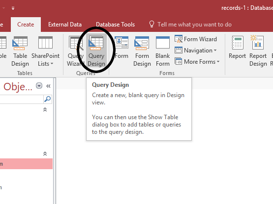

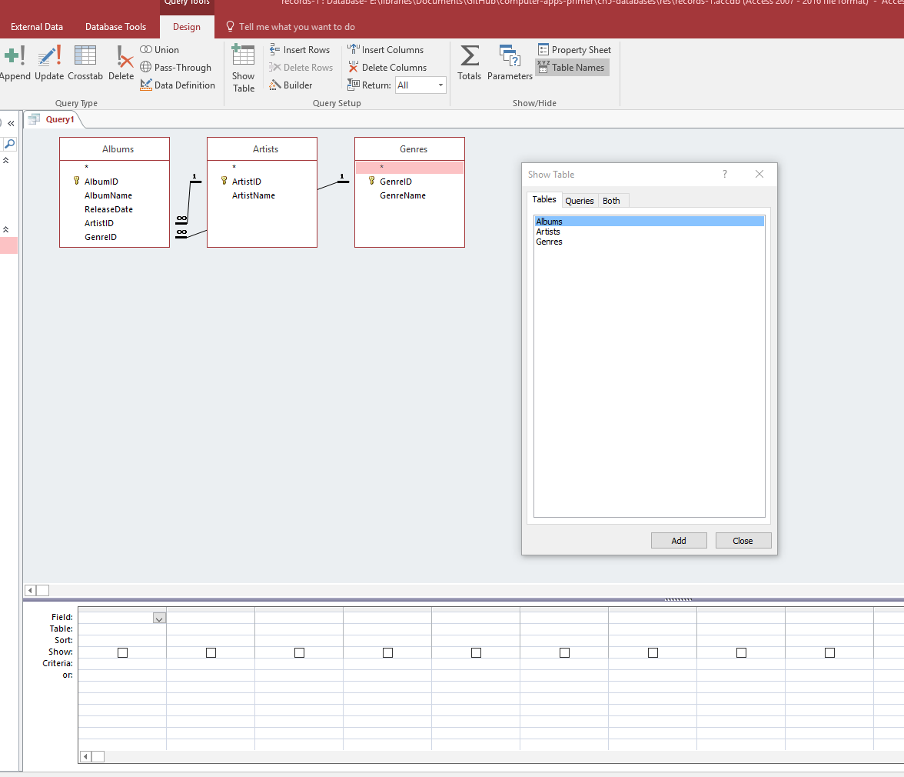

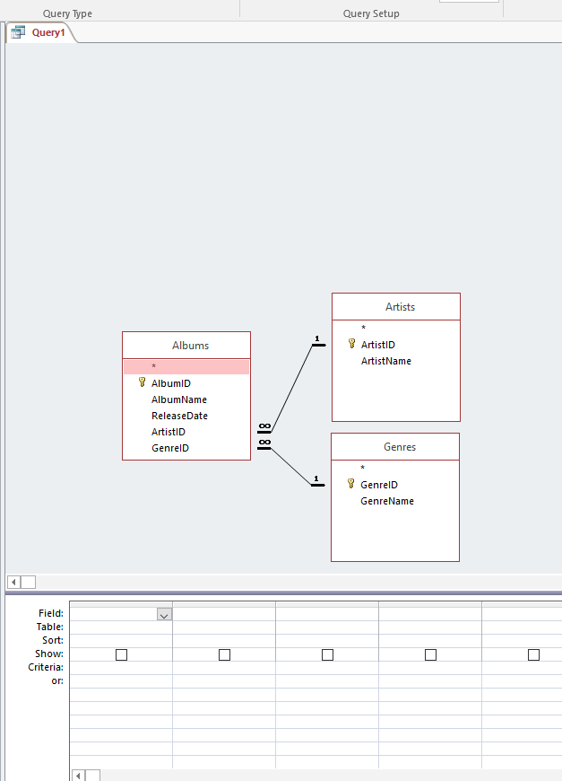

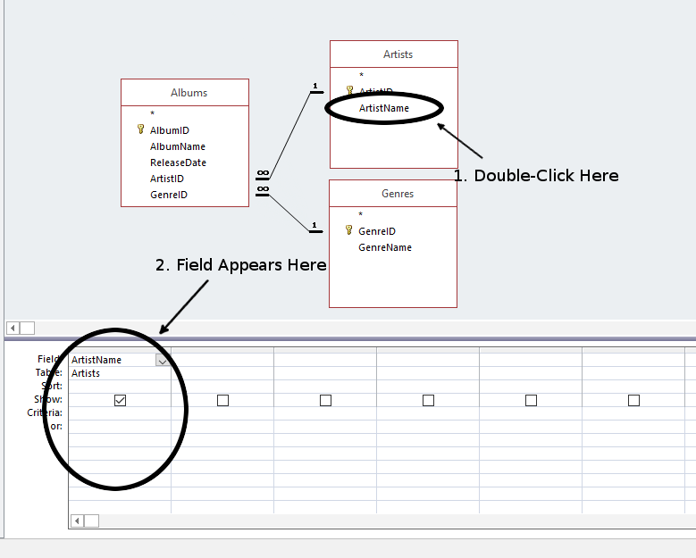

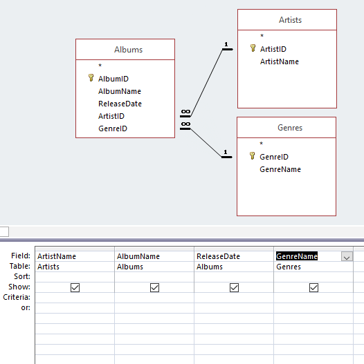

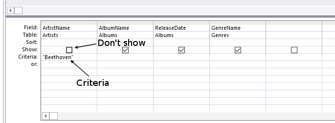

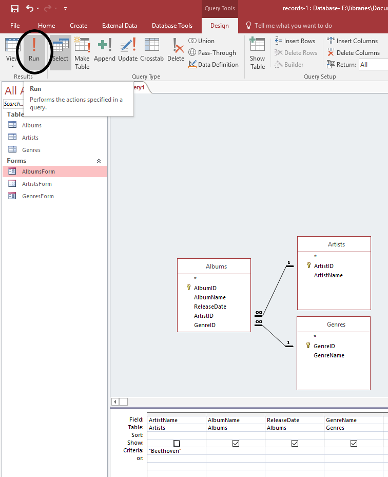

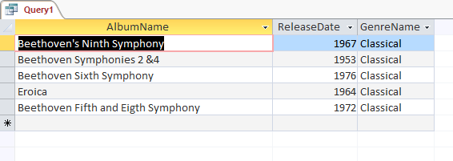

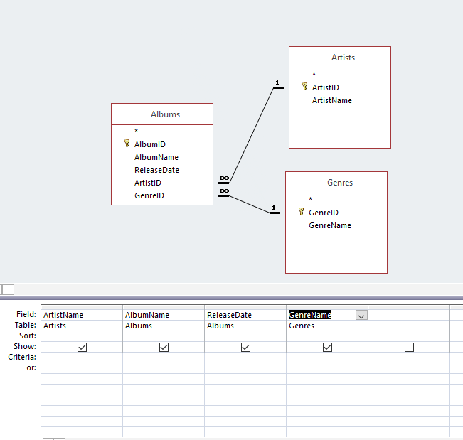

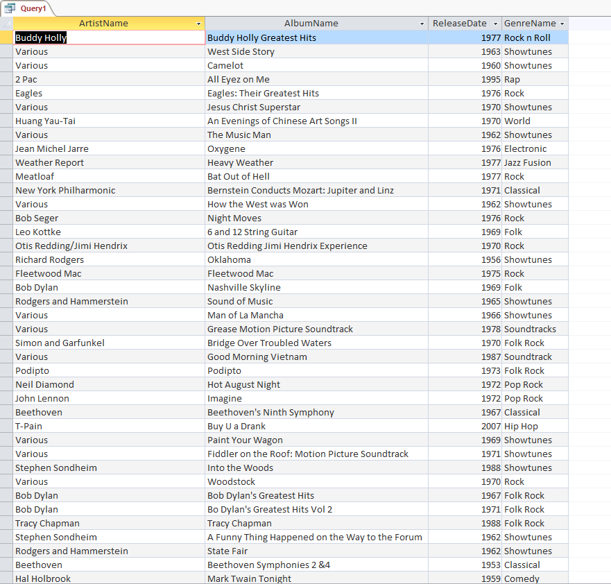

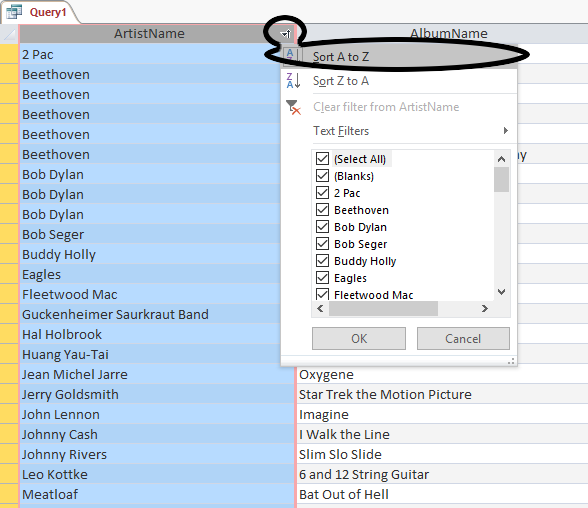

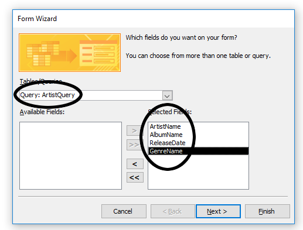

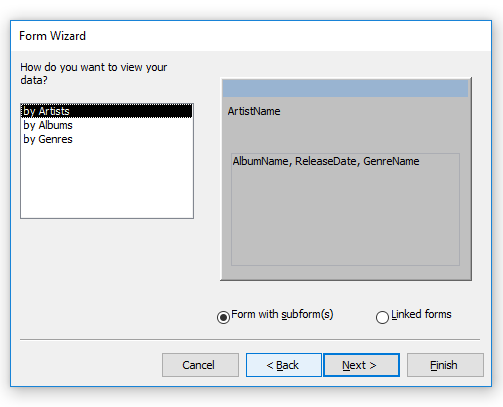

.. |14| image:: images/queries/14.png
   :width: 90%
