TUTORIAL 2 - Tables and Formatting
==================================

<iframe width="560" height="315" src="https://www.youtube.com/embed/VjB2_YmZyw0" frameborder="0" allow="accelerometer; autoplay; clipboard-write; encrypted-media; gyroscope; picture-in-picture" allowfullscreen></iframe>

One of Sheets's most important jobs is to make tabular data readable and
presentable. Some of this will be review from the previous tutorial,
and some of it will cover new tools and techniques for making tables
look more presentable.

We will also explore a few tools that allow you to sort, filter, and arrange data to make it easier to digest.

Key Tools and Concepts
----------------------

Format as Table
:   Sheets has a tool for defining a table and formatting in a way that
    is more readable.

Cell Merge
:   Sheets has a method for merging multiple cells into one. Useful for
    delineating one table from another or creating a table title.

Filters
:   A tool that allows you to exclude certain subsets of data in a table from display, making it easier to find what you're looking for, or display only the information that is important at the moment.

Slicer
:   A slicer is a GUI element that you can add to your table that allows you to filter the table on the fly.

Tutorial
--------

The scenario is relatively simple. You are given a spreadsheet with some
contact information. It's a very raw table and is very hard to read in
the default fonts. You are to make it presentable so that it can be
printed or exported to a pdf for distribution within your company.

### Download the Start File

1.  Copy the [Start
    File](https://bit.ly/3o8CjG7) to your Google Drive
2.  Open the start file in Sheets. Notice first, that there are several problems with this file. Make sure you rename the file to something reasonable like "Table Formatting".

    

### Resize columns

The first and most obvious problem is that the columns are too narrow.
There are a couple of ways to accomplish this. Let's look at a few of
them.

1.  The most obvious way to resize columns is to simply click and drag
    the border between two columns to resize that column. So **Click**
    on the border between columns **A** and **B** and drag it to the
    right until you can see all of the text in column **A**. You may
    have to adjust it a few times to get it right.

    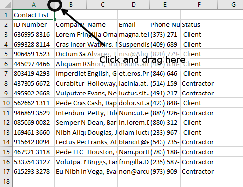

2.  Try this next: hold the mouse over the border between the column
    headers for **B** and **C**. **Double-click** the left mouse button.
    The column will instantly resize to accommodate all of the content in
    the column.

    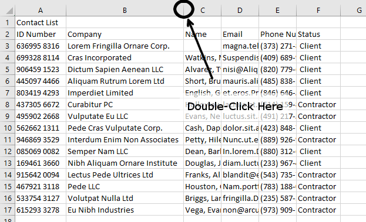

3.  You can actually resize all of the columns at once and
    automatically. First, select columns **C** through **F** by clicking
    and dragging through their column headers. Then, **Double-click** on the border between any two of these
    columns. All four columns should automatically re-size to
    accommodate their contents.

    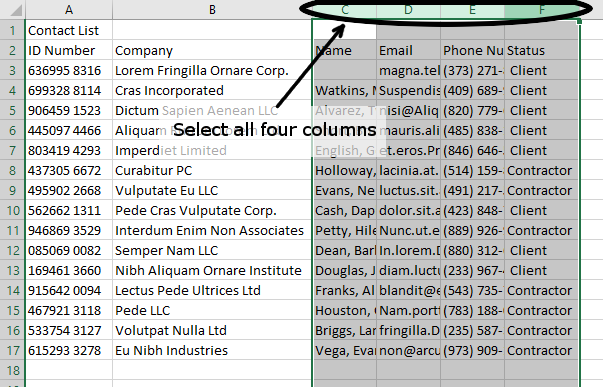

### Create a Title

Cell **A1** contains the title for the table. But wouldn't it be nice if
it were centered across the entire table? With Sheets (and most other spreadsheet apps), you can merge multiple cells into one larger one to create visual cues for certain information.

1.  Select cells **A1** through **F1**.

    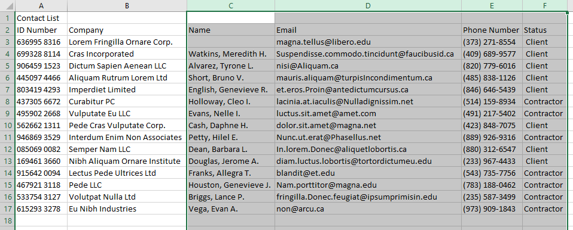

2.  Now, on the toolbar, click the **Merge Cells** tool. The cells will all merge and cells **B1:F1** will cease to exist. **A1** now occludes these other cells.

    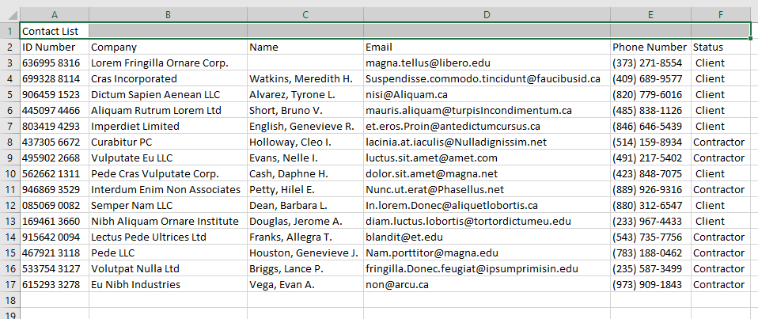

3. Next, click the **Horizontal Align** tool and select **Center**.

    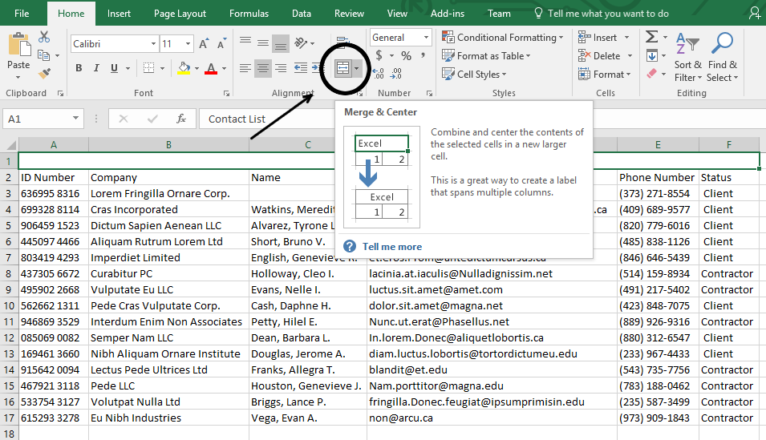

4. Finally, increase the text size of cell **A1** to **14 pts**.

    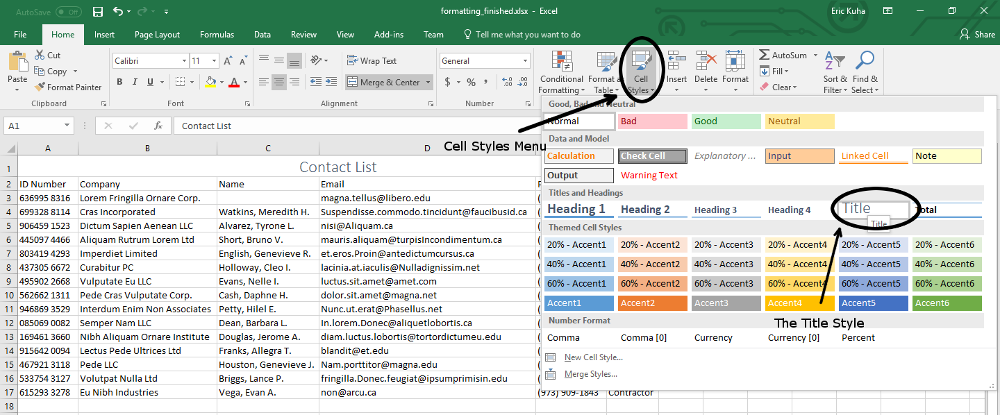

### Table Formatting

This is a (fake) contact list, which should be clear by this point. As such, it's likely to need to be human-readable. That is, we should do something to make it easier for humans to read. So let's take a crack at this.

3.  Select the table. Specifically, select the cell range
    **A2:F17**.

    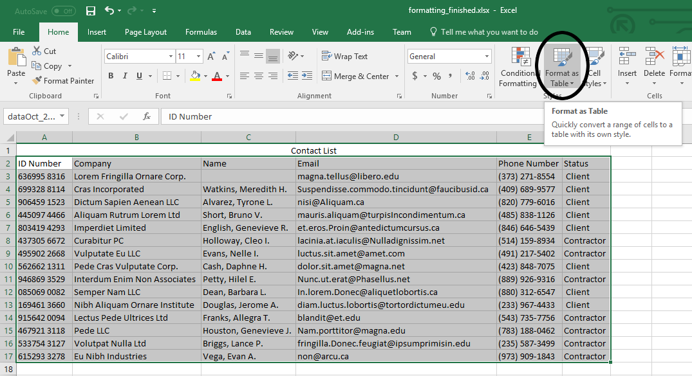

4.  In the **Format** drop-down menu, select **Alternating colors**. This will create a banded rows effect which makes it a lot easier to read the information in the table, by giving your eyes trails to follow.

    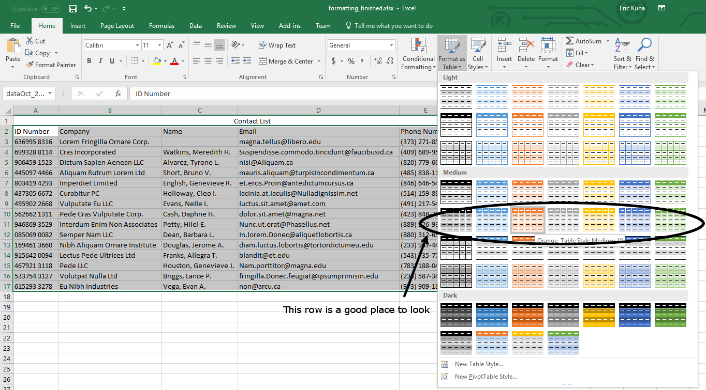

5.  Ensure that the *Header* check box is checked and select any color scheme you like. Click **Done**.

    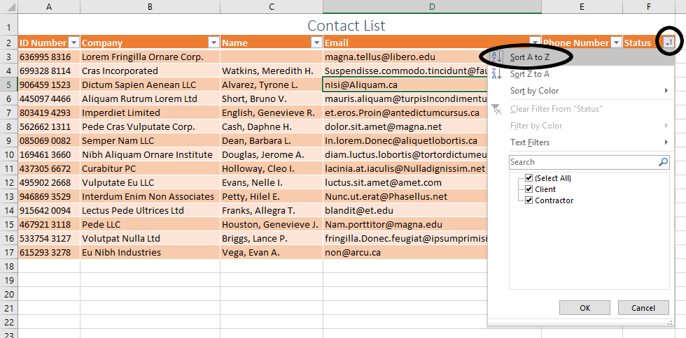

6.  We could leave this as is, but this is a good moment to discuss a little bit of design theory. One problem with this now is that the table column headers are a dark text on a dark background. This is generally considered bad design. I'm not sure why Google hasn't fixed this obvious issue, but it's easy enough to fix. Select cells **A2:F2**. Change the text color to *white*, and then, while we're at it, also make them **bold** and **center** them.

    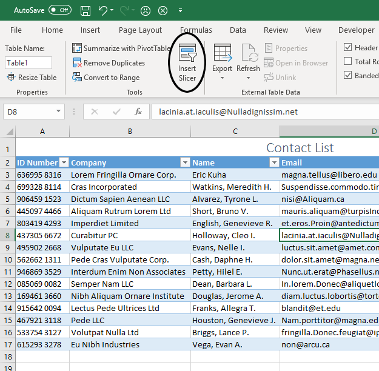

### Sorting and Filtering

There are all sorts of interesting ways we could manipulate this data. Let's look at various ways of sorting, filtering, and slicing the data.

1.  Select any one cell inside the table. Say, cell **A2**, but it doesn't really matter, so long as the cell selector is inside the data.
2.  In the **Data** drop-down menu, select **Create a filter**

    

3. Little widgets will appear in the heading boxes. Ensure that the filter widgets are actually in the heading cells. If they are *above* the headings, hit undo, and then select the entire table again before creating the filter. There's a slight edge-case bug where this sometimes doesn't behave as expected. Click on the one next to the **Name** heading. Select **Sort A &rarr; Z**.

    

4.  The table is now sorted by the name of the contact! Try this, click the filter widget next to **Status** and uncheck **Contractor** and observe the result.

    

1. The table is now filtered into just clients. The other cells are not gone or deleted, just simply hidden. Let's take this a slight step further to create a permanent **View** which we can return to whenever we like. In the **Data** drop-down, select **Turn off filter**. Now, again in the **Data** menu, select **Filter views &gt; Create new filter view**. You'll see a black border appear at the top of the screen. Ensure that the **Range** is **A2:F17**. If not, then change it by correcting it or reselecting the correct cells.

    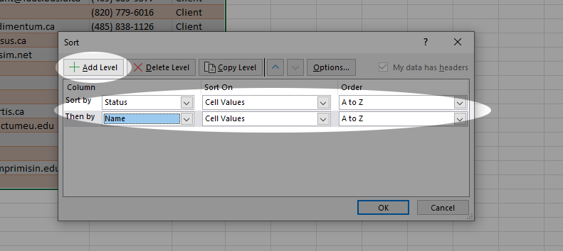

1. Change the name of the filter to **Clients**, and then repeat the application of the filters from above. That is, sort by name and then filter out the Contractors.

    

1. When you click the **X** in the upper right corner, the filters disappear. To return to this filter view, you head to the **Data** menu, and select **Filter views &gt; Clients**.

    

1. Turn the filter view off before moving on.

### Slicer

A slicer is a UI element that you can add to your sheet which will allow you to filter data on the fly.

1. Select the table again, and select **Data &gt; Slicer**. In the menu that appears on the right hand side, there may be a bug where it also selects cell **A1**. Simply change the 1 in that *Data Range* box to a 2, so it reads `Sheet1!A2:F17` and you'll be good to go.

1. Now, in the **Column** menu on that dialog, you'll see a list of all of the column headers in the table. Select **Status**.

    

1. Close the slicer dialog and reposition the actual slicer tool to somewhere more logical. Then, open the Status slicer menu and uncheck **Client**.

    

### Conclusion

Once you've formatted the table, created a filter view, and created a slicer, you can submit the end result as normal.

Sheets has many interesting ways you can manipulate tabular data, and I hope you find these tools useful in the future.
