--- 
title: 'Tutorial 4 - Functions and Basic Charts'
layout: page
parent: Chapter 5 - Spreadsheets
nav_order: 7
---

TUTORIAL 4 - Functions and Basic Charts
=======================================

<iframe width="560" height="315" src="https://www.youtube.com/embed/p7BtCknQruk" frameborder="0" allow="accelerometer; autoplay; clipboard-write; encrypted-media; gyroscope; picture-in-picture" allowfullscreen></iframe>

It's now time to look at how we can visualize data. Let's create some
charts!

For this tutorial, we'll look at some basic charting as well as some
more statistical functions.

Charts
------

First, though, we should think about charts and what they're for. Charts
and graphs are for visualizing data, but it can often be tricky to
decide just what kind of chart to use. So how do we decide? Here's a
basic rundown, then we'll look at a couple of examples:

 | Chart Type   | When to use it                                                                                                                                           |
 | -            | -                                                                                                                                                        |
 | Line Graph   | Line graphs are used to track changes over time. So if there's a time dimension, use a line graph                                                        |
 | Pie Chart    | Use a pie chart to compare parts of a whole. Like a pie!                                                                                                 |
 | Bar Graph    | Like a line graph, used to compare changes over time, but usually best for large changes. Can also be used to to compare things between different groups |
 | Scatter Plot | If you have two variables that relate to each other, you can set one to the X axis and one to the Y axis. It shows the relationship between two things   |

What does each one look like?

### Line Graph

A line graphs are really great for showing changes over time. A very
common example would be to show stock prices changes over time. For a
fun contemporary look at a line graph, here's the price of BitCoins since about 2010.

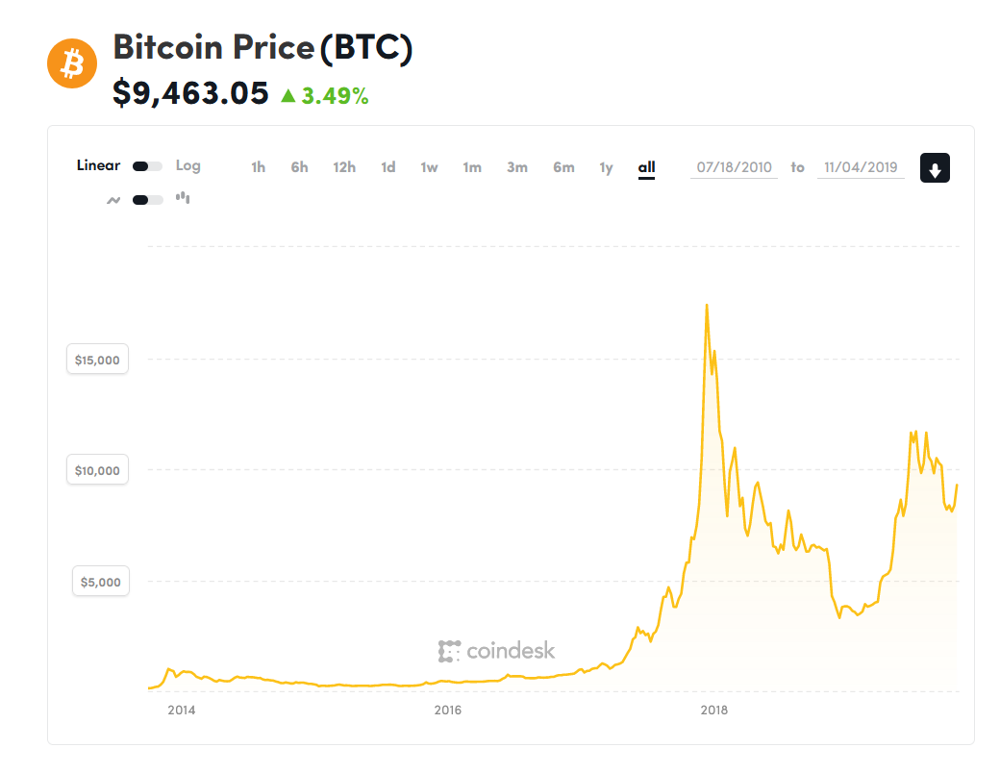

As you can see, it gives a fantastic visualization of the change in
price over the last year for the most famous crypto-currency. By the
way, if you're curious, you can get a good overview of Bitcoin on
[wikipedia](https://en.wikipedia.org/wiki/Bitcoin). If you're really
interested, the original [whitepaper](https://bitcoin.org/bitcoin.pdf)
for Bitcoin is only 8 pages long and is a pretty interesting read as
well.

### Pie Chart

A pie chart is great to compare parts of a whole. A particularly
infamous example would the United States budget. Here's a comparison of
US spending vs US revenue in two pie charts:

### Bar Graph

Bar graphs are great for comparing different groups of things. For
instance, this chart shows the what percent of US households earn what
amount of money in \$5000 increments. Except for the last couple of
bars, which are clearly labeled. The purpose of the chart is to show
income inequality in the United States and illustrates the point quite
nicely. Though, of course, it only tells part of the story. The whole
story is, perhaps, somewhat bleaker even than this. But that's beyond
the scope of this tutorial.

### Scatter Plot

Scatter plots allow you to examine potential correlations between two
variables. Sometimes there's a correlation and sometimes there isn't.
Here's an example:

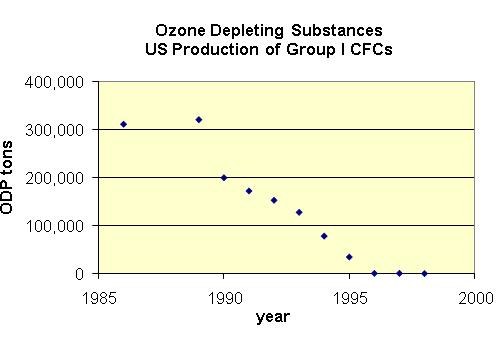

This scatter plot correlates ozone-depleting chemicals with time,
showing a promising trend after the ban of CFCs.

This scatter plot shows the correlation between the length and width of
a particular species of clam. This one is interesting in that it shows
what's called a linear correlation. That is, you could easily draw a
straight line through the points that would be very close to all of
them.

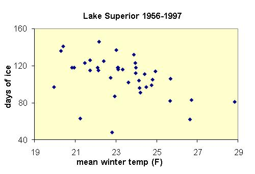

This plot shows the relationship between days of ice on Lake Superior
and the mean winter temperature. This one is not so easy to draw a line
through, but a weak correlation can be seen where the more days of ice
on the lake *tend* to mean that the winter is colder. Or vice versa.

#### Spurious Correlations

Some scatter plots contain spurious correlations however. That is, they
look like they show a real correlation, but there is no way the
correlation can possibly be causal. For some entertaining spurious
scatter plots, check out [this
website](http://www.tylervigen.com/spurious-correlations).

TUTORIAL
--------

We'll take a look at the yearly bills for a fictitious household

1. First copy the [start file](https://bit.ly/3hHPklB) to your Google Drive. Rename it "Bills Tutorial". Now, take a look around to get a feel for what's here.

    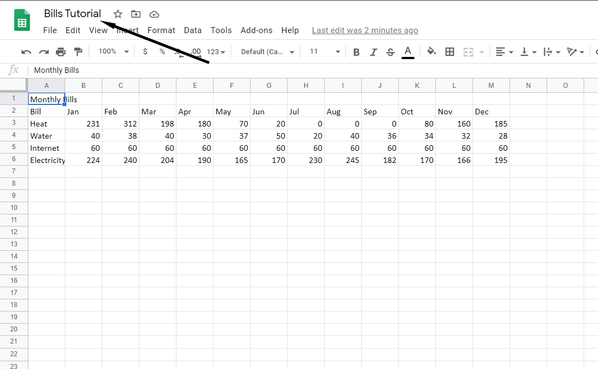

    There is a title in cell A1, a set of column headings that correspond to the months of the year, and the row titles which correspond to the individual bills that were paid. The actual tabular data are the dollar amounts paid each month to each utility.

1. The data is very raw. So let's start formatting it so that it looks a bit nicer. Select cells **A1:M1**. Then click the **Merge** tool, and then the **Center** the text with the **Alignment** tool.

    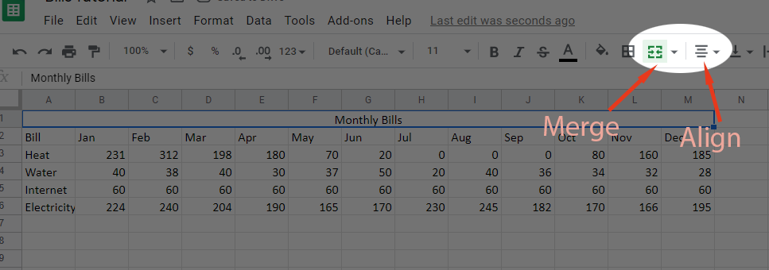

1. Sheets does not have text styles like Docs does, so any styling must be manually applied and then copied with the format painter to maintain consistency. So, with the title still selected, let's make it **bold** and then increase the size to **18 pt**.

    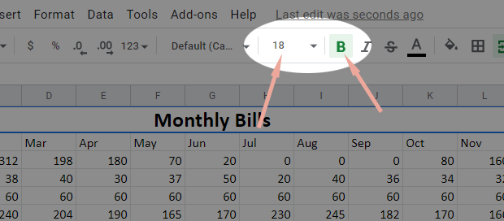

1. Now, to format the table itself, first, let's select the heading row, which is row 2. Then, make the text **bold** and **center** it:

    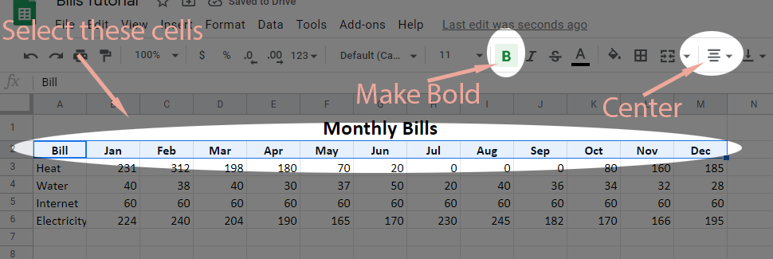

1. Next, let's add some nice styling to the table with banded rows. Select cells **A2:M6**:

    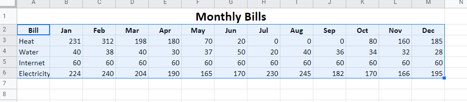

1. In the **Format** menu, select **Alternating Colors**:

    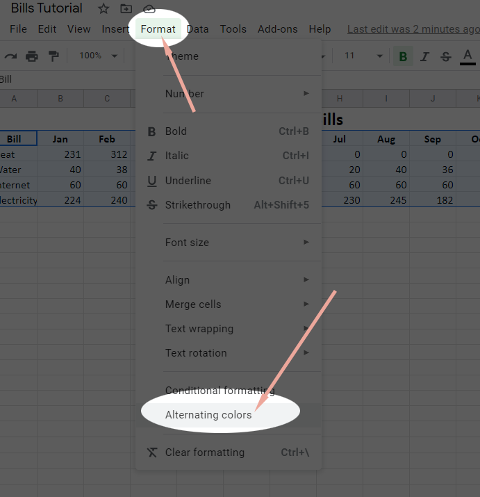

1. In the Alternating Colors sidebar, which pops up, you may select whichever color scheme you wish. Click **Done**.

    

1. Finally, you may notice now that the contrast is poor in the column headings. Selec the heading row (**Row 2**) again, and change the text color to **White**.

    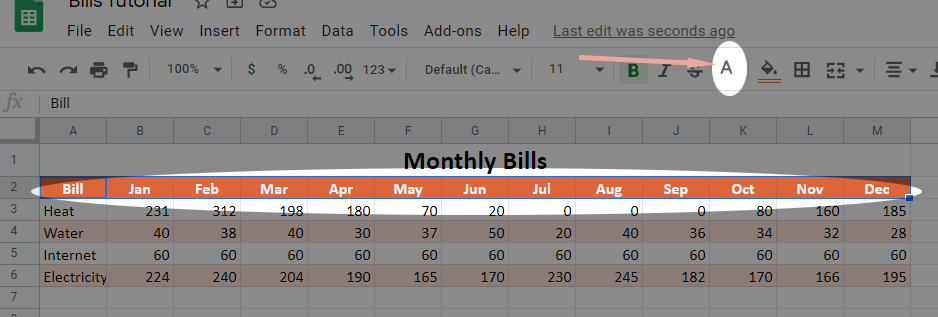

### Statistical Functions

Next, let's add some columns and a row to do some statistical calculations. We want totals, but we could also add **AVERAGE()**, **MIN()**, and **MAX()** functions. This will give us more data that we can include in our charts.

  | Function  | Purpose                                                    |
  | -         | -                                                          |
  | AVERAGE() | Adds all cells together and divides by the number of cells |
  | MAX()     | Finds the highest number in a range of cells               |
  | MIN()     | Finds the lowest number in a range of cells                |

1. Select **Cell N2**. Type the word **Total**. Then select **Cell A7** and type the word **Total**. Notice how the cell formatting automatically updates accordingly.

    

1. Now, select **Cell B7** and click on the **Functions** tool on the toolbar and select **SUM**.

    

1. Now, select the cells that we are summing, **B3:B6**. And press **Enter** to see the total.

    

1. Next, select **Cell B7** again, and click the **Fill Handle** and drag it to the right to fill in the bottom row of the table:

    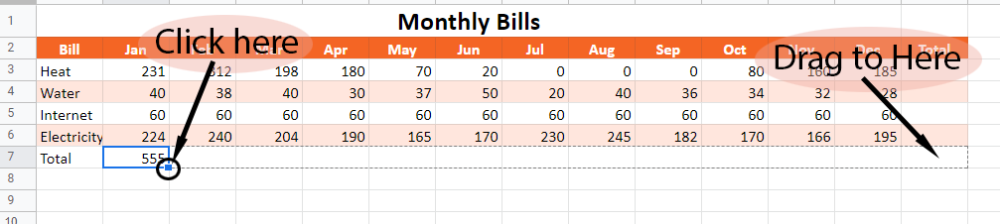

1. Follow a similar procedure to fill in the Total Column, **N**. Create a SUM() function in cell **N3**, select the numerical cells in that row, **B3:M3**

    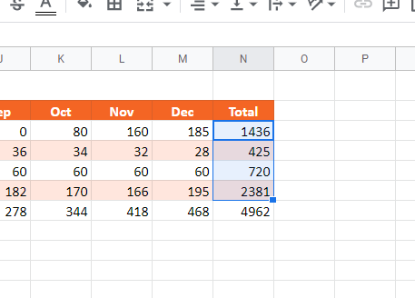

1. Let's add a few more columns and calculate those statistics. Add columns for Average, Min, and Max. You'll notice that it again automatically adds the correct formatting to those cells.

    

1. Let's just do the first cell of each column and then use the Fill Handle to complete the table. Select **Cell O3**, click the **Functions** tool and select **AVERAGE**.

    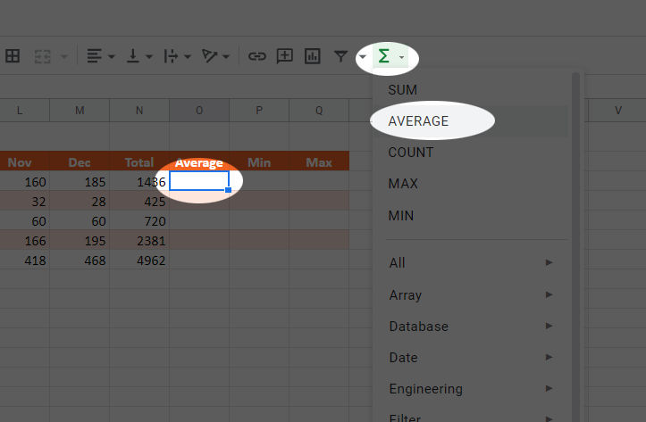

1. Now, click and drag to select **Cells B3:M3** to add them to the calculation. Press **Enter**.

    

1. Follow the same procedure for MIN() and MAX() in the other two columns. This is the result:

    

1. Select **Cells O3:Q3** and drag the Fill Handle Down to fill in the rest of the table.

    

    **See the video if you have any trouble with this step!**

1. Let's add one more column. Select **Cell R2** and type "Percent of Total". You may need to resize the column to fit the contents.

1. Select **Cell R3**. Enter **=**, click on cell **N3** (the total for the heating bill), press **/** for division, and click on cell **N7** (the total for all bills), finally press **F4** on your keyboard to conver the relative reference to **N7** to an absolute reference. The final formula looks like this: `=N3/$N$7`. 

    

1. Finally, drag the **Fill Handle** down to fill in the rest of the column. Then change the number format to **Percentage**

    

### A bar graph

Now, we want to make some charts. It would be useful to see how various
bills fluctuate throughout the year. So we'll want to build a basic bar
graph.

1. Select the cell range **A2:M7**. That is, grab all of the month data plus the total row, but not the total column:

    

1. In the **Insert** menu, select **Chart**. A chart will appear, but we need to make some changes to it.

    

1. In the **Chart Editor** dialog, do the following:
    * Set the Chart Type to **Combo Chart**

        

    * Set **Stacking** to **None** so that the bars won't stack on top of each other.

        

    * In the **Customize Tab**, find the **Series** menu and expand it by clicking on it. With the top box displaying **Apply to All Series** Change the **Type** to **Columns**.

        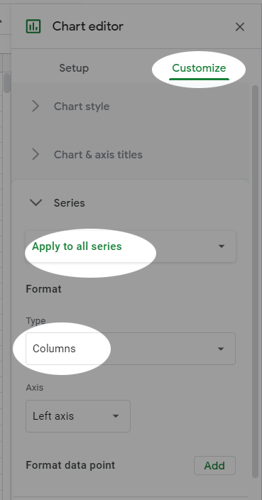

    * Now, change **Apply to All Series** to **Total**, so the next actions will only affect the **Totals** chart series. Change the **Type** to **Line** and the **Axis** to **Right Axis**. Observe the result.

        . We customized this layout by converting all of the series to columns and then change *just* the Total series to a line. Finally, since this series was suppressing all of the other data in the chart, we swapped its axis to the right axis so that the other data could display better. The result:

    

1. Finally, let's move the chart to its own sheet. With the chart selected, mouse over the top-right corner and then **Click** the ellipses and in the menu select **Move to own sheet**. Now the chart is on a new sheet and fills the entire sheet.

### A pie chart

Next, let's make a pie chart to visualize how the year end totals relate
to each other.

1. Return to the Bills sheet.

1. Follow this procedure *exactly*. Select the cell range **A3:A6**, the row headings for the four bills. Next, hold the **Ctrl** key while selecting the range **N3:N6**. This allows us to select both the names and the totals for each bill.

    

1. In the **Insert** menu, select **Chart** once again. This time, the automatically selected chart will, again, be a bar chart.

    

1. To fix this, simply change the **Chart type** to a **Pie** Chart.

    

1. Move the pie chart to its own sheet.

### Sparklines

Let's explore another data visualization tool. Sparklines are like charts, but they are contained in a single cell. If you've done this in Excel, it works a bit differently in Sheets. Let's see how it works.

1. Select column **O** by clicking on its header.
1. Right-click on the **O** column header and click **Insert 1 left**, which will insert a new column. Then do it again, so you have two new columns.

    

1. In **Cell P2**, enter "Year Trend" and in **Cell 02**, enter "Total Comparison".
1. Next, let's add the first Sparkline. In cell P3, type `=SPARKLINE(`

    

1. Now, use the mouse to select cells **B2:M2** and press **Enter**. Observe the result. You now have a trendline contained within a cell!

    

1. Select **Cell P2** and drag the Fill Handle down to fill in the column.

    

1. We're going to try something a bit more complex now. In **Cell O2**, you'll create a new Sparkline for a bar graph. This is a bit tricky, as it involves adding a number of options to your formula. For brevity, here is the full formula: `=SPARKLINE(N3, {"charttype","bar";"max",3000})` Let's break this up though. We know what a function looks like when it's used. We start with an **=** and then the name of the function. The Sparkline syntax looks like this: `=SPARKLINE(data, {options})`. So in this case, the data is a reference to the total cell. In the options, we are defining the chart type as "bar" and the maximum value as "3000". This means it will fill the cell with color proportional to the max value of 3000. If we drag the fill handle down, it will create a sort of small bar chart in the cells to the right of the totals column, to give the user a visual indicator of the proportional difference between the totals. Neat, huh?

    

This concludes the tutorial. Submit the file to the course portal as normal.
