--- 
title: 'Tutorial 3 - References: Absolute and Relative'
layout: page
parent: Chapter 5 - Spreadsheets
nav_order: 6
mathjax: true
---

TUTORIAL 3 - References: Absolute and Relative
==============================================

<iframe width="560" height="315" src="https://www.youtube.com/embed/e3G59v4J6eE" frameborder="0" allow="accelerometer; autoplay; clipboard-write; encrypted-media; gyroscope; picture-in-picture" allowfullscreen></iframe>

The **Fill Handle** is one of the most useful tools in any spreadsheet
app. It's purpose is to make copying and pasting more efficient. It can copy series, patterns, and formulas with intuitive ease.

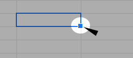

For example, if you open a blank spreadsheet and put a **1** into any cell and then drag
the fill handle down, it will fill in the cells below it with 1s.

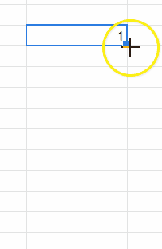

Now, try this, put a **1** in a cell and then a **2** in the cell
directly beneath it. Now, drag the fill handle down and observe the
result.

The numbers automatically increment, counting by ones. In fact, you can
do this all sorts of ways. Simply establish a pattern with the first two
cells, and the fill handle will fill in the rest of the cells with
numbers that obey this pattern. In this manner, you can count by 1s, 5s,
10s, or any other increment. It's a powerful feature with lots of other
effects.

You can also use it to increment units of time, days of the week, or
months of the year. For example, put the word **Sunday** into a cell and
drag the fill handle down and it will fill in with the days of the week.
Same with Months of the year and also the three-letter abbreviations of
the days and months:

References and the Fill Handle
------------------------------

You have already seen this in action. When you make a total column or
row and use the fill handle to fill it in, Sheets automatically adds the
correct cells together. However, let's look at this at a slightly more
abstract level for a moment so that we can see what's going on.

You're not going to turn this in, but please do follow along in this demonstration so you can get a feel for it.

1. Open a blank workbook and enter a series of numbers in the first column. Whatever numbers you like. Like this:

    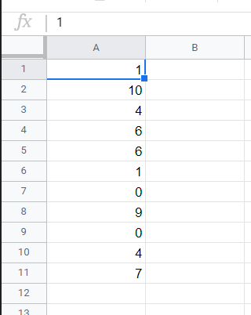{: width="50%"}

1. Now, in cell **B1**, enter the formula `=A1`. In this case, the result should be same as cell **A1**. Now, if you drag the fill handle downward, it should fill in the rest of the column with formulas that reference the corresponding cell in the first column.

    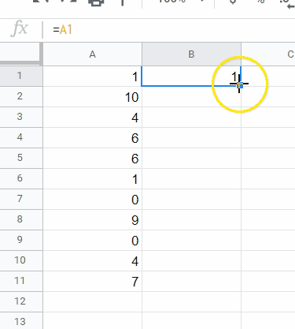{: width="50%"}

1. If you press **Ctrl-\~**, Sheets will switch to formula view, so you can see the actual contents of each cell. Observe the formulas that have been input in each cell. 

    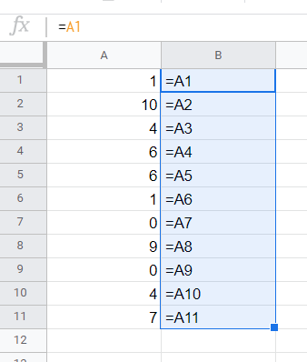

    They are `=A2`, `=A3`, `=A4`, and so on. Each formula had the row number of the coordinate in its reference incremented by one. That is, it had 1 added. This makes sense since each time you dragged the fill handle down by one row, it should be referencing the same column, but the new row.

The same works with columns, by the way. You can conduct the same test
horizontally as well and it will increment the column letter while
leaving the row number intact.

This is the default behavior when using the fill handle or copying and
pasting from one cell to another. However, this is not always the way we
want things to work.

Absolute References and the Fill Handle
---------------------------------------

Another way to work with references is to make them absolute. You see,
when we drag the fill handle on a normal cell reference, it increments
it *relative* to the cell that you started with. So, if I'm
referencing the cell to the left and drag it down, each cell below will
reference the cell to the left. In order to make a cell reference
absolute, we need to add a little syntax to it. Take the previous
example. 

1. Clear out the second column and once again, enter the formula `=A1` into cell **B1**.

    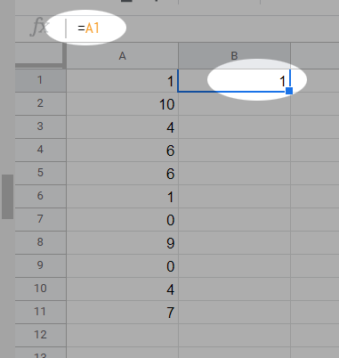{: width="75%"}

1. Now, in the **formula bar**, change the formula by inserting dollar signs (`$`) before the two coordinates so that it reads `=$A$1`, like so:

    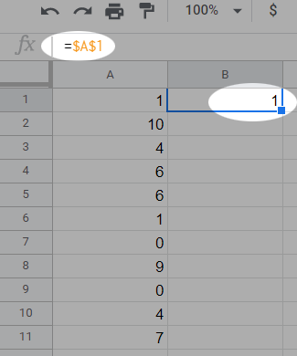{: width="75%"}

1. What happened? The value didn't change at all, but it looks like no other cell reference that we've used. Now, try dragging the fill handle down and see what happens. Verify that the formula in each cell now is exactly the same, `=$A$1`.

    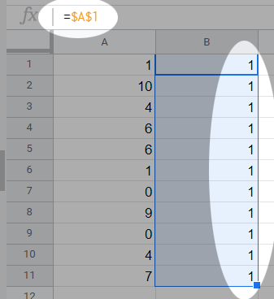{: width="75%"}

Absolute references do not increment at all. They are *absolute*. We can
use this information to do some interesting things. Think of it like the
dollar signs locking in the individual coordinates.

TUTORIAL
--------

### Payroll

There are two sheets in the start file. In the first part, we will fill
in a payroll report which will require us to use absolute references to
calculate taxes. We did something similar in the first tutorial.

In the second sheet, we will do something that we did a long time ago in grade school. We will build a times table which would normally be very tedious, but as you'll see, we'll use mixed absolute and relative references to speed this process up significantly.

1.  Copy the [start file](https://bit.ly/3kld1SI) to your Google Drive.

2.  When the file first opens, you should be in the first sheet, the payroll sheet. All of the data is already here for you, so all you need to do is fill in all of the blanks. Let's just fill in the first row, though.

3.  Select cell **D3**. This cell should contain the value for Frank's gross pay. Think about how we calculate gross pay. It's derived by multiplying the number of hours you work by your rate of pay. In this case, you will enter the formula `=B3*C3`. Remember, you can get the cell references by simply clicking on the cells rather than typing in their coordinates.

    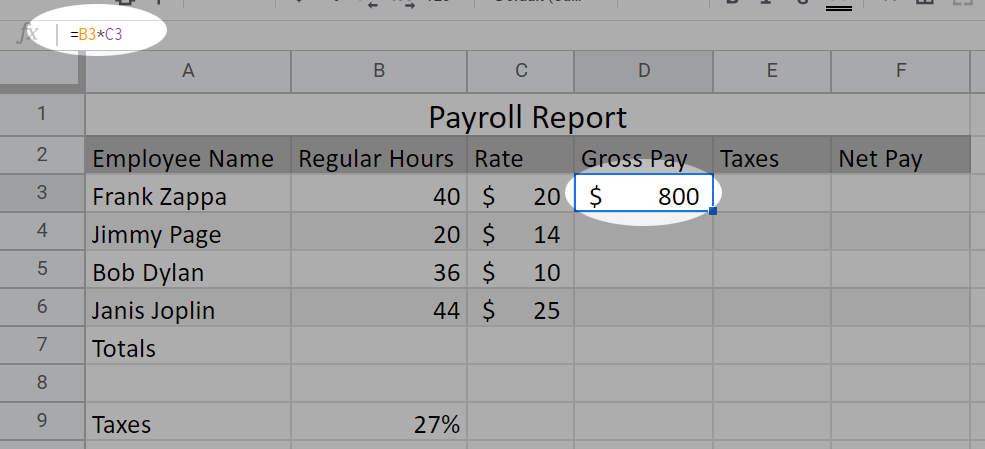{: width="75%"}

4.  Select cell **E3**. To calculate the taxes that would be taken out
    of Frank's paycheck, we need to use the tax rate (this is highly
    simplified flat tax situation and in no way represents reality!) of 27%. We simply multiply the tax
    rate by the gross pay. Thus, we get the formula `=D3*B9`.

    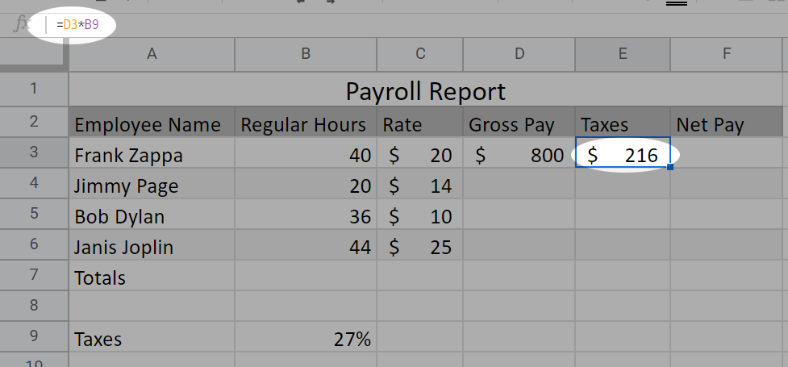{: width="75%"}

5.  Finally, select cell **F3**. To calculate the net pay or "take-home"
    pay, you simply subtract the taxes from the gross pay. So, the
    formula is `=D3-E3`.

    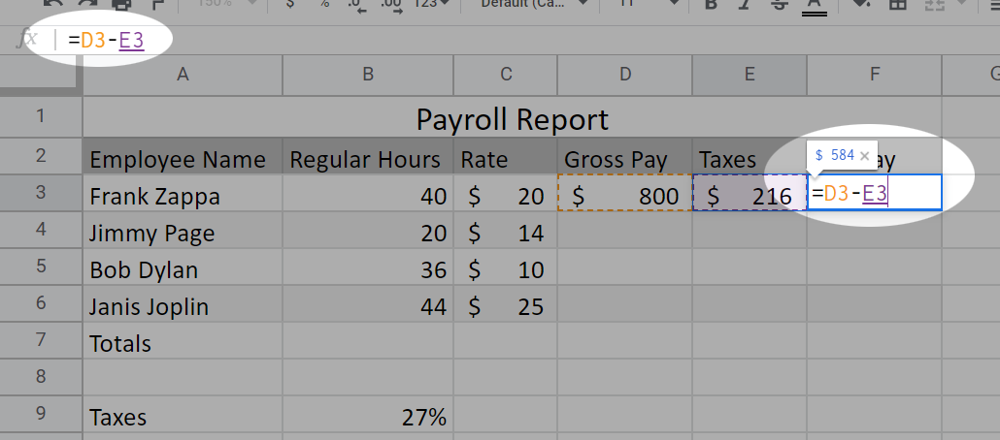{: width="75%"}

6.  Now, to fill in the rest of the table. Select the first row of your
    calculations, the cell range **D3:F3**.
7.  Drag the **fill handle** down to complete the table. And that's it! Except something has gone wrong:

    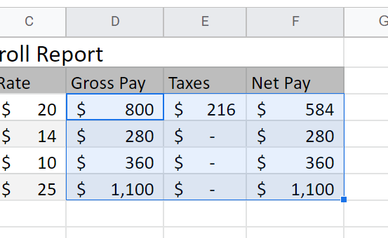{: width="75%"}
   
    Apparently, three of our employees do not pay taxes!

8.  To fix this, we must use an absolute reference to the tax rate cell.
    Select cell **E3**. Convert the reference to cell **B9** to an
    absolute reference by inserting dollar signs (\$) before the *B* and
    the *9*. A shortcut to do this is move the insertion point to the cell reference and press the **F4** key.  The formula should now read `=D3*$B$9`.

    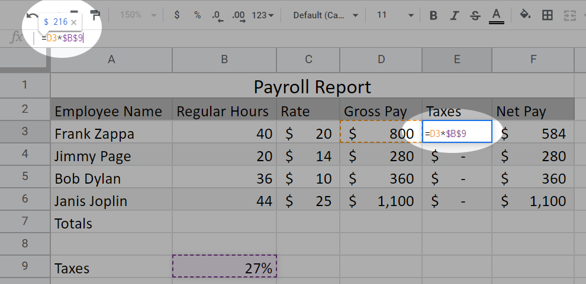{: width="75%"}

9.  Once again, select cell **E3**, drag the fill handle down, and fill
    in the rest of the column. The table should now read correctly and
    all values will be accurate. Observe carefully in the cells in
    column E the formulas will increment the relative reference, but not
    the absolute reference.

    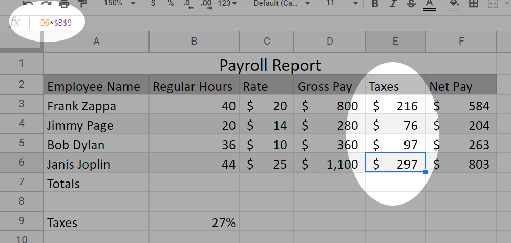{: width="75%"}

10. Next, let's fill in the totals row. Select cells **B3:B6**. In the **Functions** menu, select **SUM**. Press Enter. The sum will be deposited in cell **B7**, right where we want it.

    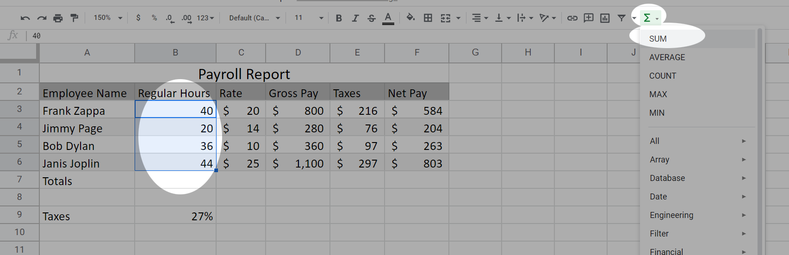{: width="75%"}

1. Finally, drag the fill handle across to fill in the bottom row. And while you're at it, make sure that the appropriate cells in the totals row have the accounting format.

    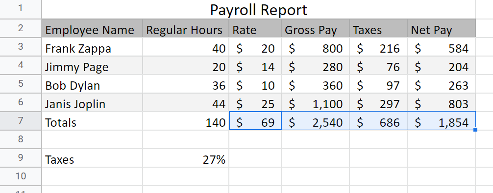{: width="75%"}

That's the Payroll sheet done and sorted. Let's move on to something a little more abstract, but also interesting.

Times Table
-----------

So the first sheet is about filling in a payroll form and that's pretty
neat. On the next sheet of this workbook, you might be surprised to
discover that it is, in fact, blank. We're going to build a times table
from scratch here. But we're going to do it Sheets-style using a mixture
of absolute and relative references. Specifically, we're going to see
what happens when we employ what are called **Mixed References**. That
is, references that lock in one or the other coordinate. For example,
`A5` is a relative reference, `$A$5` is an absolute reference.

There are two ways to make **Mixed References** as well: `$A5` and `A$5`. There
are a few places where this is a very useful tool and this times table
is our first attempt at this. Follow along.

1.  Select the **Times Table** sheet by clicking on its tab at the bottom of the Sheets window.
2.  Select cell **A1** and type "X" for times table.
3.  Select cell **B1** and type a *1*, then in cell **C1** enter a *2*.
4.  Now, select both cells **B1** and **C1**, and drag the fill handle
    to the right to cell **K1**.

    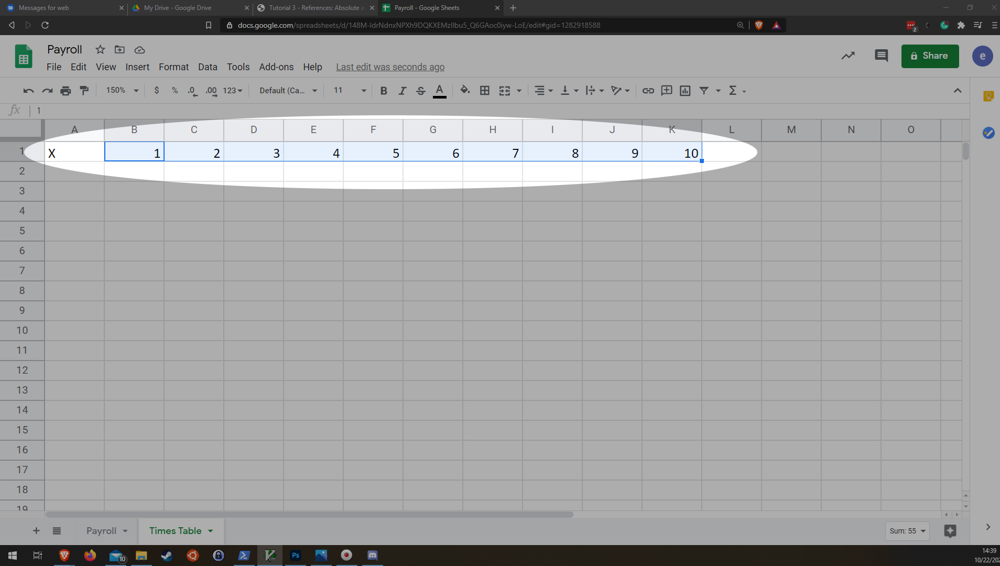{: width="75%"}

5.  Follow the same steps to create a column of numbers from 1 to 10 in
    column **A**, so that it looks like this:

    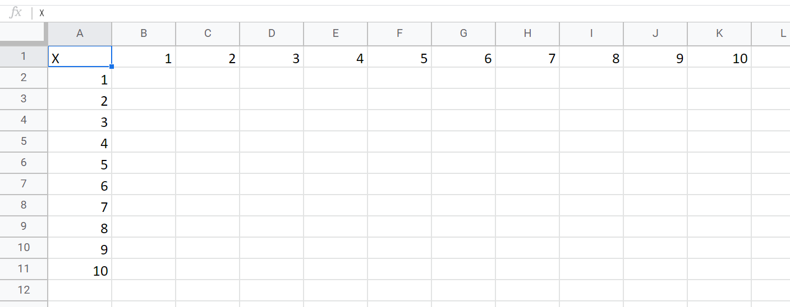{: width="75%"}

6.  Style your new header row and column up however you like. Just do
    something to make them stand out a bit. I decided to use a dark background with white, bold text in these cells. I also cleaned up the column widths, so things look a bit nicer.

    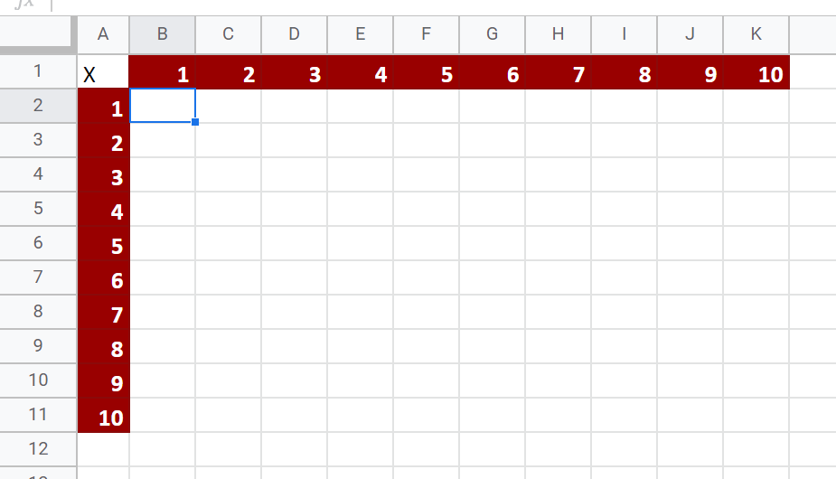{: width="75%"}

7.  Now, think about how a times table works. What goes in cell **B2**? It should be the product of the numbers in cells **B1** and **A2**, right? So enter the formula: `=B1*A2`. The result is 1.

    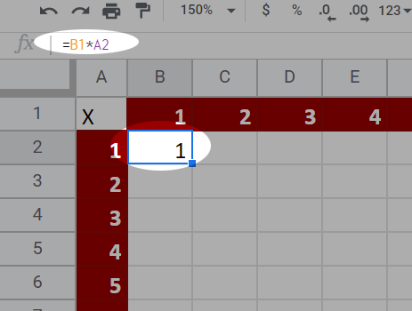{: width="75%"}

8.  Next, ensure that cell **B2** is selected and drag the fill handle to the right to fill in the first row of the times table. I think you'll notice immediately that something isn't right:

    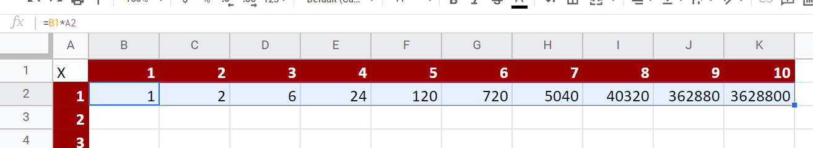{: width="75%"}

9.  Let's investigate the error. Our first clue is in the formula box.
    Since we know that $1 \times 10$ should equal 10 and *not* 3,628,800.
    Since we used relative references, it incremented the coordinates
    for each cell that you dragged. Instead of multiplying the top row
    by the left column, it multiplied the cell above by the cell to the
    left. **Double-click** cell **K2** to see what I mean:

    {: width="75%"}

Okay, so what went wrong? We're multiplying the wrong cells together.
The problem will only get worse if we use the fill handle to fill in the
entire table. The numbers will get so large that they will overflow
Sheets's ability to represent a number. So how about we use an *absolute
reference*? Well, that doesn't work either since the cells don't
increment *at all*. If you filled in the table, then every cell would
just be multiplying B1 by A2 and every cell would just contain a 1. So
is there some way that we can build this table without having to
manually enter each cell? Yes! We will use what are called **Mixed
References**.

First we have to start thinking about the dollar signs (\$) in our
absolute reference syntax as locking in their corresponding coordinates.
We just need to lock in the right coordinates on each of our operands in
the first cell and we can just fill-handle the whole table.

1.  First, let's delete everything from the table except the contents of cell **B2**.

    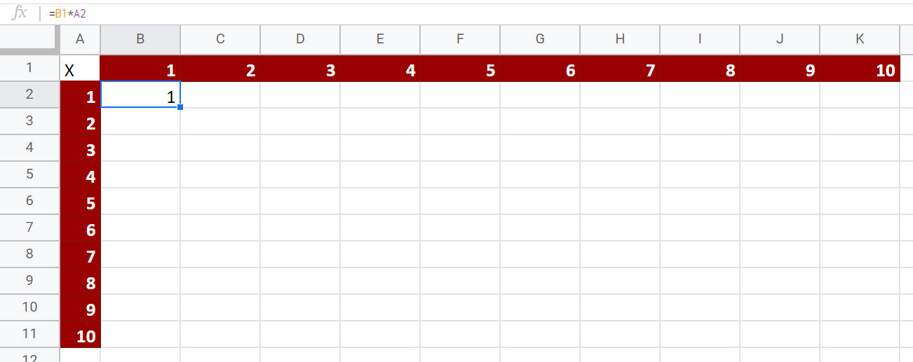{: width="75%"}

2.  Now, let's look closely at the formula in the cell. `=B1*A2`. In every cell in this entire table, we will be multiplying a number from Row **1** by a number from column **A**. So those coordinates in this formula need to stay the same, right? Let's lock them in with dollar signs. The formula becomes `=B$1*$A2`.

3.  Look very carefully at what's different here. We're locking in the **1** from the first operand and the **A** from the second operand.

    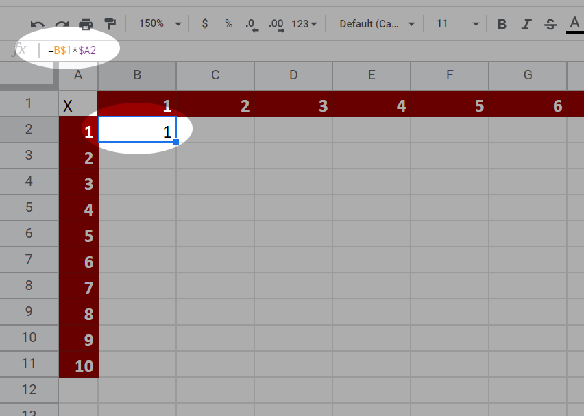{: width="75%"}

4.  Last step: Make sure that **B2** is selected and then **drag** the
    **fill handle** to the right. And then **drag** it down. And voila.
    The entire table is completed in a matter of seconds

    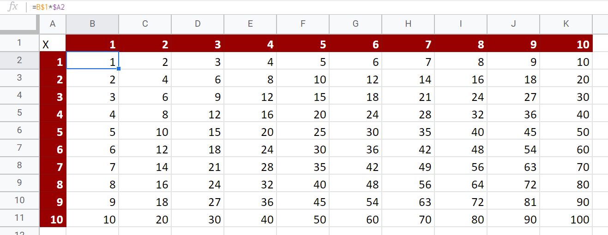{: width="75%"}

And that's it. Submit a link to your file as normal. And try to think of other ways
in which you can use mixed references like this.
