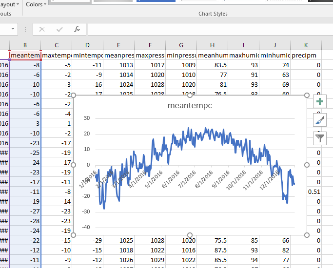

--- 
title: 'Project - Charting the Weather'
layout: page
parent: Chapter 5 - Spreadsheets
nav_order: 11
---

PROJECT - Charting the Weather
==============================

<iframe width="560" height="315" src="https://www.youtube.com/embed/j1U9SkPdtFU" frameborder="0" allow="accelerometer; autoplay; clipboard-write; encrypted-media; gyroscope; picture-in-picture" allowfullscreen></iframe>

In this project, you will look at a large data set, 366 rows of data.
These are daily weather data from the weather station near Bemidji, MN.
One daily summary for each day of the year (why are there 366? I'll let
you figure it out).

Your job is to take the raw data and build some charts with it.

Directions
----------

1.  Open the [start file](https://bit.ly/3lAYKlF) in Sheets. It will automatically create a copy of the file for you.
3.  To create the first chart, select the first two columns of data, that is Columns **A** and **B**, the date column and the mean temperature column.
4.  Click the **Insert Chart** tool and it will create a line chart showing the mean temperature over the course of the year. It should look like this:

    {: width="75%"}

5.  Create another sheet and name it *Charts*.
1. Copy and paste the chart over to the new sheet and then delete it from the main sheet. For the rest of the project, you will copy all of your charts to that sheet.

Requirements
------------

**You will build 5 charts:**

1.  A line chart showing just the mean temperature throughout the year
    (already demonstrated)
2.  A line chart showing the mean, min, and max temperature throughout
    the year
3.  A column chart showing precipitation throughout the year
4.  A line chart that compares mean temp and mean humidity throughout
    the year
5.  A combo chart showing mean pressure as a line and precipitation as
    columns

**Extra Credit Charts:**

1.  See if you can find a way to build a chart that shows the cumulative
    precipitation throughout the year. That is, it should keep going up.
2.  Try to build a pie chart that shows percentage of precipitation by
    month.

