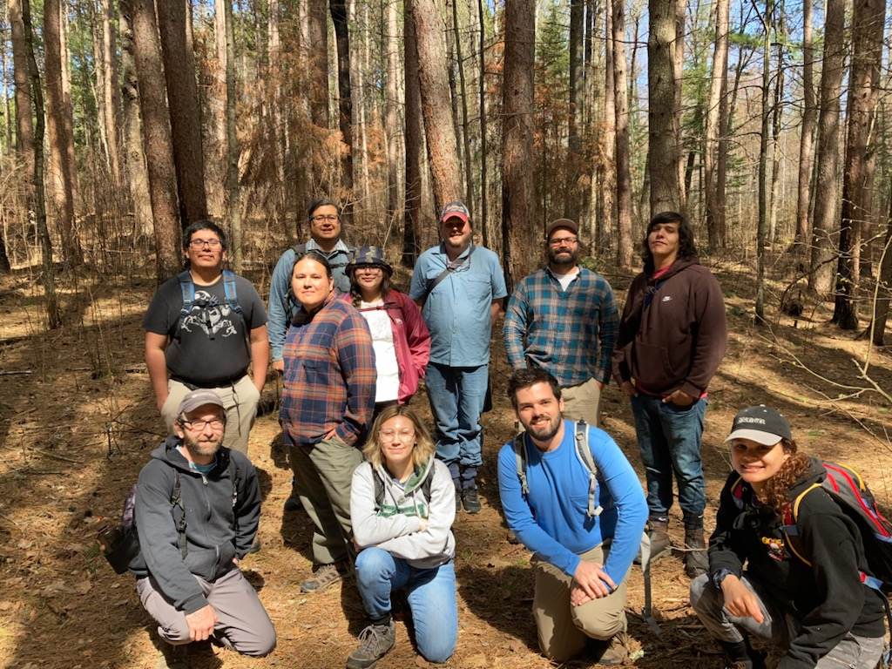

--- 
title: 'Project - The Environment'
layout: page
parent: Chapter 5 - Spreadsheets
nav_order: 17
---

Project - The Environment
=========================

For the last few years, LLTC has been conducting an environmental monitoring project to assess the effectiveness of fire in managing the forests of the area. This is a technique for forest management that has been used for thousands of years in North America, but for a while now, there have governments pushing to prevent fires of all kinds and this has disrupted the natural life cycle of the forest. By bringing back fire, we hope to help the forest to repopulate with trees that need fire and create better conditions for other wild food sources, such as blueberries.

|  |  |

And this brings us to our final data set for our charting story projects. Our interns use a sensor package called Hobo to monitor several conditions at each site. These include the temperature, humidity, soil temperature and moisture at several depths, solar radiation, and a few other things.

[Sensor Data](res/projects/hobo1.csv)

These data are from November 2021 through March 2022. The labels might be difficult to understand so, these are the fields in the data:

* Date and Time
* Air Temperature
* Humidity
* Soil Temp (depth 1)
* Soil Temp (depth 2)
* Soil Moisture (depth 1)
* Soil Moisture (depth 2)
* Soil Moisture (depth 3)
* Soil Moisture (depth 4)
* Solar Radiation
* Soil Temp (depth 3)
* Soil Temp (depth 4)
* Battery voltage

There are five temperature sensors, one for air temp and four for soil temperature. There are four water content sensors at four different depths. Normally, I'd let you know exactly which sensor is which, but once you chart it all out, it will be fairly obvious which sensor is which.

For this project, I'd like to see five charts and five stories about this data. Don't forget, when you download the csv file to save it as an Excel file.

If you are having trouble, let me know!
