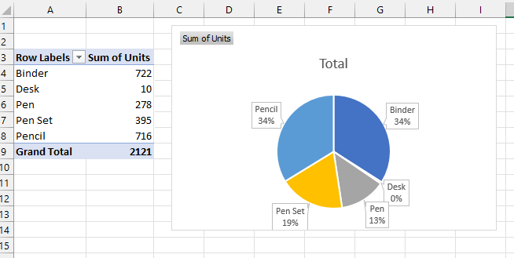

--- 
title: 'Project - Pencils and Pivot Tables'
layout: page
parent: Chapter 5 - Spreadsheets
nav_order: 14
---

Project 6 - Pencils and Pivot Tables
====================================

Here's the [Start File](res/pivot_project_data.csv). **Note:** It's a .csv file, so you *will* have to remember to save it as an Excel file. Click **File**, then **Save as**, and then click **Browse**, and make sure that the file type is **Excel Workbook**.

This project is straightforward. It's a practice with pivot tables. If you don't remember how to make or manipulate a pivot table, check the [Tutorial 6](6_tutorial_tables_pivot.html).

Inside the spreadsheet, you will find a set of sales data. You'll want to format the data so that it is more readable. The fields in the table are as follows:

* OrderDate
* Region
* Rep
* Item
* Units
* Unit Cost
* Total

Note that the total column is not filled in with values. You will have to use an appropriate formula to fill in this column before you will be able to complete the pivot tables. Here are your tasks:

1. Format the table with alternating colors.
1. Fill in the Total column with appropriate formulas. Think about how the total would be calculated (what operation needs to be performed). Use the fill handle to make your job easier.
1. Create a pivot table with the following layout:
    * Regions as columns
    * Rep as rows
    * Total as values
1. Create an appropriate chart with this pivot table.

    

1. Create another pivot tables with the following layout:
    * Item as rows
    * Units as values
1. Create an appropriate chart with this pivot table

    

1. **Challenge:** Create a third pivot table and accompanying chart of your choice. Try to make it meaningful to the data.

Submit this file to Canvas as normal.
