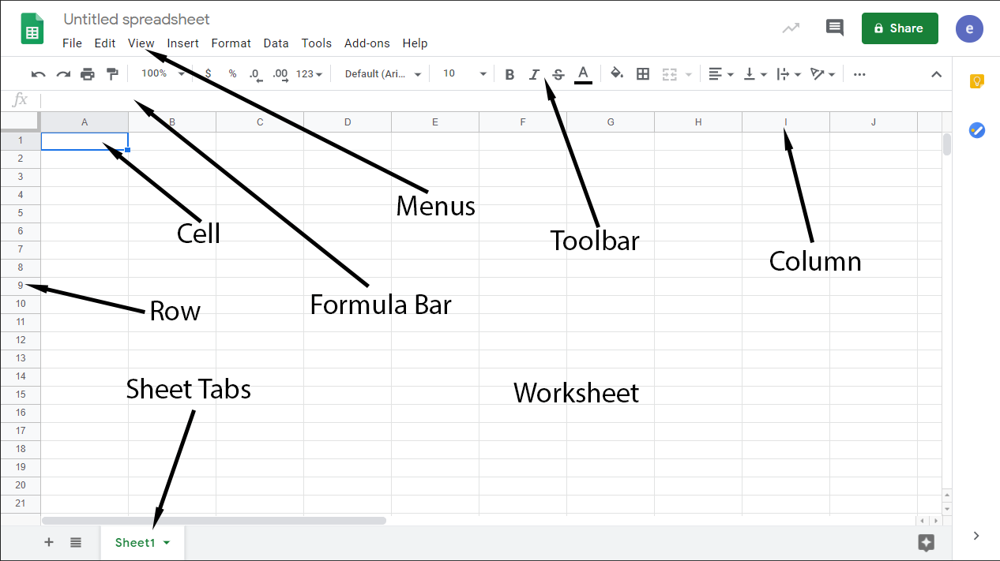

Sheets Tour
===========

<iframe width="560" height="315" src="https://www.youtube.com/embed/uuL1PVY7txY" frameborder="0" allow="accelerometer; autoplay; clipboard-write; encrypted-media; gyroscope; picture-in-picture" allowfullscreen></iframe>

{: width="20%"}

Google Sheets is a spreadsheet processing application that makes it
possible to create, view, edit, and process raw data to create useful,
professional, and interesting tables, charts, and diagrams.

Spreadsheets have a long history. Indeed, the spreadsheet is one of the
first software paradigms developed for computers. They are based on a
very old tradition of compiling data into tables so that they can be
more easily referenced. The problem is, doing it by hand is tedious and
error-prone. Computers are _much_ better at doing calculations than we
are. So let's take a look around.

Sheets at a Glance
-----------------

Menus
: As usual, Sheets has the same drop-down style menus as the other G Suite Apps. Most of the tools are stashed away in one of these menus. Tools for manipulating data, adding formulas, inserting graphics, and building charts.

Worksheet
:   A worksheet is one spreadsheet. Each file can be comprised of one
    or more worksheets. An entire file is called a Workbook. Typically,
    each sheet is devoted to one set of data, that is one or more
    related tables, charts, and other graphics. Knowing when you need to
    create a new sheet to accomodate another data set is more art than
    science, but you'll get a feel for it soon enough.

Sheet Tabs
:   At the bottom of the interface are the tabs that allow you to switch
    between sheets. The button that looks like a plus creates new sheets
    and you can rename a sheet by double-clicking on its tab. You can find other tools for changing sheet properties by clicking or tapping on the little down arrow on the tab.

Cell
:   The cell is the basic unit of a spreadsheet. Each cell can contain
    one piece of data which can be strings of text, numbers, dates, and
    even tiny charts. Each cell has an address denoted by the row and
    column where it's located. The currently selected cell is always
    highlighted by a (usually green) box. One or more cells can be
    selected at a time. Go ahead and try selecting a different cell or
    clicking and dragging to select a range of cells.

Rows and Columns
:   The horizontal rows are labeled with numbers and the vertical
    columns are labled with letters. Each cell is in a row and a column.
    Combining a row and a column creates the call's name, for example
    "A1". A spreadsheet has an upper limit of about 18,000 
    columns and 40,000 rows (Excel actually supports up to a million rows). Rows and columns can be resized
    to accomodate larger fonts or larger pieces of data by clicking and
    dragging between the column or row headings.

Formula Bar
:   When you select a cell and type some data into it, that data appears
    inside the cell. This data will also appear in the formula bar. You
    can also use the formula bar to edit the contents of a cell. What's
    more, when you type a formula (that is, when you instruct Sheets to
    do some math in a cell), the result appears in the cell, but the raw
    formula will still appear in the formula bar.

This is a lot to take in. But the tutorials that follow will help to
ease you into easily one of the most useful pieces of software that you
will ever use. With a good spreadsheet app, you can build a basic household budget,
analyze scientific data, or build reports for work. Not everyone will
find a place for spreadsheets in their lives and careers, but it's always
better to learn the basics so that in case you _do_ need it later,
you'll have it.

Let's start with some theory.
