--- 
title: 'Tutorial 4 - Functions and Basic Charts'
layout: page
parent: Chapter 5 - Spreadsheets
nav_order: 7
---

TUTORIAL 4 - Functions and Basic Charts
=======================================

It's now time to look at how we can visualize data. Let's create some
charts!

For this tutorial, we'll look at some basic charting as well as some
more statistical functions.

Charts
------

First, though, we should think about charts and what they're for. Charts
and graphs are for visualizing data, but it can often be tricky to
decide just what kind of chart to use. So how do we decide? Here's a
basic rundown, then we'll look at a couple of examples:

 | Chart Type   | When to use it                                                                                                                                           |
 | -            | -                                                                                                                                                        |
 | Line Graph   | Line graphs are used to track changes over time. So if there's a time dimension, use a line graph                                                        |
 | Pie Chart    | Use a pie chart to compare parts of a whole. Like a pie!                                                                                                 |
 | Bar Graph    | Like a line graph, used to compare changes over time, but usually best for large changes. Can also be used to to compare things between different groups |
 | Scatter Plot | If you have two variables that relate to each other, you can set one to the X axis and one to the Y axis. It shows the relationship between two things   |

What does each one look like?

### Line Graph

A line graphs are really great for showing changes over time. A very
common example would be to show stock prices changes over time. For a
fun contemporary look at a line graph, here's the price of BitCoins since about 2010.

As you can see, it gives a fantastic visualization of the change in
price over the last year for the most famous crypto-currency. By the
way, if you're curious, you can get a good overview of Bitcoin on
[wikipedia](https://en.wikipedia.org/wiki/Bitcoin). If you're really
interested, the original [whitepaper](https://bitcoin.org/bitcoin.pdf)
for Bitcoin is only 8 pages long and is a pretty interesting read as
well.

### Pie Chart

A pie chart is great to compare parts of a whole. A particularly
infamous example would the United States budget. Here's a comparison of
US spending vs US revenue in two pie charts:

### Bar Graph

Bar graphs are great for comparing different groups of things. For
instance, this chart shows the what percent of US households earn what
amount of money in \$5000 increments. Except for the last couple of
bars, which are clearly labeled. The purpose of the chart is to show
income inequality in the United States and illustrates the point quite
nicely. Though, of course, it only tells part of the story. The whole
story is, perhaps, somewhat bleaker even than this. But that's beyond
the scope of this tutorial.

### Scatter Plot

Scatter plots allow you to examine potential correlations between two
variables. Sometimes there's a correlation and sometimes there isn't.
Here's an example:

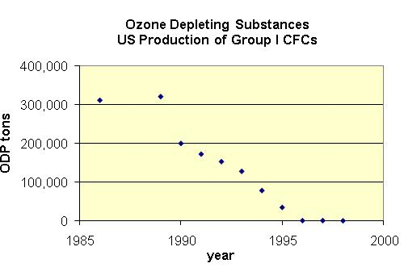

This scatter plot correlates ozone-depleting chemicals with time,
showing a promising trend after the ban of CFCs.

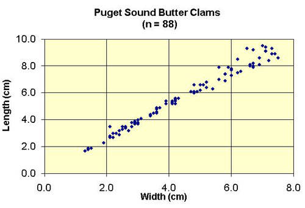

This scatter plot shows the correlation between the length and width of
a particular species of clam. This one is interesting in that it shows
what's called a linear correlation. That is, you could easily draw a
straight line through the points that would be very close to all of
them.

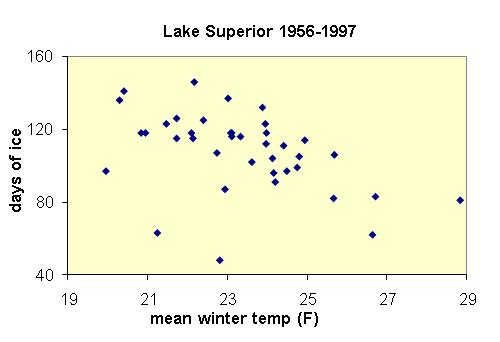

This plot shows the relationship between days of ice on Lake Superior
and the mean winter temperature. This one is not so easy to draw a line
through, but a weak correlation can be seen where the more days of ice
on the lake *tend* to mean that the winter is colder. Or vice versa.

#### Spurious Correlations

Some scatter plots contain spurious correlations however. That is, they
look like they show a real correlation, but there is no way the
correlation can possibly be causal. For some entertaining spurious
scatter plots, check out [this
website](http://www.tylervigen.com/spurious-correlations).

TUTORIAL
--------

We'll take a look at the yearly bills for a fictitious household

1. First copy the [start file](https://bit.ly/3hHPklB) to your Google Drive. Rename it "Bills Tutorial". Now, take a look around to get a feel for what's here.

    

    There is a title in cell A1, a set of column headings that correspond to the months of the year, and the row titles which correspond to the individual bills that were paid. The actual tabular data are the dollar amounts paid each month to each utility.

1. The data is very raw. So let's start formatting it so that it looks a bit nicer. Select cells **A1:M1**. Then click the **Merge** tool, and then the **Center** the text with the **Alignment** tool.

    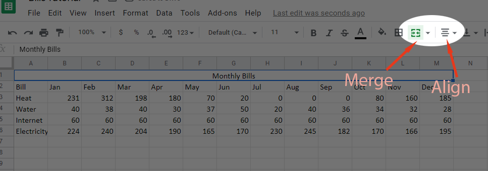

1. Sheets does not have text styles like Docs does, so any styling must be manually applied and then copied with the format painter to maintain consistency. So, with the title still selected, let's make it **bold** and then increase the size to **18 pt**.

    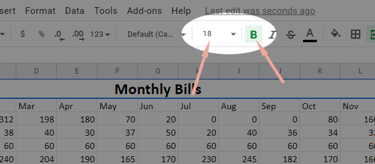

1. Now, to format the table itself, first, let's select the heading row, which is row 2. Then, make the text **bold** and **center** it:

    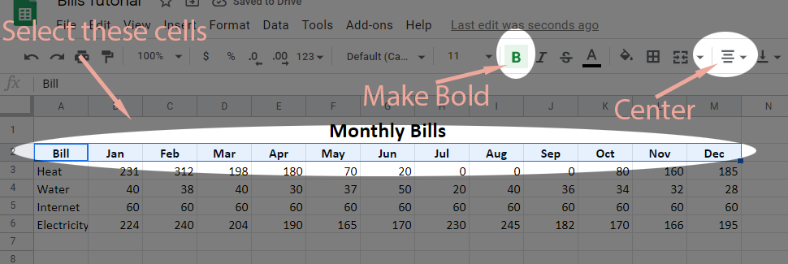

1. Next, let's add some nice styling to the table with banded rows. Select cells **A2:M6**:

    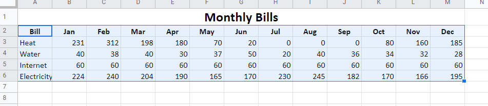

1. In the **Format** menu, select **Alternating Colors**:

    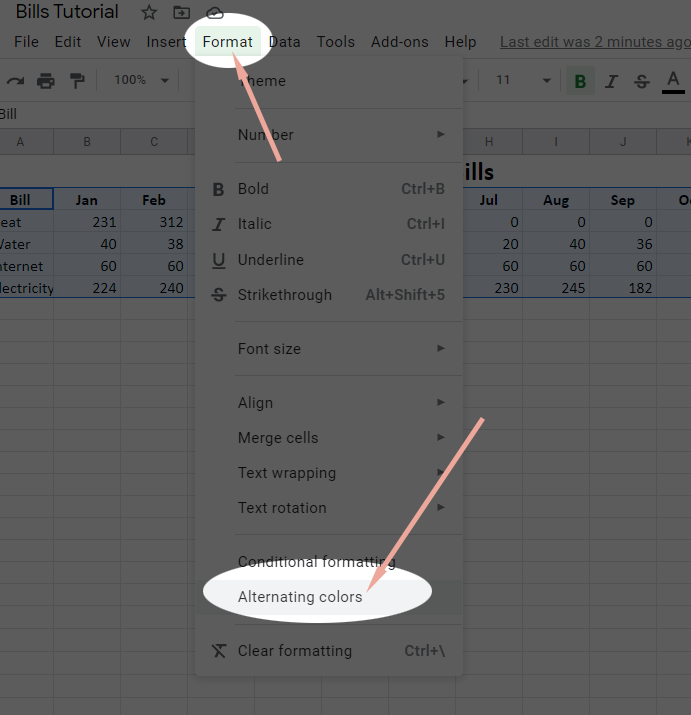

1. In the Alternating Colors sidebar, which pops up, you may select whichever color scheme you wish. Click **Done**.

    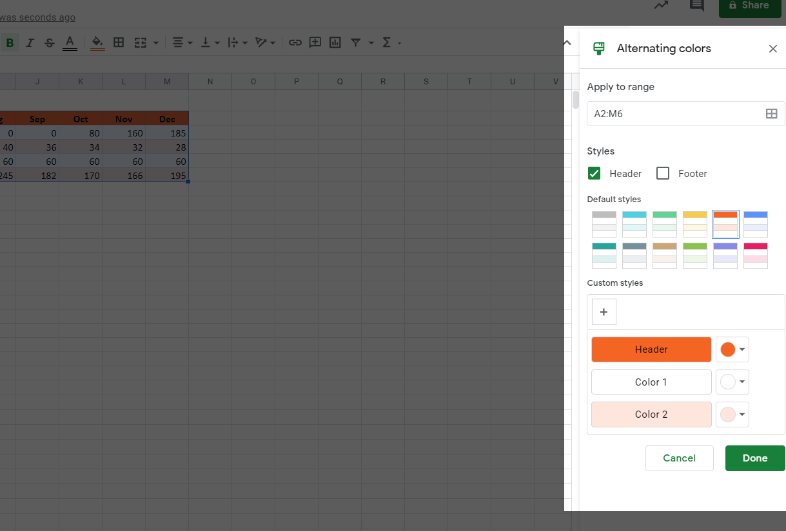

1. Finally, you may notice now that the contrast is poor in the column headings. Selec the heading row (**Row 2**) again, and change the text color to **White**.

    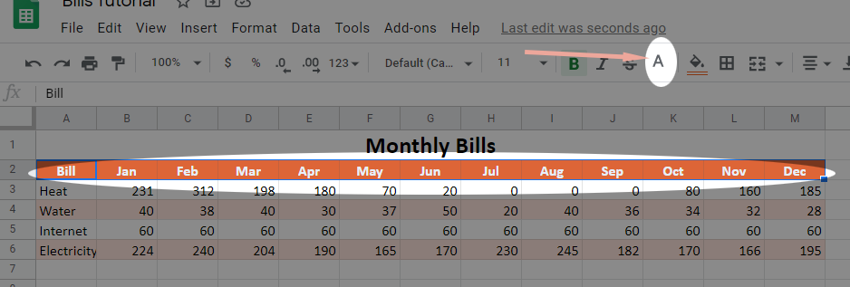

### Statistical Functions

Next, let's add some columns and a row to do some statistical calculations. We want totals, but we could also add **AVERAGE()**, **MIN()**, and **MAX()** functions. This will give us more data that we can include in our charts.

  | Function  | Purpose                                                    |
  | -         | -                                                          |
  | AVERAGE() | Adds all cells together and divides by the number of cells |
  | MAX()     | Finds the highest number in a range of cells               |
  | MIN()     | Finds the lowest number in a range of cells                |

1. Select **Cell N2**. Type the word **Total**. Then select **Cell A7** and type the word **Total**. Notice how the cell formatting automatically updates accordingly.

    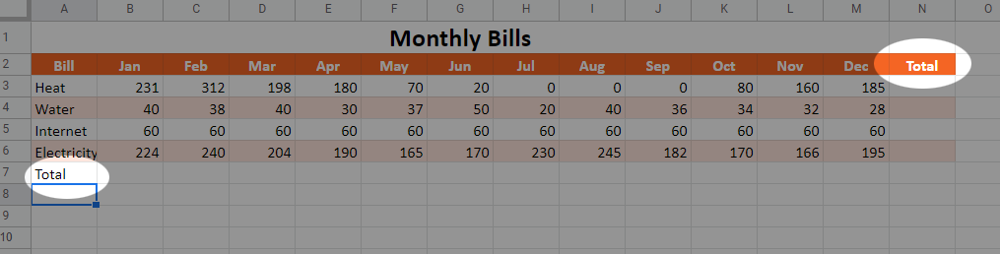

1. Now, select **Cell B7** and click on the **Functions** tool on the toolbar and select **SUM**.

    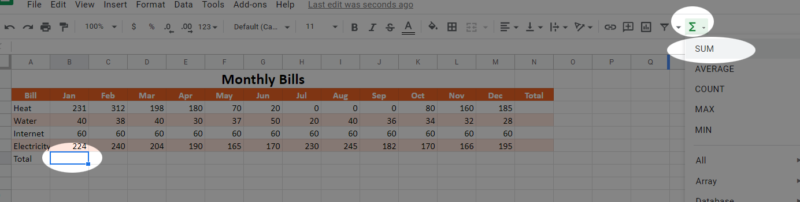

1. Now, select the cells that we are summing, **B3:B6**. And press **Enter** to see the total.

    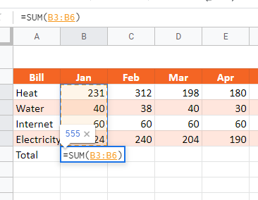

1. Next, select **Cell B7** again, and click the **Fill Handle** and drag it to the right to fill in the bottom row of the table:

    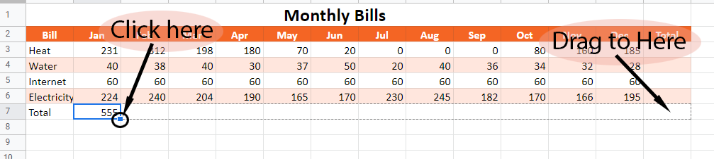

1. Follow a similar procedure to fill in the Total Column, **N**. Create a SUM() function in cell **N3**, select the numerical cells in that row, **B3:M3**

    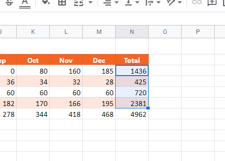

1. Let's add a few more columns and calculate those statistics. Add columns for Average, Min, and Max. You'll notice that it again automatically adds the correct formatting to those cells.

    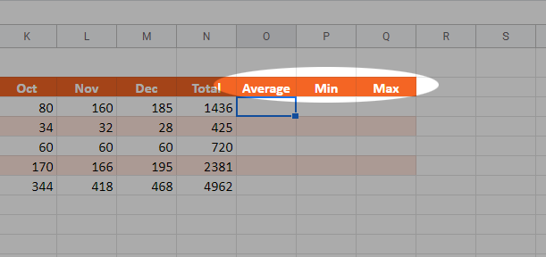

1. Let's just do the first cell of each column and then use the Fill Handle to complete the table. Select **Cell O3**, click the **Functions** tool and select **AVERAGE**.

    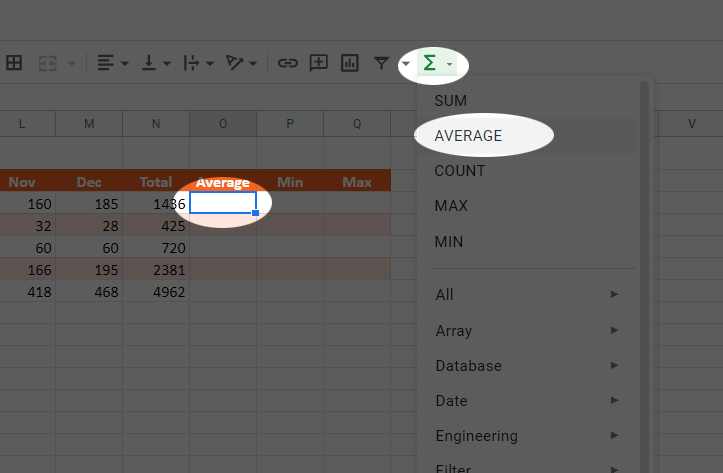

1. Now, click and drag to select **Cells B3:M3** to add them to the calculation. Press **Enter**.

    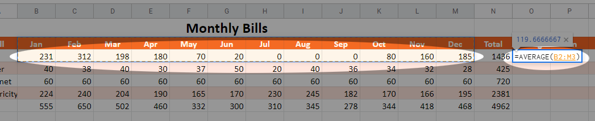

1. Follow the same procedure for MIN() and MAX() in the other two columns. This is the result:

    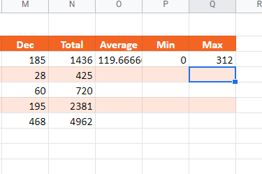

1. Select **Cells O3:Q3** and drag the Fill Handle Down to fill in the rest of the table.

    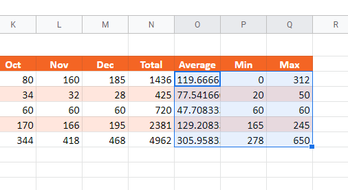

    **See the video if you have any trouble with this step!**

1. Let's add one more column

---

### Getting started

1.  In cell **O2**, enter the new column heading *AVERAGE*. Hit
    **ENTER**.
2.  In cell **O3**, enter the average function. Type =AVERAGE(, then
    highlight the range **B3:M3**. Make sure you do not include the
    average column. Notice that when you hit enter, the entire column
    fills with averages. Excel has intelligently predicted what you are
    trying to do as a consequence of formatting the data as a table.
    Adjust the number of decimal places shown so it looks nice.

    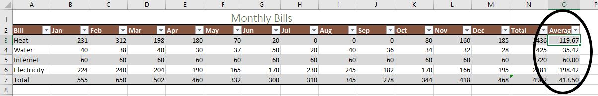

3.  Follow the same process for Columns **P** and **Q** and the MAX()
    and MIN() functions. The result should look like this:

    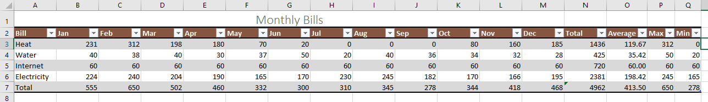

4.  In cell **R2**, enter the new heading *Percent of Total*.
5.  Select cell **R3**. Enter =, click on cell **N3** (the total for the
    heating bill), press / for division, and click on cell **N7** (the
    total for all bills), finally press **F4** on the keyboard to
    convert the reference to **N7** into an absolute reference. The
    final formula will end up looking like this (note how Excel
    automatically re-labels some cell references): `=[@Total]/$N$7`.
    When you hit **Enter**, it should fill in the rest of the column
    autmoatically!
6.  Change the number format of these cells to percentages, resize the
    column, and you should have something that looks like this:

    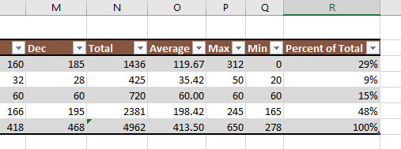

### A bar graph

Now, we want to make some charts. It would be useful to see how various
bills fluctuate throughout the year. So we'll want to build a basic bar
graph.

1.  Select the cell range A2:M7. That is, grab all of the month data
    plus to the total row, but not the total column.
2.  In the **Insert** tab, **Charts** group, select the **Column** tool
    and select the first option, **Clustered Column**:

    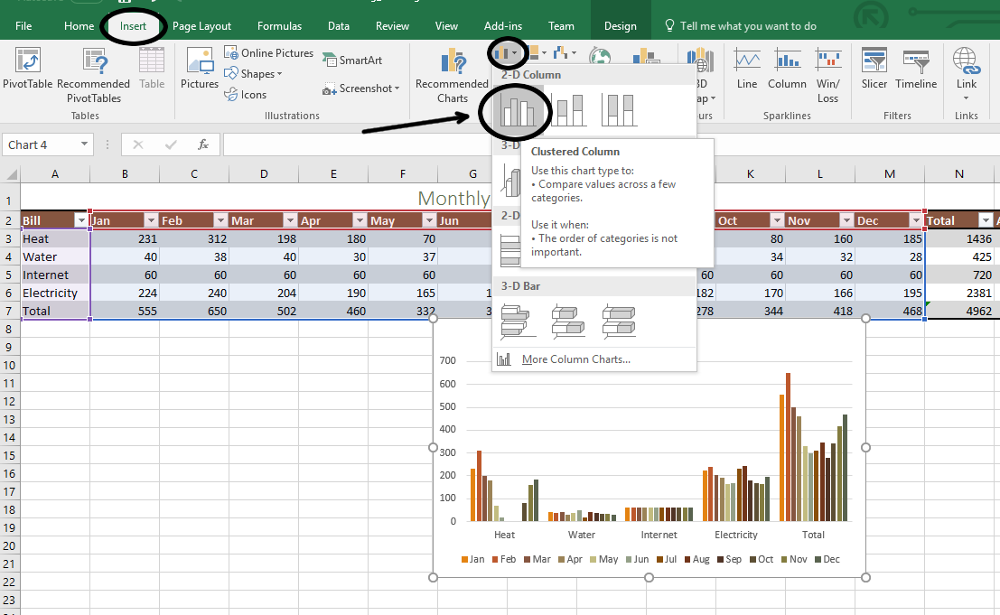

3.  The first thing you'll notice, is that our chart looks terrible.
    That's because it's being correlated by bill and not by month. Let's
    fix that. You should be in the new **Chart Tools: Design** tab. In
    the **Data** group, select the **Switch Row/Column** tool. It will
    look a lot more reasonable.

    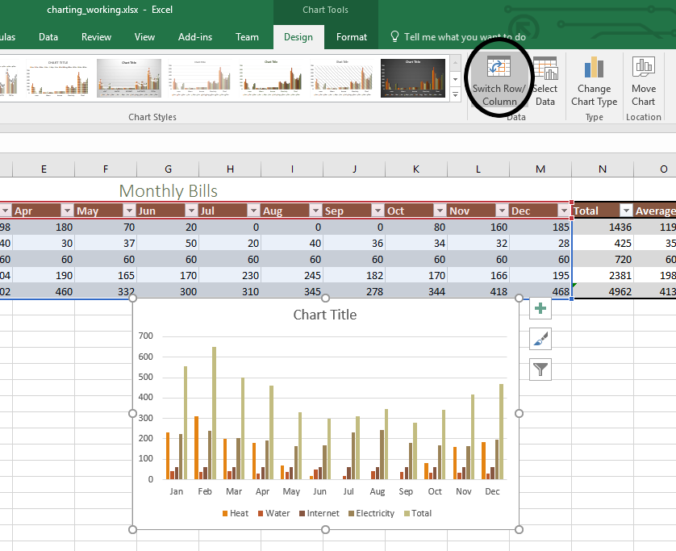

4.  Examine your chart. The chart is still a little weird and if you
    look carefully at the legend on the bottom of the chart, you might
    see why. Notice that in each month, we have a bar for heat, water,
    internet, electricity, and Total. Total doesn't belong here because
    it's literally the total of the other four. So it's basically
    drowning out all of the other bars and dominating the entire chart.
    So we're going to do a little surgery on our chart to make this look
    a little more reasonable.
5.  While still in the **Chart Tools: Design** tab, click **Change Chart
    Type** in the **Type** group.
6.  Select the **Combo** type.
7.  In the dialog, make sure all four of the bills are still set to
    *Clustered Column*, and the total is set to *Line*. Last, check the
    *Secondary Axis* box next to the Total line.

    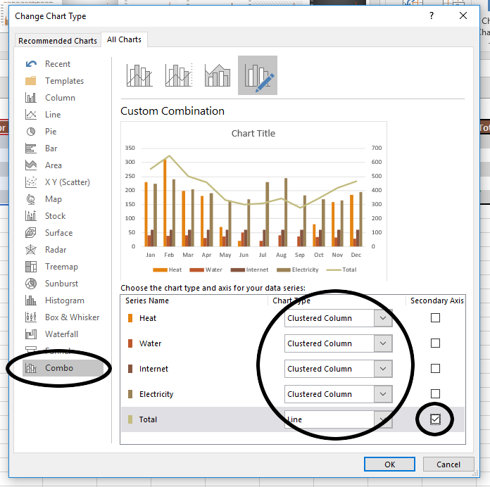

8.  Press **OK**.
9.  To polish up our Chart a little bit, double click on the Chart Title
    to edit it and change it to **Yearly Bills**.
10. Finally, in the **Chart Tools: Design** tab, click **Move Chart**
    and select **New Sheet** and change the name to *Bills Chart*. This
    moves it to its own sheet in your workbook.
11. If you like, feel free to change the **Chart Style** to something
    that looks nice.

### A pie chart

Next, let's make a pie chart to visualize how the year end totals relate
to each other.

1.  Make sure you're on the Bills sheet.
2.  Select the cell range A3:A6, the names of the four bills. Next, hold
    the *Ctrl* key while selecting the range N3:N6. This allows us to
    select both the names and the totals of each bill.

    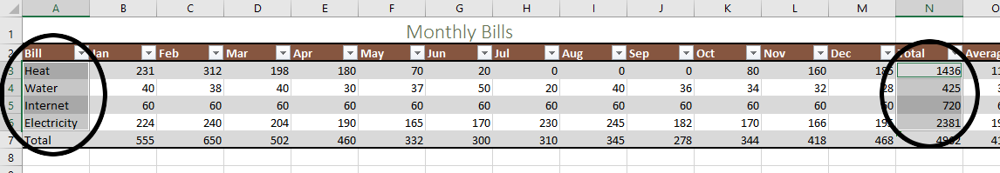

3.  In the **Insert** tab, select the **Pie Chart** tool and select the
    first 2D pie chart.

    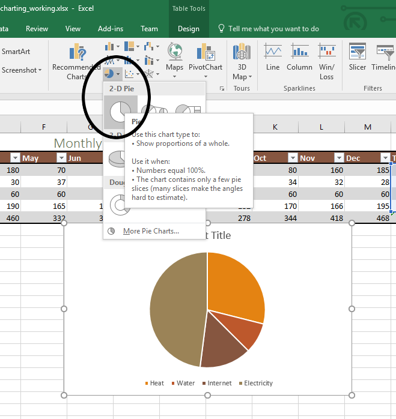

4.  Now, select **Add Chart Element**, **Data Labels**, and select the
    **Data Callout** option. This puts the bill name and percentage on
    each pie slice.

    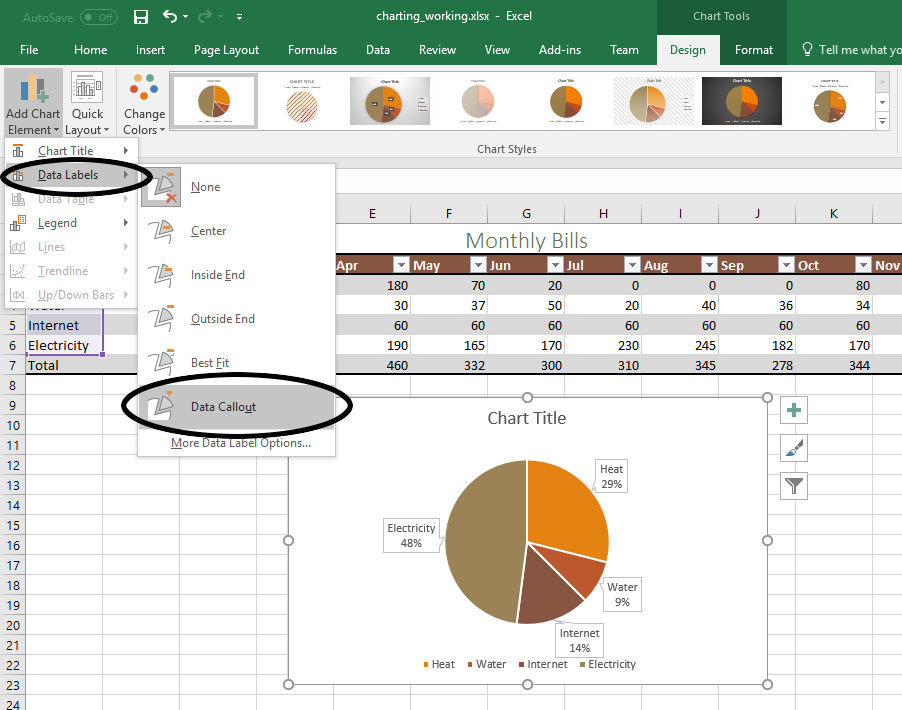

5.  Again, in **Add Chart Element**, **Legend**, select **None** since
    we don't need it with the data callouts.

    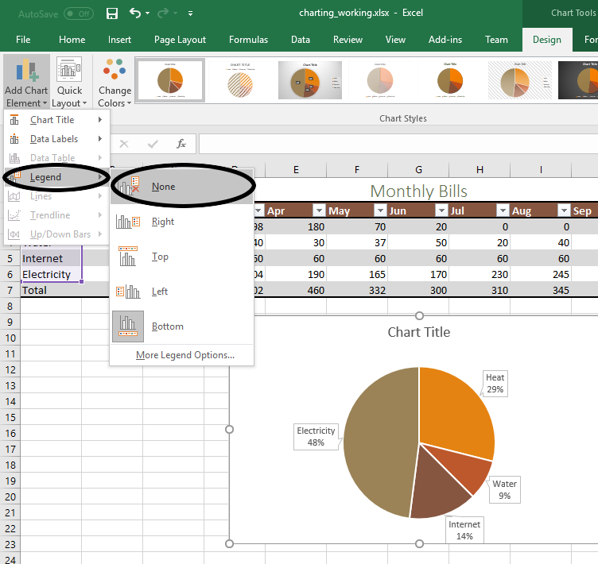

6.  Finally, change the chart title to **Total Bills** and move it to
    its own chart sheet.

### Sparklines and Data Bars

Let's explore two more charting and data visualization tools,
**Sparklines** and **Data Bars**. Sparklines are like charts but they
are contained to a single cell. Data bars are a kind of conditional
formatting which allows us to visualize the data in the cells. Let's see
how they work

1.  Select column **O** by clicking on its header.
2.  In the **Home** tab, in the **Cells** group, click **Insert**. This
    should insert a new blank column into our table.
3.  Click on the heading in Column **O** and change the heading to
    **Year Trend**. This is what it should all look like.

    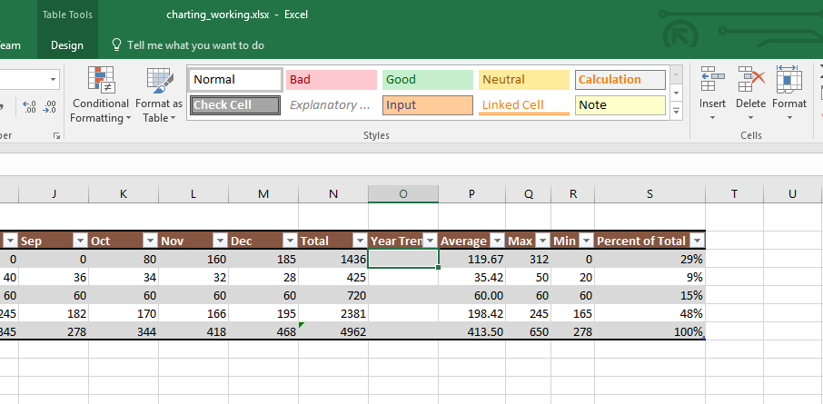

1. Select the new blank cells **O3:O7**.
1. In the **Inert** tab, find the **Sparklines** group and click **Line**.

    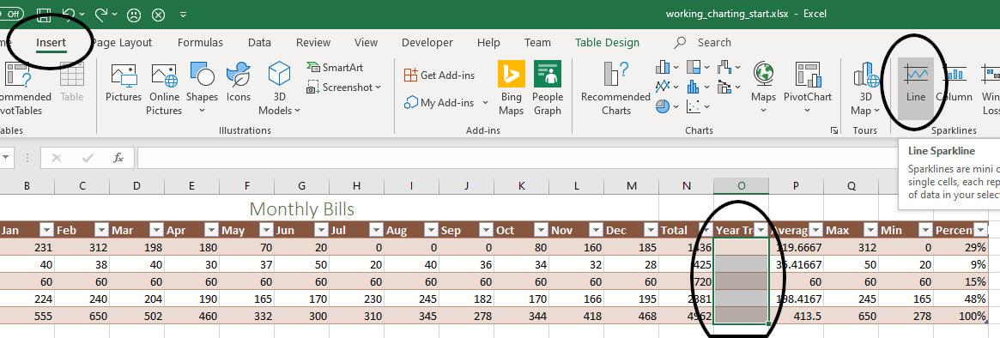

1. The *Location Range* should be pre-populated with the range `$O$3:$O$7`. With the insertion point in the the *Data Range* box, simply select the cells `B3:M7` and that reference should appear in the box. Verify that your screen looks like this image before clicking **OK**.

    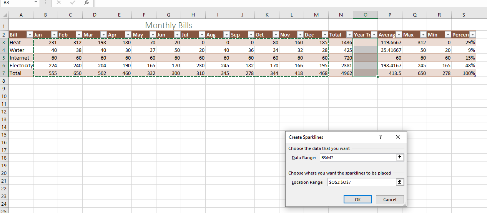

1. The result looks like this:

    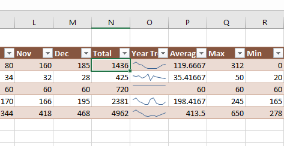

1. To create the *Data Bars*, select cells `N3:N6` and in the **Home** tab, select **Conditional Formatting**. Then simply select **Data Bars** and choose a style you like. This gives you the ability to visualize data *within* a cell as it relates to data in other cells.

    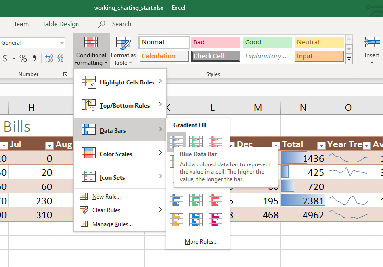

This concludes the tutorial. Submit the file to the course portal as normal.
