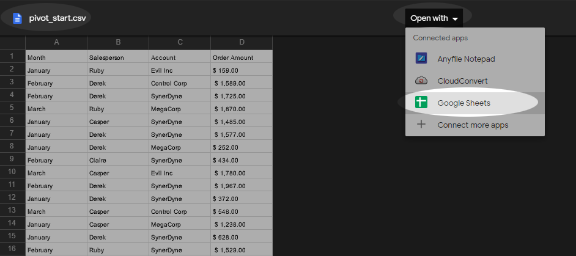

--- 
title: 'Tutorial 6 - Tables Pivot Tables'
layout: page
parent: Chapter 5 - Spreadsheets
nav_order: 9
mathjax: true
---

TUTORIAL 6 - Tables and Pivot Tables
====================================

<iframe width="560" height="315" src="https://www.youtube.com/embed/bDEeNQYLMoE" frameborder="0" allow="accelerometer; autoplay; clipboard-write; encrypted-media; gyroscope; picture-in-picture" allowfullscreen></iframe>

In an earlier tutorial, we looked at how you can take a range of data
and make it into a table. Now, we are going to look at some advanced
ways in which you can use those tables to make the data fit your needs.

At every step of this tutorial, it is very important to stop and think about what you're doing and what information you are gaining by performing this particular action.

Tutorial
--------

First, let's consider how our table might be structured. When we
conceptualize data ranges. Often a data range is just a structured
collection of individual data entries. A list, if you will. So for
example, let's imagine our company has four salespeople. We might
imagine a table with the following columns:

  | Column Name  | Data Type                            |
  | -            | -                                    |
  | Month        | The Month The sale took place        |
  | Salesperson  | Name of the person who made the sale |
  | Account      | The name of the client account       |
  | Order Amount | The amount of the order in dollars   |

### Tables

1.  Open the [start file](https://bit.ly/32ZG3kz) in a new tab. At the top center, it will ask you what app you would like to open the file with. The reason for this is that this is not a Sheets document. It is a csv file with nothing but raw data. Select **Open With Google Sheets**.

    

    By default, it will stick the file in your root directory of your Google Drive. So it's not a bad idea to move it to wherever you keep your work:

    

1.  Examine the sheet and get a sense of what it's reporting. Each line
    is an individual sale of some product made by a particular sales
    person, during a month, to some client, and for some total amount.

    

1. Let's do some basic formatting. To select all of the table data, press **Ctrl-a**. This will select the entire table and just the table. In the **Format** menu, select **Alternating Colors**. Pick a color scheme you like. 

    

    Another thing I like to do is tweak the headings. Select the first row of the table (the headings) and make them bold, center them, and change the text color to white.

    

### Sorting, Filtering, and Slicing

Before we get into Pivot Tables, let's look at some of the more basic sorting and filtering methods available to us in Sheets.

1. With the cell selector somewhere in the data, in the **Data** menu, select **Create a Filter**. This will turn on your filters. You'll see them appear next to the column headings.

    

1. Now, for a first look at how to sort and filter, click on the filter next to the *Salesperson* heading. Click on **Sort A &rarr; Z** and observe the result.

    

    You'll see that the salespeople are now sorted alphabetically. But not only that, *all* of the data is now sorted by salesperson name.

1. Let's try a more complex sort. Select all the data by pressing **Ctrl-a**. In the **Data** menu, select **Sort Range**.

    

1. In the dialog that opens, you'll be able to set multiple sort columns. First, ensure that **Data has header row** is checked. Then, sort **A &rarr; Z** by *Salesperson*, and finally, click **Add another sort column** and sort **A &rarr; Z** by *Account*. Get the dialog looking like this:

    

    Observe that the result is a two level sort of the data.

1. Now, let's try filtering. Once again, click the filter next to the *Salesperson* heading. Click on *Clear* and then select just one of the salespeople, and click **OK**. 

    

    Observe that all of the lines that are not sales by that salesperson are gone. Of course, they're not really gone. They are merely hidden. The data is still intact and accessible. Just mess around with the filters again.

1. Another, more interesting way to filter data is to use a **Slicer**. This is a new feature in Sheets, so let's check it out. With the selector somewhere inside the data, go to the **Data** menu and select **Slicer**.

    

1. The slicer interface will be created in your sheet. On the dialog that opens on the right, select **Month** to slice your table by Month. Then, in the slicer itself, select which months you'd like to see and click **OK**.

    

    I suspect that the slicer interface will improve. As it is, it's just a slightly more complex filter tool. But it's a new feature and likely still under development.

### Pivot Table

Let's create a couple of pivot tables. A pivot table is a tool for summarizing and correlating data. Here, we have a bunch of lines of data that could be correlated in more than just this list fashion. Let's say we want to create a matrix showing the salesperson cross referenced with their months of work and how much money they made in each month. Let's see how we get this done.

1. With the cell selector somewhere in the data, select the **Data** menu and select **Pivot Table**.

    

1. In the dialog that opens, make sure that **New sheet** is selected and click **Create**.

    

1. Check out your new pivot table. It doesn't look like much yet, but we'll work on it.

    

    The table itself is empty because we haven't added anything yet. You'll see that it's divided into three areas: *Rows*, *Columns*, and *Values*. Essentially, the goal is to take column headings from your original tabular data and add them one of these three areas. Optionally, you can designate some headings as filters to omit certain parts of the data. Let's build a simple example.

1. To *Rows*, add the **Salesperson** field. And then to *Values*, add the **Order Amount** field. Like this:

    

1. Now, add the **Month** field to the *Column* section and observe the result:

    

    We now have the cross-reference matrix that we described.

1. Try swapping out **Account** for **Month** in the column section. To do this, click the **X** by the *Month* field and then add the new column set. Observe the result:

    

1. Let's make one more pivot table and create a chart. Go back to the data sheet. Make sure the cell selector is somewhere in the data and once again, in the **Data** menu, select **Pivot Table** to create a new pivot table on a new sheet as before.

1. This time, examine the **Suggested** pivot table options. I'm going to choose the **Sum of Order Amount for each Account**. If your options are different, select one that looks interesting.

    

1. Lastly, select the **Insert Chart** tool from the toolbar and observe the result.

    

1. This will almost certainly create a column chart. You could tweak the resulting chart a bit. Removing the total column would be an okay thing to do since it suppresses the other data. This is easy to accomplish by changing the data range in the right-hand column so that it's only looking at cells **A1:B5** instead of B6. The end result looks like this:

    

This concludes this basic level tutorial on sorting, filtering, and pivoting your data. We'll do some more interesting things with real data in the sections to come. Submit this to Canvas as normal.

