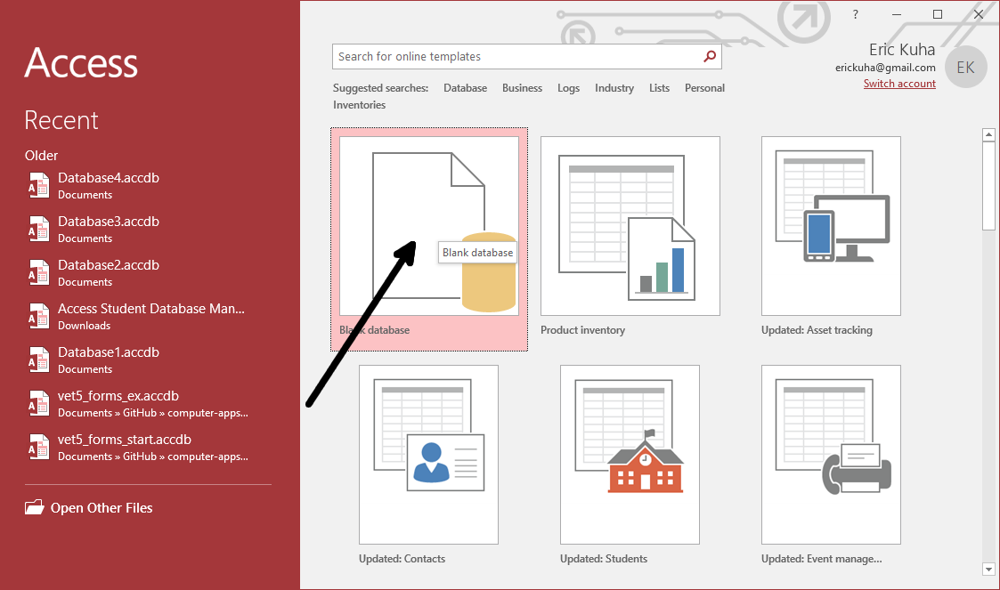
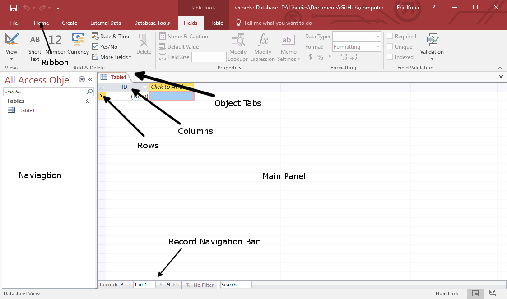
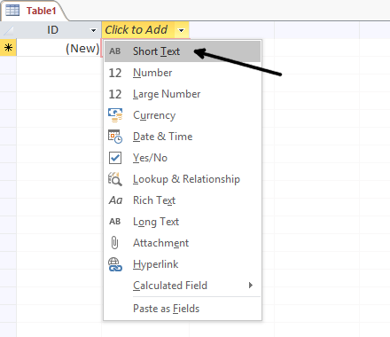
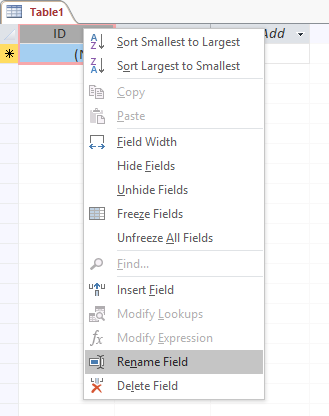
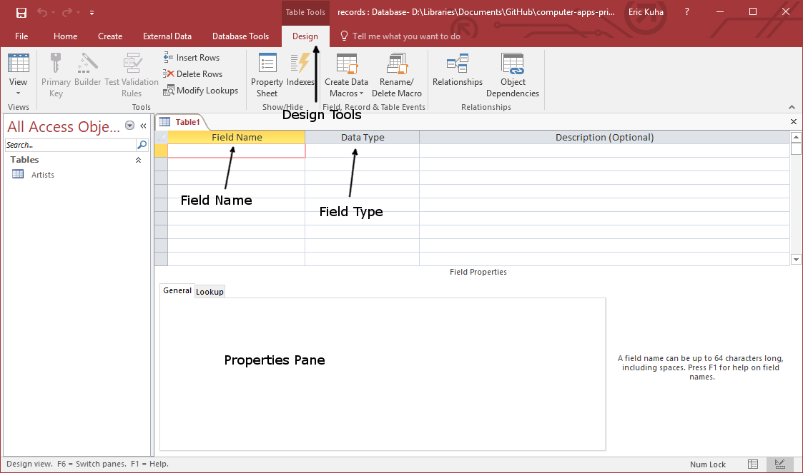
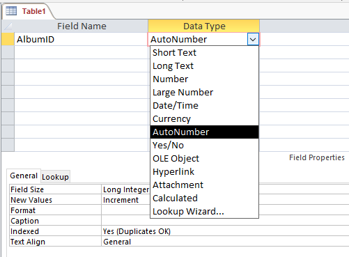
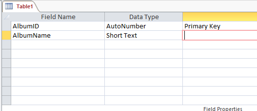

--- 
title: 'TUTORIAL 1 - Tables'
layout: page
parent: Chapter 6 - Databases
nav_order: 3
---

TUTORIAL 1 - Tables
===================

The first Access object we will explore is the table. The basic idea of
a table persists across almost all database software and these concepts
will transfer easily if you decide to move on to more advanced database
tools in the future.

The table is where all of the data goes. Everything in a database is
derived from the data definitions in the table fields and the actual
data in records in the table. We will start from the ground up. Follow
along with this tutorial starting with an empty database and you will
have gained some experience building, editing, and tweaking tables as
well as doing some light, not-too-strenuous data entry.

Tutorial
--------

### Designing the Database

The first step in building any database is to plan it. We have to decide
on our database\'s basic structure. How many tables do we want? What
fields should each table have? What data types would those fields have?
There are many, many considerations in database design, but we will look
at a simple example.

You have taken to collecting vinyl records (they\'re making a
[comback](http://www.latimes.com/opinion/op-ed/la-oe-sax-analog-nostalgia-20160103-story.html)!).
And since most of them are relatively inexpensive, you\'ve acquired a
lot of them in a fairly short period of time. You\'ve decided that you
want to keep better track of which ones you have. So you decide to build
a database.

It\'s good to have this idea before we get started. There\'s a lot to
cover, so I\'ll lay out the plan now and we will refer back to it as we
move throughout this chapter. So don\'t worry if you don\'t know exactly
what it means.

We will construct three tables. One for artists, one for genres, and one
for albums. The album table is our primary table and will have the most
fields. The others are supplementary and serve only to create
relationships and organize the data.

The following diagram is what\'s called a UML diagram and gives us an
idea of the structure of our tables:

 helps
us to organize our thoughts.](images/tables/1.png)

These tables could probably be tweaked a little bit. You might want more
or less information. The **Albums** table, for instance, might benefit
from a field for the condition of the vinyl record. But these things can
be added in later if we so desire. Though, it is possible that we may
regret it later because it will be more data entry down the line.

Look at the connections between the three tables. We have one field in
the **Genre** table called *ID* and it is connected to another field in
the **Albums** table called *GenreID*. Make sense? Likewise, there is an
*ID* field in the **Artists** table connected to the *ArtistID* in the
**Albums** table.

Let\'s start building our tables

### Creating a Database

1.  Open **Microsoft Access**. Select **Blank Database**.

    

2.  **Click** the folder icon and navigate to where you want to save it,
    and then change the name to records.

    

3.  Now, you are in the Microsoft Access main interface. Here, you will
    build your tables, create relationships, generate reports, and do
    all of the other database stuff that we do. Let\'s take a look
    around.

Access Tour
-----------

There\'s a lot going on here, but only some of it is of immediate
relevance to us. Let\'s take a look

Ribbon

:   Just like other MS Office apps, the tool bar is a tabbed Ribbon. If
    you like, you should take a moment to see what\'s in each tab, even
    if you don\'t know what everything does yet.

Navigation Pane

:   The left sidebar is a navigation pane which will show a list of all
    of the Access Objects currently created in our database. This will
    include all tables, queries, forms and reports. There are also tools
    here for sorting and filtering them.

Main Panel

:   The largest part of the interface is the main work area. This will
    show the current \"document\" that you have selected. In this case,
    it\'s the initial empty table

Object Tabs

:   Along the top of the main panel, you will see the tabs of all open
    \"documents\" so you can quicksly switch between them.

Columns

:   Individual fields in a table are represented as columns. They have
    names. In your initial table, there is only one field, called
    *ID*.

Rows

:   Individual records in a table are represented as rows. Each row is
    its own record. In this table, there are no records yet.

Record Navigation Bar

:   Along the bottom of the main panel is a toolbar with buttons that
    you can use to navigate through a table, filter entries, or search
    for specific records.

### Building the Artist table

Let's start simple. We have three tables to construct. The first one we
should look into is a table for each artist. Remember, you might have
several albums by the same artist, and so this is our first clue that
\"Artists\" need their own table.

1.  At the top of the table, where it says *Click to Add*, **Click**.
    Select **Short Text** for the type for this field.

    > 

2.  Type *ArtistName* as the title of the field and press **Enter**.
    Note, while it's not required, the convention is for all field
    names to be one word and so a further convention is to use "camel
    case", capitalizing each word, to differentiate them. Like so:

    > 

3.  Next, let's rename the *ID* field. **Right-click** on the *ID*
    title and select **Rename**. Type "ArtistID".

    > 

4.  This table is finished. **Save** the table. You will be prompted to
    name it. Call it *Artists*. Close the table.

### Building the Album table

For the *Album* table, we will build the table in **Design View**, which
gives us more granular control over how the table is constructed. For
this part of the tutorial, we will create a table with the following
structure:

  | Field Name  | Data Type  | Description |
  | ----------- | ---------  | ----------- |
  | AlbumID     | AutoNumber | Primary Key |
  | AlbumName   | Short Text |             |
  | ReleaseDate | Number     |             |
  | ArtistID    | Number     | Foreign Key |
  | GenreID     | Number     | Foreign Key |

1.  In the **Create** tab, select **Table Design**.

    

2.  You will see a new interface. This is the table design view. Instead
    of showing the records in rows and columns, it shows the fields and
    their components.

    

3.  In the first row\'s **Field Name** cell, type *AlbumID*. In the
    **Data Type** cell dropdown menu, select *AutoNumber*. 
    
    Under Description, type *Primary Key*. This sets the field so that you
    never have to give it a value. Every time you create a new record in
    this table, it will automatically take the value of the next
    integer. Note, that if you delete a record, it won\'t fill in the
    vacant ID, so the highest numbered record is not necessarily an
    accurate count of the number of albums you own. The ID field is
    *only* there as a unique identifier of each record in the table. By
    giving it the description \"Primary Key\", we are reminding
    ourselves of the purpose of this field. It has not actual mechanical
    effect.

    

4.  Give the next field the name *AlbumName* and the type *Short Text*.
    Note, *Short Text* is a data type that allows up to 255 characters
    in length. You can make it smaller to save space for very large
    databases, however, in this case, we\'ll leave it at that.

    

5.  Now, look at the bottom of the panel at the **Field Properties**
    box. Here we can put restrictions on some of the things that users
    are allowed to do with the field. For example, every album must have
    a name, so we will set the *Required* property to *Yes*.

    

6.  The next field gets the name *ReleaseDate*. Give it the Data Type
    *Number*,(**NOT DATE/TIME**), and set *Required* to *Yes*.
7.  Make the other two fields as shown in the table above. Give them the
    description *Foreign Key*, as they will be used to build links to
    the other two tables in our database (later). And make sure they are
    *Required* fields. The finished table should look like this:

    

8.  You have one last thing to do before we can save and close the
    table. We need to set the ArtistID field as the **Primary Key**.
9.  Click on the first field, *AlbumID*. In the **Table Tools: Design**
    tab, click the **Primary Key** tool to establish AlbumID as the
    primary key for this table.

    

10. This table is complete for now. Save the table by hitting the
    **Save** button or pressing **Ctrl-s**. Name the table *Albums*. and
    close it.

### The Genre Table

  | Field Name | Data Type  | Description |
  | ---------- | ---------  | ----------- |
  | GenreID    | Number     | Primary Key |
  | GenreName  | Short Text |             |

1.  Like the Artists table, the Genres table has only two fields. The
    name of the genre and its primary key. Build it according to the
    scheme outlined above.

    **NOTE:** The screenshots here all say AutoNumber for this data type. Use Number instead, because it will make populating this table a lot easier later on.

2.  When you are finished, save the table and close it.

### Saving and compacting your database

One last thing before we upload this. As databases grow, they can become
fragmented and take up more space than they need to on the hard drive.
To this end, Access includes a utility to compact the database so that
it is smaller and more manageable.

1.  First, save and close all open tables.
2.  Click the **File** tab.
3.  In the *backstage* view, click the large button that says **Compact
    & Repair**.

That's it. Close it and upload your database in this form to the
portal. **Note:** It is important that you close it before uploading it.
Opening a database actually creates a second file in the folder with the
database file. The database file has the .accdb extension. This new file
has the .laccdb extension. It\'s a locking file that prevents two people
from editing the same database at the same time. It\'s for security.
That said, I have had students upload the lock file before and it
creates a fair bit of confusion. So to prevent this, make sure you close
the database first, which deletes the locking file and then there\'s no
confusion.
