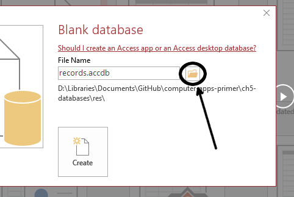
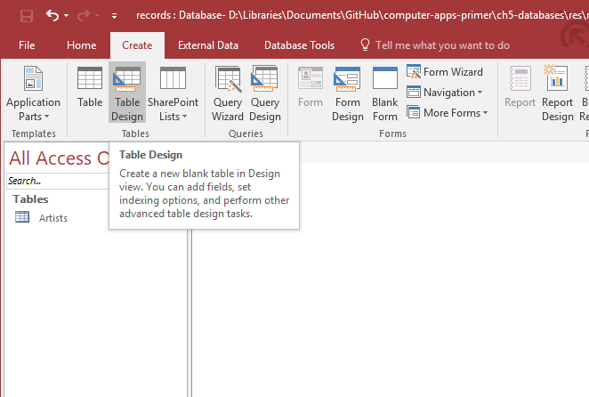
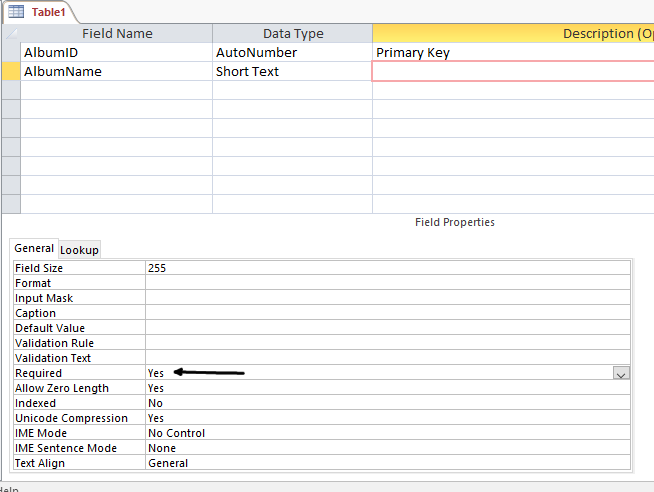

--- 
title: 'TUTORIAL 1 - Tables'
layout: page
parent: Chapter 6 - Databases
nav_order: 3
mathjax: true
---

TUTORIAL 1 - Tables
===================

<iframe width="560" height="315" src="https://www.youtube.com/embed/yU9eBkm30gk" frameborder="0" allow="accelerometer; autoplay; clipboard-write; encrypted-media; gyroscope; picture-in-picture" allowfullscreen></iframe>

The first Database object we will explore is the table. The basic idea of
a table persists across almost all database software, and a baseline understanding will serve you well if you decide to move on to more advanced database tools in the future.

The table is where all of the data goes. Everything in a database is
derived from the data definitions in the table fields and the actual
data in records in the table. We will start from the ground up. Follow
along with this tutorial, beginning with an empty database and you will
have gained some experience building, editing, and tweaking tables as
well as doing some light, not-too-strenuous data entry.

TUTORIAL
--------

### Designing the Database

The first step in building any database is to plan it. We have to decide
on our database's basic structure. How many tables do we want? What
fields should each table have? What data types would those fields have?
There are many, many considerations in database design, but we will look
at a simple example.

Let's say you have taken to collecting vinyl records (they're making a
[comeback](http://www.latimes.com/opinion/op-ed/la-oe-sax-analog-nostalgia-20160103-story.html)!).
And since most of them are relatively inexpensive, you've acquired a
lot of them in a relatively short time. You've decided that you
want to keep better track of which ones you have. So you decide to build
a database.

It's good to have this idea before we get started. There's a lot to
cover, so I'll lay out the plan now, and we will refer back to it as we
move throughout this chapter. So don't worry if you don't understand it entirely yet.

Let's plan for three tables. One for artists, one for genres, and one
for albums. The album table is our primary table and will have the most
fields. The others are supplementary and serve only to create
relationships and organize the data.

The following diagram is what's called a UML diagram and gives us an idea of the structure of our tables:

 helps
us to organize our thoughts.](images/tables/1.png)

One could probably tweak these tables a little bit. Perhaps, you might want more or less information. The **Albums** table, for instance, might benefit from a field for the condition of the vinyl record. But we can add these things later if we so desire. Though, we may regret it later because it will be more data entry down the line.

Look at the connections between the three tables. We have one field in
the **Genre** table called *ID* connected to another field in
the **Albums** table called *GenreID*. Make sense? Likewise, there is an
*ID* field in the **Artists** table connected to the *ArtistID* in the
**Albums** table. These relationships will make more sense when we see them in action.

Let's start building our tables.

### Creating a Database

1.  Open **LibreOffice Base**. Select **Create a new database** and click **Next**.

    

2.  On the next screen, it asks you if you want to register the database. Registering the database is a neat feature that gives you the ability to access and reference the data in this database from other LibreOffice apps like their spreadsheet app Calc. For our purposes, we will not register it, however. So select **No, do not register the database**. Then click **Finish**.

    

3.  It will ask you to save the file. Select a suitable folder and name it **records**. Notice that the file type is `*.odb`. This is the Base default file format. Once you save, you will be in the Base main interface. Here, you will build your tables, create relationships, generate reports, and perform other database maintenance. Let's take a look around.

Access Tour
-----------

There's a lot going on here, but only some of it is of immediate
relevance to us. Let's take a look.

Toolbar

:   The toolbar in Base changes depending on what you are doing, but generally, the buttons on the bar are the ones you'll use the most. We'll address the essential buttons as we get to them.

Tasks

:   The Tasks pane has tools for building, editing, and creating various database objects, depending on which tab is currently activated.

Database Object Tabs

: Base has a sort of tabbed interface. There are four buttons in the left pane that will show you which objects are available in the main area and which Tasks are available for that object type.

Main Area

:   The bottom pane shows which objects you've created of the type of the currently selected tab. This is where you can see them nicely organized and sorted.

### Building the Artist table

Let's start simple. We have three tables to construct. The first one we
should look into is a table for each artist. Remember, you might have
several albums by the same artist, and so this is our first clue that
"Artists" need their own table.

1. With the **Tables** tab selected, select the **Create Table in Design View** task.

    

1.  A new window will open with a new interface. This is the design view interface for building a table. It might remind you of a spreadsheet, and in a way, it is. There are three columns here that you will use to define each field in the table. If you refer to our UML diagram, the Artist table requires two fields. We need an ArtistID field and an Artist Name field. So let's create those two fields.

2.  In the first row of this interface, type *ID* in the Field Name cell. In the Field Type, select **Integer [INTEGER]**. In the Description field, type "Primary Key." Like so:

    

    So what's all going on here? Every field must have a name, and typically all field names must be one word. It can be anything you want. We have to specify a data type from a list of supported data types in the field type. There are a lot of them, and at first, it can be daunting. For example, what does it mean that we chose Integer? There are six different numerical data types to choose from; why this one? Well, because it's an excellent standard choice if you don't know what you're going to need. It means that every instance of this field will take up 32 bits of space, and it means that there are $2^32$ possible numbers that can be in the field. What that means is that if we have more than 4,294,967,296 records, we might need to choose a different type for our ID field! I don't think we have to worry about it. Next, the Description field is just for us. It has no mechanical purpose at all, but it reminds us that we'll be using this field as our primary key. Lastly, I would like to draw your attention to the Field Properties pane at the window's bottom. You will see a property called *AutoValue*, which is often recommended for an ID field. However, because of how we will be adding records to this table, we want to set our ID values manually.

1. In the next row, enter *ArtistName* as the field name. Notice the naming convention used here. We squish the words together to create one word and capitalize the first letter of each word. This is called "camel case." Leave the type as `Text [VARCHAR]` Like so:

    

3. Now, let's define the ID field as our primary key. **Right-click** on the box to the left of the ID field name. From the context menu that pops up, select **Primary Key**.

    

4.  This table is finished. **Save** the table. Base will prompt you to name it. Call it *Artists*. Close the table.

    

1. Back in the main Base screen, you can double-click on your new Artists table, and it will open in a new window. Inside, you'll see what looks like a spreadsheet with only two columns and one blank row. Let's define some more terms formally.

    

    Go ahead and close the table, leaving it blank for now.

Fields

:   Individual fields in a table are represented as columns. They have names. In the Artists table, there are two fields.

Records

:   Individual records in a table are represented as rows. Each row is a record. In this table, there are no records yet.

Record Navigation Bar

:   Along the bottom of the main panel is a toolbar with buttons that
    you can use to navigate through a table, filter entries, or search
    for specific records.

### Building the Album table

For the *Album* table, we will again build the table in **Design View**. For this part of the tutorial, we will create a table with the following
structure:

  | Field Name  | Data Type     | Description |
  | ----------- | ---------     | ----------- |
  | AlbumID     | Integer       | Primary Key |
  | AlbumName   | Short Text    |             |
  | ReleaseYear | Small Integer |             |
  | ArtistID    | Integer       | Foreign Key |
  | GenreID     | Integer       | Foreign Key |

1.  Once again, in the **Tables** tab, choose the *Create Table in Design View* task.

1. We're creating five fields here. Let's go through each one as one step, and I'll explain why each is what it is.

    * The first field is AlbumID. It should have the INTEGER type, and the Description should read "Primary Key." For this one, set the **AutoValue** flag to *yes* in the Field Properties pane, and go ahead and designate it as the Primary key now.
    * The second field is AlbumName with a VARCHAR datatype. The term "VARCHAR" is just a text datatype with a slightly archaic name that's a holdover from the early days of databases.
    * The ReleaseYear field should have the Small Integer, SMALLINT, datatype. A Small Integer will take up less space than an Integer at 32-bits, and we won't run out of years until the year 65,536, so I think we're safe.
    * The last two fields should be called ArtistID and GenreID, both with type Integer. Go ahead and give them a description of "Foreign Key" as a reminder for us.
    * Here's what it should all look like:

    

1. Go ahead and save this as "Albums" and close the table

### The Genre Table

  | Field Name | Data Type | Description |
  | ---------- | --------- | ----------- |
  | GenreID    | Integer   | Primary Key |
  | GenreName  | Text      |             |

1.  Like the Artists table, the Genres table has only two fields. The name of the genre and its primary key. Build it according to the scheme outlined above.

2.  Once you are finished, save the table as "Genres," close it, and upload the file to Canvas as normal.
