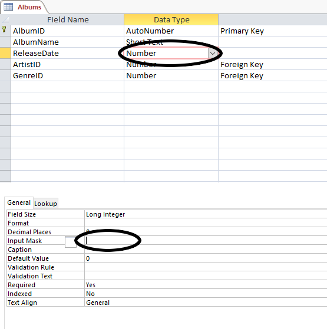
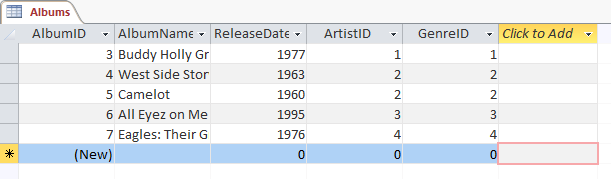
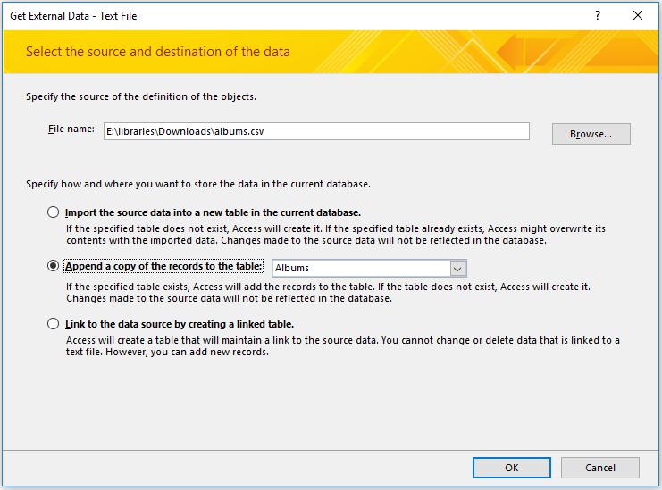
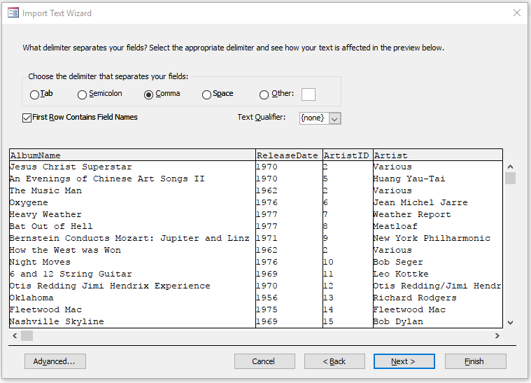

--- 
title: 'TUTORIAL 2 - Tables and Data'
layout: page
parent: Chapter 6 - Databases
nav_order: 4
mathjax: true
---

TUTORIAL 2 - Tables and Data
============================

We need to populate the database and its tables with actual data in
order for this to be interesting. So let's start looking into that, but
first, we have to make a couple of minor changes to our tables.

Creating Relationships
----------------------

Next, we need to establish our relationships. This is the feature which
defines relational databases more than any other. Let's see how it's
done.

1.  Ensure that all tables are closed. In the **Tools** menu, select **Relationships**.

    

1. In the new window that opens, select each table in turn and click **Add**, so that all three table *schema* boxes appear in the main window. Close the **Add Tables** dialog.

    

1. You can move the little schema boxes around as much as you like in this to keep things arranged neatly. What you want to do is wire up relationships between the ID fields of Artists and Genres to the foreign key fields we've created in the Albums table. Let's start with Artists. **Click** and hold on *ArtistID* in the *Artists* box. **Drag** it over to *ArtistID* in the *Albums* box. A line will appear denoting the relationship! Observe:

    

1. That's it. The relationships are created. Simply click the *Save* button and we're done. But let's, for a moment, discuss what just happened. In a relational database of the type used in Base (and many other database programs), relationships between tables are what make them work together, and helps make searchable. Look at the link drawn between two of these fields. On the Artists side, for example, there's a little *1* and on the Albums side, there's an *n*. This signifies that this is what's called a **One-To-Many** relationship. What this means is that an artist can have many albums, but an album can only have one artist. This might not completely accurately reflect the reality of the recording industry, but it *does* suit our purposes here just fine.

10. **Save** the Relationships and close the Relationship Tools interface by by click the **Close** button.

Importing some data
-------------------

Next, we will import some actual data. First, let's populate the Genre
and Artist tables. Download the two data files.

-   [artist.csv](res/artist.csv)
-   [genre.csv](res/genre.csv)

Copy them all to your working directory so you don't lose them, and
then let's get started.

1.  First, make sure all of your tables are closed.
2.  In the **External Data** tab, in the **Import** group, find the
    **Data Source** tool. You want to import from a file, and
    specifically, from a text file.

    

3.  The dialog that opens will have several options. Let's go through
    them.

    1. Under file name, click **Browse** and find the **artist.csv** file.
    1.  Check the radio button next to **Append a copy of the records to the table** and select the **Artists** table
    1.  Click **OK**

    

4.  You should see the data appear in a small window at the bottom of
    the next dialog. Ensure that the **Delimited** option is selected
    and press **Next**.

    

5.  Once again, ensure that the radio button next to **Comma** is
    selected. You should see the table split into columns. Also make
    sure there is a check next to **First Row Contains Field Names**.
    Press **Next**.

    

6.  In the final table, verify that you are importing to the Artists
    table and press **Finish**. No need to save the import steps.
7.  Open the Artists table and observe the results.

    

8.  We're going to do exactly the same thing with the **Genres** table
    and the **genre.csv** file. It should look like this when you are
    done.

    

Adding some of the album data
-----------------------------

We'll add a album records by hand because it's good to see how it
works. So here's five of the albums from my collection in tabular form:

  | AlbumName                     | ReleaseDate   | ArtistID   | GenreID    |
  | ----------------------------- | ------------- | ---------- | ---------- |
  | Buddy Holly Greatest Hits     | 1977          | 1          | 1          |
  | West Side Story               | 1963          | 2          | 2          |
  | Camelot                       | 1960          | 2          | 2          |
  | All Eyez on Me                | 1995          | 3          | 3          |
  | Eagles: Their Greatest Hits   | 1976          | 4          | 4          |

1.  Close the Artists and Genres tables and open the Artists table.
2.  Start at the first line, the ID numbers will be automatically
    generated and all you have to do is type into each field. **NOTE**:
    Remember to press **Tab** to move from field to field in each row.
3.  Make sure you get the ArtistID and GenreID fields correctly marked.
    They should correspond to the correct artist and genres in the other
    two tables.

    

Importing the rest of the data
------------------------------

To fill out the rest of the Albums table, we'll use another csv file.
The process will be similar to the other two tables

1.  Close the Albums table. It won't work if the table is open.
2.  Download the file:
    [albums.csv](res/albums.csv)
3.  In the **External Data** tab, select **New Data Source** and select
    **Text File**.
4.  Select the albums.csv file and make sure to **append** it to the
    Albums table. Press **OK**

    

5.  Make sure to select **Delimited** and go to the next dialog.
6.  Select **Comma** and check **First Row Contains Field Names**.

    

7.  Click **Next**, and then **Finish**.
8.  Open the Albums table and observe the result:

    

Save everything, repair and compact your database, and then upload it to
the class portal.

In the next tutorial, we will begin querying our database.

One last thing before we upload this. As databases grow, they can become
fragmented and take up more space than they need to on the hard drive.
To this end, Access includes a utility to compact the database so that
it is smaller and more manageable.

1.  First, save and close all open tables.
2.  Click the **File** tab.
3.  In the *backstage* view, click the large button that says **Compact
    & Repair**.

That's it. Close it and upload your database in this form to the
portal. **Note:** It is important that you close it before uploading it.
Opening a database actually creates a second file in the folder with the
database file. The database file has the .accdb extension. This new file
has the .laccdb extension. It's a locking file that prevents two people
from editing the same database at the same time. It's for security.
That said, I have had students upload the lock file before and it
creates a fair bit of confusion. So to prevent this, make sure you close
the database first, which deletes the locking file and then there's no
confusion.
