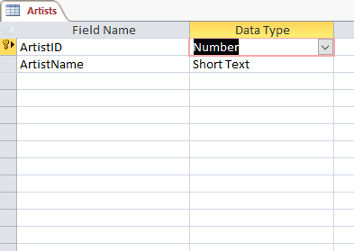
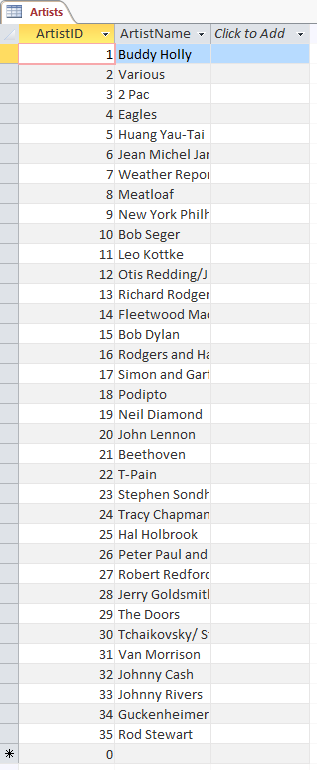
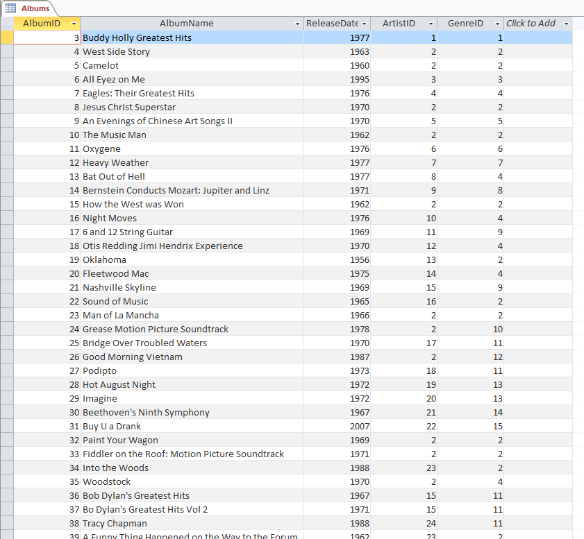

--- 
title: 'TUTORIAL 2 - Tables and Data'
layout: page
parent: Chapter 6 - Databases
nav_order: 4
mathjax: true
---

TUTORIAL 2 - Tables and Data
============================

<iframe width="560" height="315" src="https://www.youtube.com/embed/9pCXDKEqPRw" frameborder="0" allow="accelerometer; autoplay; clipboard-write; encrypted-media; gyroscope; picture-in-picture" allowfullscreen></iframe>

We need to populate the database and its tables with actual data for this to be interesting. Let's start looking into that, but first, we have one important matter to discuss.

Creating Relationships
----------------------

We need to establish our relationships. Relationships are the feature that defines relational databases more than any other. Let's see how.

1.  Ensure that all tables are closed. In the **Tools** menu, select **Relationships**.

    

1. In the new window that opens, select each table in turn and click **Add**, so that all three table *schema* boxes appear in the main window. Close the **Add Tables** dialog.

    

1. You can move the little schema boxes around as much as you like in this to keep things arranged neatly. What you want to do is wire up relationships between the ID fields of Artists and Genres to the foreign key fields we've created in the Albums table. Let's start with Artists. **Click** and hold on *ArtistID* in the *Artists* box. **Drag** it over to *ArtistID* in the *Albums* box. A line will appear denoting the relationship! Observe:

    

1. That's it. We have established our relationships. Click the *Save* button. But let's, for a moment, discuss what just happened. In a relational database of the type used in Base (and many other database programs), relationships between tables make them work together. Look at the link drawn between two of these fields. On the Artists side, for example, there's a little *1*, and on the Albums side, there's an *n*; this is what's called a **One-To-Many** relationship. Therefore, an artist can have many albums, but an album can only have one artist.

10. **Save** the Relationships and close the Relationship Tools interface by clicking the **Close** button.

Importing some data
-------------------

Next, we will import some actual data. First, let's populate the Genre and Artist tables. Download the two data files.

-   [artist.csv](res/artist.csv)
-   [genre.csv](res/genre.csv)

Copy them all to your working directory, so you don't lose them, and then let's get started.

1.  First, make sure all of your tables are closed.

1. Next, open the `artist.csv` file in **LibreOffice Calc**. Your computer will likely automatically want to open it in Excel (if you have Excel installed). You can override this behavior by right-clicking on the file, selecting *Open With*, and selecting *LibreOffice*. This is the only time we will need to use an app other than Base.

1. A dialog will open with some options for importing text data into a Calc spreadsheet. The defaults should be fine. Press **OK**.

1. Once Calc opens, you will see two columns of data. Column A will be the ID numbers of each artist. And Column B will be the names of those artists. Press **Ctrl-a** on the keyboard to select everything in the spreadsheet. Press **Ctrl-c** to copy it all to the clipboard &mdash; **Note:** You cannot perform this operation with Excel or Google Sheets. It won't work. You have to use Calc.

1. Now, armed with all of the artist data in the system clipboard, back Base, in the *Tables* tab, right-click on the *Artists* table and select **Paste**.

    

1. The Copy Table dialog will have a few settings. Select **Append Data** and **Use first line as column names**. Then click **Next**.

    

1. As long as you have the same column names as this tutorial, it should automatically assign column names correctly in the next dialog. However, if they're different, you can use the up and down chevrons to move things around. Click **Create**.

    

1. Open the Artists table to verify the data has arrived intact!

    

8.  Finally, perform the same procedure with the **Genres** table and the **genre.csv** file. It should look like this.

    

1. You can close any Calc windows at this time as well.

Adding some of the album data
-----------------------------

We'll add a few album records by hand because it's good to see how it works. So here's five of the albums from my collection in tabular form:

  | AlbumName                     | ReleaseDate   | ArtistID   | GenreID    |
  | ----------------------------- | ------------- | ---------- | ---------- |
  | Buddy Holly Greatest Hits     | 1977          | 1          | 1          |
  | West Side Story               | 1963          | 2          | 2          |
  | Camelot                       | 1960          | 2          | 2          |
  | All Eyez on Me                | 1995          | 3          | 3          |
  | Eagles: Their Greatest Hits   | 1976          | 4          | 4          |

1.  Close the Artists and Genres tables and open the Artists table.

2.  Start at the first line. Base will automatically generate ID numbers, so all you have to do is type into each field. **NOTE**: Remember to press **Tab** to move from field to field in each row.

3.  Make sure you get the ArtistID and GenreID fields correctly marked. They should correspond to the correct artist and genres in the other two tables.

    

Importing the rest of the data
------------------------------

To fill out the rest of the Albums table, we'll use another CSV file. The process will be similar to the other two tables.

1.  Close the Albums table. It won't work if the table is open.
2.  Download the file:
    [albums.csv](res/albums.csv)

1. Once again, open this CSV file in Calc and select all the data, and copy it to the system clipboard (**Ctrl-a** then **Ctrl-c**)

1. **Right-click** on the Albums table. Select Paste. Ensure that *Append data* and *User first line as column names* are selected. Click **Next**.

1. In the **Assign Columns** dialog, you might notice that there's a discrepancy here. There are different numbers of columns. You will have to select each column in the source table, in turn, and use the chevrons to line everything up correctly until it looks like this:

    

1. Click **Create**. Open the **Albums** table and verify that the data was successfully imported.

    

### Saving and repairing the database

One last thing before we upload this. As databases grow, they can become fragmented and take up more space than they need to on the hard drive. To this end, Base has a way of re-writing the database to compact it so that it's smaller and more manageable. 

1.  First, save and close all open tables.

1. In the **Tools** menu, select **SQL**. We are going to enter a brief SQL command directly to manipulate the database.

    

1. Next, in the "Command to execute" box, type the command `SHUTDOWN COMPACT` in all caps. Click **Execute**.

    

Honestly, compacting the database is not super important for this database. We probably saved a few bytes of storage. However, as a database grows, it can become quite large and unwieldy, and it's nice to know how to repair a database that has been manipulated a lot. That's it. Close it and upload your database in this form to Canvas.

In the next tutorial, we will begin querying our database.
