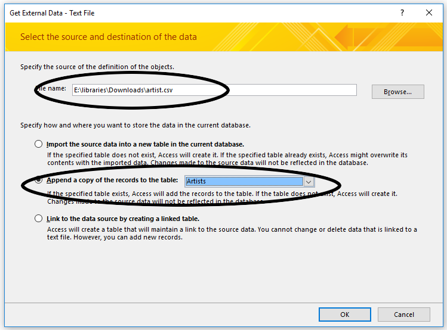
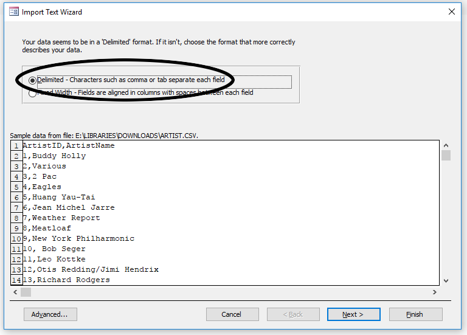
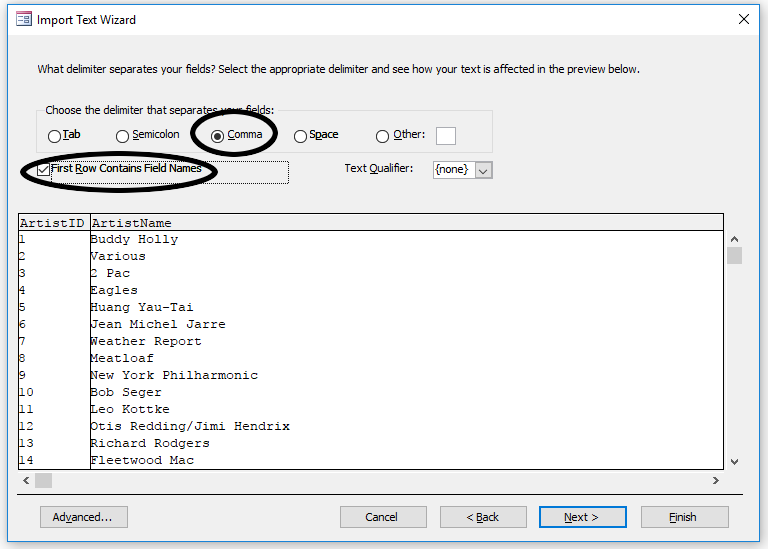
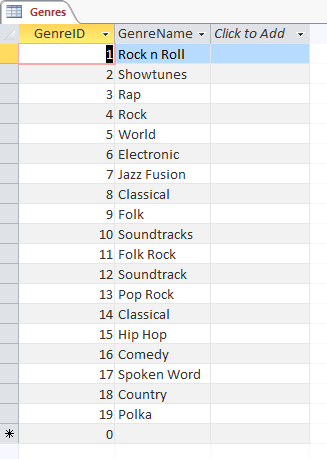

--- 
title: 'TUTORIAL 2 - Tables and Data'
layout: page
parent: Chapter 6 - Databases
nav_order: 4
---

TUTORIAL 2 - Tables and Data
============================

<iframe width="560" height="315" src="https://www.youtube.com/embed/fzT7laTPLfE" title="YouTube video player" frameborder="0" allow="accelerometer; autoplay; clipboard-write; encrypted-media; gyroscope; picture-in-picture; web-share" allowfullscreen></iframe>

We need to populate the database and its tables with actual data in
order for this to be interesting. 

Creating Relationships
----------------------

First, we need to establish our relationships. This is the feature which
defines ralational databases more than any other. Let\'s see how it\'s
done.

1.  Ensure that all tables are closed.
2.  In the **Database Tools** tab, select the **Relationships** tool.
    
3.  **Add** all three tables to the Relationships interface by
    double-clicking on their names.
    
4.  Close the *Show Table* dialog.
5.  We want to establish the *ID* keys of the *Artists* and *Genres*
    tables in their respective Foreign Key fields in the *Albums* table.
    To do this: **Click** and **drag** the *ArtistID* field from the
    *Artists* table over to the *ArtistID* field in the *Albums* table:
    
6.  In the *Edit Relationships* dialog, **check** the following options:
    (What do you think each one means?)
    A.  *Enforce Referential Integrity*
    B.  *Cascade Update Related Fields*
    C.  *Cascade Delete Related Records*
7.  Ensure that your dialog looks like this:

    

8.  Click **Create**. You\'ll see the link created between the two
    tables:

    

    Notice the 1 and the infinity symbol ($\infty$). This signifies that
    this is a **One-To-Many** relationship. Simply: An artist can have
    many albums, but an album can only have one artist. I realize that
    this is not an accurate reflection of reality (modelling reality is
    what computers are supposed to do), but it fits our purposes here
    well.

9.  Do the same with the *GenreID* field in the *Genres* table and the
    same field in the *Albums* table. Be sure to Enforce Referential
    Integrity, and set both of the Cascade options.

    

10. Save the Relationships and close the Relationship Tools interface by
    **right-clicking** on the tab in the window.

Importing some data
-------------------

Next, we will import some actual data. First, let\'s populate the Genre
and Artist tables. Download the two data files.

-   [artist.csv](res/artist.csv)
-   [genre.csv](res/genre.csv)

Copy them all to your working directory so you don\'t lose them, and
then let\'s get started.

1.  First, make sure all of your tables are closed.
2.  In the **External Data** tab, in the **Import** group, find the
    **Data Source** tool. You want to import from a file, and
    specifically, from a text file.

    

3.  The dialog that opens will have several options. Let\'s go through
    them.

    1. Under file name, click **Browse** and find the **artist.csv** file.
    1.  Check the radio button next to **Append a copy of the records to the table** and select the **Artists** table
    1.  Click **OK**

    

4.  You should see the data appear in a small window at the bottom of
    the next dialog. Ensure that the **Delimited** option is selected
    and press **Next**.

    

5.  Once again, ensure that the radio button next to **Comma** is
    selected. You should see the table split into columns. Also make
    sure there is a check next to **First Row Contains Field Names**.
    Press **Next**.

    

6.  In the final table, verify that you are importing to the Artists
    table and press **Finish**. No need to save the import steps.
7.  Open the Artists table and observe the results.

    

8.  We\'re going to do exactly the same thing with the **Genres** table
    and the **genre.csv** file. It should look like this when you are
    done.

    

Adding some of the album data
-----------------------------

We\'ll add a album records by hand because it\'s good to see how it
works. So here\'s five of the albums from my collection in tabular form:

  | AlbumName                     | ReleaseDate   | ArtistID   | GenreID    |
  | ----------------------------- | ------------- | ---------- | ---------- |
  | Buddy Holly Greatest Hits     | 1977          | 1          | 1          |
  | West Side Story               | 1963          | 2          | 2          |
  | Camelot                       | 1960          | 2          | 2          |
  | All Eyez on Me                | 1995          | 3          | 3          |
  | Eagles: Their Greatest Hits   | 1976          | 4          | 4          |

1.  Close the Artists and Genres tables and open the Artists table.
2.  Start at the first line, the ID numbers will be automatically
    generated and all you have to do is type into each field. **NOTE**:
    Remember to press **Tab** to move from field to field in each row.
3.  Make sure you get the ArtistID and GenreID fields correctly marked.
    They should correspond to the correct artist and genres in the other
    two tables.

    

Importing the rest of the data
------------------------------

To fill out the rest of the Albums table, we\'ll use another csv file.
The process will be similar to the other two tables

1.  Close the Albums table. It won\'t work if the table is open.
2.  Download the file:
    [albums.csv](res/albums.csv)
3.  In the **External Data** tab, select **New Data Source** and select
    **Text File**.
4.  Select the albums.csv file and make sure to **append** it to the
    Albums table. Press **OK**

    

5.  Make sure to select **Delimited** and go to the next dialog.
6.  Select **Comma** and check **First Row Contains Field Names**.

    

7.  Click **Next**, and then **Finish**.
8.  Open the Albums table and observe the result:

    

Save everything, repair and compact your database, and then upload it to
the class portal.

In the next tutorial, we will begin querying our database.
