--- 
title: 'TUTORIAL 4 - Queries'
layout: page
parent: Chapter 6 - Databases
nav_order: 6
---

TUTORIAL 4 - Queries
====================

<iframe width="560" height="315" src="https://www.youtube.com/embed/1-efGzLFY00" frameborder="0" allow="accelerometer; autoplay; clipboard-write; encrypted-media; gyroscope; picture-in-picture" allowfullscreen></iframe>

In this tutorial, we will build a couple of simple queries. In so doing, we will begin to see the power of a relational database for organizing information in useful ways.

Query

:   A query is a search for data across one or more tables in your database. The query allows us to sort, filter, or organize the raw data in our tables in interesting and useful ways.

Tutorial
--------

### All Artist Query

Let's create a query that shows all artist and their albums. This is a simple one.

1. Open your records database.

    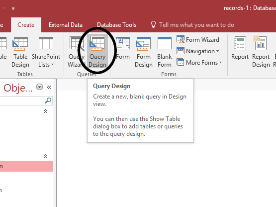

1. As in the previous query, in the **Queries** tab, select *Create Query in Design View*. You may notice that occasionally, we use a wizard to create a new object, and other times, we take a hands-on approach. This is a personal preference. I find forms annoying to make by hand and so a wizard is nice to get most of the work out of the way. But queries are easier to control in design view. Let's see how this works.

1. Let's add all three tables to the query by double-clicking on each of them until you see this:

    

1. Close the Show Table dialog and let's look around. The top half of the window shows the tables we have selected for this query. This limits us in which data we can search through for this query, so we have quite a bit of control over how to take a cross-section of the data. Let's add *ArtistName* to the query. Do this by simply double clicking it in the Artists box:

    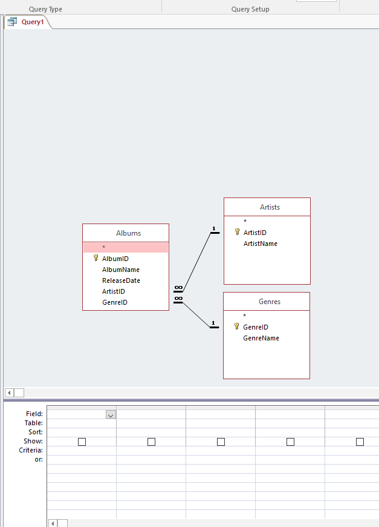

1. Now, from the Albums box, add *AlbumName*, *ReleaseYear*, and from the Genres box, add *GenreName*. It will look like this:

    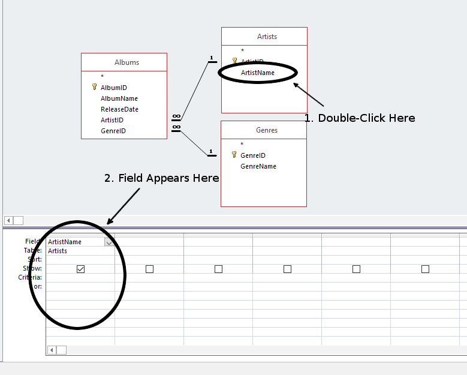

1. Run the Query by clicking the run query button, pressing F5 on the keyboard, or closing it and opening it from the main interface. Either way, the result looks like this:

    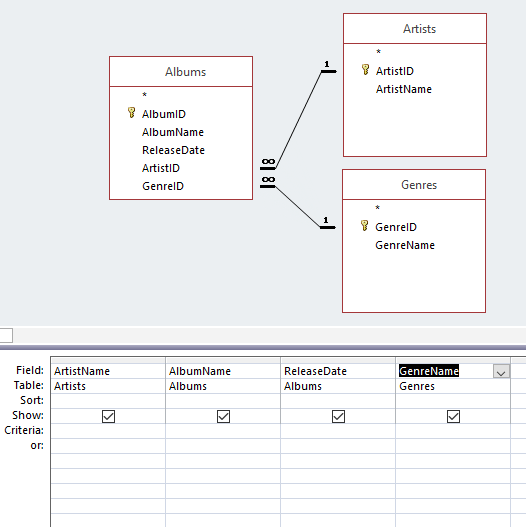

1. You can sort the results by clicking the A to Z button in the top bar as well. Save this one as Artist Query and close it.

### Bob Dylan Query

Okay, so that one was interesting and it shows how we can build a new data correlation with data from two or more tables. So how can we make this more interesting? How many Bob Dylan albums do I have? Let's find out how many and what they are. Open up your database from the previous tutorials and follow along.

1. As in the previous query, in the **Queries** tab, select *Create Query in Design View*. 

1. Recreate the exact same query as the previous one. Include the following fields: *ArtistName*, *AlbumName*, *ReleaseYear*, and *GenreName*.

1. This time, let's turn our attention to the bottom pane. Each field for this query is listed here. But what does it mean? For each field, there are several modifiers that we can add. We can create functions that modify how the field behaves, or simply filter based on a certain value. For this query, let's do the latter. Under *ArtistName*, in the *Criterion* box, enter the text `'Bob Dylan'` with single quote marks on either side, like this:

    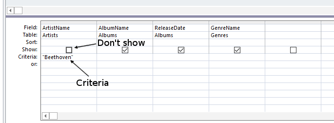

1. Now, run the query and observe the result:

    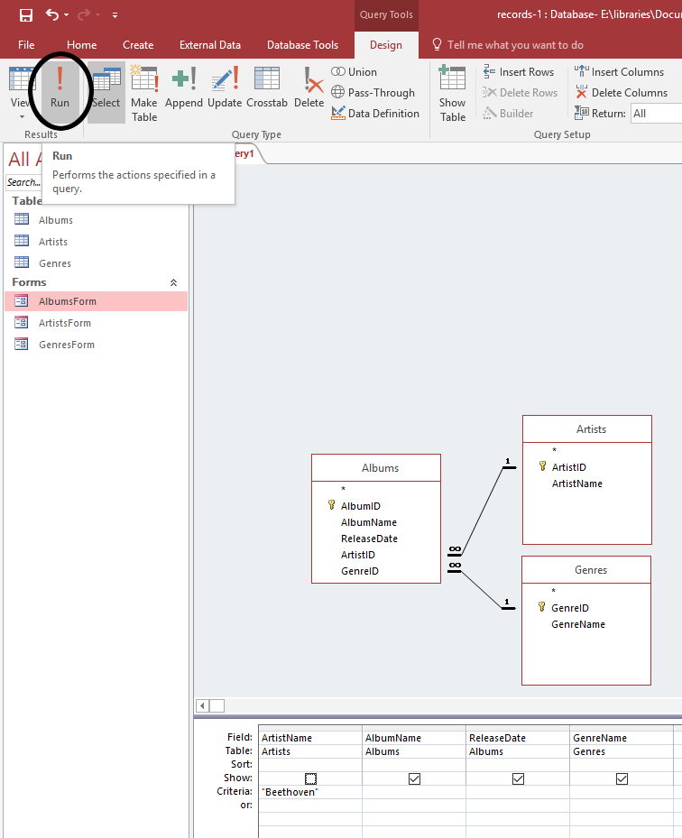

    As you can see, there are three albums by Dylan.

1. One thing that might clean up this query result, is to uncheck the "Visible" box under *ArtistName*. Since he's the only artist in this query, it's redundant to include his name every time. Re-Run it.

    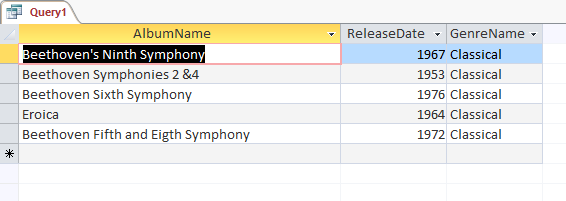

1. Save it as "Bob Dylan Query" and close it.

### Search for any artist

That was fun. But we don't really want to create a new query for every single artist in the collection. That's crazy. Let's try something else.

1. Recreate the same query as the Bob Dylan query, only this time, in the ArtistName criterion, type this exactly: `:EnterArtistName`. With the colon at the beginning, and all in one word.

    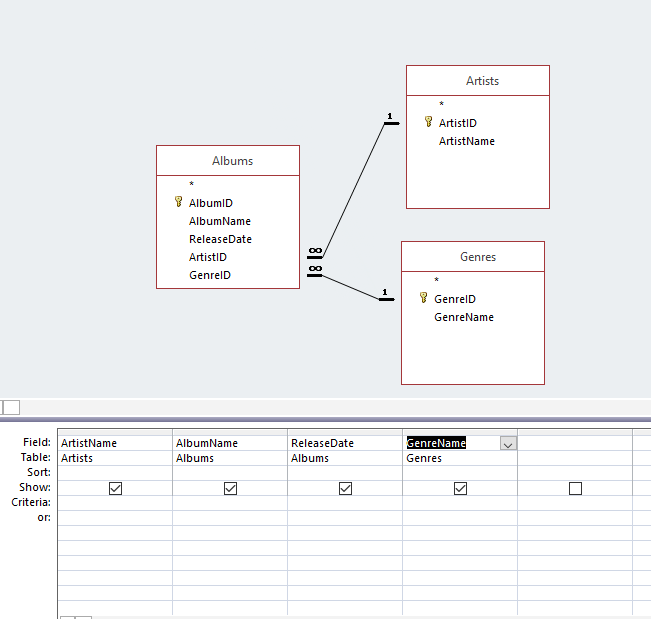

1. Now, when you run it, it will prompt you to enter a name. Try a few out, like "Led Zeppelin", "2 Pac", "John Lennon", or "T-Pain" (Oh yes. I have T-Pain on vinyl).

    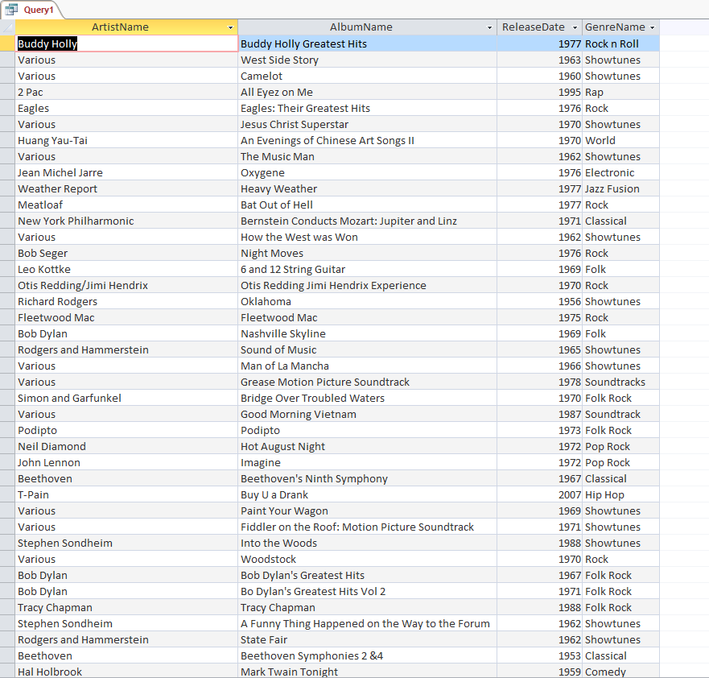

### Count Albums

Here's another kind of fun thing we can do. Let's count how many albums each artist has in this collection.

1. Create a new query in Design View.

1. Add the *Artists* and *Albums* tables.

1. Add two fields: *ArtistName* and *AlbumID*.

    

1. Now, let's add some functions. Under ArtistName, select the function **Group**. And under AlbumID, select the function **Count**.

    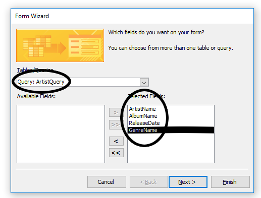

    All we really want to do is count the number of albums by each artist. It is a quirk of the underlying SQL database engine that whenever you create a calculated field with a COUNT or something similar, that you must also include all other fields present in some sort of grouping, hence the group function under ArtistName. Run it!

1. Here's the result:

    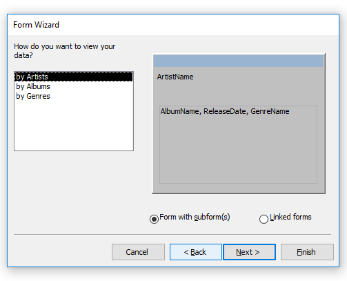

1. Save this Query as "Album Count." Close it.

### See what you can do

We have gotten to the point where it's time to see what you can
discover on your own. I think you should have something of a sense for
how these disparate Access objects work together and with that, you
should try to build some queries of your own.

1.  Build two more queries. 
    * For at least one of them, you should use a *Criteria* to filter the results of running the query. 
    * For another, use a count function

There are more sophisticated ways that we can use queries, but for now, let's leave it at this. Close all objects. Submit the database to Canvas as normal.
