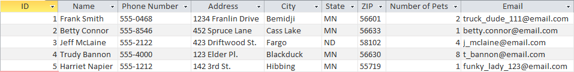
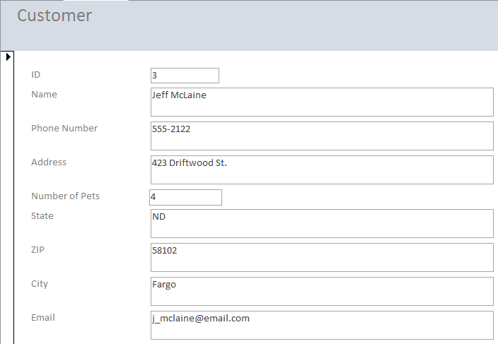
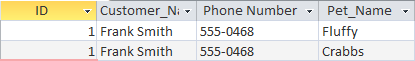
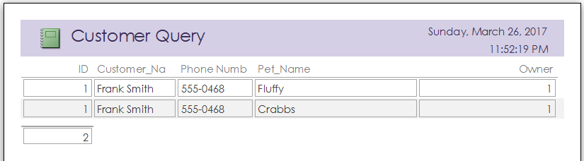
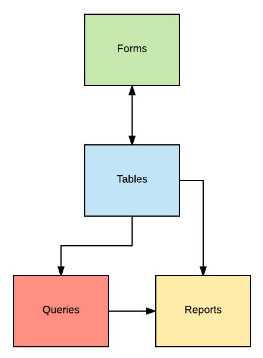

--- 
title: 'Elements of a Database'
layout: page
parent: Chapter 6 - Databases
nav_order: 2
---

Elements of a Database
======================

[Example
File](res/vet_example.accdb)

There are four main elements, called **objects** of an Access database.
Here they are in brief.

Table

:   A set of data entries (records) whose model is defined by a set of
    columns (fields). A table has a predefined number of columns, but
    can have any number of rows.

Form

:   A user-interface designed for entering data into a table or tables.
    It presents this interface so that the database designer does not
    have to worry about the end users messing up the database tables.

Query

:   A tool for searching the database. Parameters are defined for the
    search and the user can filter the table or tables in a variety of
    different ways.

Report

:   A report is a database tool which allows the user to pull
    well-formatted data. It offers the ability to print your data in a
    way that is readable and understandable.

Tables
------

In a spreadsheet, columns and rows are flexible. They can mean anything
you like. In a database, however, rows and columns have very specific
purposes. In all database software, a column is called a **field** and a
row is called a **record**. So a row in the veterinarian\'s *Customer*
table would be one customer\'s contact data. His or her name, phone
number, address, billing information, and a list of pets.

Each column in a database comes with a *type*. This is specified when
the table is created and cannot be changed \-- well, not without extreme
difficulty. These data types can be anything from strings of text, to
numbers, to special binary types called **booleans**. Recall the
customer table from the previous section. Here is a more detailed
version of that table:

What kind of data do you think each field in this table represents?

Forms
-----

Access has a user-interface which you will use to create and modify a
database. But as the database administrator, the absolute *last* thing
you want anyone else to have is direct access to your database, its
fields, or its contents. So Access has a way for you to create your own
user interfaces so that your employees or co-workers can have a nice,
clean interface where they can\'t mess anything up.

Here is what a customer information form might look like:

From this basic design, the form can be customized, themed, and tweaked
almost infinitely.

Forms even allow you to enter data into multiple tables at once! They
are a powerful tool that give you the power to decide how your database
grows, how its entered, and what happens to it once it is.

Queries
-------

A database engine is only as good as its ability to search a dataset.
Thus, one of your most important tools in database management is the
**query**. With a query, you build a set of parameters involving one,
two, or many of your database tables which the software will then use to
search the database and generate a result. Perhaps you want to see the
list of all of the pets owned by a particular customer. That\'s what a
query is for.

This might be the result of a query that searches for all of the pets
owned by a particular customer:

Reports
-------

A report is document which can be generated at will which organizes your
data in ways that are more readable. They are designed to be printable
or exported to a PDF. This is how you might create copies of information
for a meeting or for filing purposes. You can build reports straight
from a table, or from a query, which gives you incredible control over
how your information is displayed to whoever reads your reports. Here is
a report generated from the above query:

Making sense of it all
----------------------

These four objects have a complex relationship with each other, however,
with a little practice, you\'ll be an expert in database fundamentals.
The **table** is the most fundamental aspect of the database and every
piece of information in the database must come from one table or other
originally. Here is a breakdown of the relationship between the four
components of a database:

It breaks down kind of like this: \* **Tables** generate **Forms** and
**Forms** modify individual **records** in tables. \* **Queries** search
one or more tables **Tables** for specific data. \* **Reports** format
**Table** data or **Query** results for printing.

As we continue on, you will see many of the ways in which these powerful
tools can be used to build ways to maintain, organize, and search
datasets. Pace yourself and don\'t give up. It will make sense in the
end.
