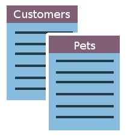
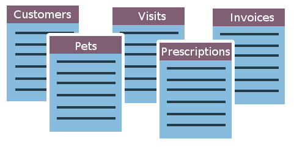
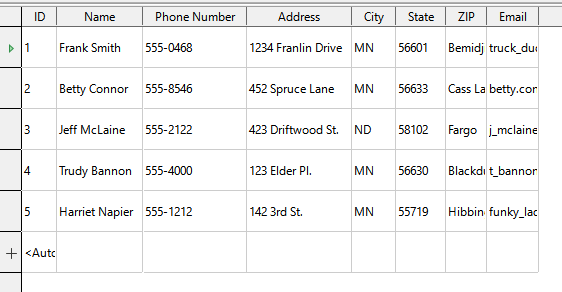
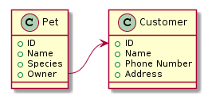

--- 
title: 'Database Fundamentals'
layout: page
parent: Chapter 6 - Databases
nav_order: 1
---

Database Fundamentals
=====================

<iframe width="560" height="315" src="https://www.youtube.com/embed/jHp3_DRWhwU" frameborder="0" allow="accelerometer; autoplay; clipboard-write; encrypted-media; gyroscope; picture-in-picture" allowfullscreen></iframe>

[Slides for this page](https://docs.google.com/presentation/d/e/2PACX-1vTialPd_tb8Lb6PRzlwD_CYfgYeP7PC984QF3DgCkrJ7mPh9jX97SuFW8aIAICQ3Y4fzhDP888-r1bv/pub?start=false&loop=false&delayms=3000)

LibreOffice Base is a database management system from the Document Foundation. It
combines two important tools to create a unified application. Behind the
scenes it has a variant of a popular database
[engine](https://en.wikipedia.org/wiki/Software_engine) called SQL, which is a database framework for storing,
retrieving, and changing data. The engine, as its name implies, is
what's under the hood of Base. On top of the engine, Base
has a sophisticated user interface which allows interacting with the
database in a more intuitive way. This is a good thing because the traditional way of interacting with a database is via complex text commands that are easy to mess up.

What is a database?
-------------------

A **database** is a collection of data stored in a computer system. Generally, a database will also have some interface which allows a user to add new data, edit existing data, or search (called querying) existing data. You
have probably seen them many times. If you go to the doctor's office,
you'll notice that the doctor takes notes on a computer. All of that
information is being stored in a (hopefully very secure) database so that the next time you come
back, it will still be there, nice and organized, so that any nurse,
other doctor, or receptionist will be able to quickly and accurately
reference your information. This prevents mistakes, miscommunication,
or worse. You may have used one as well if you've ever worked retail.
Ever had to look up an item on a computer to see if it was in stock?
You're referencing a database.

Modern databases, more concretely, consist of a collection of **tables**. A
table is basically just a list. For example, in the doctor's office,
there is a list of patient contact data. When you walk in to the
doctor's office and see the receptionist, they will ask you for your
last name and date of birth and will look up your entry in the database
from that information. It pulls your information from a massive list of
patients. What other lists of information might a medical database
include?

It might have lists of contact information, lists of past appointments
and notes about them, lists of immunization records. A mature and much
used database might have many more lists, all cross-referenced, and
easily searchable to find exactly what you're looking for.

Let's look at a simple example.

Let's say you're a veterinarian and all of your information is
stored in stacks of notebooks. You decide to modernize and so you want
to start building up a database of information so it's easier to
reference information, treat pets, and, most importantly, bill
customers! What sorts of lists might you need? First, you'll need a
list of customer information. And then you'll need a list of their
pets. Once you put these two lists together, you're well on your way to
building a database!

As your business grows, so will your lists, and so will the *number* of
lists. Your database itself will become more complex.

In Base, a list is a little more complex than just your grocery list
&mdash; though even these days, some people store their grocery lists *in* a
database. Base stores these lists in a special type of data structure
called a **table**. Consider the following **Customer** table for our
veterinarian.

The resemblance to Sheets or Excel should be obvious, but there are a few key
differences. Notice that the columns have actual names rather than
column letters. And the rows are identified by an *ID* number &mdash; called
a **Primary Key** &mdash; rather than a row number. In fact, an Excel
spreadsheet *is* a database of a sort. However, as we shall see,
**Access** gives us a much different set of tools for how we access and
manipulate that data.

Why not just use a spreadsheet?
-------------------------------

The fact of the matter is, for many smaller applications, a spreadsheet
works great. In fact, it excels at handling *numerical* data and doing complex data analysis. For
doing some math-heavy data analysis, there is
no better tool than a good spreadsheet and, indeed, there are many ways in which
Base and a spreadsheet can be made to work together! However, a database is
far more powerful when it comes to manipulating *non-numerical* data
(i.e. text). In particular, the database's strength comes from searching, sorting, and storing data, rather than having highly complex statistical or analytic tools.

The thing that really sets it apart, though, is the way you can build
*relationships* between different **tables** (lists). Base utilizes
what we call a **relational database**. With a relational database, we
can build connections between tables in ways that are very difficult (but not necessarily impossible)
with a traditional spreadsheet.

For an example, let's look at the veterinarian database again. You want
to organize all of your data using tables, but with a table for pets and
a table for customers, you need a way to connect the two together. So
each pet needs an owner. On a conceptual level, this is what our table relationships might look like

We want to build a relation between our customer table and our pet
table. More specifically, in each entry in the **Pet** table, there will
now be a column or **field** which represents the owner of the pet.

Let's say we want to create another table for **Office Visits**. This
table would probably need to have a relation to the **Pet** table, so
that each office visit would involve some pet, and then, by relation,
the owner of the pet.

In the other tutorials in this chapter, you will learn the basic
building blocks of an Access database: **Tables**, **Forms**,
**Queries**, and **Reports**. Along the way, you will pick up some of
the philosophy behind databases and what they are for.
